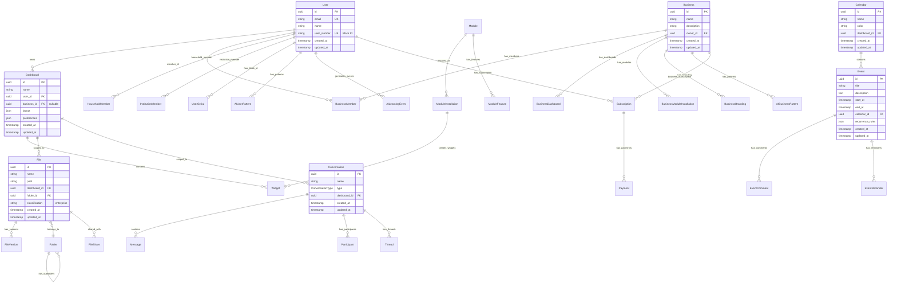

# Vssyl Codebase Architecture Flowchart

## Complete System Architecture Overview

This document provides a comprehensive visual representation of how all components in the Vssyl codebase relate to one another, showing the flow of data, dependencies, and relationships between different parts of the system.

## High-Level Architecture Flow

```mermaid
flowchart TD
    %% External Systems
    User[👤 User] --> Browser[🌐 Browser]
    Browser --> CDN[☁️ Google Cloud CDN]
    
    %% Frontend Layer
    CDN --> Frontend[📱 Next.js Frontend<br/>web/src/]
    Frontend --> AuthUI[🔐 Authentication UI<br/>NextAuth.js]
    Frontend --> Dashboard[📊 Dashboard System<br/>Multi-context switching]
    Frontend --> Modules[🧩 Module System<br/>Dynamic loading]
    Frontend --> Business[🏢 Business Workspace<br/>Admin & Employee views]
    
    %% API Proxy Layer
    Frontend --> APIPxy[🔄 API Proxy<br/>web/src/app/api/[...slug]/route.ts]
    APIPxy --> Backend[⚙️ Express Backend<br/>server/src/]
    
    %% Backend Core
    Backend --> AuthSvc[🔒 Authentication Service<br/>JWT + NextAuth.js]
    Backend --> Controllers[🎮 Controllers Layer<br/>40+ API endpoints]
    Backend --> Services[⚡ Services Layer<br/>Business logic]
    Backend --> Middleware[🛡️ Middleware<br/>Auth, validation, errors]
    
    %% Database Layer
    Services --> Prisma[🗄️ Prisma ORM<br/>Type-safe queries]
    Prisma --> PostgreSQL[🐘 PostgreSQL<br/>Cloud SQL Production]
    
    %% Real-time Layer
    Frontend --> WebSocket[🔌 WebSocket Client<br/>Socket.IO]
    Backend --> SocketSvc[📡 Socket Service<br/>Real-time events]
    
    %% AI System
    Services --> AI[🤖 AI System<br/>Digital Life Twin]
    AI --> AIProviders[🧠 AI Providers<br/>OpenAI, Anthropic]
    AI --> Learning[📚 Learning Engine<br/>Cross-module intelligence]
    
    %% Storage Layer
    Services --> Storage[💾 Storage Service<br/>File abstraction]
    Storage --> GCS[☁️ Google Cloud Storage<br/>Production files]
    Storage --> LocalFS[📁 Local Filesystem<br/>Development]
    
    %% External Integrations
    Services --> Stripe[💳 Stripe<br/>Payment processing]
    Services --> Email[📧 Email Service<br/>Notifications]
    Services --> Geolocation[🌍 Geolocation API<br/>Block ID system]
    
    %% Shared Components
    Frontend --> Shared[🔧 Shared Components<br/>shared/src/]
    Backend --> Shared
    
    %% Module System
    Modules --> Marketplace[🏪 Module Marketplace<br/>Third-party modules]
    Modules --> BuiltIn[📦 Built-in Modules<br/>Drive, Chat, Calendar]
    
    %% Context Systems
    Dashboard --> Personal[👤 Personal Context<br/>Individual workspace]
    Dashboard --> Business[🏢 Business Context<br/>Team workspace]
    Dashboard --> Household[🏠 Household Context<br/>Family workspace]
    Dashboard --> Educational[🎓 Educational Context<br/>School workspace]
    
    %% Styling
    classDef frontend fill:#e1f5fe
    classDef backend fill:#f3e5f5
    classDef database fill:#e8f5e8
    classDef external fill:#fff3e0
    classDef ai fill:#fce4ec
    classDef storage fill:#f1f8e9
    
    class Frontend,AuthUI,Dashboard,Modules,Business,APIPxy,WebSocket frontend
    class Backend,AuthSvc,Controllers,Services,Middleware,SocketSvc backend
    class Prisma,PostgreSQL database
    class User,Browser,CDN,Stripe,Email,Geolocation,Marketplace external
    class AI,AIProviders,Learning ai
    class Storage,GCS,LocalFS storage
```

## Detailed Component Relationships

### 1. Frontend Architecture (Next.js)

```mermaid
flowchart TD
    %% Next.js App Router Structure
    App[📱 Next.js App<br/>web/src/app/] --> Layout[🎨 Root Layout<br/>Global providers]
    App --> Pages[📄 Pages<br/>Route-based components]
    
    %% Core Pages
    Pages --> Landing[🏠 Landing Page<br/>Public marketing]
    Pages --> Dashboard[📊 Dashboard<br/>/dashboard]
    Pages --> Business[🏢 Business<br/>/business/[id]]
    Pages --> Chat[💬 Chat<br/>/chat]
    Pages --> Drive[📁 Drive<br/>/drive]
    Pages --> Calendar[📅 Calendar<br/>/calendar]
    Pages --> Admin[⚙️ Admin Portal<br/>/admin-portal]
    
    %% Authentication Flow
    Pages --> Auth[🔐 Auth Pages<br/>/auth/*]
    Auth --> Login[🔑 Login]
    Auth --> Register[📝 Register]
    Auth --> Reset[🔄 Password Reset]
    
    %% API Routes
    App --> APIRoutes[🔄 API Routes<br/>/api/*]
    APIRoutes --> Proxy[📡 API Proxy<br/>[...slug]/route.ts]
    APIRoutes --> Features[⚡ Features API<br/>Feature gating]
    APIRoutes --> Trash[🗑️ Trash API<br/>File management]
    
    %% Components Layer
    Layout --> Components[🧩 Components<br/>web/src/components/]
    Components --> Shared[🔧 Shared Components<br/>shared/src/components/]
    Components --> Business[🏢 Business Components<br/>business/]
    Components --> Chat[💬 Chat Components<br/>chat/]
    Components --> Drive[📁 Drive Components<br/>drive/]
    Components --> Calendar[📅 Calendar Components<br/>calendar/]
    Components --> AI[🤖 AI Components<br/>ai/]
    
    %% Context Providers
    Layout --> Contexts[🎯 Context Providers<br/>web/src/contexts/]
    Contexts --> Dashboard[📊 Dashboard Context<br/>Multi-context switching]
    Contexts --> Business[🏢 Business Config Context<br/>Real-time updates]
    Contexts --> Chat[💬 Chat Context<br/>Conversation state]
    Contexts --> Theme[🎨 Theme Context<br/>Dark/light mode]
    Contexts --> Global[🌐 Global Contexts<br/>Search, trash, branding]
    
    %% Hooks & Utilities
    Components --> Hooks[🎣 Custom Hooks<br/>web/src/hooks/]
    Hooks --> FeatureGating[⚡ Feature Gating<br/>Subscription checks]
    Hooks --> Theme[🎨 Theme Management<br/>Dark mode]
    Hooks --> ModuleSelection[🧩 Module Selection<br/>Dashboard setup]
    
    Components --> Utils[🛠️ Utilities<br/>web/src/utils/]
    Utils --> Format[📝 Formatting<br/>Date, currency, etc.]
    Utils --> Trash[🗑️ Trash Utils<br/>File operations]
    
    %% API Client Layer
    Components --> APIClient[🌐 API Client<br/>web/src/api/]
    APIClient --> Business[🏢 Business API<br/>business.ts]
    APIClient --> Chat[💬 Chat API<br/>chat.ts]
    APIClient --> Drive[📁 Drive API<br/>drive.ts]
    APIClient --> Calendar[📅 Calendar API<br/>calendar.ts]
    APIClient --> User[👤 User API<br/>user.ts]
    APIClient --> Payment[💳 Payment API<br/>payment.ts]
    
    %% Styling
    classDef pages fill:#e3f2fd
    classDef components fill:#f3e5f5
    classDef context fill:#e8f5e8
    classDef api fill:#fff3e0
    
    class Pages,Landing,Dashboard,Business,Chat,Drive,Calendar,Admin,Auth pages
    class Components,Shared,Business,Chat,Drive,Calendar,AI components
    class Contexts,Dashboard,Business,Chat,Theme,Global context
    class APIClient,Business,Chat,Drive,Calendar,User,Payment api
```

### 2. Backend Architecture (Express.js)

```mermaid
flowchart TD
    %% Express Server Entry
    Server[⚙️ Express Server<br/>server/src/index.ts] --> Middleware[🛡️ Middleware Stack<br/>CORS, auth, validation]
    
    %% Route Layer
    Server --> Routes[🛣️ Routes Layer<br/>server/src/routes/]
    Routes --> Auth[🔐 Auth Routes<br/>JWT + NextAuth]
    Routes --> Business[🏢 Business Routes<br/>CRUD operations]
    Routes --> Chat[💬 Chat Routes<br/>Messages, conversations]
    Routes --> Drive[📁 Drive Routes<br/>Files, folders]
    Routes --> Calendar[📅 Calendar Routes<br/>Events, calendars]
    Routes --> AI[🤖 AI Routes<br/>Digital Life Twin]
    Routes --> Admin[⚙️ Admin Routes<br/>Management tools]
    Routes --> Payment[💳 Payment Routes<br/>Stripe integration]
    Routes --> Module[🧩 Module Routes<br/>Marketplace, installation]
    
    %% Controller Layer
    Routes --> Controllers[🎮 Controllers<br/>server/src/controllers/]
    Controllers --> AuthCtrl[🔐 Auth Controller<br/>Login, registration]
    Controllers --> BusinessCtrl[🏢 Business Controller<br/>Business management]
    Controllers --> ChatCtrl[💬 Chat Controller<br/>Message handling]
    Controllers --> DriveCtrl[📁 Drive Controller<br/>File operations]
    Controllers --> CalendarCtrl[📅 Calendar Controller<br/>Event management]
    Controllers --> AICtrl[🤖 AI Controller<br/>AI interactions]
    Controllers --> AdminCtrl[⚙️ Admin Controller<br/>System management]
    Controllers --> PaymentCtrl[💳 Payment Controller<br/>Billing operations]
    
    %% Service Layer
    Controllers --> Services[⚡ Services<br/>server/src/services/]
    Services --> AuthSvc[🔐 Auth Service<br/>JWT management]
    Services --> BusinessSvc[🏢 Business Service<br/>Business logic]
    Services --> ChatSvc[💬 Chat Service<br/>Real-time messaging]
    Services --> DriveSvc[📁 Drive Service<br/>File management]
    Services --> CalendarSvc[📅 Calendar Service<br/>Event processing]
    Services --> AISvc[🤖 AI Service<br/>Digital Life Twin]
    Services --> StorageSvc[💾 Storage Service<br/>File abstraction]
    Services --> PaymentSvc[💳 Payment Service<br/>Stripe integration]
    Services --> NotificationSvc[📧 Notification Service<br/>Email, push]
    Services --> FeatureGatingSvc[⚡ Feature Gating Service<br/>Subscription checks]
    
    %% AI System Architecture
    AISvc --> AIEngines[🧠 AI Engines<br/>server/src/ai/]
    AIEngines --> Core[🎯 AI Core<br/>DigitalLifeTwinCore]
    AIEngines --> Context[🔄 Context Engine<br/>CrossModuleContextEngine]
    AIEngines --> Learning[📚 Learning Engine<br/>Pattern recognition]
    AIEngines --> Analytics[📊 Analytics Engines<br/>Real-time, predictive]
    AIEngines --> Providers[🔌 AI Providers<br/>OpenAI, Anthropic]
    
    %% Database Layer
    Services --> Prisma[🗄️ Prisma ORM<br/>Type-safe queries]
    Prisma --> Schema[📋 Database Schema<br/>prisma/schema.prisma]
    Schema --> Modules[🧩 Modular Schema<br/>prisma/modules/]
    Modules --> Auth[🔐 Auth Module<br/>Users, sessions]
    Modules --> Business[🏢 Business Module<br/>Companies, teams]
    Modules --> Chat[💬 Chat Module<br/>Messages, conversations]
    Modules --> Drive[📁 Drive Module<br/>Files, folders]
    Modules --> Calendar[📅 Calendar Module<br/>Events, calendars]
    Modules --> Billing[💳 Billing Module<br/>Subscriptions, payments]
    Modules --> AI[🤖 AI Module<br/>Learning, patterns]
    
    %% Real-time Layer
    Server --> SocketIO[📡 Socket.IO<br/>Real-time communication]
    SocketIO --> ChatSocket[💬 Chat Socket<br/>Message broadcasting]
    SocketIO --> NotificationSocket[🔔 Notification Socket<br/>Real-time alerts]
    SocketIO --> PresenceSocket[👤 Presence Socket<br/>User status]
    
    %% External Integrations
    Services --> External[🌐 External Services]
    External --> Stripe[💳 Stripe API<br/>Payment processing]
    External --> Email[📧 Email Service<br/>SMTP/Nodemailer]
    External --> GCS[☁️ Google Cloud Storage<br/>File storage]
    External --> Geolocation[🌍 Geolocation API<br/>Block ID system]
    
    %% Styling
    classDef routes fill:#e3f2fd
    classDef controllers fill:#f3e5f5
    classDef services fill:#e8f5e8
    classDef ai fill:#fce4ec
    classDef database fill:#f1f8e9
    classDef external fill:#fff3e0
    
    class Routes,Auth,Business,Chat,Drive,Calendar,AI,Admin,Payment,Module routes
    class Controllers,AuthCtrl,BusinessCtrl,ChatCtrl,DriveCtrl,CalendarCtrl,AICtrl,AdminCtrl,PaymentCtrl controllers
    class Services,AuthSvc,BusinessSvc,ChatSvc,DriveSvc,CalendarSvc,AISvc,StorageSvc,PaymentSvc,NotificationSvc,FeatureGatingSvc services
    class AIEngines,Core,Context,Learning,Analytics,Providers ai
    class Prisma,Schema,Modules,Auth,Business,Chat,Drive,Calendar,Billing,AI database
    class External,Stripe,Email,GCS,Geolocation external
```



### 3. Database Schema Architecture



### 4. Module System Architecture

```mermaid
flowchart TD
    %% Module System Core
    ModuleSystem[🧩 Module System] --> Marketplace[🏪 Module Marketplace<br/>Third-party modules]
    ModuleSystem --> BuiltIn[📦 Built-in Modules<br/>Core functionality]
    
    %% Built-in Modules
    BuiltIn --> Drive[📁 Drive Module<br/>File management]
    BuiltIn --> Chat[💬 Chat Module<br/>Real-time messaging]
    BuiltIn --> Calendar[📅 Calendar Module<br/>Event management]
    BuiltIn --> Analytics[📊 Analytics Module<br/>Business intelligence]
    BuiltIn --> Admin[⚙️ Admin Module<br/>System management]
    
    %% Module Architecture
    Drive --> DriveAPI[📡 Drive API<br/>Files, folders, sharing]
    Drive --> DriveUI[🎨 Drive UI<br/>File grid, upload, preview]
    Drive --> DriveStorage[💾 Storage Integration<br/>GCS, local filesystem]
    
    Chat --> ChatAPI[📡 Chat API<br/>Messages, conversations]
    Chat --> ChatUI[🎨 Chat UI<br/>Message list, composer]
    Chat --> ChatSocket[🔌 Real-time Socket<br/>Live messaging]
    
    Calendar --> CalendarAPI[📡 Calendar API<br/>Events, calendars]
    Calendar --> CalendarUI[🎨 Calendar UI<br/>Month view, event forms]
    Calendar --> CalendarSync[🔄 Calendar Sync<br/>External providers]
    
    %% Module Installation Flow
    Marketplace --> ModuleInstall[📥 Module Installation<br/>Dynamic loading]
    ModuleInstall --> ModuleConfig[⚙️ Module Configuration<br/>Settings, permissions]
    ModuleConfig --> WidgetCreation[🧩 Widget Creation<br/>Dashboard integration]
    WidgetCreation --> DashboardDisplay[📊 Dashboard Display<br/>User interface]
    
    %% Context-Aware Features
    ModuleSystem --> ContextAware[🎯 Context-Aware Features]
    ContextAware --> Personal[👤 Personal Context<br/>Individual features]
    ContextAware --> Business[🏢 Business Context<br/>Enterprise features]
    ContextAware --> Household[🏠 Household Context<br/>Family features]
    ContextAware --> Educational[🎓 Educational Context<br/>School features]
    
    %% Feature Gating
    ContextAware --> FeatureGating[⚡ Feature Gating<br/>Subscription-based]
    FeatureGating --> Free[🆓 Free Tier<br/>Basic features]
    FeatureGating --> Pro[⭐ Pro Tier<br/>Enhanced features]
    FeatureGating --> Business[🏢 Business Tier<br/>Team features]
    FeatureGating --> Enterprise[🏭 Enterprise Tier<br/>Advanced features]
    
    %% Module Development
    Marketplace --> DevPortal[👨‍💻 Developer Portal<br/>Module creation]
    DevPortal --> ModuleSubmission[📤 Module Submission<br/>Review process]
    ModuleSubmission --> RevenueSharing[💰 Revenue Sharing<br/>70/30 split]
    
    %% Styling
    classDef modules fill:#e3f2fd
    classDef builtin fill:#f3e5f5
    classDef context fill:#e8f5e8
    classDef gating fill:#fff3e0
    classDef dev fill:#fce4ec
    
    class ModuleSystem,Marketplace,BuiltIn,ModuleInstall,ModuleConfig,WidgetCreation,DashboardDisplay modules
    class Drive,Chat,Calendar,Analytics,Admin,DriveAPI,DriveUI,DriveStorage,ChatAPI,ChatUI,ChatSocket,CalendarAPI,CalendarUI,CalendarSync builtin
    class ContextAware,Personal,Business,Household,Educational context
    class FeatureGating,Free,Pro,Business,Enterprise gating
    class DevPortal,ModuleSubmission,RevenueSharing dev
```



### 5. AI System Architecture

```mermaid
flowchart TD
    %% AI System Core
    AISystem[🤖 AI System<br/>Digital Life Twin] --> Core[🎯 AI Core<br/>DigitalLifeTwinCore]
    
    %% AI Engines
    Core --> ContextEngine[🔄 Context Engine<br/>CrossModuleContextEngine]
    Core --> LearningEngine[📚 Learning Engine<br/>Pattern recognition]
    Core --> PersonalityEngine[👤 Personality Engine<br/>User modeling]
    Core --> DecisionEngine[🧠 Decision Engine<br/>Autonomous actions]
    
    %% Context Engine
    ContextEngine --> ModuleContext[🧩 Module Context<br/>Cross-module intelligence]
    ModuleContext --> DriveContext[📁 Drive Context<br/>File patterns]
    ModuleContext --> ChatContext[💬 Chat Context<br/>Communication patterns]
    ModuleContext --> CalendarContext[📅 Calendar Context<br/>Schedule patterns]
    ModuleContext --> BusinessContext[🏢 Business Context<br/>Work patterns]
    
    %% Learning System
    LearningEngine --> PatternDiscovery[🔍 Pattern Discovery<br/>User behavior analysis]
    LearningEngine --> PredictiveIntelligence[🔮 Predictive Intelligence<br/>Future behavior]
    LearningEngine --> ContinuousLearning[🔄 Continuous Learning<br/>Adaptive improvement]
    
    %% Analytics Engines
    Core --> Analytics[📊 Analytics Engines]
    Analytics --> RealTime[⚡ Real-time Analytics<br/>Live data processing]
    Analytics --> Predictive[🔮 Predictive Analytics<br/>Forecasting models]
    Analytics --> BusinessIntelligence[📈 Business Intelligence<br/>KPI dashboards]
    Analytics --> AIInsights[🧠 AI-Powered Insights<br/>Automated recommendations]
    
    %% AI Providers
    Core --> AIProviders[🔌 AI Providers]
    AIProviders --> OpenAI[🤖 OpenAI GPT-4o<br/>Primary provider]
    AIProviders --> Anthropic[🧠 Anthropic Claude<br/>Alternative provider]
    AIProviders --> Local[💻 Local Processing<br/>Privacy-sensitive data]
    
    %% AI Actions
    DecisionEngine --> Actions[⚡ AI Actions]
    Actions --> Autonomous[🤖 Autonomous Actions<br/>Self-executing]
    Actions --> Approval[✅ Approval Actions<br/>Human oversight]
    Actions --> Recommendations[💡 Recommendations<br/>Suggested actions]
    
    %% Privacy & Security
    Core --> Privacy[🔒 Privacy System]
    Privacy --> DataRouter[🛣️ Privacy Data Router<br/>Data classification]
    Privacy --> ConsentManager[✅ Consent Manager<br/>User permissions]
    Privacy --> AuditLogging[📝 Audit Logging<br/>Action tracking]
    
    %% Integration Points
    AISystem --> FrontendIntegration[📱 Frontend Integration]
    FrontendIntegration --> AIAssistant[🤖 AI Assistant UI<br/>Chat interface]
    FrontendIntegration --> SmartRecommendations[💡 Smart Recommendations<br/>Contextual suggestions]
    FrontendIntegration --> PredictiveUI[🔮 Predictive UI<br/>Anticipated actions]
    
    AISystem --> BackendIntegration[⚙️ Backend Integration]
    BackendIntegration --> AIControllers[🎮 AI Controllers<br/>API endpoints]
    BackendIntegration --> AIServices[⚡ AI Services<br/>Business logic]
    BackendIntegration --> LearningEvents[📚 Learning Events<br/>Data collection]
    
    %% Styling
    classDef core fill:#e3f2fd
    classDef engines fill:#f3e5f5
    classDef analytics fill:#e8f5e8
    classDef providers fill:#fff3e0
    classDef privacy fill:#fce4ec
    classDef integration fill:#f1f8e9
    
    class AISystem,Core core
    class ContextEngine,LearningEngine,PersonalityEngine,DecisionEngine,ModuleContext,DriveContext,ChatContext,CalendarContext,BusinessContext engines
    class Analytics,RealTime,Predictive,BusinessIntelligence,AIInsights analytics
    class AIProviders,OpenAI,Anthropic,Local providers
    class Privacy,DataRouter,ConsentManager,AuditLogging privacy
    class FrontendIntegration,BackendIntegration,AIAssistant,SmartRecommendations,PredictiveUI,AIControllers,AIServices,LearningEvents integration
```



### 6. Business Workspace Architecture

```mermaid
flowchart TD
    %% Business Workspace Core
    BusinessWorkspace[🏢 Business Workspace] --> AdminDashboard[⚙️ Admin Dashboard<br/>/business/[id]]
    BusinessWorkspace --> EmployeeWorkspace[👥 Employee Workspace<br/>/business/[id]/workspace]
    
    %% Admin Dashboard Features
    AdminDashboard --> BusinessSetup[🔧 Business Setup<br/>Profile, branding]
    AdminDashboard --> TeamManagement[👥 Team Management<br/>Members, roles]
    AdminDashboard --> ModuleManagement[🧩 Module Management<br/>Installation, config]
    AdminDashboard --> AIControl[🤖 AI Control Center<br/>Business AI settings]
    AdminDashboard --> Analytics[📊 Analytics Dashboard<br/>Business metrics]
    
    %% Business Setup
    BusinessSetup --> Profile[📋 Business Profile<br/>Name, description]
    BusinessSetup --> Branding[🎨 Business Branding<br/>Logo, colors, fonts]
    BusinessSetup --> Settings[⚙️ Business Settings<br/>Configuration]
    
    %% Team Management
    TeamManagement --> OrgChart[📊 Org Chart Builder<br/>Organizational structure]
    TeamManagement --> MemberInvites[📧 Member Invites<br/>Email invitations]
    TeamManagement --> RoleAssignment[👤 Role Assignment<br/>Admin, Manager, Employee]
    TeamManagement --> Permissions[🔐 Permissions<br/>Access control]
    
    %% Module Management
    ModuleManagement --> ModuleInstallation[📥 Module Installation<br/>Business-scoped modules]
    ModuleManagement --> ModuleConfiguration[⚙️ Module Configuration<br/>Settings per module]
    ModuleManagement --> FeatureGating[⚡ Feature Gating<br/>Subscription-based access]
    
    %% Employee Workspace
    EmployeeWorkspace --> WorkLanding[🏠 Work Landing<br/>Branded dashboard]
    EmployeeWorkspace --> ModuleAccess[🧩 Module Access<br/>Enabled modules only]
    EmployeeWorkspace --> BusinessContext[🎯 Business Context<br/>Scoped data access]
    
    %% Work Landing Features
    WorkLanding --> AIAssistant[🤖 AI Assistant<br/>Business-focused help]
    WorkLanding --> QuickActions[⚡ Quick Actions<br/>Common tasks]
    WorkLanding --> Notifications[🔔 Notifications<br/>Business updates]
    WorkLanding --> RecentActivity[📈 Recent Activity<br/>Work progress]
    
    %% Context Switching
    BusinessWorkspace --> ContextSwitching[🔄 Context Switching]
    ContextSwitching --> PersonalTab[👤 Personal Tab<br/>Individual workspace]
    ContextSwitching --> WorkTab[🏢 Work Tab<br/>Business workspace]
    ContextSwitching --> BusinessProfile[📋 Business Profile<br/>Admin functions]
    
    %% Real-time Synchronization
    BusinessWorkspace --> RealTimeSync[⚡ Real-time Sync]
    RealTimeSync --> WebSocketUpdates[🔌 WebSocket Updates<br/>Live changes]
    RealTimeSync --> ConfigurationSync[⚙️ Config Sync<br/>Module changes]
    RealTimeSync --> MemberSync[👥 Member Sync<br/>Team updates]
    
    %% Business AI Integration
    AIControl --> BusinessAI[🤖 Business AI<br/>Company-specific intelligence]
    BusinessAI --> BusinessPatterns[📊 Business Patterns<br/>Work behavior analysis]
    BusinessAI --> BusinessRecommendations[💡 Business Recommendations<br/>Workflow optimization]
    BusinessAI --> BusinessInsights[🧠 Business Insights<br/>Performance analytics]
    
    %% Styling
    classDef admin fill:#e3f2fd
    classDef employee fill:#f3e5f5
    classDef setup fill:#e8f5e8
    classDef management fill:#fff3e0
    classDef sync fill:#fce4ec
    classDef ai fill:#f1f8e9
    
    class AdminDashboard,BusinessSetup,TeamManagement,ModuleManagement,AIControl,Analytics admin
    class EmployeeWorkspace,WorkLanding,ModuleAccess,BusinessContext employee
    class BusinessSetup,Profile,Branding,Settings setup
    class TeamManagement,OrgChart,MemberInvites,RoleAssignment,Permissions,ModuleManagement,ModuleInstallation,ModuleConfiguration,FeatureGating management
    class RealTimeSync,WebSocketUpdates,ConfigurationSync,MemberSync,ContextSwitching sync
    class AIControl,BusinessAI,BusinessPatterns,BusinessRecommendations,BusinessInsights,AIAssistant ai
```

### 7. Authentication & Security Architecture

```mermaid
flowchart TD
    %% Authentication System
    AuthSystem[🔐 Authentication System] --> NextAuth[🔑 NextAuth.js<br/>Frontend auth]
    AuthSystem --> JWT[🎫 JWT System<br/>Backend auth]
    
    %% NextAuth Configuration
    NextAuth --> Providers[🔌 Auth Providers]
    Providers --> Credentials[📧 Credentials<br/>Email/password]
    Providers --> Google[🔍 Google OAuth<br/>Social login]
    Providers --> GitHub[🐙 GitHub OAuth<br/>Developer login]
    
    %% JWT System
    JWT --> AccessToken[🎫 Access Token<br/>API authentication]
    JWT --> RefreshToken[🔄 Refresh Token<br/>Token renewal]
    JWT --> TokenValidation[✅ Token Validation<br/>Middleware verification]
    
    %% Security Layers
    AuthSystem --> SecurityLayers[🛡️ Security Layers]
    SecurityLayers --> InputValidation[✅ Input Validation<br/>Zod schemas]
    SecurityLayers --> SQLInjection[🚫 SQL Injection Prevention<br/>Prisma ORM]
    SecurityLayers --> XSSProtection[🚫 XSS Protection<br/>React escaping]
    SecurityLayers --> CSRFProtection[🚫 CSRF Protection<br/>Token validation]
    
    %% Authorization System
    AuthSystem --> Authorization[👤 Authorization System]
    Authorization --> RoleBased[🎭 Role-based Access<br/>User, Admin, Manager]
    Authorization --> ContextBased[🎯 Context-based Access<br/>Personal, Business, Household]
    Authorization --> FeatureGating[⚡ Feature Gating<br/>Subscription-based]
    
    %% Block ID System
    AuthSystem --> BlockID[🆔 Block ID System]
    BlockID --> Geolocation[🌍 Geolocation Detection<br/>IP-based location]
    BlockID --> SerialGeneration[🔢 Serial Generation<br/>Unique user numbers]
    BlockID --> LocationHierarchy[🏗️ Location Hierarchy<br/>Country → Region → Town]
    
    %% Privacy & Compliance
    AuthSystem --> Privacy[🔒 Privacy & Compliance]
    Privacy --> GDPR[🇪🇺 GDPR Compliance<br/>Data protection]
    Privacy --> ConsentManagement[✅ Consent Management<br/>User permissions]
    Privacy --> DataDeletion[🗑️ Data Deletion<br/>Right to be forgotten]
    Privacy --> AuditLogging[📝 Audit Logging<br/>Activity tracking]
    
    %% Session Management
    AuthSystem --> SessionMgmt[📱 Session Management]
    SessionMgmt --> SessionStorage[💾 Session Storage<br/>Secure cookies]
    SessionMgmt --> SessionRefresh[🔄 Session Refresh<br/>Automatic renewal]
    SessionMgmt --> LogoutHandling[🚪 Logout Handling<br/>Token invalidation]
    
    %% Multi-factor Authentication
    AuthSystem --> MFA[🔐 Multi-factor Authentication]
    MFA --> EmailVerification[📧 Email Verification<br/>Account activation]
    MFA --> PasswordReset[🔄 Password Reset<br/>Secure recovery]
    MFA --> TwoFactor[📱 Two-factor Auth<br/>TOTP support]
    
    %% Styling
    classDef auth fill:#e3f2fd
    classDef security fill:#f3e5f5
    classDef authorization fill:#e8f5e8
    classDef privacy fill:#fff3e0
    classDef session fill:#fce4ec
    
    class AuthSystem,NextAuth,JWT,Providers,Credentials,Google,GitHub auth
    class SecurityLayers,InputValidation,SQLInjection,XSSProtection,CSRFProtection security
    class Authorization,RoleBased,ContextBased,FeatureGating authorization
    class Privacy,GDPR,ConsentManagement,DataDeletion,AuditLogging,BlockID,Geolocation,SerialGeneration,LocationHierarchy privacy
    class SessionMgmt,SessionStorage,SessionRefresh,LogoutHandling,MFA,EmailVerification,PasswordReset,TwoFactor session
```



### 8. Real-time Communication Architecture

```mermaid
flowchart TD
    %% Real-time System Core
    RealTimeSystem[📡 Real-time System] --> SocketIO[🔌 Socket.IO<br/>WebSocket server]
    
    %% Socket Services
    SocketIO --> ChatSocket[💬 Chat Socket Service<br/>Real-time messaging]
    SocketIO --> NotificationSocket[🔔 Notification Socket<br/>Real-time alerts]
    SocketIO --> PresenceSocket[👤 Presence Socket<br/>User status]
    SocketIO --> BusinessSocket[🏢 Business Socket<br/>Team updates]
    
    %% Chat Real-time Features
    ChatSocket --> MessageBroadcast[📢 Message Broadcasting<br/>Room-based messaging]
    ChatSocket --> TypingIndicators[⌨️ Typing Indicators<br/>Real-time typing status]
    ChatSocket --> MessageDelivery[✅ Message Delivery<br/>Read receipts]
    ChatSocket --> FileSharing[📁 File Sharing<br/>Real-time file transfer]
    
    %% Notification System
    NotificationSocket --> RealTimeNotifications[🔔 Real-time Notifications<br/>Instant alerts]
    NotificationSocket --> NotificationGroups[📋 Notification Groups<br/>Categorized alerts]
    NotificationSocket --> NotificationSettings[⚙️ Notification Settings<br/>User preferences]
    NotificationSocket --> PushNotifications[📱 Push Notifications<br/>Mobile alerts]
    
    %% Presence System
    PresenceSocket --> UserStatus[👤 User Status<br/>Online, offline, away]
    PresenceSocket --> ActivityTracking[📊 Activity Tracking<br/>User activity monitoring]
    PresenceSocket --> StatusUpdates[🔄 Status Updates<br/>Real-time status changes]
    PresenceSocket --> LastSeen[👁️ Last Seen<br/>Activity timestamps]
    
    %% Business Real-time Features
    BusinessSocket --> TeamUpdates[👥 Team Updates<br/>Member changes]
    BusinessSocket --> ModuleChanges[🧩 Module Changes<br/>Installation updates]
    BusinessSocket --> ConfigurationSync[⚙️ Configuration Sync<br/>Settings updates]
    BusinessSocket --> BusinessEvents[📈 Business Events<br/>Analytics updates]
    
    %% Client-side Integration
    RealTimeSystem --> ClientIntegration[📱 Client Integration]
    ClientIntegration --> ChatClient[💬 Chat Client<br/>web/src/lib/chatSocket.ts]
    ClientIntegration --> NotificationClient[🔔 Notification Client<br/>web/src/lib/notificationSocket.ts]
    ClientIntegration --> PresenceClient[👤 Presence Client<br/>User status tracking]
    
    %% Room Management
    SocketIO --> RoomManagement[🏠 Room Management]
    RoomManagement --> ConversationRooms[💬 Conversation Rooms<br/>Chat channels]
    RoomManagement --> BusinessRooms[🏢 Business Rooms<br/>Team channels]
    RoomManagement --> DashboardRooms[📊 Dashboard Rooms<br/>Context-specific rooms]
    
    %% Authentication & Security
    SocketIO --> SocketAuth[🔐 Socket Authentication]
    SocketAuth --> TokenValidation[✅ Token Validation<br/>JWT verification]
    SocketAuth --> RoomAuthorization[🎭 Room Authorization<br/>Access control]
    SocketAuth --> RateLimiting[⏱️ Rate Limiting<br/>Message throttling]
    
    %% Error Handling & Reconnection
    RealTimeSystem --> ErrorHandling[⚠️ Error Handling]
    ErrorHandling --> ConnectionRetry[🔄 Connection Retry<br/>Automatic reconnection]
    ErrorHandling --> FallbackMechanisms[🛡️ Fallback Mechanisms<br/>Graceful degradation]
    ErrorHandling --> ErrorLogging[📝 Error Logging<br/>Connection monitoring]
    
    %% Styling
    classDef socket fill:#e3f2fd
    classDef chat fill:#f3e5f5
    classDef notification fill:#e8f5e8
    classDef presence fill:#fff3e0
    classDef business fill:#fce4ec
    classDef client fill:#f1f8e9
    
    class RealTimeSystem,SocketIO,RoomManagement,SocketAuth,ErrorHandling socket
    class ChatSocket,MessageBroadcast,TypingIndicators,MessageDelivery,FileSharing,ConversationRooms chat
    class NotificationSocket,RealTimeNotifications,NotificationGroups,NotificationSettings,PushNotifications notification
    class PresenceSocket,UserStatus,ActivityTracking,StatusUpdates,LastSeen presence
    class BusinessSocket,TeamUpdates,ModuleChanges,ConfigurationSync,BusinessEvents,BusinessRooms business
    class ClientIntegration,ChatClient,NotificationClient,PresenceClient,DashboardRooms client
```



## Data Flow Summary

### 1. User Request Flow
```
User → Browser → Next.js Frontend → API Proxy → Express Backend → Services → Prisma → PostgreSQL
```

### 2. Real-time Communication Flow
```
Frontend WebSocket Client → Socket.IO Server → Room Management → Broadcast to Connected Clients
```

### 3. AI Processing Flow
```
User Interaction → AI Context Engine → Learning Engine → AI Providers → Response Generation
```

### 4. File Upload Flow
```
Frontend Upload → API Proxy → Express Controller → Storage Service → Google Cloud Storage
```

### 5. Authentication Flow
```
User Login → NextAuth.js → JWT Generation → Backend Validation → Protected Routes
```

## Key Architectural Patterns

### 1. **Monorepo Structure**
- **web/**: Next.js frontend application
- **server/**: Express.js backend API
- **shared/**: Shared components and utilities
- **prisma/**: Database schema and migrations

### 2. **API Proxy Pattern**
- Next.js API routes (`/api/*`) proxy to Express backend
- Consistent authentication and error handling
- Environment variable abstraction

### 3. **Context-Aware Architecture**
- Personal, Business, Household, and Educational contexts
- Data isolation and scoping per context
- Dynamic feature switching based on context

### 4. **Modular System**
- Dynamic module loading based on permissions
- Built-in modules (Drive, Chat, Calendar, Analytics)
- Third-party module marketplace with revenue sharing

### 5. **Real-time Architecture**
- Socket.IO for WebSocket connections
- Room-based messaging and notifications
- Presence and activity tracking

### 6. **AI-First Design**
- Digital Life Twin as core system
- Cross-module intelligence and learning
- Predictive and autonomous capabilities

### 7. **Security-First Approach**
- JWT-based authentication
- Role and context-based authorization
- Privacy compliance and audit logging

### 8. **Cloud-Native Architecture**
- Google Cloud Platform deployment
- Containerized services with Docker
- Automated CI/CD with Cloud Build

This architecture provides a comprehensive, scalable, and maintainable foundation for the Vssyl digital workspace platform, supporting both individual users and enterprise teams with AI-powered intelligence and real-time collaboration capabilities.
