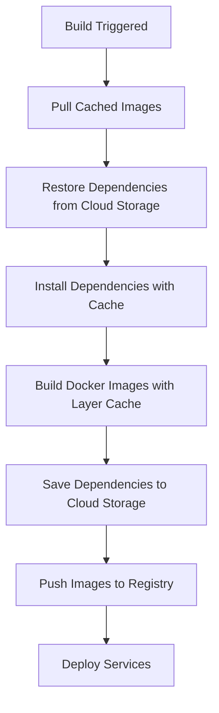

# Build Caching Guide

This guide explains the comprehensive caching strategy implemented for Google Cloud Build to reduce build times and costs.

## 🎯 Overview

The caching strategy uses multiple layers of caching to minimize rebuild time:

1. **Docker Layer Caching** - Reuses Docker image layers
2. **Dependency Caching** - Caches `node_modules` and pnpm store
3. **Cloud Storage Caching** - Persists cache between builds
4. **Optimized Dockerfiles** - Structured for maximum cache hits

## 🏗️ Architecture



## 📁 Files Modified

### Core Build Files
- `cloudbuild.yaml` - Enhanced with comprehensive caching
- `server/Dockerfile.production` - Optimized layer ordering
- `web/Dockerfile.production` - Optimized layer ordering

### New Scripts
- `scripts/setup-build-cache.sh` - Sets up Cloud Storage bucket
- `scripts/manage-build-cache.sh` - Manages cache (status, clear, etc.)

## 🚀 Setup Instructions

### 1. Initial Setup
```bash
# Set up the cache bucket
./scripts/setup-build-cache.sh
```

### 2. Run Your First Build
```bash
# This will be slower as it creates the initial cache
gcloud builds submit --config cloudbuild.yaml .
```

### 3. Subsequent Builds
```bash
# These will be much faster due to caching
gcloud builds submit --config cloudbuild.yaml .
```

## 🔧 Cache Management

### Check Cache Status
```bash
./scripts/manage-build-cache.sh status
```

### Clear Cache (if needed)
```bash
./scripts/manage-build-cache.sh clear
```

### View Cache Contents
```bash
./scripts/manage-build-cache.sh contents
```

## 💡 How It Works

### Docker Layer Caching
- Pulls previous images before building
- Uses `--cache-from` to reuse layers
- Enables BuildKit for better caching

### Dependency Caching
- Caches `node_modules` in Cloud Storage
- Caches pnpm store for faster installs
- Restores cache at build start
- Saves updated cache after build

### Optimized Dockerfiles
- Package files copied first (rarely change)
- Dependencies installed before source code
- Source code copied last (changes frequently)
- Each layer is cached independently

## 📊 Expected Performance

### First Build
- **Time**: ~8-12 minutes
- **Cost**: Full build cost
- **Cache**: Creates initial cache

### Subsequent Builds (no code changes)
- **Time**: ~2-3 minutes
- **Cost**: ~70% reduction
- **Cache**: Full cache hit

### Subsequent Builds (code changes only)
- **Time**: ~4-6 minutes
- **Cost**: ~50% reduction
- **Cache**: Partial cache hit

### Subsequent Builds (dependency changes)
- **Time**: ~6-8 minutes
- **Cost**: ~30% reduction
- **Cache**: Docker layer cache hit

## 🛠️ Troubleshooting

### Cache Not Working
1. Check if bucket exists: `gsutil ls gs://$PROJECT_ID-build-cache`
2. Verify permissions: `gsutil iam get gs://$PROJECT_ID-build-cache`
3. Check build logs for cache restoration messages

### Build Still Slow
1. Ensure Dockerfiles are optimized (package files first)
2. Check if `--cache-from` is working in build logs
3. Verify Cloud Storage cache is being saved

### Cache Too Large
1. Check cache size: `./scripts/manage-build-cache.sh status`
2. Clear cache if needed: `./scripts/manage-build-cache.sh clear`
3. Adjust lifecycle policy in setup script

## 🔍 Monitoring

### Build Logs
Look for these messages in build logs:
- `🔍 Pulling cached images for Docker layer caching...`
- `🚀 Restoring node_modules from cache...`
- `💾 Saving cache for next build...`

### Cache Effectiveness
- Check build times in Cloud Build console
- Monitor cache hit rates in logs
- Use `./scripts/manage-build-cache.sh status` to track cache size

## 💰 Cost Optimization

### Storage Costs
- Cache bucket has 30-day lifecycle policy
- Old cache files are automatically deleted
- Monitor cache size with management script

### Build Costs
- Faster builds = lower compute costs
- Dependency caching reduces install time
- Docker layer caching reduces build time

## 🔄 Maintenance

### Regular Tasks
1. Monitor cache size monthly
2. Clear cache if it becomes too large
3. Update lifecycle policy if needed
4. Review build performance metrics

### Cache Invalidation
Cache is automatically invalidated when:
- Package files change (`package.json`, `pnpm-lock.yaml`)
- Dockerfile changes
- Dependencies change

## 📈 Best Practices

1. **Don't clear cache unnecessarily** - Let it build up over time
2. **Monitor cache size** - Use management script regularly
3. **Optimize Dockerfiles** - Keep frequently changing layers last
4. **Use specific tags** - Avoid `latest` for production builds
5. **Test cache effectiveness** - Compare build times before/after

## 🆘 Support

If you encounter issues:
1. Check the troubleshooting section above
2. Review build logs for error messages
3. Verify all scripts have execute permissions
4. Ensure Cloud Build service account has proper permissions

## 📚 Additional Resources

- [Google Cloud Build Caching Documentation](https://cloud.google.com/build/docs/optimize-builds/speeding-up-builds)
- [Docker Layer Caching Best Practices](https://docs.docker.com/build/cache/)
- [pnpm Caching Documentation](https://pnpm.io/cli/store)
