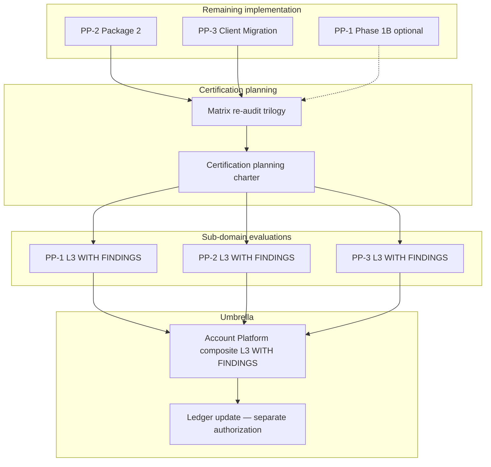

# Account Platform — Certification Path

**Program:** Account Platform — Post-Foundation Certification Readiness Reassessment  
**Date:** 2026-06-20  
**Type:** Governance roadmap only — **no certification execution authorized**  
**Framework:** G1–G9 platform capability gates (Admin Portal, BO, Reference Workspace precedent)

---

## Current posture (post all foundations)

| Sub-domain | Readiness | Cert status | Change since Phase 0C |
|------------|-----------|-------------|----------------------|
| **PP-1 Identity & Profile** | ~81% | NOT CERTIFIABLE → **L3 WITH FINDINGS candidate** | +37 pts — services + PE + activity |
| **PP-2 Settings** | ~78% | NOT CERTIFIABLE | +41 pts — foundation only; G9 unchanged |
| **PP-3 Billing & Entitlements** | ~85% | NOT CERTIFIABLE → **progress review eligible** | +29 pts — entitlement + billing SoR |
| **Account Platform umbrella** | ~72% | **No ledger row** | +27 pts program implementation |

*Scores are governance estimates — not evaluator-certified. Operation matrix re-audit required before any evaluation packet.*

---

## Certification anti-patterns (still in force)

| Anti-pattern | Status |
|--------------|--------|
| Certify before implementation foundations | ✅ Foundations shipped — anti-pattern cleared for **planning** |
| Certify PP-3 before entitlement SoR | ✅ Cleared — F01 closed |
| Certify PP-2 before PP-1 substrate | ✅ Cleared |
| Umbrella cert before sub-domains | **Still blocked** |
| Plain L3 as trilogy target | **Still inappropriate** — MFA, modal billing, hub fragmentation |
| Ledger update during implementation | **Not performed** — unchanged |

---

## Recommended topology: Phased platform capabilities (Path 1)

Unchanged from Phase 0C — **hybrid Option C** with sub-domain certificates compositing into umbrella row.

---

## Sub-domain certification paths

### PP-1 — Identity & Profile

| Field | Value |
|-------|-------|
| **Target outcome** | L3 WITH FINDINGS |
| **Earliest sub-domain certifiable** | **Yes — first in trilogy** |
| **Pre-evaluation gates** | Matrix re-audit; F04 partial acceptable; F03 MFA → advisory or Phase 1B |
| **Expected open advisories** | 6–10 (session UX, photo URLs, notification fragmentation until PP-2 P2) |
| **Plain L3** | Unlikely — MFA + G6 gaps |

**Evaluation timing:** After PP-2 Package 2 (notification adapter improves cross-domain audit story) **or** parallel progress review if matrix re-audit complete.

---

### PP-2 — Settings Platform

| Field | Value |
|-------|-------|
| **Target outcome** | L3 WITH FINDINGS |
| **Pre-evaluation gates** | Package 2 complete (F04–F09); integration test expansion |
| **Blocking for eval** | F04–F09 majors |
| **Expected open advisories** | 4–6 (module settings index, theme edges) |

**Evaluation timing:** After PP-2 Package 2 — illustrative **Q1–Q2 2027**.

---

### PP-3 — Billing & Entitlements

| Field | Value |
|-------|-------|
| **Target outcome** | L3 WITH FINDINGS; Stripe depth → reference billing pattern advisory post-cert |
| **Split evaluation** | **Progress review now eligible** (entitlement + billing backend slices) |
| **Full L3 gates** | F03 closed (client migration); F08 addressed or documented; F02 data migration |
| **Expected open advisories** | 4–8 (trial flow, AI query boundary, legacy cleanup) |

**Evaluation timing:**

| Slice | When | Scope |
|-------|------|-------|
| Entitlement progress review | **Now eligible** | Tier SoR, resolver, gating — no ledger |
| Billing backend progress review | **Now eligible** | `billingService`, PE, activity — no ledger |
| Full PP-3 L3 | After client migration + UX decision on F08 | Complete convergence |

---

### Account Platform umbrella

| Requirement | Status |
|-------------|--------|
| PP-1 at L3 WITH FINDINGS | ⏳ Earliest candidate |
| PP-2 at L3 WITH FINDINGS | ⏳ Blocked on Package 2 |
| PP-3 at L3 WITH FINDINGS | ⏳ Blocked on F03 closure + F08 |
| Unified cross-domain operation matrix | ❌ Not merged |
| Cross-cutting security (MFA decision) | ❌ Open |
| No open blocking findings | ❌ F02, F03 partial |

**Umbrella evaluation:** **Q2 2027 illustrative** — unchanged draft target; **not justified until sub-domains advance**.

**Umbrella scope (composite):**

| Included | Excluded |
|----------|----------|
| Identity, profile, settings IA, billing, entitlements | BA business profile (separate L3) |
| User account security slice | AI persona (AI Platform) |
| Privacy slice | Dashboard layout (Wave 3) |
| Preference registry | Admin Portal operator ops |

---

## Certification planning charter — when justified

| Criterion | Met? |
|-----------|------|
| All three foundation packages complete | ✅ |
| At least one sub-domain ≥80% with majors closed | ✅ PP-1 |
| Partial blockers documented with sunset | ✅ PP3-F03 |
| Operation matrix re-audit | ❌ |
| PP-2 Package 2 complete | ❌ |
| PP-3 client migration complete | ❌ |

**Verdict:** Certification **planning** charter justified **after PP-2 Package 2 + PP-3 client migration** — not as next package.

Certification **execution** remains unauthorized.

---

## Progress reviews (non-ledger)

Authorized as **governance-only** checkpoints without ledger promotion:

| Review | Eligibility | Output |
|--------|-------------|--------|
| PP-3 entitlement slice | ✅ Now | Findings delta report |
| PP-3 billing backend slice | ✅ Now | Convergence status report |
| PP-1 identity foundation | ✅ After matrix re-audit | G1–G9 self-score submission |

---

## Evaluation checklist (per sub-domain)

| Step | PP-1 | PP-2 | PP-3 | Umbrella |
|------|------|------|------|----------|
| Implementation charter complete | ✅ P1 | ✅ P1 | ✅ P1+P2 | ⏳ |
| Matrix re-audit | ⏳ | ⏳ | ⏳ | ⏳ |
| Blocking findings closed | Partial | N/A (blockings done) | Partial | ❌ |
| Integration test evidence | Partial | Partial | ✅ Stronger | ⏳ |
| Council evaluation packet | ❌ | ❌ | Progress only | ❌ |
| Ledger update | ❌ | ❌ | ❌ | ❌ |

---

## Reference capability potential (unchanged — post-cert only)

| Pattern | Candidate | Prerequisite |
|---------|-----------|--------------|
| Stripe billing integration | Reference billing pattern | PP-3 L3 WITH FINDINGS |
| Preference registry + settings IA | Reference settings pattern | PP-2 L3 WITH FINDINGS |
| Photo library + Vssyl ID | Reference identity foundation | PP-1 L3 WITH FINDINGS |

**Not authorized today** — separate council vote per `REFERENCE_MODULE_CATALOG`.

---

## Ledger posture

| Action | Status |
|--------|--------|
| Certification ledger update | **Not performed** |
| Sub-domain ledger rows | **Not created** |
| Umbrella row | **Draft target post sub-domain certs** |

---

**Last updated:** 2026-06-20 (Post-Foundation Reassessment)
