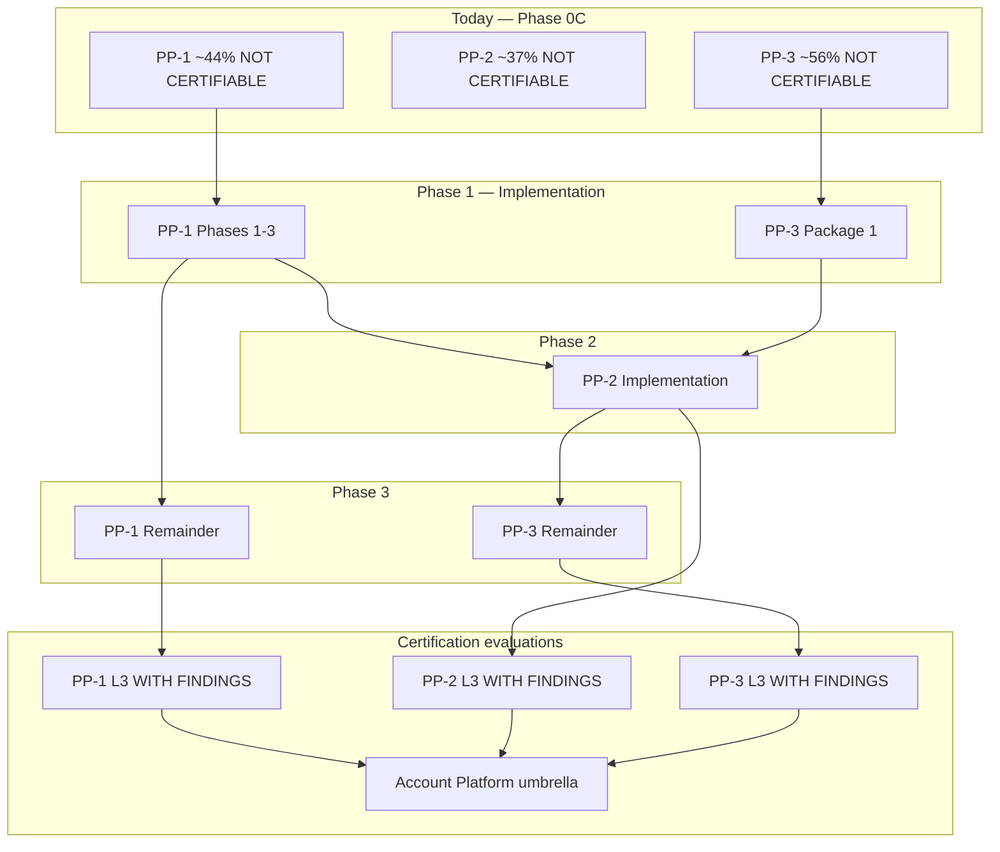

# Account Platform — Certification Roadmap

**Program:** Account Platform Phase 0C — Trilogy Governance & Modernization Sequencing  
**Date:** 2026-06-19  
**Status:** Governance roadmap — **no certification execution authorized**

**Framework:** G1–G9 platform capability gates (consistent with Admin Portal, BO, Reference Workspace, WS-L3 programs).

---

## Roadmap overview

---

## Current readiness (Phase 0C baseline)

| Sub-domain | G1–G9 | Operation matrix | Cert status |
|------------|-------|------------------|-------------|
| **PP-1 Identity & Profile** | ~12/27 (~44%) | 4C / 28P / 7N | NOT CERTIFIABLE |
| **PP-2 Settings** | ~10/27 (~37%) | Low C · high P/N | NOT CERTIFIABLE |
| **PP-3 Billing & Entitlements** | ~15/27 (~56%) | 7C / 33P / 7N | NOT CERTIFIABLE |
| **Account Platform umbrella** | No composite score | No unified matrix | **No ledger row** |

---

## PP-1 certification path

### Target outcome

**Platform capability L3 WITH FINDINGS** — not plain L3 (MFA gap likely remains advisory).

### Implementation gates before evaluation

| Gate | Requirement | Phase |
|------|-------------|-------|
| G3 Service boundaries | `authService`, `profileService`, `profilePhotoService` | Phases 1–3 |
| G3 remainder | `privacyService`, `connectionService` | PP-1 remainder |
| G1 Authorization | PE on profile, photo, privacy, connection writes | Remainder |
| G2 Auditability | Normalized activity on mutations | Remainder |
| G6 Tests | Integration suite for identity/profile | Phases 1–3 + remainder |
| G8 Production safety | MFA decision (implement or document deferral) | Remainder |
| G4 API coherence | Auth routes out of `index.ts` | Phase 1 |

### Post-implementation target score

| Gate | Current | Target |
|------|---------|--------|
| G1 | 1 | 2–3 |
| G2 | 1 | 2–3 |
| G3 | 1 | 3 |
| G4 | 2 | 3 |
| G5 | 1 | 3 |
| G6 | 1 | 2–3 |
| G7 | 2 | 3 |
| G8 | 2 | 2–3 |
| G9 | 2 | 3 |
| **Total** | **~44%** | **~67–81%** |

### Likely findings at evaluation

| Severity | Finding | Resolution |
|----------|---------|------------|
| Major (pre-eval) | PP1-F01–F06 | Must close before evaluation |
| Advisory (may remain) | MFA, session UX, legacy photo URLs, PP-2 hook drift | WITH FINDINGS acceptable |

### Evaluation timing

**After PP-1 remainder** (privacy, connections) — may evaluate phases 1–3 slice earlier as **progress review** but not full L3.

---

## PP-2 certification path

### Target outcome

**Platform capability L3 WITH FINDINGS**.

### Implementation gates before evaluation

| Gate | Requirement |
|------|-------------|
| PP-1 foundation | Phases 1–3 complete |
| PP-3 Package 1 | Tier resolver live (for gated settings UI) |
| G3 | `settingsService` + registry |
| G4 | `/api/settings` mounted; `useUserSettings` fixed |
| G5 | Ownership model enforced in code |
| G9 | Hub consolidation — reduced entry points |
| G6 | Settings integration test suite |

### Post-implementation target score

| Gate | Current | Target |
|------|---------|--------|
| **Total** | **~37%** | **~65–78%** |

### Likely findings at evaluation

| Severity | Finding |
|----------|---------|
| Blocking (pre-eval) | No platform API, no registry, broken hook |
| Advisory (may remain) | Module settings index completeness, theme migration edges |

### Evaluation timing

**After PP-2 implementation complete** — no earlier evaluation warranted.

---

## PP-3 certification path

### Target outcome

**Platform capability L3 WITH FINDINGS** — Stripe integration depth supports **reference billing pattern** advisory post-cert.

### Split evaluation option

| Slice | When | Scope |
|-------|------|-------|
| **Entitlements slice** | After Package 1 | Tier SoR, resolver, gating consolidation — **progress review** |
| **Full PP-3** | After Remainder | Billing UX, dual API retired, PE/activity |

### Implementation gates before full evaluation

| Gate | Requirement | Phase |
|------|-------------|-------|
| Entitlement SoR | `entitlementService` + Subscription authoritative | Package 1 |
| Dual API | `/api/payment` retired | Remainder |
| G3 | `billingService`, thin controller | Remainder |
| G1/G2 | PE + activity on subscription lifecycle | Remainder |
| G9 | Billing beyond modal-only | Remainder |
| G6 | Entitlement + billing integration tests | Package 1 + Remainder |

### Post-implementation target score

| Gate | Current | Target (full) |
|------|---------|---------------|
| **Total** | **~56%** | **~74–85%** |

### Likely findings at evaluation

| Severity | Finding |
|----------|---------|
| Blocking (pre-eval) | PP3-F01–F03 |
| Advisory (may remain) | Trial flow, AI query boundary docs, legacy client cleanup |

### Evaluation timing

**Full L3 after PP-3 Remainder** — Package 1 enables **entitlement progress review** only.

---

## Account Platform umbrella path

### Target outcome

**Account Platform program ledger row** — composite **L3 WITH FINDINGS** referencing sub-domain certificates.

### Requirements for umbrella evaluation

| Requirement | Source |
|-------------|--------|
| PP-1 at L3 WITH FINDINGS | Sub-domain cert |
| PP-2 at L3 WITH FINDINGS | Sub-domain cert |
| PP-3 at L3 WITH FINDINGS | Sub-domain cert |
| Unified cross-domain operation matrix | Governance merge of PP-1/2/3 matrices |
| Cross-cutting security posture | MFA decision documented |
| Ownership model ratified in runtime | All three ownership docs enforced |
| No open **blocking** findings across trilogy | Council rule |

### Umbrella scope (composite)

| Included | Excluded |
|----------|----------|
| Identity, profile, settings IA, billing, entitlements | BA business profile (L3 separate) |
| User account security slice | AI persona (AI Platform) |
| Privacy slice | Dashboard layout (Wave 3) |
| Preference registry | Admin Portal operator ops |

### Target timeline (draft)

| Milestone | Target |
|-----------|--------|
| PP-3 Package 1 complete | Q3 2026 (illustrative) |
| PP-1 phases 1–3 complete | Q3 2026 |
| PP-2 implementation complete | Q1 2027 |
| PP-3 Remainder complete | Q1 2027 |
| Sub-domain L3 evaluations | Q1–Q2 2027 |
| Umbrella evaluation | **Q2 2027** (aligns with Phase 0A portfolio draft) |

*Dates illustrative — charters set actual schedule.*

### Likely umbrella outcome

**L3 WITH FINDINGS** — not plain L3. Composite advisories from MFA, trial flow, module settings index, and cross-hub edge cases expected (~6–12 open advisories).

### Reference capability potential (post-umbrella)

| Pattern | Candidate status |
|---------|------------------|
| Stripe billing integration | **Reference billing pattern** — medium confidence |
| Preference registry + settings IA | **Reference settings pattern** — post PP-2 L3 |
| Photo library + Vssyl ID | **Reference identity foundation** — post PP-1 L3 |

**Not authorized today** — reference designation requires separate council vote per `REFERENCE_MODULE_CATALOG` process.

---

## Certification anti-patterns

| Anti-pattern | Why blocked |
|--------------|-------------|
| Certify PP-3 before Package 1 | Ratifies tier drift |
| Certify PP-2 before PP-1 | No substrate |
| Umbrella cert before sub-domains | No composite without children |
| Plain L3 target for trilogy | MFA, modal billing, trial gaps |
| Ledger update during implementation | Cert execution is separate phase |
| Merge BA L3 into umbrella | Excluded domain |

---

## Ledger posture (unchanged)

| Action | Status |
|--------|--------|
| Certification ledger update | **Not performed** (Phase 0C governance only) |
| Sub-domain ledger rows | **Not created** |
| Umbrella row | **Draft target Q2 2027** |

---

## Evaluation checklist (per sub-domain)

| Step | Action |
|------|--------|
| 1 | Implementation charter complete |
| 2 | Operation matrix re-audit — blocking findings closed |
| 3 | G1–G9 self-score ≥ target threshold |
| 4 | Integration test evidence attached |
| 5 | Council evaluation packet submitted |
| 6 | Evaluator review (external or council-appointed) |
| 7 | Findings register published |
| 8 | Ratification vote |
| 9 | Ledger update (separate authorized action) |

---

**Last updated:** 2026-06-19 (Phase 0C)
