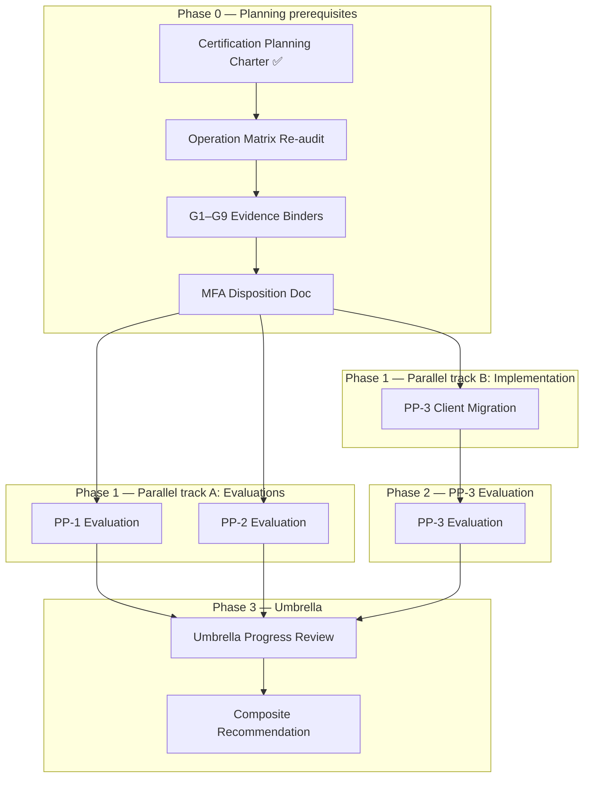

# Account Platform — Certification Sequence

**Program:** Account Platform — Certification Planning Charter  
**Date:** 2026-06-20  
**Status:** Authoritative sequence — planning only

**Supersedes:** Evaluation ordering in [ACCOUNT_PLATFORM_CERTIFICATION_ROADMAP.md](./ACCOUNT_PLATFORM_CERTIFICATION_ROADMAP.md) (Phase 0C baseline)

---

## Authoritative recommendation

| Decision | Selection | Justification |
|----------|-----------|---------------|
| **PP-1 first vs PP-2 first vs PP-3 first** | **PP-1 + PP-2 parallel** | Both eval-ready; independent boundaries; maximizes throughput |
| **PP-3 position** | **Last** | Client migration hard gate |
| **Strongest sub-domain** | **PP-2 (~93%)** | Likely first to receive L3 WITH FINDINGS recommendation |
| **Foundation narrative order** | **PP-1 → PP-2 → PP-3** | Dependency story for umbrella composite |

**Not recommended:** PP-3 first (blocked). Sequential PP-1-then-PP-2 only (unnecessary delay).

---

## Full sequence

---

## Phase detail

### Phase 0 — Planning prerequisites (current)

| # | Activity | Duration (illustrative) | Exit |
|---|----------|-------------------------|------|
| 0.1 | Certification Planning Charter | Complete | This document set |
| 0.2 | Operation matrix re-audit | 2–4 weeks | Updated C/P/N per sub-domain |
| 0.3 | Evidence binder assembly | 2–3 weeks | G1–G9 packets |
| 0.4 | MFA disposition (PP1-F03) | 1 week | Document for eval |
| 0.5 | Evaluation authorization votes | Council | Per sub-domain |

### Phase 1 — Parallel evaluations + client migration

| Track | Activity | Prerequisite | May overlap? |
|-------|----------|--------------|--------------|
| **A** | PP-1 evaluation | Phase 0 + auth vote | Yes — with Track B |
| **A** | PP-2 evaluation | Phase 0 + auth vote | Yes — with Track B |
| **B** | PP-3 Client Migration | Separate impl charter | Yes — with Track A |

### Phase 2 — PP-3 evaluation

| Activity | Prerequisite |
|----------|--------------|
| PP-3 L3 WITH FINDINGS evaluation | Client migration complete + Phase 0 + auth vote |

### Phase 3 — Umbrella

| Activity | Prerequisite |
|----------|--------------|
| Umbrella progress review | All three sub-domain evals complete |
| Composite L3 WITH FINDINGS recommendation | Unified matrix + no open blockings |
| Ledger draft (governance) | Council decision — **not promotion** |

---

## Certification vs evaluation order

| Sub-domain | Evaluates | Certifies (L3 WITH FINDINGS) |
|------------|-----------|------------------------------|
| PP-1 | Phase 1 (parallel) | Phase 1 — may tie with PP-2 |
| PP-2 | Phase 1 (parallel) | **Likely first** (strongest evidence) |
| PP-3 | Phase 2 | Phase 2 |
| Umbrella | Phase 3 | Phase 3 — earliest Q1–Q2 2027 illustrative |

---

## Implementation sequence from here

| Order | Initiative | Type |
|-------|------------|------|
| 1 | Operation matrix re-audit | Governance |
| 2 | G1–G9 evidence binders | Governance |
| 3 | PP-3 Client Migration | Implementation (separate charter) |
| 4 | PP-1 + PP-2 evaluation authorization | Council vote |
| 5 | PP-1 + PP-2 evaluation execution | Certification activity |
| 6 | PP-3 evaluation authorization + execution | After migration |
| 7 | Umbrella progress review | Certification activity |

---

## What should NOT be worked on next

| Item | Reason |
|------|--------|
| Ledger promotion | Out of charter scope |
| Council ratification vote | Premature |
| Evaluation execution | Requires separate authorization |
| Billing UX dashboard | WITH FINDINGS at PP-3 eval |
| Plain L3 pursuit | Blocked across trilogy |
| MFA implementation | Unless PP-1 Phase 1B separately chartered |
| `/api/payment` router unmount (Phase 3) | Post-eval remainder |

---

## Timeline (illustrative)

| Window | Milestone |
|--------|-----------|
| 2026-07 | Phase 0 complete; eval authorizations |
| 2026-08–09 | PP-1/PP-2 evals ∥ client migration |
| 2026-10 | PP-3 eval |
| 2026-11 | Umbrella progress review |
| 2027-Q1 | Composite L3 WITH FINDINGS recommendation (illustrative) |

---

**Last updated:** 2026-06-20 (Certification Planning Charter)
