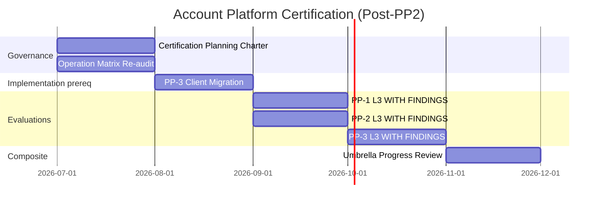

# Account Platform — Certification Sequence Update

**Program:** Account Platform — Post-PP2 Certification Path Reassessment  
**Date:** 2026-06-20  
**Status:** Governance update — supersedes Phase 0C certification timing for sub-domain evaluations

**Prior:** [ACCOUNT_PLATFORM_CERTIFICATION_ROADMAP.md](./ACCOUNT_PLATFORM_CERTIFICATION_ROADMAP.md) · [ACCOUNT_PLATFORM_MODERNIZATION_SEQUENCE.md](./ACCOUNT_PLATFORM_MODERNIZATION_SEQUENCE.md)

---

## Implementation phase — complete

| Wave | Status |
|------|--------|
| PP-1 Phase 1 | ✅ |
| PP-2 Phase 1 + Package 2 | ✅ |
| PP-3 Package 1 + Package 2 | ✅ |

**Implementation gate for certification planning:** **Met.**

---

## Updated certification sequence

*Timeline illustrative — council charters set actual dates.*

---

## Phase 1 — Certification planning (next)

| # | Work item | Exit criteria |
|---|-----------|---------------|
| 1 | Operation matrix re-audit (PP-1, PP-2, PP-3) | Updated C/P/N counts per sub-domain |
| 2 | Evaluation packet templates | G1–G9 evidence binders per sub-program |
| 3 | Findings disposition register | F01–F09 mapped to WITH FINDINGS vs must-close |
| 4 | Client migration charter scope | Phase 2 of API convergence plan |
| 5 | MFA disposition (PP1-F03) | Implement vs documented deferral for eval |
| 6 | Sequencing council brief | PP-1/PP-2 parallel eval authorization |

**Not in planning charter:** Ledger promotion, ratification vote, plain L3 targets.

---

## Phase 2 — PP-3 Client Migration (prerequisite for PP-3 eval)

| # | Work item | Exit criteria |
|---|-----------|---------------|
| 1 | Migrate `web/src/api/payment.ts` → `/api/billing` | No production calls to legacy subscription CRUD |
| 2 | Migrate `web/src/lib/stripe.ts` | Canonical billing paths only |
| 3 | Close PP3-F03 | Evaluator confirms single client namespace |
| 4 | Close PP3-F12 | Legacy client removed |

**May run parallel with PP-1/PP-2 evaluations** — does not block identity or settings evals.

---

## Phase 3 — Sub-domain evaluations

| Order | Evaluation | Prerequisite | Target outcome |
|-------|------------|--------------|----------------|
| **1a** | PP-1 Identity & Profile | Planning charter + matrix re-audit | **L3 WITH FINDINGS** |
| **1b** | PP-2 Settings Platform | Planning charter + matrix re-audit | **L3 WITH FINDINGS** |
| **2** | PP-3 Billing & Entitlements | Client migration complete | **L3 WITH FINDINGS** |

PP-1 and PP-2 evaluations **may proceed in parallel** after planning charter approval.

---

## Phase 4 — Umbrella composite

| Gate | Requirement |
|------|-------------|
| All three sub-domains | L3 WITH FINDINGS minimum |
| Unified operation matrix | Published |
| No open **blocking** findings | Council rule |
| Ledger row draft | Governance only — not promotion |

**Earliest umbrella progress review:** After all three sub-domain evaluations.

**Plain L3 umbrella:** Not targeted in current program horizon.

---

## Findings disposition at evaluation

| Finding | PP-1 eval | PP-2 eval | PP-3 eval |
|---------|-----------|-----------|-----------|
| PP1-F03 MFA | WITH FINDINGS advisory | — | — |
| PP1-F04 photo controller | WITH FINDINGS | — | — |
| PP2-F05 business dedup | — | WITH FINDINGS (BA owns) | — |
| PP3-F02 tier drift | — | — | WITH FINDINGS |
| PP3-F08 billing UX | — | — | WITH FINDINGS |
| PP3-F03 dual API | — | — | Must close before eval |

---

## What changes from Phase 0C roadmap

| Phase 0C assumption | Post-PP2 reality |
|---------------------|------------------|
| PP-2 ~37% at cert time | **~93%** — eval-ready |
| PP-2 blocks on hub majors | **Closed** (F05 partial only) |
| PP-3 eval after PP-3 Remainder only | Eval after **client migration**; UX remainder is WITH FINDINGS |
| PP-1 eval after remainder | Eval now — remainder items are WITH FINDINGS |

---

**Last updated:** 2026-06-20 (Post-PP2 Reassessment)
