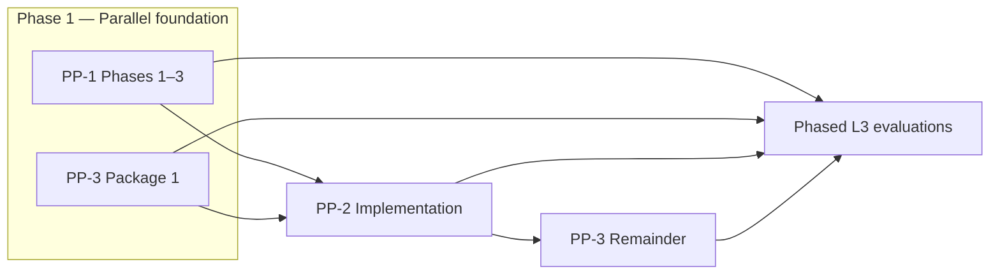

# Account Platform — Council Review

**Program:** Account Platform Phase 0C — Trilogy Governance & Modernization Sequencing  
**Date:** 2026-06-19  
**Status:** **Governance ratification package** — no implementation authorized by this document  
**Audience:** Account Platform council · architecture council · engineering leadership

**Prerequisites:** Phase 0A (domain discovery) · Phase 0B-1 (PP-1) · Phase 0B-2 (PP-2) · Phase 0B-3 (PP-3)

---

## Council mandate

Ratify:

1. Trilogy relative posture (maturity, risk, value, dependencies)
2. Authoritative dependency model
3. Modernization sequence (**Option C selected**)
4. Entitlement SoR governance decision
5. Certification roadmap (sub-domains + umbrella)
6. Portfolio priority vs Dashboard Wave 3

**Stop condition:** Governance only. No runtime changes. No certification execution. No ledger updates. No implementation packages.

---

## A. Trilogy review

### Comparative scorecard

| Dimension | PP-1 Identity & Profile | PP-2 Settings | PP-3 Billing & Entitlements |
|-----------|-------------------------|---------------|----------------------------|
| **Backend maturity** | L1 | L0–L1 | **L2** |
| **UX maturity** | L2 fragmented | L1 (16 hubs) | L1 (modal-only) |
| **G1–G9 estimate** | ~44% (12/27) | ~37% (10/27) | **~56% (15/27)** |
| **Operation matrix C/P/N** | 4 / 28 / 7 | Low C · high P/N | 7 / 33 / 7 |
| **Service layer** | **Missing** (inline `index.ts`) | **Missing** (`settingsService`) | **Partial** (subscription/stripe exist) |
| **Constitutional compliance** | Fail (no PE/activity) | Fail (no platform API) | Partial (no PE/activity on writes) |
| **Certification today** | NOT CERTIFIABLE | NOT CERTIFIABLE | NOT CERTIFIABLE |
| **Reference potential** | Medium (post-L3) | Medium (post-L3) | **Medium–High** (Stripe depth) |

### Risk posture

| Sub-domain | Critical risks | Tier |
|------------|----------------|------|
| **PP-1** | No `profileService`; auth in `index.ts`; no MFA | **Critical** (AP-R02, AP-R05) |
| **PP-2** | 16 hubs; broken `/settings` contract; no registry | **Critical** (AP-R01) |
| **PP-3** | Tier SoR drift; dual `/payment`/`/billing` APIs | **Critical** (AP-R04, AP-R03) |

**Highest-risk domain (portfolio):** **PP-3 Entitlements** — tier enum drift creates revenue leakage and wrong feature access across HR, AI, modules, and admin override paths. **PP-2 Settings fragmentation** is highest **user-session blast radius**; **PP-1 Identity gap** is highest **foundation risk**.

### Business value

| Rank | Domain | Value driver |
|------|--------|--------------|
| 1 | **PP-3 Billing & Entitlements** | Revenue, module gating, AI query packs, Stripe commerce |
| 2 | **PP-2 Settings** | Support burden, user trust, preference safety |
| 3 | **PP-1 Identity & Profile** | Daily active users, avatars, contacts, auth trust |

**Council note:** Highest **value** (PP-3) and highest **correctness risk** (entitlements) align — entitlement SoR is P0 governance.

### Dependency summary

| Sub-domain | Hard upstream | Soft upstream | Downstream consumers |
|------------|---------------|---------------|----------------------|
| **PP-1** | None (foundation) | — | PP-2, PP-3 customer lifecycle |
| **PP-2** | **PP-1** (profile, registry, privacy) | PP-3 (billing tab IA) | All modules (settings links) |
| **PP-3** | None for Package 1 backend | PP-1 (stripeCustomerId lifecycle), PP-2 (billing hub IA) | HR, AI, modules, admin |

---

## B. Dependency analysis (summary)

Full graph: [ACCOUNT_PLATFORM_DEPENDENCY_MODEL.md](./ACCOUNT_PLATFORM_DEPENDENCY_MODEL.md).

| Question | Answer |
|----------|--------|
| What does PP-1 depend on? | **Nothing** in Account Platform — foundation slice |
| What does PP-2 depend on? | **PP-1 hard** — `profileService`, preference registry, `privacyService`, domain events |
| What does PP-3 depend on? | **PP-1 soft–medium** (customer lifecycle); **PP-2 soft** (settings IA); **no hard blocker for Package 1** |

---

## C. Implementation sequencing — council decision

### Options evaluated

| Option | Sequence | Verdict |
|--------|----------|---------|
| **A** | PP-1 → PP-2 → PP-3 | **Rejected** — delays entitlement SoR fix; revenue risk persists |
| **B** | PP-1 → PP-3 → PP-2 | **Partially acceptable** — better than A but underutilizes parallel backend work |
| **C** | PP-1 + PP-3 Package 1 → PP-2 → PP-3 remainder | **✅ SELECTED** |

### Option C — ratified sequence

| Phase | Work | Charter |
|-------|------|---------|
| **1** | PP-1 phases 1–3 + PP-3 Package 1 (**parallel**) | PP-1 Implementation Charter + PP-3 Package 1 Charter |
| **2** | PP-2 implementation | PP-2 Implementation Charter |
| **3** | PP-3 remainder (billing UX, `/payment` retirement, PE/activity) | PP-3 Remainder Charter |
| **4** | Phased L3 WITH FINDINGS evaluations | Separate council votes |

Detail: [ACCOUNT_PLATFORM_MODERNIZATION_SEQUENCE.md](./ACCOUNT_PLATFORM_MODERNIZATION_SEQUENCE.md).

---

## D. Entitlement governance — council decision

### Entitlement SoR (ratified)

| Layer | Role | Status |
|-------|------|--------|
| **Active `Subscription.tier`** | **Authoritative platform tier SoR** | **Target — ratified** |
| **`entitlementService`** | Canonical read resolver for tier + features | **Target — mandatory** |
| **`Business.tier`** | **Deprecated as independent write SoR** — derived cache or admin-audited mirror only | **Transitional** |
| **`FeatureGatingService` FEATURES catalog** | Feature definition registry (not tier SoR) | Retain; consume resolver input |
| **`hrFeatureGating` matrix** | HR-owned feature matrix | Retain; **must read tier from `entitlementService`** |
| **`Module.pricingTier` / `ModuleSubscription`** | Module commerce tier (separate vocabulary) | Retain; interpreted by entitlements slice |
| **`subscriptionMiddleware`** | Route gate | Consolidate tier reads through resolver |
| **`admin-override` set-tier** | **Must write `Subscription` + audit** — not `Business.tier` alone | **Fix required** |

Full analysis: [ACCOUNT_PLATFORM_MODERNIZATION_SEQUENCE.md](./ACCOUNT_PLATFORM_MODERNIZATION_SEQUENCE.md) § Entitlement governance.

---

## E. Certification roadmap (summary)

| Sub-domain | Path | Target outcome |
|------------|------|----------------|
| **PP-1** | Implementation → matrix re-audit → evaluation | **L3 WITH FINDINGS** |
| **PP-2** | After PP-1 foundation → implementation → evaluation | **L3 WITH FINDINGS** |
| **PP-3** | Package 1 (entitlement) → remainder → evaluation | **L3 WITH FINDINGS** |
| **Umbrella** | All three at L3 WITH FINDINGS + cross-matrix | **Account Platform program row** (draft Q1 2027) |

Detail: [ACCOUNT_PLATFORM_CERTIFICATION_ROADMAP.md](./ACCOUNT_PLATFORM_CERTIFICATION_ROADMAP.md).

---

## F. Portfolio priority — Dashboard Wave 3

### Council decision

**Account Platform implementation should begin before Dashboard Wave 3 remainder work is prioritized.**

| Factor | Account Platform | Dashboard Wave 3 (remainder) |
|--------|------------------|------------------------------|
| Revenue / trust risk | **Critical** (tier SoR, billing) | Low (layout duplication) |
| Security risk | **High** (MFA gap, auth in `index.ts`) | Low |
| User blast radius | High (settings, identity) | Medium (shell chrome) |
| Wave 3A menus | — | **Done** |
| Wave 3C layout shell | PP-2 **consumes** settings layout patterns | **In progress / deferred items** |
| Blocks other programs | PP-2 blocks coherent settings; PP-3 blocks gating | Does not block Account Platform |
| Parallel execution | **Yes** — different workstreams | **Yes** — 3C-7 HR/Calendar shells |

**Rationale:** Wave 3A (menus) is complete. Remaining Wave 3C work is **UX shell extraction** — valuable but not revenue-critical. Account Platform addresses **tier SoR drift** (revenue leakage), **broken settings contract**, and **identity foundation gap**. PP-2 hub consolidation will **inform** settings layout in 3C — sequencing Account Platform before 3C settings/admin grid work avoids rework.

**Council rule:** Dashboard module L3 certification is **independent** of Account Platform umbrella — same as WS-L3 shell vs Dashboard module (see [WORKSPACE_POST_RATIFICATION_ROADMAP.md](../workspace/WORKSPACE_POST_RATIFICATION_ROADMAP.md)).

---

## Council votes required (next session)

| # | Motion | Recommendation |
|---|--------|----------------|
| 1 | Ratify Option C modernization sequence | **Approve** |
| 2 | Ratify `Subscription.tier` + `entitlementService` as entitlement SoR | **Approve** |
| 3 | Authorize **PP-1 Implementation Charter** (separate document) | **Approve pending charter draft** |
| 4 | Authorize **PP-3 Package 1 Charter** (entitlement SoR) in parallel with PP-1 phases 1–3 | **Approve pending charter draft** |
| 5 | Defer PP-2 Implementation Charter until PP-1 phases 1–3 complete | **Approve** |
| 6 | Account Platform before Dashboard Wave 3 remainder (portfolio priority) | **Approve** |

---

## Deliverables index

| Document | Purpose |
|----------|---------|
| [ACCOUNT_PLATFORM_DEPENDENCY_MODEL.md](./ACCOUNT_PLATFORM_DEPENDENCY_MODEL.md) | Authoritative dependency graph |
| [ACCOUNT_PLATFORM_MODERNIZATION_SEQUENCE.md](./ACCOUNT_PLATFORM_MODERNIZATION_SEQUENCE.md) | Option C detail + package definitions |
| [ACCOUNT_PLATFORM_CERTIFICATION_ROADMAP.md](./ACCOUNT_PLATFORM_CERTIFICATION_ROADMAP.md) | Sub-domain + umbrella cert paths |
| [ACCOUNT_PLATFORM_EXECUTIVE_SUMMARY_PHASE_0C.md](./ACCOUNT_PLATFORM_EXECUTIVE_SUMMARY_PHASE_0C.md) | Executive brief + 10 questions |
| This document | Council review record |

---

## Related Phase 0B deliverables

| Program | Executive summary |
|---------|-------------------|
| PP-1 | [PP1_IDENTITY_PROFILE_EXECUTIVE_SUMMARY.md](./PP1_IDENTITY_PROFILE_EXECUTIVE_SUMMARY.md) |
| PP-2 | [PP2_SETTINGS_EXECUTIVE_SUMMARY.md](./PP2_SETTINGS_EXECUTIVE_SUMMARY.md) |
| PP-3 | [PP3_BILLING_ENTITLEMENTS_EXECUTIVE_SUMMARY.md](./PP3_BILLING_ENTITLEMENTS_EXECUTIVE_SUMMARY.md) |

---

**Last updated:** 2026-06-19 (Phase 0C)
