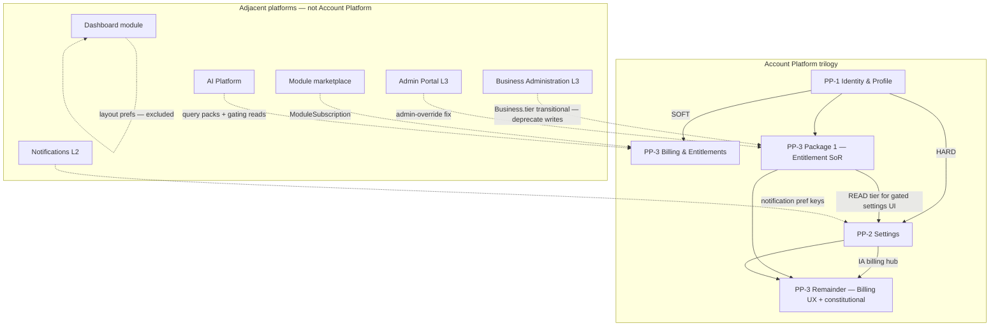

# Account Platform — Dependency Model

**Program:** Account Platform Phase 0C — Trilogy Governance & Modernization Sequencing  
**Date:** 2026-06-19  
**Status:** **Authoritative dependency graph** — governance; not runtime-enforced

**Supersedes:** Dependency notes in Phase 0A/0B executive summaries for sequencing decisions.

---

## Dependency strength legend

| Symbol | Meaning |
|--------|---------|
| **HARD** | Implementation cannot proceed without upstream completion |
| **SOFT** | Can proceed with coordination; full certification needs alignment |
| **READ** | Downstream reads upstream data/API only |
| **IA** | Information architecture / UX placement only |

---

## Authoritative dependency graph

---

## PP-1 dependencies

### What PP-1 depends on

| Dependency | Type | Notes |
|------------|------|-------|
| Account Platform program charter | Governance | Phase 0A Option C |
| Prisma `User`, `RefreshToken`, auth tables | Data | Existing |
| `securityService` / `SecurityEvent` | Service | Partial — auth failures |
| `geolocationService` | Service | Registration only |
| **PP-2** | — | **None** |
| **PP-3** | — | **None** |
| Business Administration | — | **Excluded** — BA profile is separate L3 |
| AI Platform | — | **Excluded** — AI persona not PP-1 |

**PP-1 is the Account Platform foundation — no hard upstream dependencies.**

### What depends on PP-1

| Consumer | Dependency type | What PP-1 provides |
|----------|-----------------|-------------------|
| **PP-2 Settings** | **HARD** | `profileService`, `privacyService`, preference registry substrate, `userPreferenceService` extension |
| **PP-3 Billing** | **SOFT** | `User` row + `stripeCustomerId` lifecycle via `authService`; JWT auth (already works) |
| **All modules** | **READ** | User identity, avatars, contacts |
| **Notifications** | **SOFT** | KV key schema for notification prefs |
| **Admin Portal** | **READ** | User ops, impersonation context |

---

## PP-2 dependencies

### What PP-2 depends on

| Dependency | Type | Notes |
|------------|------|-------|
| **PP-1 Identity & Profile** | **HARD** | Service extraction before PP-2 code changes |
| `profileService` | **HARD** | Settings hub displays profile; links to profile mutations |
| `privacyService` | **HARD** | Privacy hub placement + SoR separation |
| Preference registry / `userPreferenceService` | **HARD** | `/api/settings` contract builds on registry |
| Domain events (normalized activity) | **HARD** | Constitutional writes on preference mutations |
| **PP-3 Package 1** | **SOFT** | Tier resolver for HR-gated settings UI reads |
| **PP-3 Remainder** | **IA** | Billing tab placement in consolidated hub |
| Notifications platform | **SOFT** | Delivery + metadata; Settings orchestrates UI |
| AI Platform | **IA** | Cross-link to AI Control Center — not Settings SoR |
| Business Administration | **IA** | Business entity settings — BA owns rows; PP-2 owns hub dedup |
| Dashboard Wave 3C | **SOFT** | Settings layout patterns — PP-2 IA informs 3C deferred grids |

### What depends on PP-2

| Consumer | Dependency type | What PP-2 provides |
|----------|-----------------|-------------------|
| **PP-3 Remainder** | **IA** | Billing settings tab in unified hub |
| All modules | **IA** | Settings index / discoverability |
| `useUserSettings` hook | **HARD** | Fix broken `/settings` contract |
| HR module | **READ** | Tier-gated settings surfaces |

---

## PP-3 dependencies

### What PP-3 depends on

| Dependency | Type | Notes |
|------------|------|-------|
| Stripe (external) | **HARD** | Payment provider |
| Prisma billing models | **HARD** | `Subscription`, `ModuleSubscription`, etc. |
| **PP-1** | **SOFT** | `authService` for customer lifecycle; JWT works today without extraction |
| **PP-2** | **SOFT–IA** | Billing hub placement; not blocking Package 1 |
| Module marketplace | **READ** | `ModuleInstallation`, `Module.pricingTier` |
| AI Platform | **READ** | Query consumption; billing owns purchase rows |
| Admin Portal | **SOFT** | `adminBillingService`; admin-override fix |
| Business Administration | **TRANSITIONAL** | `Business.tier` writes — deprecate |

### PP-3 Package 1 scope (minimal dependencies)

| Work item | PP-1 required? | PP-2 required? |
|-----------|----------------|----------------|
| `entitlementService` creation | **No** | **No** |
| Canonical tier enum | **No** | **No** |
| `Subscription.tier` as SoR | **No** | **No** |
| Migrate `hrFeatureGating` tier reads | **No** | **No** |
| Fix `admin-override` | **No** | **No** |
| Consolidate `subscriptionMiddleware` | **No** | **No** |

**Package 1 can overlap PP-1 phases 1–3.**

### PP-3 Remainder scope (additional dependencies)

| Work item | PP-1 required? | PP-2 required? |
|-----------|----------------|----------------|
| Retire `/api/payment` + client migration | **Soft** | **No** |
| Billing dashboard UX | **Soft** | **IA — hub placement** |
| PE + activity on billing writes | **Soft** | **No** |
| `billingService` facade | **No** | **No** |
| Full L3 certification evaluation | **Soft** | **Soft–IA** |

### What depends on PP-3

| Consumer | Dependency type | What PP-3 provides |
|----------|-----------------|-------------------|
| **HR module** | **READ** | Tier gates via `hrFeatureGating` |
| **AI Platform** | **READ** | Feature gating, query pack billing |
| **Module marketplace** | **READ** | `ModuleSubscription`, revenue split |
| **PP-2 Settings** | **READ** | Tier for gated settings UI |
| **Feature routes** | **READ** | `/api/features`, subscription middleware |
| Admin Portal | **READ** | Operator billing analytics |

---

## Cross-program dependency matrix

| Program | Account Platform relationship |
|---------|------------------------------|
| **Business Administration** | BA L3 certified — **excluded** from Account Platform writes on `Business` profile |
| **Admin Portal** | Operator billing adjacency — admin-override fix is PP-3 Package 1 |
| **AI Platform** | Consumes entitlements; owns query consumption — not billing SoR |
| **Notifications** | PP-2 coordinates pref UI; Notifications owns delivery |
| **Dashboard / Wave 3** | Layout prefs excluded; 3C settings grids **soft coordinate** with PP-2 |
| **Reference Workspace** | Archived WS-L3 — independent of Account Platform |
| **Module marketplace** | Install vs subscribe split — PP-3 owns paid tier |

---

## Dependency rules (ratified)

1. **PP-1 before PP-2 implementation** — hard rule; discovery parallel allowed.
2. **PP-3 Package 1 parallel with PP-1 phases 1–3** — hard rule for Option C.
3. **PP-2 before PP-3 Remainder UX certification** — soft rule for billing hub IA.
4. **Entitlement reads must flow through `entitlementService`** after Package 1 — all consumers.
5. **No Account Platform writes to BA-certified `Business` profile fields** — unchanged from Phase 0A.
6. **Dashboard Wave 3 does not block Account Platform** — parallel allowed; Account Platform prioritized for portfolio.

---

## Anti-patterns (do not sequence)

| Anti-pattern | Why blocked |
|--------------|-------------|
| PP-2 implementation before PP-1 service extraction | Broken substrate; duplicate profile logic |
| PP-3 full cert before entitlement SoR | Certification would ratify drift |
| Merge `Business.tier` writes without Subscription sync | Perpetuates AP-R04 |
| Dashboard Wave 3C settings grids before PP-2 IA charter | Rework risk on hub consolidation |
| Umbrella certification before sub-domain L3 WITH FINDINGS | No composite ledger row without children |

---

**Last updated:** 2026-06-19 (Phase 0C)
