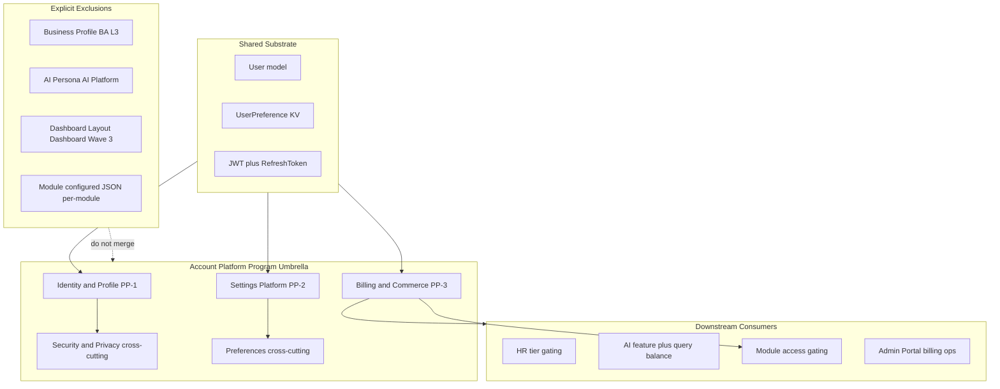

# Account Platform — Domain Map

**Program:** Account Platform Phase 0A — Reality Assessment & Domain Discovery  
**Date:** 2026-06-19  
**Status:** Discovery only

---

## Topology recommendation (Hybrid — Option C)



---

## Domain inventory

### Account Platform sub-domains (in scope)

| Sub-domain | Type | Key surfaces | Primary SoR | Maturity | Cert status |
|------------|------|--------------|-------------|----------|-------------|
| **Identity & Profile** | Platform capability slice | `/api/profile`, `/api/profile-photos`, `/api/member`, `/profile/*` | `User`, `UserProfilePhoto`, `Relationship` | **L1** | **Unaudited** |
| **Settings Platform** | Platform capability slice | 12–14 settings hubs, 20+ API families | Fragmented — no platform namespace | **L1** | **Unaudited** |
| **Billing & Commerce** | Platform capability slice | `/api/billing`, `/api/payment`, Stripe, `/api/features` | `Subscription`, `ModuleSubscription`, `FeatureGatingService` | **L2 backend / L1 UX** | **Unaudited** |
| **Entitlements & Licensing** | Billing sub-slice | `featureGating`, `subscriptionMiddleware`, `Module.pricingTier` | **Dual SoR** — Subscription + `Business.tier` | **L2 fragmented** | **Unaudited** |
| **Security (account)** | Cross-cutting | `/api/auth/*`, tokens, password reset | `auth.ts`, `tokenUtils`, `RefreshToken` | **L1–L2** (no MFA) | **Unaudited** |
| **Privacy** | Cross-cutting | `/api/privacy/*`, `/profile/analytics` | `UserPrivacySettings`, `UserConsent` | **L1–L2** | **Unaudited** |
| **Preferences** | Cross-cutting | KV + AI + notification keys | `UserPreference` + domain tables | **L1** | **Unaudited** |

---

### Adjacent domains (related but not Account Platform)

| Domain | Relationship | Why excluded |
|--------|--------------|--------------|
| **Business Administration — business profile** | Shares "profile" noun | **L3 certified** — `businessProfileService`, PE, activity events |
| **AI Platform — identity/personality** | Parallel user persona | Deferred L3 program; 7+ AI routes |
| **Dashboard module** | Layout/sidebar prefs | **Separate Wave 3** — workspace shell ≠ dashboard product |
| **Notifications platform** | Settings overlap | **L2 service certified separately** (UX Ref #2) — not settings platform cert |
| **Admin Portal** | Billing/security ops | **L3 certified** — operator control plane |
| **Member module** | Connections UI | Identity graph — in Identity slice scope |

---

## Entity map

### Identity & Profile entities

| Entity | Model | API | UI |
|--------|-------|-----|-----|
| Core user | `User` | `/api/profile`, auth | `/profile`, `/profile/settings` |
| Photo library | `UserProfilePhoto` | `/api/profile-photos/*` | `ProfilePhotoManager` |
| Vssyl ID / location | Location FKs on User | `/api/location/*` | settings location tab |
| Connections | `Relationship` | `/api/member/connections*` | `/member` |
| Pinned colleagues | `PinnedColleague` | `/api/member/business/:id/pinned` | member UI |

### Settings entities (by persistence)

| Entity | Store | Hub |
|--------|-------|-----|
| Account fields | `User` | `/profile/settings?tab=account` |
| Privacy | `UserPrivacySettings` | `/profile/analytics` |
| Notification prefs | `UserPreference` keys | `/notifications/settings` |
| Email prefs | `UserPreference` keys | `EmailNotificationSettings` |
| Push subs | `PushSubscription` | `PushNotificationSettings` |
| Theme | localStorage | `AvatarContextMenu` |
| Business config | `Business` + webhooks | workspace settings |
| Module config | `ModuleInstallation.configured` | module panels |

### Billing entities

| Entity | Model | Consumer |
|--------|-------|----------|
| Core sub | `Subscription` | User/business tier |
| Module sub | `ModuleSubscription` | App Store model |
| Invoice | `Invoice` | Billing history |
| Usage | `UsageRecord` | Metering |
| AI queries | `AIQueryBalance` | AI routes |
| Pricing | `PricingConfig` | Admin + checkout |
| Feature catalog | `FeatureGatingService` static | `/api/features` |

---

## API namespace map

```
Account-adjacent (fragmented — no /api/account or /api/settings platform root)

Identity:     /api/profile  /api/profile-photos  /api/user  /api/member  /api/location
Settings:     /api/user/preferences/:key  /api/privacy  /api/notifications  /api/email-notifications
              /api/push-notifications  /api/place/settings  /api/modules  /api/hr/admin/settings
AI prefs:     /api/ai/preferences  /api/ai/personality  /api/ai/autonomy  /api/ai/identity  ...
Billing:      /api/billing  /api/payment (legacy)  /api/features  /api/feature-gating  /api/pricing
              /api/usage  /api/ai/queries
Security:     /api/auth/*  (inline index.ts)
Admin:        /api/admin-portal/billing  /api/admin-portal/security  /api/admin-override
```

**Missing canonical namespaces:** `/api/settings`, `/api/account`, `/api/entitlements`

---

## UI hub map

```
Personal account path (fragmented):
  AvatarContextMenu
    → Profile Settings (/profile/settings)
    → Billing (BillingModal)
    → Theme (localStorage)
    → AI (/ai)
  /profile/analytics (privacy — not in settings hub)
  /notifications/settings
  /member (connections)

Business account path (overlap):
  /business/:id/profile          ← BA domain
  /business/:id/workspace/settings
  /business/:id/branding
  /business/:id/workspace/settings/webhooks
```

---

## Dependency edges

| From | To | Edge type |
|------|-----|-----------|
| Identity | Settings | Profile hub is primary settings entry |
| Settings | Billing | Billing modal from avatar menu |
| Billing | Entitlements | Feature gating reads subscription tier |
| Billing | AI Platform | Query balance, feature checks |
| Billing | HR | `hrFeatureGating` |
| Billing | Modules | `ModuleSubscription`, `pricingTier` |
| Security | Identity | Auth gates all account APIs |
| Privacy | Settings | IA split — same user concern |
| Preferences | AI Platform | Parallel preference stores |
| Preferences | Dashboard | Layout JSON — separate module |

---

## Certification boundary map

| Boundary | Inside Account Platform program | Outside |
|----------|--------------------------------|---------|
| Personal profile name/photos | ✅ | |
| Business org profile | | ✅ BA L3 |
| User auth/password/MFA | ✅ | |
| Admin impersonation ops | | ✅ Admin Portal L3 |
| User privacy/GDPR | ✅ | |
| Stripe subscriptions | ✅ | |
| Module marketplace revenue | ✅ (billing slice) | |
| Widget grid layout | | ✅ Dashboard Wave 3 |
| AI personality questionnaire | | ✅ AI Platform |
| In-app notification delivery | | ✅ Notifications L2 service |

---

## Related

- [ACCOUNT_PLATFORM_REALITY_ASSESSMENT.md](./ACCOUNT_PLATFORM_REALITY_ASSESSMENT.md)
- [ACCOUNT_PLATFORM_OWNERSHIP_MODEL.md](./ACCOUNT_PLATFORM_OWNERSHIP_MODEL.md)
- [PLATFORM_PORTFOLIO_DOMAIN_MAP.md](../platform-portfolio/PLATFORM_PORTFOLIO_DOMAIN_MAP.md)

**Last updated:** 2026-06-19 (Phase 0A)
