# Account Platform — Evaluation Authorization Decision

**Program:** Account Platform — Umbrella Certification Evaluation Authorization Review  
**Date:** 2026-06-20  
**Type:** Governance decision record — **recommendation issued; council vote pending**  
**Status:** **Recommendation issued**

**Supersedes:** [ACCOUNT_PLATFORM_EVALUATION_AUTHORIZATION_DECISION.md](./ACCOUNT_PLATFORM_EVALUATION_AUTHORIZATION_DECISION.md) PP-1/PP-2 parallel authorization (2026-06-20) — **executed and ratified**

---

## Decision

| Field | Value |
|-------|-------|
| **Authorization outcome** | **✅ AUTHORIZE Account Platform Umbrella Certification Evaluation** |
| **Target certification level** | **LEVEL 3 CERTIFIED WITH FINDINGS** |
| **Evaluation execution** | **Not performed** by this review |
| **Ledger update** | **Not authorized** |
| **Council ratification** | **Required separately** post-evaluation |

---

## Authorization rationale

1. **Trilogy complete** — PP-1, PP-2, PP-3 all ratified L3 WITH FINDINGS (24/27 · 26/27 · 23/27).
2. **Preparation packet complete** — unified matrix validation, composite evidence binder, findings register, readiness review.
3. **No open blocking findings** — 0 AP-UMB blockers; ~23 sub-domain findings frozen closed.
4. **Composite G1–G9 score 22/27 (~81%)** — exceeds WITH FINDINGS threshold; aligns with WS (23/27) and BO (24/27) bands.
5. **Cross-domain coherence validated** — 122-row unified matrix; 0 ownership conflicts; exclusions held.
6. **Residual risks acceptable** — 7 majors dispositioned; MFA disposition document; G9 compensation rule documented.
7. **Progress review + planning + prep gates complete** — no remaining prep prerequisites.

---

## Conditions of authorization

| # | Condition | Owner |
|---|-----------|-------|
| 1 | Submit evaluation packet per [ACCOUNT_PLATFORM_CERTIFICATION_PREPARATION_SUMMARY.md](./ACCOUNT_PLATFORM_CERTIFICATION_PREPARATION_SUMMARY.md) | Program governance |
| 2 | Assign evaluator (council-appointed) | Council |
| 3 | Target **L3 WITH FINDINGS** — not plain L3 | Evaluator briefing |
| 4 | Pre-brief AP-UMB-M01–M07 as accepted/documented majors | Program governance |
| 5 | Apply G9 compensation rule from composite G1–G9 model | Evaluator |
| 6 | Include MFA disposition in eval packet | Program governance |
| 7 | **No ledger update** until separate ratification vote post-eval | Council |
| 8 | **No runtime changes** during evaluation unless eval blocker discovered | Engineering |
| 9 | Do not re-audit closed sub-domain findings without regression evidence | Evaluator |

---

## Denial criteria (not met)

| Criterion | Met? |
|-----------|------|
| Open blocking finding | ❌ Not met — 0 open |
| Composite below WITH FINDINGS threshold (&lt;70%) | ❌ Not met — 81% |
| Missing evidence packet | ❌ Not met — complete |
| Ownership conflict | ❌ Not met — 0 conflicts |
| Sub-domain regression | ❌ Not met — none identified |
| Unified matrix invalid | ❌ Not met — validated |

**Denial is not warranted.**

---

## Alternatives considered

| Option | Assessment | Verdict |
|--------|------------|---------|
| **A. Authorize umbrella evaluation now** | Packet complete; trilogy ratified; 0 blockers | **✅ Selected** |
| B. Defer for MFA implementation | Delays without improving L3 WF odds | Rejected |
| C. Defer for billing UX (M02) | Functional within modal; pre-briefed | Rejected |
| D. Defer for trilogy ledger PR | Recommended parallel — not blocking | Rejected |
| E. Authorize plain L3 target | 7 majors block | Rejected |
| F. Deny evaluation | No governance basis | Rejected |

---

## Post-authorization sequence

```mermaid
flowchart LR
  AUTH[Authorization ✅]
  ASSIGN[Evaluator assignment]
  SUBMIT[Packet submission]
  EVAL[Umbrella evaluation]
  FIND[AP-UMB findings confirm]
  REC[Recommendation report]
  RAT[Council ratification vote]
  LED[Ledger update — separate]

  AUTH --> ASSIGN
  ASSIGN --> SUBMIT
  SUBMIT --> EVAL
  EVAL --> FIND
  FIND --> REC
  REC --> RAT
  RAT --> LED
```

| Step | Authorized by this decision? |
|------|-------------------------------|
| Evaluation entry | **Yes** — upon council vote |
| Evaluation execution | **Yes** — upon evaluator assignment |
| Ledger promotion | **No** |
| Council ratification | **No** — follows eval recommendation |

---

## Scope boundaries (evaluation)

| In scope | Out of scope |
|----------|--------------|
| Account Platform umbrella composite | Sub-domain re-evaluation (unless regression) |
| Cross-cutting G1–G9 at program level | Plain L3 promotion |
| Unified 122-row operation matrix | MFA implementation |
| AP-UMB findings register | Billing dashboard UX implementation |
| Trilogy integration coherence | BA business dedup implementation |
| Inherited sub-domain attestations | Program archive / closeout |

---

## Expected evaluation findings (predicted)

| Severity | Predicted open count | Examples |
|----------|---------------------|----------|
| Major | 6–7 | M01–M07 (may consolidate M04 into ACC-01) |
| Advisory | 16–20 | ADV-01–18; possible ≤3 new AP-UMB-EVAL-* |
| Blocking | 0 | — |

**Predicted award:** **L3 WITH FINDINGS** at **21–23/27** evaluator score.

---

## Plain L3 blockers (document for eval packet)

| Blocker | Finding |
|---------|---------|
| MFA | AP-UMB-M01 |
| Billing dashboard UX | AP-UMB-M02 |
| Business settings dedup | AP-UMB-M03 |
| Tier enum migration | AP-UMB-M04 |
| Photo controller boundary | AP-UMB-M06 |
| Composite G9 | Requires M02 closure |

---

## WITH FINDINGS blockers

**None.** All 7 majors are pre-dispositioned for WITH FINDINGS path. Authorization is not blocked by open majors.

---

## Sign-off posture

| Role | Action |
|------|--------|
| Program governance | **Recommend AUTHORIZE** |
| Council | **Vote required** for formal charter |
| Evaluator | Not yet assigned |
| Engineering | Hold — no implementation unless eval blocker |

---

**Last updated:** 2026-06-20 (Umbrella Evaluation Authorization Decision)
