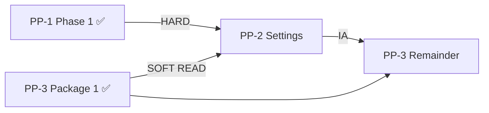

# Account Platform — Foundation Checkpoint

**Program:** Account Platform — PP-1 / PP-3 Foundation Checkpoint  
**Date:** 2026-06-20  
**Type:** Governance review only  
**Status:** **Checkpoint complete**

**Council sequence (ratified):** Option C — PP-1 + PP-3 Package 1 (parallel) → PP-2 → PP-3 Remainder

---

## Checkpoint purpose

Determine whether **PP-2 Settings Platform implementation** is authorized, or whether additional PP-1 / PP-3 foundation work is required first.

**Verdict:** **PP-2 is authorized to begin.** No additional foundation gate required.

---

## Foundation completion summary

| Package | Status | Key artifacts |
|---------|--------|---------------|
| **PP-1 Phase 1** | ✅ Complete | 7 account services + PE + activity + preference substrate |
| **PP-3 Package 1** | ✅ Complete | `entitlementService` + Subscription SoR + read APIs + gating alignment |
| **PP-2** | ⏳ Not started | Awaiting implementation charter |
| **PP-3 Package 2 / Remainder** | ⏳ Deferred | After PP-2 |

---

## Findings rollup

### PP-1

| Category | Count |
|----------|-------|
| Majors closed | 4 (F01, F02, F05, F06) |
| Majors partial | 1 (F04) |
| Majors open | 1 (F03 MFA) |
| Advisories open | 6 |

### PP-3

| Category | Count |
|----------|-------|
| Blocking closed | 1 (F01) |
| Blocking partial | 1 (F02) |
| Blocking open | 1 (F03 — cert only) |
| Majors closed | 1 (F04) |
| Majors partial | 2 (F05, F07) |
| Majors open | 2 (F06, F08) |

### PP-2 (pre-implementation)

| Category | Count |
|----------|-------|
| Blocking open | 3 (F01–F03) — **PP-2 implementation targets** |
| Majors open | 6 (F04–F09) |

---

## Dependency gate analysis

| Gate | Met? |
|------|------|
| PP-1 service extraction (HARD) | ✅ |
| PP-1 preference substrate (HARD) | ✅ |
| PP-3 entitlement resolver (SOFT) | ✅ |
| PP-3 billing API retirement (—) | Not required for PP-2 |
| PP-3 full certification | Not required for PP-2 |

---

## Sequencing decision

| Option | Selected |
|--------|----------|
| A. Start PP-2 now | **✅ Yes** |
| B. PP-1 Phase 1B cleanup first | No — optional parallel |
| C. PP-3 Package 2 first | No — violates Option C |
| D. Parallel cleanup first | No — not a hard gate |

---

## Required questions — answers

| # | Question | Answer |
|---|----------|--------|
| 1 | Is PP-1 foundation sufficient for PP-2? | **Yes** — all HARD dependencies met |
| 2 | Is PP-3 entitlement foundation sufficient for PP-2? | **Yes** — SOFT READ dependency met |
| 3 | Are there open blockers (for PP-2 start)? | **No** |
| 4 | Are there open majors? | **Yes** — PP1-F03 (MFA), PP1-F04 partial; PP3-F02/F05/F07 partial; PP3-F06/F08 open — none block PP-2 |
| 5 | What PP-1 gaps remain? | MFA; photo controller thinning; Global Trash photos; full integration tests; matrix re-audit |
| 6 | What PP-3 gaps remain? | F03 dual APIs; billing PE/events on checkout; `billingService`; tier enum migration; AI/usage direct reads |
| 7 | Can PP-2 start? | **Yes** |
| 8 | Should PP-3 Package 2 wait? | **Yes** — until after PP-2 |
| 9 | Recommended next package? | **PP-2 Settings Platform** |
| 10 | Updated Account Platform readiness? | **~52% → ~58%** program implementation readiness (see executive summary) |

---

## Deliverables produced

| Document | Purpose |
|----------|---------|
| [ACCOUNT_PLATFORM_FOUNDATION_CHECKPOINT.md](./ACCOUNT_PLATFORM_FOUNDATION_CHECKPOINT.md) | This checkpoint |
| [PP1_STATUS_REVIEW.md](./PP1_STATUS_REVIEW.md) | PP-1 findings and gaps |
| [PP3_STATUS_REVIEW.md](./PP3_STATUS_REVIEW.md) | PP-3 findings and gaps |
| [PP2_AUTHORIZATION_RECOMMENDATION.md](./PP2_AUTHORIZATION_RECOMMENDATION.md) | Authorization decision |
| [ACCOUNT_PLATFORM_FOUNDATION_EXECUTIVE_SUMMARY.md](./ACCOUNT_PLATFORM_FOUNDATION_EXECUTIVE_SUMMARY.md) | Executive rollup |

---

## Stop condition

Checkpoint and recommendation **complete**. No runtime changes. No PP-2 implementation started by this review.

**Next governance action:** Approve **PP-2 Settings Platform Implementation Charter** (separate authorization).

---

**Last updated:** 2026-06-20
