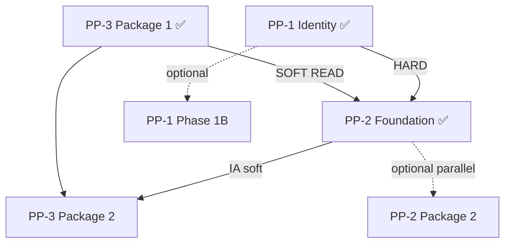

# Account Platform — Foundation Reassessment

**Program:** Account Platform — Foundation Checkpoint After PP-1 / PP-2 / PP-3 Package 1  
**Date:** 2026-06-20  
**Type:** Governance review only  
**Status:** **Checkpoint complete**

**Council sequence (ratified):** Option C — PP-1 + PP-3 Package 1 (parallel) → PP-2 → PP-3 Remainder

---

## Checkpoint purpose

Reassess Account Platform after all three foundation packages are in place and determine the **next implementation package**.

**Verdict:** Foundations complete. **PP-3 Package 2 is the recommended next authorization.** No additional foundation gate required.

---

## Foundation completion summary

| Package | Status | Key artifacts |
|---------|--------|---------------|
| **PP-1 Phase 1** | ✅ Complete | 7 account services + PE + activity + preference substrate |
| **PP-3 Package 1** | ✅ Complete | `entitlementService` + Subscription SoR + `/api/account/*` |
| **PP-2 Phase 1** | ✅ Complete | `settingsService` + registry + `/api/settings` + events |
| **PP-3 Package 2** | ⏳ Not started | Awaiting charter |
| **PP-2 Package 2** | ⏳ Not started | Deferred remainder |
| **PP-1 Phase 1B** | ⏳ Not started | Optional security wave |

---

## Findings rollup (post all foundations)

### PP-1

| Category | Count |
|----------|-------|
| Majors closed | 4 (F01, F02, F05, F06) |
| Majors partial | 1 (F04) |
| Majors open | 1 (F03 MFA) |
| Advisories closed | 1 (F12 via PP-2) |
| Advisories open | 5 |

### PP-2

| Category | Count |
|----------|-------|
| Blocking closed | 3 (F01–F03) |
| Majors partial | 1 (F07 theme) |
| Majors open | 5 (F04–F06, F08–F09) |
| Advisories open | 4 (F10–F13) |

### PP-3

| Category | Count |
|----------|-------|
| Blocking closed | 1 (F01) |
| Blocking partial | 1 (F02) |
| Blocking open | 1 (F03 — Package 2 target) |
| Majors closed | 1 (F04) |
| Majors partial | 2 (F05, F07) |
| Majors open | 2 (F06, F08) |
| Advisories open | 4+ |

---

## Cross-domain dependency verification

### PP-2 consumes PP-1 foundations

| Dependency | Type | Status | Evidence |
|------------|------|--------|----------|
| `profileService` | HARD | ✅ | Settings nav links to profile surfaces |
| `privacyService` | HARD | ✅ | Registry projects `privacy.*` read-only |
| `userPreferenceService` | HARD | ✅ | KV storage for writable registry keys |
| Preference domain events | HARD | ✅ | PP-1 substrate; PP-2 adds settings events |
| PE on preference writes | HARD | ✅ | `settings:read` / `settings:update` |

### PP-2 consumes PP-3 entitlement foundation

| Dependency | Type | Status | Evidence |
|------------|------|--------|----------|
| Tier reads for gated settings UI | SOFT | ✅ | `entitlementService.resolveTier()` + `/api/account/tier` |
| Billing hub IA placement | IA | ⏳ Deferred | Nav contract includes billing link; hub not consolidated |

### PP-3 Package 2 after PP-2 foundation

| Gate | Met? | Notes |
|------|------|-------|
| PP-2 `/api/settings` live | ✅ | Canonical contract operational |
| PP-2 hub IA substantially complete | ⚠️ Partial | Nav contract only; not sequencing blocker for backend billing |
| PP-1 identity substrate | ✅ | |
| PP-3 entitlement SoR | ✅ | |

**Conclusion:** PP-3 Package 2 **may proceed**. Billing backend work does not require settings hub consolidation.

### Circular ownership check

| Domain | Owns | Does not own |
|--------|------|--------------|
| **Settings** | Registry, `/api/settings`, orchestration, `appearance.theme` | Profile rows, privacy SoR, subscriptions, AI persona |
| **Identity** | Profile, privacy, connections, photos | Settings registry, billing |
| **Billing** | Subscriptions, entitlements, checkout | Settings KV, profile |
| **BA** | Business configuration rows | Settings platform API |
| **AI** | Personality, autonomy | Settings registry writes (`ai_preferred_*` read-only in registry) |

**No circular ownership** detected at runtime after foundations.

---

## Readiness estimates (governance)

| Domain | Pre-foundations | Post-foundations | Certification |
|--------|-----------------|------------------|---------------|
| PP-1 Identity | ~44% | **~81%** | L3 WITH FINDINGS candidate post re-audit |
| PP-2 Settings | ~37% | **~78%** (foundation) | NOT READY — majors F04–F09 |
| PP-3 Entitlements | ~44% | **~85%** (slice) | NOT READY — F03 blocker |
| **Account Platform (program implementation)** | ~45% | **~65%** | NOT CERTIFIABLE umbrella |

*Estimates for planning — not evaluator-certified.*

---

## Next package evaluation

| Option | Assessment | Verdict |
|--------|------------|---------|
| **A. PP-3 Package 2** — Billing Service + `/api/payment` retirement | Aligns with ratified Option C; closes PP3-F03; revenue/correctness risk; PP-2 foundation gate met | **✅ Recommended** |
| **B. PP-2 Package 2** — Hub IA / theme hydration / notification adapter | Valid remainder; closes PP2-F04–F09; does not address tier/API drift | Defer — not sequence-primary |
| **C. PP-1 Phase 1B** — MFA / photo cleanup | High security value; not sequencing blocker | Optional parallel |
| **D. Certification reassessment** | No open blocking findings closed across trilogy; matrix re-audit not done | **Premature** |

---

## Required questions — answers

| # | Question | Answer |
|---|----------|--------|
| 1 | PP-1 readiness now? | **~81%** — foundation complete; MFA open |
| 2 | PP-2 readiness now? | **~78%** (foundation) — blockings closed; IA majors open |
| 3 | PP-3 readiness now? | **~85%** (entitlements slice) — F03 blocks full cert |
| 4 | Account Platform readiness now? | **~65%** program implementation; **NOT CERTIFIABLE** |
| 5 | Open blockers? | **PP3-F03** (dual APIs) — cert blocker; **PP1-F03** (MFA) — security, not sequencing |
| 6 | Open majors? | **PP-1:** F03, F04 partial · **PP-2:** F04–F06, F08–F09, F07 partial · **PP-3:** F06, F08, F02/F05/F07 partial |
| 7 | Open advisories? | **~13** across trilogy (notification fragmentation, stale UI, orphan files, legacy clients) |
| 8 | Is PP-3 Package 2 authorized next? | **Yes — recommended** per Option C sequence |
| 9 | Is PP-2 Package 2 authorized next? | **Not as primary** — valid parallel or follow-on |
| 10 | Is PP-1 Phase 1B required first? | **No** |
| 11 | Is certification review premature? | **Yes** |
| 12 | Recommended next package? | **PP-3 Package 2 — Billing Service + `/api/payment` retirement** |

---

## Deliverables produced

| Document | Purpose |
|----------|---------|
| [ACCOUNT_PLATFORM_FOUNDATION_REASSESSMENT.md](./ACCOUNT_PLATFORM_FOUNDATION_REASSESSMENT.md) | This reassessment |
| [PP1_FOUNDATION_STATUS.md](./PP1_FOUNDATION_STATUS.md) | PP-1 status |
| [PP2_FOUNDATION_STATUS.md](./PP2_FOUNDATION_STATUS.md) | PP-2 status |
| [PP3_FOUNDATION_STATUS.md](./PP3_FOUNDATION_STATUS.md) | PP-3 status |
| [ACCOUNT_PLATFORM_NEXT_PACKAGE_RECOMMENDATION.md](./ACCOUNT_PLATFORM_NEXT_PACKAGE_RECOMMENDATION.md) | Authorization decision |
| [ACCOUNT_PLATFORM_FOUNDATION_REASSESSMENT_SUMMARY.md](./ACCOUNT_PLATFORM_FOUNDATION_REASSESSMENT_SUMMARY.md) | Executive summary |

---

## Stop condition

Checkpoint and recommendation **complete**. No runtime changes. No implementation authorized by this review.

**Next governance action:** Approve **PP-3 Package 2 Implementation Charter** (separate authorization).

---

**Last updated:** 2026-06-20
