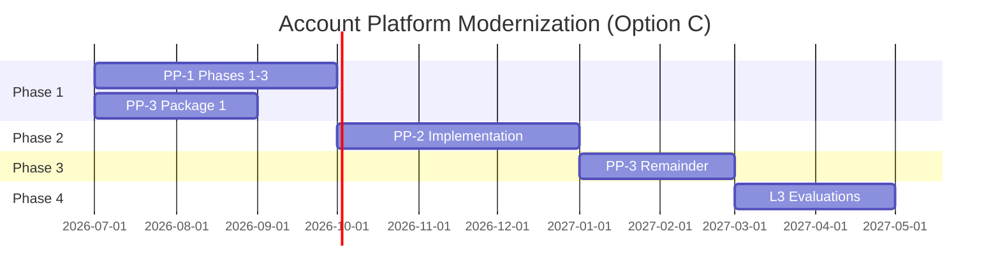

# Account Platform — Modernization Sequence

**Program:** Account Platform Phase 0C — Trilogy Governance & Modernization Sequencing  
**Date:** 2026-06-19  
**Status:** **Ratified sequence (Option C)** — governance only; implementation requires separate charters

**Council decision:** **Option C selected** — PP-1 + PP-3 Package 1 (parallel) → PP-2 → PP-3 Remainder.

---

## Options evaluated

### Option A — PP-1 → PP-2 → PP-3

| Pros | Cons |
|------|------|
| Clean linear dependency | **Delays entitlement SoR 2+ phases** — revenue/correctness risk persists |
| PP-2 hub before billing UX | PP-3 backend strength underutilized |
| Simple staffing narrative | Tier drift continues through PP-1 and PP-2 work |

**Verdict:** **Rejected.**

### Option B — PP-1 → PP-3 → PP-2

| Pros | Cons |
|------|------|
| Fixes tier SoR before settings | PP-2 still blocked until PP-1 complete |
| Revenue risk reduced earlier than A | **No parallel backend work** during PP-1 |
| Billing backend leads | Billing UX cert still needs PP-2 IA |

**Verdict:** **Partially acceptable** — better than A but inferior to C.

### Option C — PP-1 + PP-3 Package 1 → PP-2 → PP-3 Remainder

| Pros | Cons |
|------|------|
| **Parallel foundation** — identity + entitlement SoR simultaneously | Requires two parallel charters + coordination |
| **Earliest tier SoR fix** | Two workstreams need council oversight |
| PP-2 starts on stable identity + tier reads | Slightly more complex program management |
| Aligns with Phase 0B audit conclusions | |

**Verdict:** **✅ SELECTED.**

---

## Ratified modernization timeline



*Timeline illustrative — council charters set actual dates.*

---

## Phase 1 — Parallel foundation

### PP-1 phases 1–3 (Identity & Profile)

| Phase | Scope | Target services | Exit criteria |
|-------|-------|-----------------|---------------|
| **1** | Auth extraction | `authService` — login, register, refresh, password reset, verify email | Auth routes removed from `index.ts`; integration tests |
| **2** | Profile core | `profileService` — name, search, read projections | Thin profile routes; no inline Prisma in `index.ts` |
| **3** | Profile photos | `profilePhotoService` — library, avatar slots, upload | `profilePhotoController` thinned; photo tests |

**Not in Phase 1 (deferred to PP-1 remainder):** `privacyService`, `connectionService`, MFA, account security UX, preference registry completion.

**Charter:** PP-1 Implementation Charter (separate approval).

### PP-3 Package 1 (Entitlement SoR) — parallel with PP-1 phases 1–3

| # | Work item | Owner slice | Exit criteria |
|---|-----------|-------------|---------------|
| 1 | Canonical tier enum definition | Entitlements | Single `PlatformTier` vocabulary documented + enforced in validation |
| 2 | `entitlementService` | Entitlements | `getEffectiveTier`, `checkFeature`, `checkModuleAccess` |
| 3 | `Subscription.tier` as write SoR | Billing | All tier mutations write Subscription row |
| 4 | Deprecate `Business.tier` independent writes | Entitlements + Admin | Admin-override writes Subscription + audit trail |
| 5 | Migrate `hrFeatureGating` tier input | Entitlements | No `business.tier` fallback without resolver |
| 6 | Migrate `subscriptionMiddleware` | Entitlements | Single tier hierarchy from resolver |
| 7 | Migrate `FeatureGatingService` tier reads | Entitlements | Catalog retained; tier from resolver |
| 8 | Entitlement integration tests | Entitlements | Tier edge cases, admin override, HR gate |
| 9 | Archive `featureGatingService.simplified.ts` | Entitlements | Orphan removed |

**Explicitly NOT in Package 1:** `/api/payment` retirement, `billingService`, billing dashboard UX, PE/activity on billing writes, invoice service extraction.

**Charter:** PP-3 Package 1 Implementation Charter (separate approval).

### Phase 1 coordination rules

| Rule | Rationale |
|------|-----------|
| Package 1 **must not** change auth routes or profile APIs | Avoid PP-1 merge conflicts |
| PP-1 phase 3 **should coordinate** `stripeCustomerId` lifecycle hook with Package 1 if checkout touched | Soft coordination point |
| Package 1 **must not** implement PP-2 `/api/settings` | PP-2 scope |
| Both streams **update operation matrices** on completion | Governance hygiene |

---

## Phase 2 — PP-2 Settings implementation

**Gate:** PP-1 phases 1–3 complete **AND** PP-3 Package 1 complete (or Package 1 tier resolver live).

| # | Work item | Exit criteria |
|---|-----------|---------------|
| 1 | Preference key registry | Documented + validation layer |
| 2 | `settingsService` | Hub orchestration + section reads |
| 3 | `/api/settings` platform API | Bulk + section endpoints mounted |
| 4 | Fix `useUserSettings` hook | Calls live `/api/settings` |
| 5 | Personal settings hub consolidation | Reduce duplicate entry points |
| 6 | Business settings deduplication | Triplication resolved (IA + redirects) |
| 7 | Theme server-backed KV | `appearance.theme` in `UserPreference` |
| 8 | Notification pref adapter | Unified writes for `notification_*` keys |
| 9 | Privacy hub linkage | PP-1 `privacyService` embedded/linked |
| 10 | Billing tab placement (IA) | Links to `BillingModal` / future dashboard |

**Charter:** PP-2 Implementation Charter (separate approval — **not authorized until Phase 1 gate**).

---

## Phase 3 — PP-3 Remainder

**Gate:** PP-2 implementation substantially complete (hub IA + `/api/settings` live).

| # | Work item | Exit criteria |
|---|-----------|---------------|
| 1 | Retire `/api/payment` | Routes removed; clients on `/api/billing` |
| 2 | `billingService` facade | Checkout, upgrade, downgrade orchestration |
| 3 | `invoiceService` | Inline Prisma removed from controller |
| 4 | Thin `billingController` | Route → authorize → service → response |
| 5 | PE + normalized activity | Subscription lifecycle events |
| 6 | Billing dashboard UX | Beyond modal-only surface |
| 7 | Customer portal + webhook hardening | Tests expanded |
| 8 | Module subscription path unification | Single API namespace |
| 9 | Operation matrix re-audit | PP-3 rows updated |

**Charter:** PP-3 Remainder Implementation Charter (separate approval).

---

## Phase 4 — Certification evaluations

| Order | Evaluation | Prerequisite |
|-------|------------|--------------|
| 1 | PP-3 Entitlements + Billing | PP-3 Remainder complete |
| 2 | PP-1 Identity & Profile remainder | Privacy, connections, MFA (advisory may remain) |
| 3 | PP-2 Settings | PP-2 implementation complete |
| 4 | Account Platform umbrella | All three L3 WITH FINDINGS |

Evaluations are **separate council votes** — not authorized by Phase 0C.

---

## Entitlement governance (authoritative)

### What becomes Entitlement SoR

| Artifact | Role | Ratified decision |
|----------|------|-------------------|
| **Active `Subscription` row** | Platform tier **write and read SoR** | **✅ Authoritative** |
| **`entitlementService`** | **Canonical resolver** for effective tier + feature checks | **✅ Mandatory** |
| **`FeatureGatingService.FEATURES`** | Feature **catalog** (definitions, not tier) | Retain — not tier SoR |
| **`ModuleSubscription`** | Module **commerce** tier (`premium`/`enterprise`) | Retain — separate vocabulary |
| **`Module.pricingTier`** | Module **catalog** pricing class | Retain — marketplace defines |
| **`ModuleInstallation`** | Install state (free access) | Marketplace — not entitlement tier |

### What is deprecated or transitional

| Artifact | Current role | Target |
|----------|--------------|--------|
| **`Business.tier`** | Independent write SoR (admin-override) | **Derived cache** synced from Subscription OR read-only legacy with migration |
| **`subscriptionMiddleware` tier logic** | Inline enum hierarchy | Reads `entitlementService` |
| **`hrFeatureGating` fallback** | `activeSub?.tier \|\| business.tier` | Resolver only |
| **`featureGatingService.simplified.ts`** | Orphan duplicate | **Archive** |
| **`/api/payment` tier mutations** | Legacy subscription CRUD | **Retire** (Remainder phase) |

### Canonical tier enum (target vocabulary)

| Tier | Scope | Notes |
|------|-------|-------|
| `free` | Personal + business | Default |
| `pro` | Personal | Replaces legacy `standard` on personal subs |
| `business_basic` | Business | |
| `business_advanced` | Business | |
| `enterprise` | Personal + business | |

**Migration rule:** Map legacy `standard` → `pro` (personal) or `business_basic` (business context) during Package 1 data migration script (charter scope).

### Entitlement read contract (target)

```
entitlementService.getEffectiveTier({ userId, businessId? })
  → { tier, source: 'subscription' | 'admin_override', subscriptionId? }

entitlementService.checkFeature({ userId, featureKey, businessId? })
  → { allowed, tier, reason? }

entitlementService.checkModuleAccess({ userId, moduleId, businessId? })
  → { allowed, moduleTier?, platformTier }
```

---

## What should NOT be modernized first

| Item | Reason |
|------|--------|
| PP-2 before PP-1 phases 1–3 | Hard dependency |
| PP-3 Remainder before Package 1 | Certifies drift |
| PP-3 full UX before PP-2 IA | Billing hub placement rework |
| Dashboard Wave 3C settings grids before PP-2 IA | Hub consolidation first |
| Umbrella ledger row before sub-domain L3 | No composite cert without children |
| MFA as blocker for Package 1 | Independent workstreams |
| Merging BA business profile into Account Platform | BA L3 exclusion |

---

## Package sizing reference

| Package | Est. effort | Risk | Business value |
|---------|-------------|------|----------------|
| PP-1 phases 1–3 | Large | Medium | Foundation |
| PP-3 Package 1 | Medium | **High** (correctness) | **Highest** (revenue) |
| PP-2 full | Large | High (blast radius) | High |
| PP-3 Remainder | Medium | Medium | High |
| PP-1 remainder | Medium | Medium | Trust/security |

---

**Last updated:** 2026-06-19 (Phase 0C)
