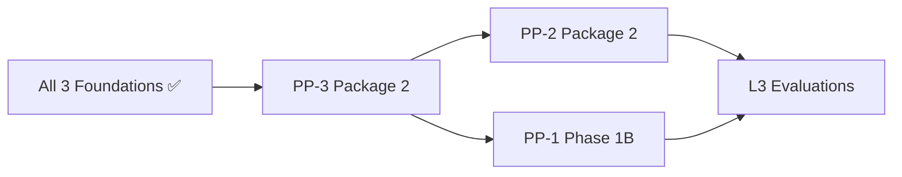

# Account Platform — Next Package Recommendation

**Program:** Account Platform — Foundation Checkpoint After PP-1 / PP-2 / PP-3 Package 1  
**Date:** 2026-06-20  
**Type:** Governance recommendation only  
**Status:** **Recommendation issued**

---

## Decision

| Field | Value |
|-------|-------|
| **Recommended next package** | **PP-3 Package 2 — Billing Service + `/api/payment` retirement** |
| **Authorization status** | **Not authorized** — requires separate implementation charter |
| **Rationale** | Ratified Option C sequence; closes highest remaining blocking finding (PP3-F03); PP-2 foundation gate satisfied |

---

## Options evaluated

### A. PP-3 Package 2 — Billing Service + `/api/payment` retirement ✅ SELECTED

| Factor | Assessment |
|--------|------------|
| Council sequence | **Next in Option C** after PP-2 foundation |
| Findings impact | Closes **PP3-F03** (blocking); advances F02, F05, F06, F07, F12 |
| Revenue / correctness | Dual API drift is active production risk |
| PP-2 dependency | **Met** — `/api/settings` live; billing tab IA is soft dependency |
| PP-1 dependency | **Met** — identity + `stripeCustomerId` lifecycle |
| Risk | Medium — Stripe/webhook touch; requires careful client migration |

**Proposed scope (charter draft — not authorized):**

| # | Work item |
|---|-----------|
| 1 | `billingService` facade — checkout, upgrade, downgrade orchestration |
| 2 | Retire `/api/payment` routes; migrate clients to `/api/billing` |
| 3 | Thin `billingController` — route → authorize → service |
| 4 | PE + normalized activity on subscription lifecycle mutations |
| 5 | Stripe webhook → entitlement sync via `entitlementService` |
| 6 | Migrate `usageTrackingService`, `aiQueryService` tier reads |
| 7 | Tier enum vocabulary alignment (`subscriptionService` `standard` → canonical) |
| 8 | Integration tests for billing + entitlement convergence |

**Explicitly out of scope:** Billing dashboard UX (F08), certification, ledger, PP-2 hub consolidation.

---

### B. PP-2 Package 2 — Settings Hub IA / theme hydration / notification adapter

| Factor | Assessment |
|--------|------------|
| Council sequence | **Remainder** — not primary after foundation per Option C |
| Findings impact | Closes PP2-F04–F09, PP1-F07 |
| Blocks PP-3 P2? | **No** |
| Value | High for UX consistency (G9) |
| Verdict | **Defer as primary** — recommend parallel track or follow PP-3 P2 backend |

---

### C. PP-1 Phase 1B — MFA / photo controller cleanup / security UX

| Factor | Assessment |
|--------|------------|
| Findings impact | Closes PP1-F03 (major security gap) |
| Blocks next package? | **No** |
| Value | High for G8 production safety |
| Verdict | **Optional parallel** — security wave independent of billing/settings |

---

### D. Account Platform Certification Readiness Reassessment

| Factor | Assessment |
|--------|------------|
| Open blockings | PP3-F03; PP3-F02 partial |
| Open majors | 9+ across trilogy |
| Matrix re-audit | Not performed post-implementation |
| Verdict | **Premature** — defer to Phase 4 per modernization sequence |

---

## Sequencing diagram (recommended)

*PP-2 Package 2 and PP-1 Phase 1B may run in parallel with PP-3 Package 2 where staffing allows.*

---

## Authorization gates for PP-3 Package 2

| Gate | Status |
|------|--------|
| PP-1 foundation complete | ✅ |
| PP-3 Package 1 complete | ✅ |
| PP-2 foundation complete | ✅ |
| No circular ownership | ✅ |
| Council charter required | ⏳ Pending |

---

## What council should NOT authorize yet

| Item | Reason |
|------|--------|
| Certification evaluation | Blockings + majors remain |
| Ledger promotion | Deferred per program charter |
| PP-2 hub consolidation as substitute for PP-3 P2 | Violates Option C revenue priority |
| Full billing dashboard UX | PP-3 F08 — separate wave after backend |

---

## Expected findings closure (PP-3 Package 2)

| Finding | Expected outcome |
|---------|------------------|
| **PP3-F03** | **Closed** |
| **PP3-F02** | **Mostly closed** — enum migration + consumer alignment |
| **PP3-F05** | **Mostly closed** — checkout/webhook PE + activity |
| **PP3-F06** | **Closed** — thin controller |
| **PP3-F07** | **Partial** — HR matrix by design |
| PP3-F08 | Open — UX wave |
| PP3-F09–F12 | Partial / advisory |

---

## Charter prerequisites (suggested)

1. Client inventory: all `/api/payment` consumers documented
2. Stripe webhook idempotency review
3. Rollback plan for payment route retirement
4. No PP-2 hub consolidation scope creep

---

**Last updated:** 2026-06-20
