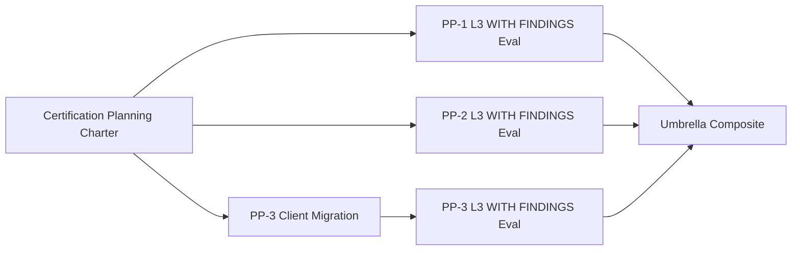

# Account Platform — Post-PP2 Reassessment

**Program:** Account Platform — Post-PP2 Certification Path Reassessment  
**Date:** 2026-06-20  
**Type:** Governance review only  
**Status:** **Assessment complete**

---

## Purpose

Reassess certification paths after **PP-2 Package 2** (Settings Experience Consolidation), with PP-1, PP-2 Phase 1, PP-3 Packages 1–2 already complete.

**Verdict:** PP-1 and PP-2 are **READY FOR EVALUATION** (L3 WITH FINDINGS). PP-3 requires **client migration** before evaluation. Umbrella certification **planning is justified**; **execution is not**.

---

## Program completion status

| Package | Status | Cert posture |
|---------|--------|--------------|
| PP-1 Phase 1 Identity Foundation | ✅ | READY FOR EVALUATION |
| PP-2 Phase 1 Settings Foundation | ✅ | — |
| PP-2 Package 2 Settings Consolidation | ✅ | READY FOR EVALUATION |
| PP-3 Package 1 Entitlement Foundation | ✅ | Progress review eligible |
| PP-3 Package 2 Billing Service & API Convergence | ✅ | Blocked on client migration |

---

## Findings rollup

### PP-1 (F01–F06)

| Status | Count | Items |
|--------|-------|-------|
| Closed | 4 | F01, F02, F05, F06 |
| Partial | 1 | F04 |
| Open | 1 | F03 (MFA) |

### PP-2 (F01–F09)

| Status | Count | Items |
|--------|-------|-------|
| Closed | 8 | F01–F04, F06–F09, F10–F11 |
| Partial | 1 | **F05 only** |
| Open | 0 majors | F12–F13 advisory |

### PP-3 (F01–F08)

| Status | Count | Items |
|--------|-------|-------|
| Closed | 3 | F01, F04, F06 |
| Partial | 4 | F02, F03, F05, F07 |
| Open | 1 | F08 (billing UX) |

---

## Readiness estimates (G1–G9)

| Sub-program | Pre-PP2 P2 | Post-PP2 P2 | Cert determination |
|-------------|------------|---------------|-------------------|
| **PP-1 Identity** | ~81% | **~89%** | **READY FOR EVALUATION** |
| **PP-2 Settings** | ~78% | **~93%** | **READY FOR EVALUATION** |
| **PP-3 Billing & Entitlements** | ~85% | **~85%** | NOT READY (eval) — client migration |
| **Account Platform umbrella** | ~72% | **~82%** | NOT READY — composite blocked |

---

## Certification path determination

| Target | Determination |
|--------|---------------|
| **PP-1** | **READY FOR EVALUATION** → L3 WITH FINDINGS |
| **PP-2** | **READY FOR EVALUATION** → L3 WITH FINDINGS |
| **PP-3** | **NOT READY** for evaluation until client migration |
| **Umbrella** | **NOT READY** — planning justified, execution premature |

---

## PP-3 Client Migration vs certification

| Certification activity | Client migration required? |
|------------------------|---------------------------|
| Certification **planning** charter | **No** |
| PP-1 **evaluation** | **No** |
| PP-2 **evaluation** | **No** |
| PP-3 **evaluation** | **Yes** |
| Umbrella **evaluation** | **Yes** (for PP-3 slice) |

Server-side PP3-F03 is **partially closed** (deprecation + delegation). Certification lens treats **active legacy clients** as open until Phase 2 migration per [PP3_API_CONVERGENCE_PLAN.md](./PP3_API_CONVERGENCE_PLAN.md).

---

## Required questions — answers

| # | Question | Answer |
|---|----------|--------|
| 1 | PP-1 readiness now? | **~89%** — READY FOR EVALUATION |
| 2 | PP-2 readiness now? | **~93%** — READY FOR EVALUATION |
| 3 | PP-3 readiness now? | **~85%** — NOT READY for eval (client migration) |
| 4 | Account Platform readiness now? | **~82%** implementation; NOT CERTIFIABLE umbrella |
| 5 | Open blockers? | **PP3-F03 partial** (client layer); no full open blockings |
| 6 | Open majors? | PP1-F03; PP1-F04 partial; PP2-F05 partial; PP3-F08 |
| 7 | Open advisories? | **~10** (MFA UX, photo trash, HR 404, orphan gating, trial flow, etc.) |
| 8 | Earliest certifiable sub-domain? | **PP-1** or **PP-2** (tie — both eval-ready) |
| 9 | Earliest L3 WITH FINDINGS candidate? | **PP-1** (historically first in sequence; PP-2 equally ready) |
| 10 | Earliest plain L3 candidate? | **None** — MFA, F05, F08, F03 partial block plain L3 |
| 11 | PP-3 Client Migration required before certification? | **Yes** for PP-3 and umbrella eval; **No** for PP-1/PP-2 eval and planning |
| 12 | Umbrella certification planning justified? | **Yes** — not execution |
| 13 | Recommended next initiative? | **Option D — Account Platform Certification Planning** |
| 14 | Updated modernization sequence? | See [ACCOUNT_PLATFORM_CERTIFICATION_SEQUENCE_UPDATE.md](./ACCOUNT_PLATFORM_CERTIFICATION_SEQUENCE_UPDATE.md) |
| 15 | What should NOT be worked on next? | Ledger, council ratification, billing UX redesign, plain L3 pursuit, MFA (unless 1B chartered separately) |

---

## Deliverables

| Document |
|----------|
| [ACCOUNT_PLATFORM_POST_PP2_REASSESSMENT.md](./ACCOUNT_PLATFORM_POST_PP2_REASSESSMENT.md) |
| [PP1_CERTIFICATION_READINESS_UPDATE.md](./PP1_CERTIFICATION_READINESS_UPDATE.md) |
| [PP2_CERTIFICATION_READINESS_UPDATE.md](./PP2_CERTIFICATION_READINESS_UPDATE.md) |
| [PP3_CERTIFICATION_READINESS_UPDATE.md](./PP3_CERTIFICATION_READINESS_UPDATE.md) |
| [ACCOUNT_PLATFORM_CERTIFICATION_SEQUENCE_UPDATE.md](./ACCOUNT_PLATFORM_CERTIFICATION_SEQUENCE_UPDATE.md) |
| [ACCOUNT_PLATFORM_EXECUTIVE_SUMMARY_POST_PP2.md](./ACCOUNT_PLATFORM_EXECUTIVE_SUMMARY_POST_PP2.md) |

---

## Stop condition

Assessment complete. No implementation. No certification execution. No ledger. No council review.

**Next governance action:** Approve **Account Platform Certification Planning Charter** (separate authorization).

---

**Last updated:** 2026-06-20
