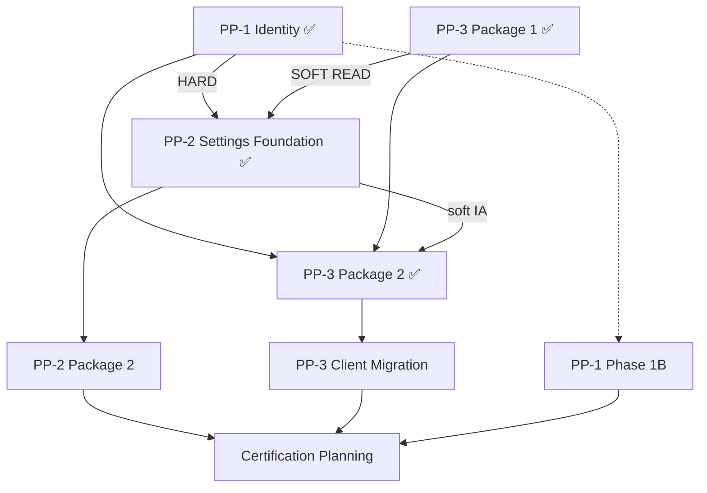

# Account Platform — Readiness Reassessment

**Program:** Account Platform — Post-Foundation Certification Readiness Reassessment  
**Date:** 2026-06-20  
**Type:** Governance review only — **no implementation, no certification, no ledger updates**  
**Status:** **Reassessment complete**

---

## Purpose

Authoritative readiness reassessment after all foundation implementation packages have shipped:

| Phase / package | Status |
|-----------------|--------|
| Account Platform Phase 0A–0C | ✅ Complete |
| PP-1 Phase 1 — Identity Foundation | ✅ Complete |
| PP-2 Phase 1 — Settings Platform Foundation | ✅ Complete |
| PP-3 Package 1 — Entitlement Foundation | ✅ Complete |
| PP-3 Package 2 — Billing Service & API Convergence | ✅ Complete |

---

## Foundation inventory (runtime)

### Identity (PP-1)

| Artifact | Status |
|----------|--------|
| `authService`, `profileService`, `privacyService`, `connectionService`, `profilePhotoService` | ✅ |
| Identity PE + activity + preference substrate | ✅ |

### Settings (PP-2)

| Artifact | Status |
|----------|--------|
| `settingsService`, `preferenceRegistry`, `/api/settings` | ✅ |
| Settings activity/events | ✅ |

### Billing & Entitlements (PP-3)

| Artifact | Status |
|----------|--------|
| `entitlementService`, `billingService` | ✅ |
| `Subscription.tier` authority; `Business.tier` cache | ✅ |
| `/api/account/*` entitlement APIs | ✅ |
| Billing activity/events; `billing:read` / `billing:write` | ✅ |
| `/api/payment` deprecation layer | ✅ Phase 1 |

---

## Sub-program findings rollup

### PP-1 (F01–F06)

| Status | IDs |
|--------|-----|
| **Closed** | F01, F02, F05, F06 |
| **Partial** | F04 |
| **Open** | F03 (MFA) |

### PP-2 (F01–F09)

| Status | IDs |
|--------|-----|
| **Closed** | F01, F02, F03 |
| **Partial** | F07 |
| **Open** | F04, F05, F06, F08, F09 |

### PP-3 (F01–F08)

| Status | IDs |
|--------|-----|
| **Closed** | F01, F04, F06 |
| **Partial** | F02, F03, F05, F07 |
| **Open** | F08 |

---

## Cross-domain readiness (D)

### Domain scorecard

| Domain | G1–G9 estimate | Certification posture | Primary gap |
|--------|----------------|----------------------|-------------|
| **Identity** | **~81%** | L3 WITH FINDINGS candidate | MFA (F03); matrix re-audit |
| **Settings** | **~78%** | NOT READY | Hub fragmentation F04–F09 |
| **Billing & Entitlements** | **~85%** | Progress review eligible | F03 partial; modal UX F08 |
| **Security (user account)** | **~55%** | NOT READY | MFA; session UX |
| **Privacy** | **~72%** | Bundled with Identity | Hub placement (PP-2) |
| **Preferences** | **~78%** | Tied to Settings | Notification adapter |

### Account Platform umbrella

| Field | Value |
|-------|-------|
| **Program implementation readiness** | **~72%** (weighted composite) |
| **Certification readiness** | **NOT CERTIFIABLE** |
| **Ledger row** | None — unchanged |
| **Operation matrix** | Per-slice matrices exist; **unified re-audit not performed** |

### Remaining blockers (certification)

| ID | Domain | Severity | Notes |
|----|--------|----------|-------|
| **PP3-F03** | Billing | Blocking (partial) | Legacy `/api/payment` clients active; deprecation layer mitigates drift |
| **PP3-F02** | Entitlements | Blocking (partial) | Enum normalization in code; data migration deferred |

*No open **blocking** findings remain at **full closure** status. Partial blockers prevent evaluation.*

### Remaining majors

| Domain | Open / partial majors |
|--------|----------------------|
| **PP-1** | F03 (open), F04 (partial) |
| **PP-2** | F04–F06, F08–F09 (open); F07 (partial) |
| **PP-3** | F02, F03, F05, F07 (partial); F08 (open) |

**Count:** ~5 open majors · ~6 partial majors across trilogy

### Remaining advisories

| Count | Examples |
|-------|----------|
| **~14** | PP1-F07–F11; PP2-F10–F13; PP3-F09–F12; orphan gating file; trial flow; stale UI links |

---

## Cross-domain dependency verification

| Dependency | Status |
|------------|--------|
| PP-2 ← PP-1 (profile, privacy, preferences) | ✅ |
| PP-2 ← PP-3 (tier reads for gated UI) | ✅ |
| PP-3 ← PP-1 (`stripeCustomerId` lifecycle) | ✅ |
| PP-3 ← PP-2 (billing tab IA) | ⚠️ Soft — nav contract only |
| Circular ownership | ✅ None detected |

---

## Next package decision (E)

| Option | Assessment | Verdict |
|--------|------------|---------|
| **A. PP-3 Phase 2 Client Migration** | Natural continuation of Package 2; closes F03/F12; backend already converged | Valid — **secondary** |
| **B. PP-2 Package 2** | Ratified sequence remainder; largest open major cluster (F04–F09); closes G9 debt; notification adapter closes PP1-F07 | **✅ Primary recommendation** |
| **C. PP-1 Phase 1B** | Closes F03 security gap; independent of sequencing | Optional parallel |
| **D. Certification Planning** | Matrix re-audit absent; partial blockers; 11+ majors/advisories open | **Premature** |

**Selected:** **Option B — PP-2 Package 2** (Settings IA, hub consolidation, notification adapter, theme hydration)

**Rationale:** Ratified Option C places PP-2 implementation remainder before PP-3 UX/client remainder. PP-3 Package 2 closed backend billing foundation; legacy API has a working deprecation layer. Settings fragmentation (G9 = 1) is the largest user-facing debt and blocks PP-2 certification path. Client migration is lower urgency while canonical backend paths are operational.

---

## Required questions — answers

| # | Question | Answer |
|---|----------|--------|
| 1 | PP-1 readiness now? | **~81%** — foundation complete; F03 MFA open; **earliest L3 WITH FINDINGS sub-domain** |
| 2 | PP-2 readiness now? | **~78%** — blockings closed; F04–F09 majors open |
| 3 | PP-3 readiness now? | **~85%** — entitlement + billing foundations complete; F03 partial; F08 open |
| 4 | Account Platform readiness now? | **~72%** program implementation; **NOT CERTIFIABLE** umbrella |
| 5 | Open blockers? | **PP3-F03** (partial), **PP3-F02** (partial) — no fully open blockers |
| 6 | Open major findings? | **~5 open** (PP1-F03; PP2-F04–F06, F08–F09; PP3-F08) + **~6 partial** |
| 7 | Open advisory findings? | **~14** across trilogy |
| 8 | Certification review premature? | **Yes** — matrix re-audit + partial blockers + open majors |
| 9 | Earliest certifiable sub-domain? | **PP-1 Identity & Profile** (~81%, 4/6 pre-cert majors closed) |
| 10 | Earliest L3 WITH FINDINGS candidate? | **PP-1** — after operation matrix re-audit; MFA likely advisory |
| 11 | Earliest plain L3 candidate? | **None** — MFA, modal billing, fragmented settings hubs |
| 12 | Recommended next package? | **PP-2 Package 2** — Settings IA + notification adapter + theme hydration |
| 13 | Modernization order from here? | PP-2 P2 → PP-3 client migration → PP-1 Phase 1B (parallel) → cert planning → sub-domain L3 evals → umbrella |
| 14 | Umbrella certification planning justified? | **Not yet** — planning charter justified **after** PP-2 P2 + PP-3 client migration |
| 15 | What should NOT be worked on next? | Certification execution, ledger updates, council ratification, billing UX redesign, checkout redesign, PP-1 Phase 1B as **primary** (optional parallel only) |

---

## Deliverables

| Document | Purpose |
|----------|---------|
| [ACCOUNT_PLATFORM_READINESS_REASSESSMENT.md](./ACCOUNT_PLATFORM_READINESS_REASSESSMENT.md) | This reassessment |
| [PP1_POST_FOUNDATION_REVIEW.md](./PP1_POST_FOUNDATION_REVIEW.md) | PP-1 findings + gates |
| [PP2_POST_FOUNDATION_REVIEW.md](./PP2_POST_FOUNDATION_REVIEW.md) | PP-2 findings + gates |
| [PP3_POST_FOUNDATION_REVIEW.md](./PP3_POST_FOUNDATION_REVIEW.md) | PP-3 findings + gates |
| [ACCOUNT_PLATFORM_CERTIFICATION_PATH.md](./ACCOUNT_PLATFORM_CERTIFICATION_PATH.md) | Certification sequencing |
| [ACCOUNT_PLATFORM_EXECUTIVE_SUMMARY_POST_FOUNDATION.md](./ACCOUNT_PLATFORM_EXECUTIVE_SUMMARY_POST_FOUNDATION.md) | Executive summary |

---

## Stop condition

Assessment **complete**. No runtime changes. No implementation authorized. No certification. No ledger updates. No council ratification.

**Next governance action:** Authorize **PP-2 Package 2 Implementation Charter** (separate approval).

---

**Last updated:** 2026-06-20 (Post-Foundation Reassessment)
