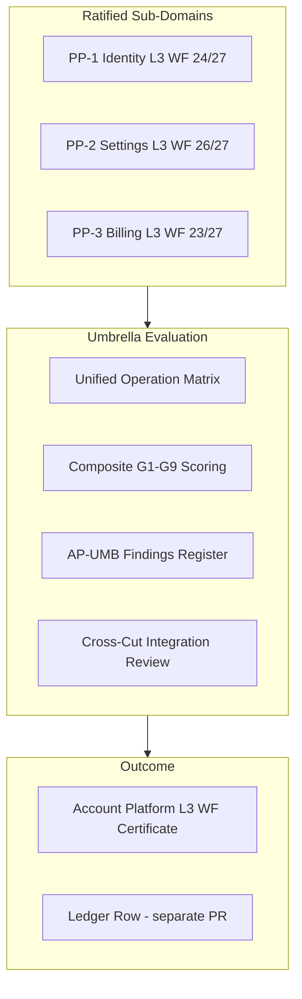

# Account Platform — Umbrella Certification Plan

**Program:** Account Platform — Umbrella Certification Planning  
**Date:** 2026-06-20  
**Authority:** Platform Architecture Governance  
**Status:** **PLANNING COMPLETE** — no evaluation, certification, ledger, or ratification authorized

**Inputs:**

- [ACCOUNT_PLATFORM_UMBRELLA_PROGRESS_REVIEW.md](./ACCOUNT_PLATFORM_UMBRELLA_PROGRESS_REVIEW.md)
- [ACCOUNT_PLATFORM_COMPOSITE_SCORECARD.md](./ACCOUNT_PLATFORM_COMPOSITE_SCORECARD.md)
- [ACCOUNT_PLATFORM_SHARED_FINDINGS_REVIEW.md](./ACCOUNT_PLATFORM_SHARED_FINDINGS_REVIEW.md)
- [ACCOUNT_PLATFORM_CERTIFICATION_PLANNING_CHARTER.md](./ACCOUNT_PLATFORM_CERTIFICATION_PLANNING_CHARTER.md)
- Trilogy ratification records (PP-1, PP-2, PP-3)

**Precedent:** Business Operations convergence · Context Graph program closeout · Workspace composite certification

---

## Plan purpose

Define the **authoritative umbrella certification strategy** — evaluation topology, scoring model, findings aggregation, certificate structure, and the exact path from current state (trilogy ratified, progress review complete) to umbrella evaluation and eventual composite certification.

---

## A. Composite certification model

### Evaluation topology

| Field | Decision |
|-------|----------|
| **Model** | **Composite platform capability certification** — single umbrella evaluation over ratified sub-domains |
| **Sub-domain treatment** | **Inherited** — PP-1/PP-2/PP-3 ratified scores and findings roll up; umbrella eval validates **cross-cutting coherence**, not re-audit of closed sub-domain rows |
| **Framework** | G1–G9 platform capability gates (umbrella variant) |
| **Evaluator** | Council-designated certification evaluator — **separate authorization required** |
| **Level 4 denial** | **Affirmed** — File Hub remains sole Reference Implementation (L4) |
| **Target level** | **LEVEL 3 CERTIFIED WITH FINDINGS** — not plain L3 |



### Score aggregation

Two scores reported at umbrella evaluation (see [ACCOUNT_PLATFORM_COMPOSITE_G1_G9_MODEL.md](./ACCOUNT_PLATFORM_COMPOSITE_G1_G9_MODEL.md)):

| Score type | Method | Planning estimate |
|------------|--------|-------------------|
| **Trilogy mean** | (PP-1 + PP-2 + PP-3) ÷ 3 | **24/27 (~89%)** |
| **Umbrella composite** | Gate-by-gate at program level with cross-cut rules | **22/27 (~81%)** |

**Authoritative score for certification vote:** Umbrella composite G1–G9 total.

**Trilogy mean** is informational — measures sub-domain strength; does not override composite gate failures (e.g., G9 adjustment).

### Finding aggregation

| Layer | Register | Treatment |
|-------|----------|-----------|
| Sub-domain | PP1-F*, PP2-F*, PP3-F* | Closed findings **frozen** — no reopen without separate charter |
| Umbrella | AP-UMB-M*, AP-UMB-ADV-* | **Roll-up** from open sub-domain findings + cross-cut dedup |
| New at umbrella eval | AP-UMB-EVAL-* | Evaluator may surface ≤3 new findings; cannot reopen closed sub-domain findings without evidence of regression |

**Dedup rules:**

- Same root cause across sub-domains → single AP-UMB ID (e.g., business 2FA UI)
- Cross-cut findings inherit sub-domain severity unless umbrella lens elevates (never downgrade majors)

### Certificate structure

| Field | Content |
|-------|---------|
| **Program name** | Account Platform |
| **Level** | LEVEL 3 CERTIFIED WITH FINDINGS |
| **Composite score** | G1–G9 X/27 |
| **Sub-domain attestations** | PP-1 · PP-2 · PP-3 ratified levels and scores (reference only) |
| **Open findings** | AP-UMB-M* (majors) + AP-UMB-ADV* (advisories) — projected ~25 tracked |
| **Exclusions** | BA profile, AI persona, Dashboard layout, Admin Portal ops |
| **Reference capabilities** | `#AP-BILL-1` Billing Pattern (With Findings) |
| **Plain L3 blockers** | Listed on certificate — MFA, billing UX, business dedup, tier vocab |
| **Ledger notation** | Separate PR — not part of certificate document |

---

## B. Unified operation matrix

**Authoritative document:** [ACCOUNT_PLATFORM_UNIFIED_OPERATION_MATRIX.md](./ACCOUNT_PLATFORM_UNIFIED_OPERATION_MATRIX.md)

| Slice | Re-audit source | In-scope rows | C / P / N |
|-------|-----------------|---------------|-----------|
| Identity (PP-1) | PP1_OPERATION_MATRIX_REAUDIT | 37 | 7 / 27 / 3 |
| Settings (PP-2 core) | PP2_OPERATION_MATRIX_REAUDIT | 26 | 15 / 11 / 0 |
| Billing & Entitlements (PP-3) | PP3_OPERATION_MATRIX_REAUDIT | 47 | 19 / 23 / 2 |
| Shared platform (cross-cut) | This plan | 12 | 8 / 4 / 0 |
| **Unified total** | | **122** | **49 / 65 / 5** |

**Unified compliance rate:** ~**40% C** · ~**53% P** · ~**4% N**

Rows marked **—** (excluded) in sub-domain matrices are **not counted** in umbrella totals.

---

## C. Unified G1–G9 model

**Authoritative document:** [ACCOUNT_PLATFORM_COMPOSITE_G1_G9_MODEL.md](./ACCOUNT_PLATFORM_COMPOSITE_G1_G9_MODEL.md)

| Rule | Description |
|------|-------------|
| Gate scoring | Program-level score 1–3 per gate |
| Sub-domain influence | Min gate score where cross-cutting; max where uniformly strong |
| Inherited findings | Open sub-domain findings constrain gate ceiling (G9 capped at 2 while F08 open) |
| Gate pass threshold | ≥2 = pass; gate at 1 = FAIL unless umbrella G9 compensation rule applies |
| Certification threshold | All gates ≥2 + 0 blockers → L3 WITH FINDINGS |

---

## D. Umbrella findings strategy

**Authoritative document:** [ACCOUNT_PLATFORM_UMBRELLA_FINDINGS_STRATEGY.md](./ACCOUNT_PLATFORM_UMBRELLA_FINDINGS_STRATEGY.md)

| Class | Count | Blocks umbrella eval? | Blocks L3 WF? |
|-------|------:|----------------------|---------------|
| Blocking | **0** | No | — |
| Major (AP-UMB-M01–M07) | **7** | No | No |
| Advisory (AP-UMB-ADV01–18) | **~18** | No | No |
| Accepted WITH FINDINGS | **2** | No | No (F02 waiver, F14 exception) |

---

## E. Evaluation readiness gates

### Must exist before evaluation execution

| # | Prerequisite | Status | Owner |
|---|--------------|--------|-------|
| 1 | Trilogy ratified L3 WF | ✅ Complete | — |
| 2 | Umbrella progress review | ✅ Complete | — |
| 3 | Umbrella certification plan (this doc) | ✅ Complete | — |
| 4 | Unified operation matrix | ✅ Complete | — |
| 5 | Composite G1–G9 model | ✅ Complete | — |
| 6 | Umbrella findings strategy | ✅ Complete | — |
| 7 | Composite evidence binder | ⏳ **Required** | Program governance |
| 8 | Evaluation authorization vote | ⏳ **Required** | Council |

### May remain open at evaluation

| Item | Rationale |
|------|-----------|
| AP-UMB-M01 (MFA) | Dispositioned — PP1_MFA_DISPOSITION_REVIEW |
| AP-UMB-M02 (billing UX) | Functional within modal scope |
| AP-UMB-M03 (business dedup) | BA-owned WITH FINDINGS |
| All advisories | Track-only per framework |
| Trilogy ledger rows | Authorized separately — recommended before eval but not blocking |

### Blocks evaluation execution

| Blocker | Status |
|---------|--------|
| Open sub-domain blocking findings | **None** |
| Missing composite evidence binder | **Open** |
| Missing evaluation authorization | **Open** |
| Sub-domain score regression | N/A — frozen at ratification |

---

## Certification path (authoritative sequence)

```
✅ Phase 0:   Trilogy implementation + sub-domain eval + ratification
✅ Phase 1:   Umbrella progress review
✅ Phase 2:   Umbrella certification planning ← THIS PLAN
⏳ Phase 2b:  Composite evidence binder
⏳ Phase 2c:  Trilogy ledger PR (recommended parallel)
⏳ Phase 3:   Umbrella evaluation authorization
⏳ Phase 4:   Umbrella certification evaluation
⏳ Phase 5:   Umbrella ratification council
⏳ Phase 6:   Umbrella ledger row + program closeout (optional)
```

**Earliest umbrella evaluation:** After Phase 2b + Phase 3 complete.  
**Illustrative timeline:** Q1 2027 (4–8 weeks prep + 2–4 weeks eval cycle).

---

## Required questions — answers

| # | Question | Answer |
|---|----------|--------|
| 1 | Umbrella certification topology? | **Composite platform capability** over ratified trilogy |
| 2 | Composite scoring model? | **Dual score** — trilogy mean (89%) + umbrella composite (81%) |
| 3 | Composite blockers? | **0** |
| 4 | Composite majors? | **7** (AP-UMB-M01–M07) |
| 5 | Composite advisories? | **~18** (AP-UMB-ADV01–18) |
| 6 | Evaluation prerequisites? | Binder + eval authorization (planning artifacts now complete) |
| 7 | Evaluation blockers? | **Missing binder + eval authorization** — not findings |
| 8 | Ready for evaluation planning? | **Yes — complete** |
| 9 | Ready for evaluation execution? | **No** — binder + authorization pending |
| 10 | Earliest certification path? | **Q1–Q2 2027** illustrative |
| 11 | Recommended umbrella target? | **LEVEL 3 CERTIFIED WITH FINDINGS** |
| 12 | Remaining modernization work? | **Hygiene** — MFA, billing UX, dedup, tier (not blocking eval) |
| 13 | Remaining governance work? | Composite binder, eval authorization, eval, ratification, ledger |
| 14 | Recommended next authorization? | **Umbrella evaluation authorization** (after binder) |
| 15 | Final planning outcome? | **Formal strategy complete** — proceed to prep + authorization |

---

## Stop condition

Planning **complete**. No implementation. No certification. No ledger. No ratification.

**Next gate:** Composite evidence binder → evaluation authorization vote.

---

**Last updated:** 2026-06-20 (Umbrella Certification Planning)
