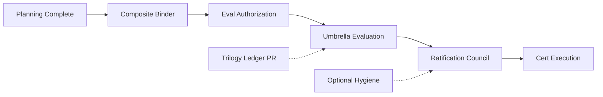

# Account Platform — Umbrella Execution Roadmap

**Program:** Account Platform — Umbrella Certification Planning  
**Date:** 2026-06-20  
**Status:** Authoritative execution sequence — governance gates only until authorized  
**Plan basis:** [ACCOUNT_PLATFORM_UMBRELLA_CERTIFICATION_PLAN.md](./ACCOUNT_PLATFORM_UMBRELLA_CERTIFICATION_PLAN.md)

**Constraint:** No implementation, certification, ledger, or ratification authorized by this document.

---

## Current position

```
✅ Phase 0:   Trilogy implementation
✅ Phase 1:   Sub-domain evaluation + ratification (PP-1 24/27 · PP-2 26/27 · PP-3 23/27)
✅ Phase 2:   Umbrella progress review (~81% composite)
✅ Phase 3:   Umbrella certification planning ← COMPLETE
⏳ Phase 4:   Evaluation prep (binder + ledger PR)
⏳ Phase 5:   Evaluation authorization
⏳ Phase 6:   Umbrella certification evaluation
⏳ Phase 7:   Umbrella ratification council
⏳ Phase 8:   Certification execution (ledger + certificate)
⏳ Phase 9:   Program closeout (optional)
```

---

## Phase 4 — Evaluation prep (next)

| # | Deliverable | Owner | Est. | Blocks eval? | Authorized? |
|---|-------------|-------|------|:------------:|:-----------:|
| 4.1 | **Composite G1–G9 evidence binder** | Program governance | 1 week | **Yes** | Planning only |
| 4.2 | Trilogy ledger PR (PP-1 + PP-2 + PP-3) | Platform Engineering | 1 PR | No (recommended) | Ratification authorized |
| 4.3 | Reference catalog PR (`#AP-BILL-1`) | Platform Architecture | 1 PR | No | Ratification authorized |
| 4.4 | Unified matrix validation sample | Evaluator prep | 2 days | No | Planning complete |

### Composite evidence binder contents

| Section | Source artifacts |
|---------|------------------|
| G1 | PE inventories (identity, settings, billing); MFA disposition |
| G2 | Activity/event maps; invoice gap note |
| G3 | Service boundary analysis (PP-1/2/3) |
| G4 | API inventories; payment retirement proof |
| G5 | Ownership model; tier SoR docs |
| G6 | Test inventory (~50+ trilogy tests) |
| G7 | Doc index + unified operation matrix |
| G8 | Stripe alignment; production safety notes |
| G9 | Hub IA + billing modal scope |
| Findings | AP-UMB register (this plan) |
| Cross-cut | Integration matrix (unified ops doc) |

---

## Phase 5 — Evaluation authorization

| # | Action | Type | Prerequisite |
|---|--------|------|--------------|
| 5.1 | Umbrella evaluation authorization review | Governance | Phase 4.1 complete |
| 5.2 | Risk review (composite) | Governance | Binder draft |
| 5.3 | Council authorization vote | Council | Review complete |

**Authorization scope:** Evaluation entry only — not ratification, not ledger, not execution.

**Target at authorization:** L3 WITH FINDINGS · ~22/27 composite · 0 blockers.

---

## Phase 6 — Umbrella certification evaluation

| # | Activity | Owner | Est. |
|---|----------|-------|------|
| 6.1 | Matrix sample validation (≥40 rows) | Evaluator | 2 days |
| 6.2 | G1–G9 gate scoring | Evaluator | 2 days |
| 6.3 | Findings confirmation / ≤3 new | Evaluator | 1 day |
| 6.4 | Evaluation packet production | Evaluator | 1 day |

**Deliverables (eval session):**

- `ACCOUNT_PLATFORM_CERTIFICATION_EVALUATION.md`
- `ACCOUNT_PLATFORM_CERTIFICATION_SCORECARD.md`
- `ACCOUNT_PLATFORM_FINDINGS_REVIEW.md` (umbrella)
- `ACCOUNT_PLATFORM_CERTIFICATION_EXECUTIVE_SUMMARY.md` (eval)

**Not authorized in eval session:** Ratification vote · Ledger update · Certificate publication.

---

## Phase 7 — Umbrella ratification council

| # | Activity | Prerequisite |
|---|----------|--------------|
| 7.1 | Evaluation packet review | Phase 6 complete |
| 7.2 | Findings disposition vote | Eval recommendation |
| 7.3 | Reference status affirmation | `#AP-BILL-1` |
| 7.4 | Ledger recommendation | Separate PR authorization |
| 7.5 | Ratification decision record | Council vote APPROVE/REJECT/DEFER |

**Deliverables (ratification session):**

- `ACCOUNT_PLATFORM_CERTIFICATION_RATIFICATION.md`
- `ACCOUNT_PLATFORM_COUNCIL_DECISION.md` (umbrella — may extend existing trilogy doc)
- `ACCOUNT_PLATFORM_POST_RATIFICATION_ROADMAP.md` (umbrella closeout)

---

## Phase 8 — Certification execution

| # | Action | Authorization source |
|---|--------|---------------------|
| 8.1 | Umbrella ledger row | Ratification council |
| 8.2 | Certificate publication | Governance execution charter |
| 8.3 | Findings register merge to platform register | Governance |
| 8.4 | Reference catalog update | Separate PR |

**Parallel OK:** Trilogy ledger PR (Phase 4.2) may precede umbrella row.

---

## Phase 9 — Program closeout (optional)

| Trigger | Action |
|---------|--------|
| Umbrella ratified L3 WF | Program archive recommendation |
| All majors closed | Plain L3 promotion vote (optional) |
| Pattern council | PP-1/PP-2 reference promotion review |

---

## Parallel tracks (non-blocking)

| Track | Items | Blocks umbrella eval? |
|-------|-------|:---------------------:|
| **Hygiene / modernization** | MFA, billing UX, business dedup, tier migration | No |
| **Sub-domain plain L3** | Per-sub-domain remediation charters | No |
| **Reference promotion** | `#AP-BILL-1` plain Reference Capability | No |

---

## Timeline (illustrative)

| Phase | Window | Cumulative |
|-------|--------|------------|
| Phase 4 (prep) | Weeks 1–2 | Feb 2027 |
| Phase 5 (auth) | Week 3 | Feb 2027 |
| Phase 6 (eval) | Weeks 4–5 | Mar 2027 |
| Phase 7 (ratification) | Week 6 | Mar 2027 |
| Phase 8 (execution) | Week 7+ | Q2 2027 |

*Assumes governance cadence ~1 session/week. Adjust to council schedule.*

---

## Gate dependency diagram



---

## Stop conditions

| Action | Status |
|--------|--------|
| Runtime implementation | **Not authorized** |
| Umbrella evaluation | **Not authorized** — Phase 5 required |
| Ledger update | **Not authorized** |
| Ratification | **Not authorized** |

---

**Last updated:** 2026-06-20 (Umbrella Certification Planning)
