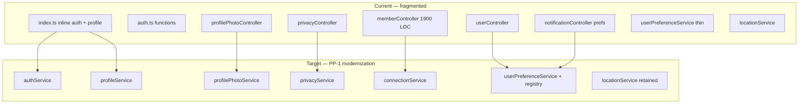

# PP-1 — Identity & Profile Service Boundary Analysis

**Program:** Account Platform Phase 0B-1 — Identity & Profile Platform Audit  
**Date:** 2026-06-19  
**Status:** Discovery only — **extraction requirements** for future PP-1 implementation charter (not authorized here)

---

## Current vs target service map



---

## Service inventory — current state

| Service | Path | Exists? | Maturity | Notes |
|---------|------|---------|----------|-------|
| `auth.ts` functions | `server/src/auth.ts` | Partial | L1 | Not a service class; mixed with Passport |
| `tokenUtils` | `server/src/utils/tokenUtils.ts` | Yes | L2 | Token CRUD helpers |
| `userPreferenceService` | `server/src/services/userPreferenceService.ts` | Yes | L1 | 2 functions only; no registry |
| `locationService` | `server/src/services/locationService.ts` | Yes | L2 | Read-focused |
| `userNumberService` | `server/src/services/userNumberService.ts` | Yes | L2 | Registration only |
| `geolocationService` | `server/src/services/geolocationService.ts` | Yes | L2 | Registration only |
| `securityService` | `server/src/services/securityService.ts` | Yes | L2 | Event logging |
| `storageService` | `server/src/services/storageService.ts` | Yes | L3-adjacent | Used by photos |
| **`profileService`** | — | **No** | L0 | **Required** |
| **`profilePhotoService`** | — | **No** | L0 | **Required** |
| **`privacyService`** | — | **No** | L0 | **Required** |
| **`authService`** (route module) | — | **No** | L0 | **Required** |
| **`connectionService`** | — | **No** | L0 | **Required** |
| `businessProfileService` | `services/business/` | Yes | L2 | **BA — excluded** |

---

## Controller → service extraction matrix

| Controller / handler | LOC est. | Direct Prisma | Target service | Extraction priority |
|----------------------|----------|---------------|----------------|---------------------|
| `index.ts` auth handlers | ~400 | Yes | `authService` + `authRoutes` | **P0** |
| `index.ts` profile handlers | ~50 | Yes | `profileService` | **P0** |
| `profilePhotoController` | ~750 | Yes | `profilePhotoService` | **P0** |
| `privacyController` | ~400 | Yes | `privacyService` | **P1** |
| `memberController` (connections subset) | ~600 | Yes | `connectionService` | **P1** |
| `userController` | ~65 | Partial | `userPreferenceService` extend | **P1** |
| `notificationController` (prefs only) | ~150 | Yes | `userPreferenceService` or `notificationPreferenceAdapter` | **P1** |
| `memberController` (employee ops) | ~1300 | Yes | Stay in member/BA boundary | **P2** — not PP-1 core |

---

## Proposed service responsibilities

### `authService` (new)

| Method domain | Operations |
|---------------|------------|
| Registration | `registerUser` migration from `auth.ts` |
| Login | Coordinate Passport + token issue |
| Refresh | Rotate refresh tokens |
| Recovery | Forgot/reset password |
| Verification | Email verify/resend |
| Session hygiene | Revoke all refresh tokens for user |

**Does not own:** JWT middleware (stays `authenticateJWT`); NextAuth client (frontend).

### `profileService` (new)

| Method domain | Operations |
|---------------|------------|
| Read self | Aggregate user + photo slot summary |
| Update name | Validated name write |
| Search | Bounded user discovery |
| Projection | DTO for `req.user` enrichment |

**Does not own:** Photo bytes (photo service); business profile (BA).

### `profilePhotoService` (new)

| Method domain | Operations |
|---------------|------------|
| Upload | Sharp pipeline, storage write |
| Library | List non-trashed photos |
| Assign slot | personal/business FK with uniqueness rules |
| Update crop | Avatar rendition regeneration |
| Soft delete | `trashedAt` + slot clearing |
| Serve | Authorized image proxy |

**Integration:** Register `registerGlobalTrashHandlers` for photo library.

### `privacyService` (new)

| Method domain | Operations |
|---------------|------------|
| Settings | Get/create/update `UserPrivacySettings` |
| Consent | Grant/revoke/list `UserConsent` |
| Deletion | `DataDeletionRequest` workflow |
| Export | User data export aggregation |

### `connectionService` (new — subset of member)

| Method domain | Operations |
|---------------|------------|
| Graph read | List connections, pending, sent |
| Mutations | Send, accept, decline, block, remove |
| Validation | Self-request, duplicate detection |

**Keeps in memberController:** Business employee invite, role updates, bulk business ops.

### `userPreferenceService` (extend)

| Addition | Purpose |
|----------|---------|
| Key registry | Typed known keys + validation |
| Prefix helpers | `notification_*`, `email_*` |
| Unified write | Single path for all KV consumers |
| Domain events | Emit on all preference mutations |

---

## Route module target structure

```
server/src/routes/
  auth.ts              (move from index.ts)
  profile.ts           (new — replaces inline profile)
  profilePhotos.ts     (retain — thin controller)
  privacy.ts           (retain — thin controller)
  user.ts              (retain — thin controller)
  member.ts            (retain — slimmed)

server/src/services/account/   (proposed namespace)
  authService.ts
  profileService.ts
  profilePhotoService.ts
  privacyService.ts
  connectionService.ts
  userPreferenceService.ts     (move from services/)
```

**Alternative:** `server/src/services/identity/` namespace — council choice in implementation charter.

---

## Inline Prisma audit (extraction triggers)

| File | `prisma.` call count (approx.) | Extraction required |
|------|-------------------------------|-------------------|
| `index.ts` (auth+profile) | 15+ | **Yes** |
| `profilePhotoController.ts` | 15+ | **Yes** |
| `privacyController.ts` | 10+ | **Yes** |
| `memberController.ts` | 40+ | **Partial** (connections only) |
| `notificationController.ts` (prefs) | 5+ | **Yes** |
| `userController.ts` | 2 | Via preference service |

---

## Constitutional alignment per target service

| Service | PE on writes | Activity events | Tenant scope |
|---------|--------------|-----------------|--------------|
| `authService` | N/A (credential) | Security events + registration activity | User self |
| `profileService` | Future read checks | `profile_updated` | User self |
| `profilePhotoService` | User scope | `profile_photo_*` | User self |
| `privacyService` | User scope | `privacy_*` | User self |
| `connectionService` | Target PE | `member_*` or domain events | User graph |
| `userPreferenceService` | User scope | Domain event ✅ (extend) | User self |

---

## Dependencies on other services

| Service | Depends on |
|---------|------------|
| `authService` | `tokenUtils`, `emailService`, `geolocationService`, `userNumberService` |
| `profilePhotoService` | `storageService`, sharp |
| `privacyService` | Prisma privacy models; may call export aggregators |
| `connectionService` | `NotificationService` |
| `userPreferenceService` | Domain event emitter |

**No new external dependencies required** for extraction — refactor-only boundary work.

---

## Extraction sequencing (recommended — not authorized)

| Phase | Work | Unlocks |
|-------|------|---------|
| **1** | `authRoutes` + `authService` + remove inline auth from `index.ts` | G3, G7 |
| **2** | `profileService` + `profileRoutes` | G3, matrix C-rows for name |
| **3** | `profilePhotoService` + thin controller | G2, G8, trash |
| **4** | `privacyService` | G1, G2 |
| **5** | `connectionService` + member slim | G1 |
| **6** | Preference registry + notification adapter | G5, PP-2 prep |

---

## Related

- [PP1_IDENTITY_PROFILE_OPERATION_MATRIX.md](./PP1_IDENTITY_PROFILE_OPERATION_MATRIX.md)
- [PP1_IDENTITY_PROFILE_OWNERSHIP_MODEL.md](./PP1_IDENTITY_PROFILE_OWNERSHIP_MODEL.md)

**Last updated:** 2026-06-19 (Phase 0B-1)
