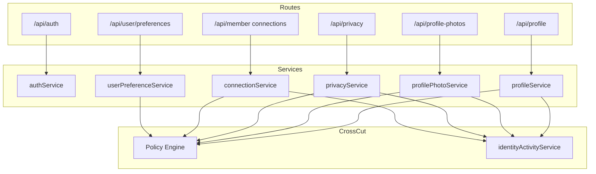

# PP-1 Phase 1 — Identity & Profile Foundation Architecture

**Program:** Account Platform PP-1 Implementation Charter — Phase 1  
**Date:** 2026-06-19  
**Status:** Implemented — Identity Foundation (not certification)

---

## Purpose

Establish the constitutional Identity Foundation by extracting inline auth/profile logic from `index.ts`, introducing account platform services, aligning Policy Engine on identity mutations, and restoring normalized activity on profile, privacy, connection, and photo writes.

**Out of scope (Phase 1):** MFA · certification · Settings Platform · Billing · entitlementService · Dashboard · AI Platform

---

## Service layer

| Service | Path | Responsibility |
|---------|------|----------------|
| `authService` | `server/src/services/account/authService.ts` | Register, refresh, password reset, email verification |
| `profileService` | `server/src/services/account/profileService.ts` | Profile read/update (name) |
| `profilePhotoService` | `server/src/services/account/profilePhotoService.ts` | Photo library CRUD, slot assignment, serve bundle |
| `privacyService` | `server/src/services/account/privacyService.ts` | Privacy settings, consents, GDPR export/deletion |
| `connectionService` | `server/src/services/account/connectionService.ts` | Personal connection lifecycle |
| `userPreferenceService` | `server/src/services/userPreferenceService.ts` | KV preferences + registry validation + PE |
| `identityActivityService` | `server/src/services/account/identityActivityService.ts` | Normalized `account` module activity events |
| `userResponse` | `server/src/services/account/userResponse.ts` | Safe user DTO (password stripped) |

---

## Route architecture

| Mount | Router | Controller | Notes |
|-------|--------|------------|-------|
| `/api/auth` | `routes/auth.ts` | `authController.ts` | Extracted from `index.ts` |
| `/api/profile` | `routes/profile.ts` | `profileController.ts` | JWT required; preserves GET/PUT |
| `/api/privacy` | `routes/privacy.ts` | `privacyController.ts` (thin) | Delegates to `privacyService` |
| `/api/profile-photos` | `routes/profilePhotos.ts` | `profilePhotoController.ts` (thinning) | Multer in controller; logic in service |
| `/api/member` | `routes/member.ts` | `memberController.ts` | Connection mutations via `connectionService` |
| `/api/user/preferences/:key` | `routes/user.ts` | `userController.ts` | Uses `setUserPreferenceWithPolicy` |

**Route preservation:** All public auth paths and `/api/profile` GET/PUT contracts unchanged.

---

## Policy Engine

New actions in `policyActions.ts`:

- `user:profile.read` / `user:profile.update`
- `user:photo.write`
- `user:privacy.read` / `user:privacy.update`
- `user:preference.write`
- `connection:request` / `connection:update` / `connection:remove`

Handlers in `policyEngine.ts` — self-scoped user resources and relationship participant checks.

`identityPolicyDual.ts` — `assertIdentitySelfPolicy` wrapper for services.

---

## Activity integration

Order: **authorize (PE) → execute → emit normalized activity**

| Mutation | Activity |
|----------|----------|
| Profile name update | `account:profile.updated` |
| Photo upload/assign/update/remove | `account:profile_photo.*` |
| Privacy settings update | `account:privacy.updated` |
| Connection request/accept/decline/block/remove | `account:connection.*` |
| Preference write | Domain event `emitUserPreferenceUpdatedEvent` |

Auth flows continue to use `logger.logUserAction` / `logSecurityEvent` (credential plane).

---

## Dependency diagram

---

## Phase 1 exit criteria

| Criterion | Status |
|-----------|--------|
| Auth routes removed from `index.ts` | ✅ |
| Profile routes removed from `index.ts` | ✅ |
| Six target services exist | ✅ |
| Controllers thinned for privacy, connections, photos (partial) | ✅ |
| PE on profile/privacy/preference/connection writes | ✅ |
| Activity on profile/privacy/photo/connection mutations | ✅ |
| Tests added | ✅ |
| MFA | Deferred (out of scope) |
| Certification | Not started |

---

## Remaining Phase 1+ / remainder work

- Further thin `profilePhotoController` (storage/multer only in controller)
- `connectionService` — extract read/list handlers from `memberController`
- MFA and account security UX
- Global Trash handler for photos
- Full integration test suite for auth routes

---

**Last updated:** 2026-06-19 (PP-1 Phase 1)
