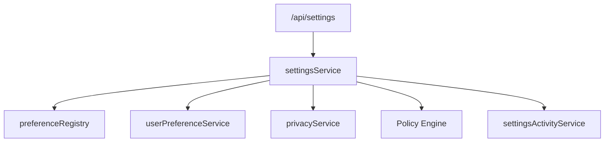

# PP-2 Phase 1 — Settings Platform Foundation Architecture

**Program:** Account Platform PP-2 Implementation Charter — Phase 1  
**Date:** 2026-06-19  
**Status:** Implemented — foundation only (not certification)

---

## Purpose

Create the constitutional **Settings Platform Foundation**: unified service layer, preference registry, canonical `/api/settings` API, activity/events foundation, and theme persistence path — without hub consolidation or UX redesign.

---

## Service layer

| Service | Path | Role |
|---------|------|------|
| `settingsService` | `server/src/services/account/settingsService.ts` | **Platform entry point** |
| `preferenceRegistry` | `server/src/services/account/preferenceRegistry.ts` | Authoritative key contract |
| `settingsNavigationContract` | `server/src/services/account/settingsNavigationContract.ts` | IA metadata (not enforcement) |
| `settingsActivityService` | `server/src/services/account/settingsActivityService.ts` | Module activity + domain events |
| `userPreferenceService` | `server/src/services/userPreferenceService.ts` | KV storage (extended delete) |

### settingsService API

| Method | Responsibility |
|--------|----------------|
| `resolveSettings(userId)` | Bulk settings + registry metadata |
| `updateSettings(userId, input)` | Bulk or single-key update |
| `resolvePreference(userId, key)` | Single key read with defaults |
| `updatePreference(userId, key, value)` | Validated write |
| `deletePreference(userId, key)` | Remove KV row (reset) |
| `resolveSettingsSections(userId)` | Section map + navigation contract |

---

## Route architecture

| Mount | Router | Controller |
|-------|--------|------------|
| `/api/settings` | `routes/settings.ts` | `settingsController.ts` |

**Endpoints:**

| Method | Path | Handler |
|--------|------|---------|
| GET | `/api/settings` | Bulk resolve |
| PUT | `/api/settings` | Update `{ key, value }` or `{ settings }` |
| GET | `/api/settings/sections` | Sections + navigation |
| GET | `/api/settings/preferences/:key` | Single read |
| PUT | `/api/settings/preferences/:key` | Single write |
| DELETE | `/api/settings/preferences/:key` | Delete / reset |

**Transitional convergence:** `/api/user/preferences/:key` delegates to `settingsService` for registry-known keys.

---

## Policy Engine

| Action | Scope |
|--------|-------|
| `settings:read` | Self user |
| `settings:update` | Self user |

Implemented via `authorizeIdentitySelf` (same pattern as PP-1).

---

## Activity & events

| Mutation | Module activity | Domain event |
|----------|-----------------|--------------|
| Bulk update | `settings.updated` | `settings.updated` |
| Theme change | `theme.changed` | `settings.theme.changed` |
| Preference change | `preference.changed` | `settings.preference.changed` |

Module id: **`settings`**

---

## Theme persistence

| Layer | Behavior |
|-------|----------|
| Registry | `appearance.theme` — enum `light` \| `dark` \| `system`, default `system` |
| Server | `UserPreference` KV via `settingsService` |
| Client | `localStorage` preserved for immediate UX |
| Sync | `AvatarContextMenu` persists theme to `PUT /api/settings` on change |

Full hydration from server on load is deferred (foundation only).

---

## Ownership (runtime alignment)

| Domain | Owns |
|--------|------|
| **Settings** | Registry, `/api/settings`, sections/navigation metadata, `appearance.theme` writes |
| **Identity** | Profile, privacy SoR (`UserPrivacySettings`) — read-only projection in settings |
| **Notifications** | `notification_*`, `email_*` key semantics |
| **AI** | `ai_preferred_*` — registry documented; not writable via settings API |
| **Billing** | Subscriptions — navigation link only |
| **BA** | Business configuration — out of scope |

---

## Dependency diagram

---

## Phase 1 exit criteria

| Criterion | Status |
|-----------|--------|
| `settingsService` | ✅ |
| Preference registry | ✅ |
| `/api/settings` mounted | ✅ |
| `useUserSettings` fixed | ✅ |
| Activity/events foundation | ✅ |
| Theme registry path | ✅ |
| Navigation contract | ✅ |
| Tests | ✅ |
| Hub consolidation | ❌ Out of scope |
| Certification | ❌ Not started |

---

**Last updated:** 2026-06-19 (PP-2 Phase 1)
