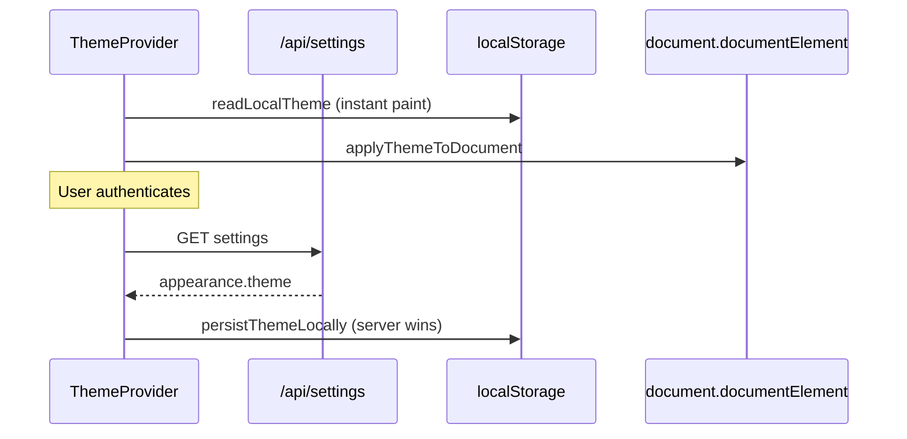

# PP-2 — Theme Hydration Report

**Program:** Account Platform PP-2 Package 2  
**Date:** 2026-06-20  
**Status:** Implemented

---

## Registry contract

| Key | Type | Default | Storage |
|-----|------|---------|---------|
| `appearance.theme` | enum (`light` \| `dark` \| `system`) | `system` | `UserPreference` |

---

## Implementation

### Server

- `PUT /api/settings` with `{ key: 'appearance.theme', value }` — unchanged from Phase 1
- Emits `settings.theme.changed` domain event

### Client utilities

**Path:** `web/src/lib/settingsTheme.ts`

| Function | Purpose |
|----------|---------|
| `hydrateThemeFromServer(token)` | Load theme from `GET /api/settings` on auth |
| `persistThemeLocally(theme)` | Apply DOM + localStorage + `themeChange` event |
| `persistThemeToServer(token, theme)` | `PUT /api/settings` |
| `changeTheme(token, theme)` | Combined local + server persist |

### Hydration flow

### Integration points

| Component | Behavior |
|-----------|----------|
| `ThemeProvider` | Hydrates from server when session authenticated |
| `useTheme` | Listens to `themeChange` events |
| `AppearanceSettings` | Full theme picker in settings hub |
| `AvatarContextMenu` | Quick toggle via `changeTheme()` |

---

## Verified behaviors

| Behavior | Status |
|----------|--------|
| **Load** — server theme applied on login | ✅ |
| **Persist** — change writes local + server | ✅ |
| **Change** — immediate DOM update | ✅ |
| **Cross-session** — server value hydrates on new device/session | ✅ |
| **Offline fallback** — localStorage used when API unavailable | ✅ |

---

## Finding closure

| Finding | Status |
|---------|--------|
| **PP2-F07** Theme localStorage only | **Closed** — full hydration path |

---

**Last updated:** 2026-06-20 (PP-2 Package 2)
