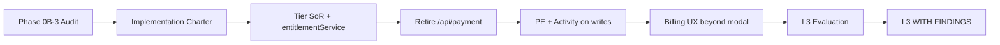

# PP-3 — Billing & Entitlements Certification Readiness

**Program:** Account Platform Phase 0B-3 — Billing & Entitlements Platform Audit  
**Date:** 2026-06-19  
**Status:** Discovery only — **no certification execution**

**Framework:** Adapted G1–G9 platform capability gates (consistent with Admin Portal, BO, Reference Workspace, PP-1, PP-2 programs).

---

## Readiness determination

| Option | Selected? |
|--------|-----------|
| NOT CERTIFIABLE | ✅ **Today** |
| READY FOR AUDIT | ✅ **After Phase 0B-3** (this package) |
| READY FOR REVIEW (L3 eval) | ❌ — requires PP-3 implementation charter |
| L3 WITH FINDINGS candidate | ❌ — post-implementation |
| Plain L3 candidate | ❌ |

**Headline:** PP-3 is **READY FOR IMPLEMENTATION CHARTER** planning — strongest backend maturity in Account Platform trilogy but blocked on entitlement SoR.

---

## G1–G9 estimate (current state)

| Gate | Score | Status | Evidence |
|------|------:|--------|----------|
| **G1** Authorization | 2 | **PARTIAL** | JWT on routes; no PE on billing writes; admin-override bypass |
| **G2** Auditability | 1 | **FAIL** | No normalized activity on subscription mutations |
| **G3** Service boundaries | 2 | **PARTIAL** | Good subscription/stripe services; fat controller; no entitlementService |
| **G4** API coherence | 1 | **FAIL** | Dual `/api/billing` + `/api/payment`; tier enum drift in validation |
| **G5** Ownership | 2 | **PARTIAL** | Services exist but dual tier SoR; ownership now documented |
| **G6** Test evidence | 2 | **PARTIAL** | Some admin billing tests; no entitlement resolver tests |
| **G7** Documentation | 2 | **PARTIAL** | Phase 0A/0B docs; operation matrix now exists |
| **G8** Production safety | 2 | **PARTIAL** | Webhook raw body correct; tier bypass risk; Stripe integration mature |
| **G9** UX consistency | 1 | **FAIL** | Modal-only billing; no dashboard; legacy payment clients |
| **Total** | **~15/27 (~56%)** | **NOT READY** | |

*Conservative estimate: 15/27. Optimistic (counting partial service maturity): ~17/27 (~63%).*

*Post-PP-3 implementation target: **~20–23/27 (~74–85%)** for L3 WITH FINDINGS evaluation.*

---

## Operation matrix compliance

From [PP3_BILLING_ENTITLEMENTS_OPERATION_MATRIX.md](./PP3_BILLING_ENTITLEMENTS_OPERATION_MATRIX.md):

| Metric | Value |
|--------|-------|
| Compliant (C) rows | **7** (~15%) |
| Partial (P) rows | **33** (~70%) |
| Non-compliant (N) rows | **7** (~15%) |

**Blocking findings:** PP3-F01 through PP3-F03.

---

## Blocking findings (certification gates)

| ID | Severity | Finding | Gate | Remediation |
|----|----------|---------|------|-------------|
| PP3-F01 | **Blocking** | No canonical entitlement SoR / `entitlementService` | G3, G5 | Create resolver; canonical tier enum |
| PP3-F02 | **Blocking** | Tier enum drift across Subscription/Business/services | G4, G5, G8 | Enum consolidation; deprecate Business.tier writes |
| PP3-F03 | **Blocking** | Dual `/api/billing` + `/api/payment` APIs | G4 | Retire payment routes; migrate clients |

---

## Major findings

| ID | Severity | Finding | Gate |
|----|----------|---------|------|
| PP3-F04 | **Major** | `admin-override` sets `Business.tier` without Subscription sync | G1, G8 |
| PP3-F05 | **Major** | No PE/activity on subscription mutations | G1, G2 |
| PP3-F06 | **Major** | Fat `billingController` + inline Prisma | G3 |
| PP3-F07 | **Major** | Multiple gating implementations (HR separate matrix) | G3, G5 |
| PP3-F08 | **Major** | Modal-only billing UX — no billing dashboard | G9 |

---

## Advisories

| ID | Severity | Finding |
|----|----------|---------|
| PP3-F09 | Advisory | Orphan `featureGatingService.simplified.ts` |
| PP3-F10 | Advisory | No product trial flow (Stripe trialing only in sync) |
| PP3-F11 | Advisory | `subscriptionService` uses `standard` vs checkout uses `pro` |
| PP3-F12 | Advisory | Legacy `web/src/api/payment.ts` still active |
| PP3-F13 | Advisory | AI query balance boundary with AI Platform unclear in docs |
| PP3-F14 | Advisory | No Global Trash pattern for billing records (expected exception) |

**Expected open advisories at WITH FINDINGS:** 4–8 if majors closed.

---

## Likely certification level

| Level | Probability | Conditions |
|-------|-------------|------------|
| NOT CERTIFIABLE | **Today** | Current state |
| L3 WITH FINDINGS | **High** (post-impl) | Tier SoR fixed, dual API retired, entitlementService, PE/activity partial |
| Plain L3 | **Low** | Would require full PE, dashboard UX, zero tier drift |
| Reference capability | **Medium** (post-impl) | Stripe integration depth could be reference pattern |

---

## Likely certification path

**Estimated phases to evaluation-ready:** 3–4 implementation packages (similar to Admin Portal sub-programs).

**Parallel work allowed:**
- Tier SoR + entitlementService (backend) can start during PP-1 phases 1–2
- Stripe webhook hardening independent of PP-2

**Serial dependencies:**
- Full UX certification needs PP-2 settings IA for billing hub placement
- Customer lifecycle alignment benefits from PP-1 `authService` extraction

---

## Modernization requirements (pre-certification)

| # | Requirement | Blocking? |
|---|-------------|-----------|
| 1 | `entitlementService` with canonical tier enum | **Yes** |
| 2 | Deprecate or sync `Business.tier` | **Yes** |
| 3 | Retire `/api/payment` + client migration | **Yes** |
| 4 | Thin `billingController` / `billingService` | Major |
| 5 | Normalized activity on subscription lifecycle | Major |
| 6 | Policy Engine on business-scoped billing writes | Major |
| 7 | Consolidate HR gating tier reads | Major |
| 8 | Billing dashboard UX | Major (G9) |
| 9 | Entitlement integration test suite | Major |
| 10 | Fix admin-override tier path | Major |
| 11 | Archive orphan simplified gating file | Advisory |
| 12 | Product trial flow (if product requires) | Advisory |

---

## Comparison to trilogy peers

| Program | G1–G9 est. | Backend maturity | UX maturity | Service extraction |
|---------|------------|------------------|-------------|-------------------|
| PP-1 Identity | ~44% | L1 | L2 | Mandatory |
| PP-2 Settings | ~37% | L0–L1 | L2 fragmented | Mandatory |
| **PP-3 Billing** | **~56%** | **L2** | **L1** | **Mandatory** |

PP-3 has the **highest baseline certification score** in the Account Platform trilogy due to existing Stripe/subscription services, but **entitlement fragmentation** is the unique blocking risk not present in PP-1/PP-2.

---

## Ledger impact

| Action | Status |
|--------|--------|
| Certification ledger update | **Not performed** (assessment only) |
| Reference module catalog | **Not performed** |
| Promotion record | **Not created** |

---

**Last updated:** 2026-06-19 (Phase 0B-3)
