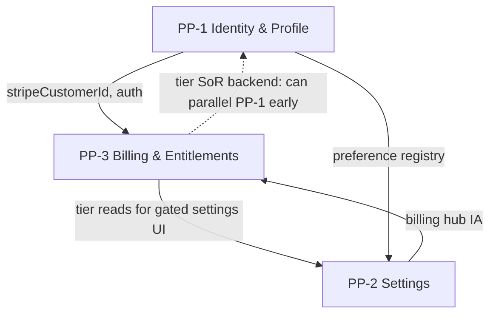

# PP-3 — Billing & Entitlements Executive Summary

**Program:** Account Platform Phase 0B-3 — Billing & Entitlements Platform Audit  
**Date:** 2026-06-19  
**Status:** Discovery complete — **no modernization, certification, or ledger changes**

**Audience:** Account Platform council · engineering leadership

---

## Headline

Billing is a **functional L2 backend subsystem** (Stripe, subscriptions, webhooks, partial tests) but **not a certified Billing Platform**. Entitlements are **not a platform** — tier and feature access are resolved through **four or more conflicting enum systems** with **no canonical resolver**. This is the **largest correctness risk** in the Account Platform trilogy: wrong feature access and revenue leakage.

PP-3 has the **highest G1–G9 baseline (~56%)** of PP-1/PP-2/PP-3 but remains **NOT CERTIFIABLE** until tier SoR and dual API drift are resolved.

---

## Required questions (17)

| # | Question | Answer |
|---|----------|--------|
| 1 | Does a Billing Platform exist? | **No.** Billing exists as **L2 backend services + routes** without unified `billingService`, constitutional writes, or certified platform status. |
| 2 | Does an Entitlement Platform exist? | **No.** Entitlements are **fragmented reads** across `Subscription.tier`, `Business.tier`, `FeatureGatingService`, `hrFeatureGating`, and module pricing enums. **No `entitlementService`.** |
| 3 | Who owns subscriptions? | **PP-3 Billing slice** — `subscriptionService`, `Subscription` model, `/api/billing` (target). Legacy `/api/payment` is drift. |
| 4 | Who owns licensing? | **Split:** Module **install** = marketplace (`ModuleInstallation`). **Paid module tier** = PP-3 (`ModuleSubscription`). **Platform feature licensing** = PP-3 Entitlements slice (target `entitlementService`). |
| 5 | Who owns module access? | **Read:** Entitlements (`checkModuleAccess`). **Install state:** Module marketplace. **Paid tier:** Billing `ModuleSubscription`. |
| 6 | Who owns feature gating? | **PP-3 Entitlements slice** (target). Today: `FeatureGatingService` + `subscriptionMiddleware` + `hrFeatureGating` (duplicated). |
| 7 | What is the entitlement source of truth? | **Today:** None canonical — dual `Subscription.tier` + `Business.tier` with different enums. **Target:** Active **`Subscription.tier`** via `entitlementService`; deprecate independent `Business.tier` writes. |
| 8 | Largest architectural weakness? | **Tier enum drift** across 10+ validation/read paths — no single resolver, admin override writes wrong column. |
| 9 | Largest ownership conflict? | **`Business.tier` vs `Subscription.tier`** — BA/admin writes Business entity tier without Subscription sync; HR gating uses fallback chain. |
| 10 | Service extraction required? | **Yes — mandatory.** Need `entitlementService` (P0), `billingService` (P1), `invoiceService` (P2); thin `billingController`; retire `paymentController`. |
| 11 | Certification readiness? | **NOT CERTIFIABLE today.** G1–G9 **~15/27 (~56%)**. Ready for **implementation charter** after this audit. |
| 12 | Likely certification path? | Implementation → tier SoR fix → retire `/payment` → PE/activity → **L3 WITH FINDINGS** (not plain L3). |
| 13 | Reference capability potential? | **Medium.** Stripe integration depth (webhooks, sync, module subs, revenue split) could become **reference billing pattern** post-certification. |
| 14 | Dependencies on PP-1? | **Medium.** `User.stripeCustomerId` on User row; auth JWT works today. Full customer lifecycle alignment benefits from PP-1 `authService`. **Backend tier work can start without full PP-1.** |
| 15 | Dependencies on PP-2? | **Soft–medium.** Billing settings tab placement, hub IA, cross-links. **Not blocking backend entitlement work.** |
| 16 | Can PP-3 be modernized independently? | **Partially.** Tier SoR, entitlement resolver, `/payment` retirement, webhook hardening: **mostly independent**. Full certification + billing dashboard UX: **needs PP-2 IA**; customer lifecycle: **coordinates with PP-1**. |
| 17 | Recommended modernization order (PP-1, PP-2, PP-3)? | **1)** PP-1 phases 1–3 (auth, profile, preference foundation) · **2)** PP-3 tier SoR + `entitlementService` + retire `/payment` (**can overlap PP-2 discovery**) · **3)** PP-2 settings API + hub consolidation · **4)** PP-3 billing UX + constitutional alignment (PE, activity) · **5)** Phased L3 evaluations across trilogy |

---

## Constitutional map (summary)

| Domain | Exists? | Maturity | Owner |
|--------|---------|----------|-------|
| Billing / payments | Partial platform | L2 backend / L1 UX | PP-3 Billing |
| Subscriptions | Yes (fragmented API) | L2 | PP-3 Billing |
| Commerce flows | Yes (checkout, upgrade, cancel) | L2 | PP-3 Billing |
| Entitlements / tier | No platform | L0–L1 | PP-3 Entitlements (target) |
| Feature gating | Yes (duplicated) | L1 | PP-3 Entitlements |
| Module licensing | Yes (split install/sub) | L2 | Billing + Marketplace |
| Stripe integration | Yes | L2 | PP-3 Billing |
| Invoices | Yes | L2 | PP-3 Billing |

---

## Trilogy dependency model

**Key insight:** PP-3 is **not a hard downstream dependency** of PP-1/PP-2 for **backend entitlement canonicalization**. It is a **soft dependency** for full Account Platform certification and UX cohesion.

---

## Findings summary

| Severity | Count | Examples |
|----------|-------|----------|
| Blocking | 3 | No entitlement SoR; tier enum drift; dual APIs |
| Major | 5 | Admin override drift; no PE/activity; fat controller; HR gating duplication; modal-only UX |
| Advisory | 6 | Orphan gating file; no trial flow; legacy clients |

---

## Deliverables produced (Phase 0B-3)

| Document | Purpose |
|----------|---------|
| [PP3_BILLING_ENTITLEMENTS_REALITY_ASSESSMENT.md](./PP3_BILLING_ENTITLEMENTS_REALITY_ASSESSMENT.md) | Full constitutional inventory |
| [PP3_BILLING_ENTITLEMENTS_OPERATION_MATRIX.md](./PP3_BILLING_ENTITLEMENTS_OPERATION_MATRIX.md) | 47 operations · 7C / 33P / 7N |
| [PP3_BILLING_ENTITLEMENTS_OWNERSHIP_MODEL.md](./PP3_BILLING_ENTITLEMENTS_OWNERSHIP_MODEL.md) | Authoritative boundaries |
| [PP3_BILLING_ENTITLEMENTS_SERVICE_BOUNDARY_ANALYSIS.md](./PP3_BILLING_ENTITLEMENTS_SERVICE_BOUNDARY_ANALYSIS.md) | Extraction requirements |
| [PP3_BILLING_ENTITLEMENTS_CERTIFICATION_READINESS.md](./PP3_BILLING_ENTITLEMENTS_CERTIFICATION_READINESS.md) | G1–G9 · certification path |
| [PP3_BILLING_ENTITLEMENTS_EXECUTIVE_SUMMARY.md](./PP3_BILLING_ENTITLEMENTS_EXECUTIVE_SUMMARY.md) | This document |

---

## Stop condition confirmation

| Constraint | Status |
|------------|--------|
| No runtime code changes | ✅ |
| No services created | ✅ |
| No routes added | ✅ |
| No schema changes | ✅ |
| No tests created | ✅ |
| No modernization executed | ✅ |
| No certification executed | ✅ |
| No ledger updates | ✅ |
| No implementation packages | ✅ |

---

## Recommended next step

Council ratification of PP-3 ownership model → **PP-3 Implementation Charter** (tier SoR + `entitlementService` as Package 1) — **not** certification evaluation.

Account Platform Phase 0B trilogy audits: **complete** (PP-1, PP-2, PP-3).

---

**Last updated:** 2026-06-19 (Phase 0B-3)
