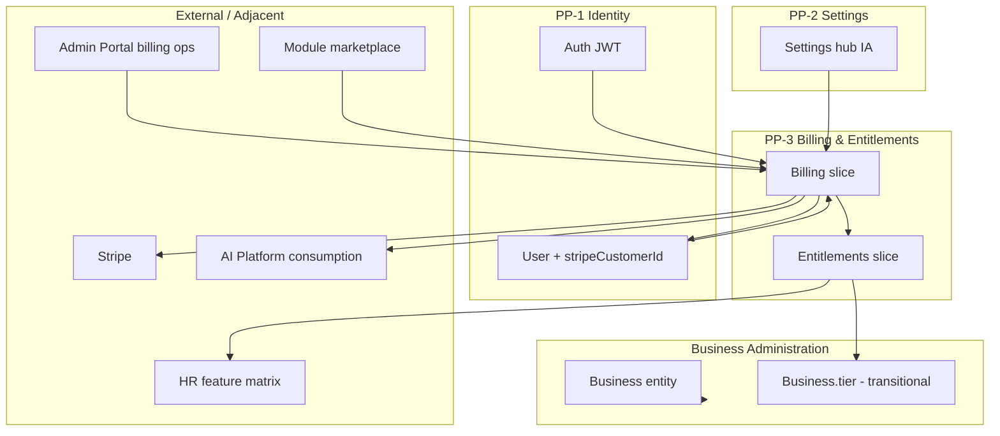

# PP-3 — Billing & Entitlements Ownership Model

**Program:** Account Platform Phase 0B-3 — Billing & Entitlements Platform Audit  
**Date:** 2026-06-19  
**Status:** **Authoritative PP-3 boundaries** — discovery; not runtime-enforced

**Supersedes:** Proposed ownership in [ACCOUNT_PLATFORM_OWNERSHIP_MODEL.md](./ACCOUNT_PLATFORM_OWNERSHIP_MODEL.md) for PP-3 scope only.

**Aligns with:** [PP1_IDENTITY_PROFILE_OWNERSHIP_MODEL.md](./PP1_IDENTITY_PROFILE_OWNERSHIP_MODEL.md) · [PP2_SETTINGS_OWNERSHIP_MODEL.md](./PP2_SETTINGS_OWNERSHIP_MODEL.md)

---

## Authoritative boundary answers

### Billing owns

| Concern | SoR | Write authority |
|---------|-----|-----------------|
| Core platform subscription rows | `Subscription` | PP-3 billing service |
| Module subscription rows | `ModuleSubscription` | PP-3 module subscription service |
| Stripe customer linkage | `User.stripeCustomerId` | PP-3 (coordination with PP-1 user lifecycle) |
| Invoices & refunds | `Invoice`, `Refund` | PP-3 billing service |
| Usage metering records | `UsageRecord` | PP-3 usage tracking service |
| Pricing configuration | `PricingConfig`, `PriceChange` | PP-3 + Admin Portal pricing ops |
| Developer revenue split | `DeveloperRevenue` | PP-3 + marketplace module |
| AI query pack purchases | `AIQueryPurchase`, `AIQueryBalance` | PP-3 billing slice (metering adjacent to AI consumption) |
| Checkout / upgrade / downgrade / cancel flows | Stripe + billing routes | PP-3 billing service |
| Payment method management | Stripe Customer + billing routes | PP-3 billing service |
| Customer portal sessions | Stripe Billing Portal | PP-3 billing service |
| Stripe webhook ingestion | Webhook handler | PP-3 billing slice |
| Overage billing cron | `overageBillingService` | PP-3 billing slice |
| Billing modal UX (`BillingModal`, `UpgradeFlow`) | Web components | PP-3 UX slice |
| Checkout return pages (`/billing/success`, `/billing/cancel`) | Web routes | PP-3 UX slice |

**Billing does NOT own:** entitlement resolution logic (Entitlements slice) · business entity profile · user identity credentials · settings hub IA.

### Entitlements owns

| Concern | SoR (target) | Write authority |
|---------|--------------|-----------------|
| Effective platform tier resolution | Derived from active `Subscription` | **Read-only resolver** — `entitlementService` (target) |
| Feature catalog definition | Static `FEATURES` map in `FeatureGatingService` | Entitlements slice — migrate to registry |
| Feature access checks (`/api/features`, AI routes) | Resolver output | Entitlements slice |
| Subscription middleware tier gates | `subscriptionMiddleware` | Entitlements slice — consolidate |
| Module access entitlement checks | `FeatureGatingService.checkModuleAccess` | Entitlements slice |
| HR feature tier matrix | `hrFeatureGating` | HR owns matrix; **Entitlements owns tier input** |
| Module pricing tier semantics | `Module.pricingTier` enum | Marketplace module defines; Entitlements interprets |

**Entitlements does NOT own:** Stripe payment state · invoice rows · subscription mutation · module install records (`ModuleInstallation`).

**Critical gap today:** No `entitlementService`; tier reads are duplicated across services with conflicting enums.

### Business Administration owns

| Concern | PP-3 relationship |
|---------|-------------------|
| `Business` entity profile (name, EIN, logo) | BA — **not PP-3** |
| `BusinessMember` roles | BA — not billing |
| `Business.tier` field on entity | **Conflict zone** — today admin-override writes here without Subscription sync; **target: deprecate or derive from Subscription** |
| Business workspace shell | BA/workspace — billing tab is **embed only** |
| HR module settings overrides | HR module — reads entitlements; does not own tier SoR |

**Rule:** PP-3 **never** becomes write owner of `Business` profile fields. Tier writes on `Business.tier` are **transitional** until Subscription SoR is canonical.

### Settings owns (PP-2)

| Concern | PP-3 relationship |
|---------|-------------------|
| Settings hub billing entry point | PP-2 IA — links to `BillingModal` |
| Business workspace billing tab placement | PP-2 consolidates IA; PP-3 owns modal content |
| Billing-related user preferences (if any) | PP-2 registry; PP-3 defines keys |
| `/settings` bulk API | PP-2 — not billing data |

### Identity owns (PP-1)

| Concern | PP-3 relationship |
|---------|-------------------|
| `User` credentials, email, role | PP-1 — billing reads `userId` |
| `User.stripeCustomerId` storage | User row — **PP-3 writes with PP-1 lifecycle coordination** |
| Auth JWT for billing routes | PP-1 auth kernel — already works |
| Profile display in billing UX | PP-1 profile — soft dependency |

### Explicitly not owned by PP-3

| Concern | Owner |
|---------|-------|
| AI personality / autonomy / query consumption logic | **AI Platform** |
| AI monetization product concepts (pack UX in AI Control Center) | **AI Platform** (billing processes payment) |
| Dashboard layout / widgets | **Dashboard module** |
| Admin Portal operator billing analytics | **Admin Portal L3** (`adminBillingService`) |
| Admin impersonation | **Admin Portal** |
| Module installation (free tier) | **Module marketplace** |
| Notification delivery for billing events | **Notifications platform** |
| Business Administration business profile | **BA L3** |

---

## Source of truth matrix

| Data | Current SoR (reality) | Target SoR (PP-3) | Drift risk |
|------|----------------------|-------------------|------------|
| Platform tier | `Subscription.tier` + `Business.tier` (dual) | **Active `Subscription.tier`** | **HIGH** |
| Module paid access | `ModuleSubscription` + `ModuleInstallation` | `ModuleSubscription` + install record | Medium |
| Feature flags | Static catalog in service | Entitlement registry | Medium |
| Stripe subscription state | Stripe + `stripeSyncService` | Stripe (external) + `Subscription` mirror | Low |
| Pricing amounts | `PricingConfig` + Stripe Prices | `PricingConfig` | Low |
| Payment methods | Stripe Customer | Stripe Customer | Low |
| Usage metering | `UsageRecord` | `UsageRecord` | Low |
| Admin tier bypass | `Business.tier` only | **Subscription row + audit** | **HIGH** |

---

## Ownership conflict register

| ID | Conflict | Parties | Resolution (target) |
|----|----------|---------|---------------------|
| PP3-OC01 | `Business.tier` vs `Subscription.tier` | PP-3 vs BA/admin | Subscription SoR; Business.tier derived or deprecated |
| PP3-OC02 | `hrFeatureGating` fallback chain | HR vs Entitlements | Single resolver input |
| PP3-OC03 | `/api/payment` vs `/api/billing` | Legacy vs PP-3 | Retire payment routes |
| PP3-OC04 | `User.stripeCustomerId` write | PP-1 vs PP-3 | PP-3 writes on checkout; PP-1 owns user row |
| PP3-OC05 | Module install vs module subscription | Marketplace vs Billing | Install = marketplace; paid tier = billing |
| PP3-OC06 | AI query balance | AI vs Billing | Billing owns purchase rows; AI owns consumption |
| PP3-OC07 | Admin tier override | Admin Portal vs Entitlements | Override writes Subscription + audit; not Business.tier alone |
| PP3-OC08 | Settings billing tab | PP-2 vs PP-3 | PP-2 IA; PP-3 modal content |

**Largest ownership conflict:** **PP3-OC01** — dual tier columns with different enum vocabularies and independent write paths.

---

## Boundary diagram

---

## Ratification status

| Item | Status |
|------|--------|
| PP-3 authoritative boundaries documented | ✅ Phase 0B-3 |
| Council ratification | Pending |
| Runtime enforcement | Not implemented |
| Ledger entry | Not created (assessment only) |

---

**Last updated:** 2026-06-19 (Phase 0B-3)
