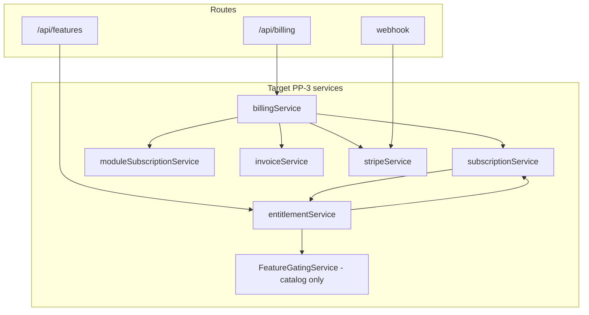

# PP-3 — Billing & Entitlements Service Boundary Analysis

**Program:** Account Platform Phase 0B-3 — Billing & Entitlements Platform Audit  
**Date:** 2026-06-19  
**Status:** Discovery only — no extraction executed

---

## Current service inventory

### Billing-adjacent services (exist)

| Service | Path | LOC est. | Role | Boundary quality |
|---------|------|----------|------|------------------|
| `subscriptionService` | `server/src/services/subscriptionService.ts` | ~400 | Core subscription CRUD | **Good** — primary SoR writer |
| `moduleSubscriptionService` | `server/src/services/moduleSubscriptionService.ts` | ~350 | Module App Store subs | **Good** |
| `stripeService` | `server/src/services/stripeService.ts` | ~500 | Stripe API wrapper | **Good** |
| `stripeSyncService` | `server/src/services/stripeSyncService.ts` | ~300 | Webhook ↔ DB sync | **Good** |
| `paymentService` | `server/src/services/paymentService.ts` | ~200 | Legacy payment layer | **Poor** — retire |
| `pricingService` | `server/src/services/pricingService.ts` | ~250 | Pricing config | **Good** |
| `usageTrackingService` | `server/src/services/usageTrackingService.ts` | ~200 | Usage metering | **Good** |
| `overageBillingService` | `server/src/services/overageBillingService.ts` | ~150 | Cron overage | **Good** |
| `revenueSplitService` | `server/src/services/revenueSplitService.ts` | ~200 | Developer split | **Good** |
| `aiQueryService` | `server/src/services/aiQueryService.ts` | ~300 | Query pack purchase | **Partial** — AI adjacency |
| `adminBillingService` | `server/src/services/adminBillingService.ts` | ~250 | Admin Portal ops | **Good** — Admin adjacency |

### Entitlement-adjacent services (exist)

| Service | Path | Role | Boundary quality |
|---------|------|------|------------------|
| `FeatureGatingService` | `server/src/services/featureGatingService.ts` | Feature + module access checks | **Partial** — also tier reader |
| `featureGatingService.simplified.ts` | Same directory | Duplicate orphan class | **Retire** |
| `subscriptionMiddleware` | `server/src/middleware/subscriptionMiddleware.ts` | Route-level tier gate | **Partial** — separate enum |
| `hrFeatureGating` | `server/src/services/hrFeatureGating.ts` | HR-specific matrix | **Poor** — duplicate tier logic |

### Missing target services

| Service | Purpose | Priority |
|---------|---------|----------|
| **`billingService`** | Unified billing orchestration facade | P1 |
| **`entitlementService`** | Canonical tier + feature resolution | **P0** |
| **`invoiceService`** | Invoice list/get (today inline Prisma) | P2 |

---

## Controller boundary analysis

### `billingController.ts` (~900 LOC)

| Pattern | Finding |
|---------|---------|
| Service delegation | **Partial** — uses subscription/module/stripe services |
| Inline Prisma | **Yes** — invoice queries, payment method default, some subscription reads |
| Authorization | JWT `req.user` — no Policy Engine |
| Activity events | **Missing** on subscription mutations |
| Error handling | Consistent logger usage |

**Extraction required:** Move inline Prisma to `invoiceService` / `billingService`; thin controller to route → authorize → service → response.

### `paymentController.ts` (~350 LOC)

| Pattern | Finding |
|---------|---------|
| Legacy duplicate | Overlaps billingController subscription CRUD |
| Client usage | `web/src/api/payment.ts`, `web/src/lib/stripe.ts` still call |
| Retirement | Migrate clients → delete controller + routes |

### `featureGatingController.ts`

| Pattern | Finding |
|---------|---------|
| Delegates to | `FeatureGatingService`, `subscriptionMiddleware` |
| Boundary | Acceptable — should consume `entitlementService` when created |

---

## Route boundary analysis

| Mount | Controller | Constitutional | Notes |
|-------|------------|----------------|-------|
| `/api/billing` | `billingController` | **Partial** | Canonical target |
| `/api/payment` | `paymentController` | **Fail** | Dual API — retire |
| `POST /api/payment/webhook` | `index.ts` raw handler | **Pass** | Security correct |
| `/api/feature-gating` | `featureGatingController` | **Partial** | Entitlement reads |
| `/api/features` | `featureGatingController` | **Partial** | Catalog API |
| `/api/pricing` | pricing routes | **Pass** | Read-heavy |
| `/api/usage` | usage routes | **Partial** | Metering |
| `/api/ai/queries` | ai query routes | **Partial** | Billing + AI boundary |
| `/api/admin-override` | inline | **Fail** | Business.tier only |
| `/api/admin-portal/billing/*` | admin routes | **Pass** | Operator scope |

---

## Inline Prisma hotspots (extraction targets)

| Location | Operation | Target service |
|----------|-----------|----------------|
| `billingController` | Invoice list/get | `invoiceService` |
| `billingController` | Set default payment method | `billingService` |
| `billingController` | Some subscription reads | `subscriptionService` (extend) |
| `paymentController` | All subscription ops | Retire → `subscriptionService` |
| `admin-override` | `Business.tier` update | `entitlementService` + audit |

---

## Constitutional compliance matrix

| Requirement | Billing | Entitlements | Status |
|-------------|---------|--------------|--------|
| `authorize → execute → activity` | **Fail** | N/A (reads) | No activity on sub changes |
| Policy Engine on writes | **Fail** | **Fail** | No PE alignment |
| Tenant scoping (`userId`, `businessId`) | **Pass** | **Pass** | Scoped queries |
| Thin controllers | **Fail** | **Pass** | billingController fat |
| Single API namespace | **Fail** | **Pass** | `/payment` duplicate |
| Service per domain | **Partial** | **Fail** | No entitlementService |
| Test evidence | **Partial** | **Fail** | Some billing tests; no entitlement tests |
| No dual SoR | **Fail** | **Fail** | Tier drift |

---

## Target service architecture

### `entitlementService` (P0) responsibilities

1. `getEffectiveTier(userId, businessId?)` — single enum vocabulary
2. `checkFeature(userId, featureKey, businessId?)` — delegates to catalog
3. `checkModuleAccess(userId, moduleId, businessId?)` — module tier logic
4. Sync hook: on Subscription change → update derived `Business.tier` cache (or deprecate field)
5. Admin override path: write Subscription + audit, not Business alone

### `billingService` (P1) responsibilities

1. Orchestrate checkout, upgrade, downgrade, cancel, reactivate
2. Payment method CRUD via stripeService
3. Customer portal session
4. Emit normalized activity on all mutations
5. PE alignment for business-scoped billing writes

---

## Extraction sequence (implementation charter — not executed)

| Phase | Work | Dependency |
|-------|------|------------|
| 1 | Create `entitlementService` + tier enum canonicalization | None |
| 2 | Migrate `hrFeatureGating`, `subscriptionMiddleware`, `FeatureGatingService` reads | Phase 1 |
| 3 | Create `invoiceService`; thin `billingController` | Phase 1 |
| 4 | Create `billingService` facade | Phases 1–3 |
| 5 | Retire `/api/payment` + migrate web clients | Phase 4 |
| 6 | Fix `admin-override` to write Subscription | Phase 1 |
| 7 | PE + activity on subscription mutations | Phase 4 |
| 8 | Archive `featureGatingService.simplified.ts` | Phase 2 |
| 9 | Billing UX dashboard (beyond modal) | Phase 4 + PP-2 IA |

**Service extraction required:** **Yes — mandatory** before L3 certification (same verdict as PP-1).

---

## Test boundary gaps

| Area | Existing tests | Gap |
|------|----------------|-----|
| Billing routes | `admin-portal-billing-analytics-route.test.ts`, integration fragments | No full billingController suite |
| Subscription service | Limited | Tier enum edge cases |
| Entitlement resolution | **None** | Full gap |
| Webhook sync | Partial | Stripe event matrix |
| Dual API drift | **None** | payment vs billing parity |
| Admin tier override | **None** | Drift regression |

---

**Last updated:** 2026-06-19 (Phase 0B-3)
