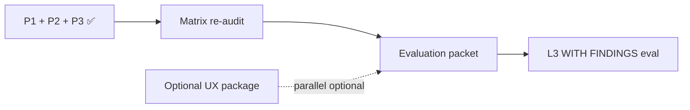

# PP-3 — Certification Readiness Review (Post-Migration)

**Program:** Account Platform — PP-3 Post-Migration Certification Reassessment  
**Date:** 2026-06-20  
**Type:** Governance determination — **no certification execution**

---

## Readiness determination

| Option | Selected? |
|--------|-----------|
| NOT CERTIFIABLE | ❌ |
| NEEDS REMEDIATION (implementation) | ❌ — optional UX wave only |
| **READY FOR EVALUATION** | **✅ L3 WITH FINDINGS candidate** |
| READY FOR EVALUATION (plain L3) | ❌ |
| Evaluation executed | ❌ — not authorized |

**Headline:** PP-3 implementation modernization is **sufficient to enter certification evaluation** targeting **L3 WITH FINDINGS**. A **governance matrix re-audit** is required before evaluation packet submission. **No additional implementation package is mandatory** before evaluation unless council mandates F08 closure.

---

## Certification path recommendation

| Step | Status | Owner |
|------|--------|-------|
| Implementation (Packages 1–2, Phase 3) | ✅ Complete | Engineering |
| Blocking findings closed | ✅ F01, F03 |
| Client migration gate | ✅ |
| Operation matrix re-audit | ⏳ **Required before eval** |
| Council evaluation packet | ⏳ Not submitted |
| Certification execution | ❌ Not authorized |

---

## Evaluation vs remediation matrix

| Criterion | Enter evaluation? | Remediation package? |
|-----------|-------------------|------------------------|
| PP3-F03 dual API | ✅ Closed | No |
| PP3-F12 legacy client | ✅ Closed | No |
| PP3-F08 modal UX | ⚠️ Open major | Optional UX package — **not eval blocker for WITH FINDINGS** |
| PP3-F05 invoice events | ⚠️ Partial | Optional events wave — WITH FINDINGS acceptable |
| PP3-F02 tier enum | ⚠️ Partial | Optional data migration — document at eval |
| Matrix stale vs runtime | ⏳ Re-audit | Governance only |

---

## Likely evaluation outcome

| Level | Probability | Conditions |
|-------|-------------|------------|
| NOT CERTIFIABLE | **Low** | If matrix re-audit reveals new blockers |
| **L3 WITH FINDINGS** | **High (~75%)** | Expected target outcome |
| Plain L3 | **Low (<10%)** | Requires F08 + F02 closure + G9≥2 |

**Expected open findings at award:** 6–10 advisories + F08 major (documented) + partial F02/F05/F07.

**Reference billing pattern advisory:** Eligible post-award if Stripe depth documented in evaluation packet.

---

## Prerequisites checklist (evaluation packet)

| # | Requirement | Met? |
|---|-------------|------|
| 1 | `entitlementService` + `billingService` live | ✅ |
| 2 | No production client dual API | ✅ |
| 3 | Blocking findings F01, F03 closed | ✅ |
| 4 | Test evidence attached | ✅ |
| 5 | G1–G9 self-score ≥ WITH FINDINGS threshold | ✅ (~88%) |
| 6 | Operation matrix re-audit published | ❌ |
| 7 | Findings register delta (this review) | ✅ |
| 8 | MFA / umbrella dependencies documented | ✅ Cross-ref PP-1 |

---

## Comparison to program targets (Phase 0C)

| Target | Actual |
|--------|--------|
| Post-impl ~74–85% for WITH FINDINGS | **~88%** ✅ |
| Retire `/api/payment` clients | ✅ |
| PE + activity on lifecycle | ✅ Partial+ |
| Billing UX beyond modal | ❌ F08 — deferred by charter |

---

**Last updated:** 2026-06-20 (Post-Migration Reassessment)
