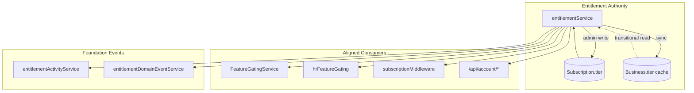

# PP-3 — Entitlement Architecture (Package 1)

**Program:** Account Platform — PP-3 Package 1 (Entitlement Foundation)  
**Date:** 2026-06-20  
**Status:** **Implemented** — constitutional entitlement authority established

**Aligns with:** [PP3_BILLING_ENTITLEMENTS_OWNERSHIP_MODEL.md](./PP3_BILLING_ENTITLEMENTS_OWNERSHIP_MODEL.md) · [ACCOUNT_PLATFORM_MODERNIZATION_SEQUENCE.md](./ACCOUNT_PLATFORM_MODERNIZATION_SEQUENCE.md)

---

## Purpose

Establish a **single entitlement authority** for platform tier resolution and feature gating input. Package 1 does **not** modernize billing UX, retire `/api/payment`, or perform certification.

---

## Source of truth

| Concern | Authority | Consumer |
|---------|-----------|----------|
| Platform tier (write) | Active `Subscription.tier` | All gating paths via `entitlementService` |
| Platform tier (read cache) | `Business.tier` | Derived sync only — **not** a parallel SoR |
| Feature catalog | `FeatureGatingService.FEATURES` | Interpreted through resolver (Package 2 may registry-ify) |
| HR feature matrix | `hrFeatureGating` | Tier **input** from `entitlementService` only |
| Module commerce tier | `ModuleSubscription` | Unchanged — separate vocabulary |

---

## Canonical tier vocabulary

| Tier | Scope |
|------|-------|
| `free` | Personal + business |
| `pro` | Personal |
| `business_basic` | Business |
| `business_advanced` | Business |
| `enterprise` | Personal + business |

**Legacy mapping:** `standard` → `pro` (personal) or `business_basic` (business context).

---

## Resolution contract

```typescript
resolveTier({ userId, businessId? })
  → { tier, source: 'subscription' | 'business_cache' | 'default', subscriptionId? }

resolveEffectiveEntitlements({ userId, businessId? })
  → { tier, source, scope, features[] }

hasFeature({ userId, businessId? }, featureKey)
  → { allowed, tier, reason? }

hasModuleAccess({ userId, businessId? }, moduleId)
  → { allowed, tier, missingFeatures[], availableFeatures[] }
```

### Resolution order (business context)

1. Active `Subscription` where `businessId` matches and `status = active`
2. Transitional fallback: `Business.tier` cache (when no subscription row exists)
3. Default: `free`

### Resolution order (personal context)

1. Active `Subscription` where `userId` matches, `businessId` is null, `status = active`
2. Default: `free`

---

## Write path (admin override)

`setBusinessTierAuthority()` is the **only** supported tier mutation path in Package 1:

1. Upsert active `Subscription.tier` for the business
2. Sync `Business.tier` derived cache via `syncBusinessTierCache()`
3. Emit module activity + domain events

Admin routes (`/api/admin-override/.../set-tier`, debug tier POST) now call this path.

---

## Read APIs

| Method | Path | Description |
|--------|------|-------------|
| GET | `/api/account/entitlements` | Full entitlement snapshot (`?businessId=` optional) |
| GET | `/api/account/tier` | Tier resolution only |
| GET | `/api/account/effective` | Alias of entitlements |

All routes require JWT; policy `entitlement:read` enforced.

---

## Consumer alignment (Package 1)

| Consumer | Change |
|----------|--------|
| `FeatureGatingService` | Tier via `resolveTier()` |
| `hrFeatureGating` | Tier via `resolveBusinessTier()` |
| `subscriptionMiddleware` | Personal tier via `resolveTier()`; expanded tier hierarchy |
| `admin-override` | Writes `Subscription` + syncs `Business.tier` |
| `debug-business-tier` | Uses resolver + authority write path |

**Not migrated in Package 1:** `usageTrackingService`, `aiQueryService`, billing controllers, Stripe webhooks — remain on direct subscription reads until Package 2.

---

## Architecture diagram



---

## Out of scope (Package 1)

- Billing UX / Stripe UX / invoice redesign
- `/api/payment` retirement
- PP-2 Settings Platform
- Certification / ledger / council work
- AI monetization product changes

**Package 2** will evaluate `billingService`, payment API retirement, subscription management, and Stripe modernization.

---

**Last updated:** 2026-06-20 (PP-3 Package 1)
