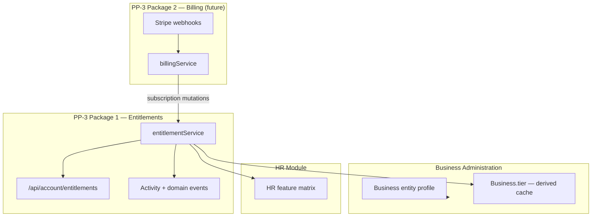

# PP-3 — Entitlement Ownership Model (Package 1)

**Program:** Account Platform — PP-3 Package 1  
**Date:** 2026-06-20  
**Status:** **Runtime-enforced foundation** — resolver + write path implemented

**Supersedes:** Entitlement sections of [PP3_BILLING_ENTITLEMENTS_OWNERSHIP_MODEL.md](./PP3_BILLING_ENTITLEMENTS_OWNERSHIP_MODEL.md) for tier SoR only.

---

## Authoritative ownership (post Package 1)

### Entitlements slice owns

| Concern | SoR | Write authority |
|---------|-----|-----------------|
| Effective platform tier resolution | Active `Subscription.tier` | **Read-only** via `entitlementService` |
| Tier mutation (admin override) | `Subscription.tier` | `setBusinessTierAuthority()` + PE `entitlement:write` |
| Business tier cache | `Business.tier` | **Derived only** — `syncBusinessTierCache()` |
| Feature access input | Resolver output | `entitlementService.hasFeature()` |
| Module access input | Resolver + `FeatureGatingService` | `entitlementService.hasModuleAccess()` |
| Entitlement read APIs | `/api/account/*` | PP-3 entitlements slice |
| Entitlement activity | `account` module activity | `entitlementActivityService` |
| Entitlement domain events | Domain event registry | `entitlementDomainEventService` |

### Entitlements slice does NOT own

| Concern | Owner |
|---------|-------|
| Stripe payment state | Billing slice (Package 2) |
| Invoice rows | Billing slice |
| Subscription checkout UX | Billing slice |
| Module install records | Marketplace |
| HR feature matrix definitions | HR module |
| `Business` profile fields (name, EIN, logo) | Business Administration |

---

## Source of truth matrix (updated)

| Data | Pre Package 1 | Post Package 1 | Drift risk |
|------|---------------|----------------|------------|
| Platform tier write | `Subscription.tier` **and** `Business.tier` (dual) | **`Subscription.tier` only** | **Reduced** — admin path fixed |
| Platform tier read | Duplicated Prisma queries | **`entitlementService`** | **Reduced** |
| Business.tier | Independent admin write SoR | **Derived cache** | **Reduced** — transitional read fallback remains |
| Feature gating input | 4+ independent paths | **3 paths** via resolver | **Partial** — HR matrix still separate |
| Admin tier bypass | `Business.tier` only | **Subscription + sync + events** | **Closed (PP3-F04)** |

---

## Conflict register updates

| ID | Status | Resolution |
|----|--------|------------|
| PP3-OC01 | **Partially closed** | Subscription SoR enforced; Business.tier consumerized for writes |
| PP3-OC02 | **Partially closed** | HR gating uses resolver tier input |
| PP3-OC03 | **Open** | Payment API retirement — Package 2 |
| PP3-OC07 | **Closed** | Admin override writes Subscription + audit events |

---

## Boundary diagram

---

## Ratification status

| Item | Status |
|------|--------|
| Entitlement SoR documented | ✅ Package 1 |
| `entitlementService` implemented | ✅ |
| Runtime enforcement (resolver) | ✅ |
| Council ratification | Prior Option C sequence — not re-required for Package 1 |
| Ledger entry | Not created (foundation only) |

---

**Last updated:** 2026-06-20 (PP-3 Package 1)
