# PP-3 — Evaluation Authorization Decision

**Program:** Account Platform — PP-3 Certification Evaluation Authorization Review  
**Date:** 2026-06-20  
**Type:** Governance decision record — **not council ratification**  
**Status:** **Recommendation issued**

---

## Decision

| Field | Value |
|-------|-------|
| **Authorization outcome** | **✅ AUTHORIZE PP-3 Certification Evaluation** |
| **Target certification level** | **Platform capability L3 WITH FINDINGS** |
| **Evaluation execution** | **Not performed** by this review |
| **Ledger update** | **Not authorized** |
| **Council ratification** | **Required separately** for formal program vote |

---

## Authorization rationale

1. **Implementation modernization complete** — Packages 1–2, Phase 3 delivered per charter.
2. **No open blocking findings** — F01, F03 closed; F02 partial with documented mitigation.
3. **Preparation package complete** — Matrix re-audit, evidence binder, findings disposition, webhook review.
4. **G1–G9 score 24/27** — exceeds WITH FINDINGS threshold precedent (BO 24/27, WS 23/27).
5. **Residual risks acceptable** — F08, F05, F07 documented as WITH FINDINGS scope.
6. **API convergence closed** — PP3-F03/F12 closed; webhook exception validated.

---

## Conditions of authorization

| # | Condition | Owner |
|---|-----------|-------|
| 1 | Submit evaluation packet as indexed in prep summary | Program governance |
| 2 | Assign evaluator (council-appointed or external) | Council |
| 3 | Target **L3 WITH FINDINGS** — not plain L3 | Evaluator briefing |
| 4 | Pre-brief F08, F05, F07, F02 as accepted/documented majors | Program governance |
| 5 | **No ledger update** until separate ratification vote post-eval | Council |
| 6 | **No runtime changes** during evaluation unless eval blocker discovered | Engineering |

---

## Denial criteria (not met)

| Criterion | Met? |
|-----------|------|
| Open blocking finding | ❌ Not met — none open |
| G1–G9 below WITH FINDINGS threshold | ❌ Not met — 24/27 |
| Missing evidence packet | ❌ Not met — complete |
| Unresolved dual API drift | ❌ Not met — closed |
| Missing entitlement SoR | ❌ Not met — closed |

**Denial is not warranted.**

---

## Alternatives considered

| Option | Assessment | Verdict |
|--------|------------|---------|
| **A. Authorize evaluation now** | Aligns with prep completion; no code gate | **✅ Selected** |
| B. Defer for billing UX package (F08) | Would delay eval without improving WITH FINDINGS odds materially | Rejected |
| C. Defer for F02 data migration | Non-blocking; document at eval | Rejected |
| D. Authorize plain L3 target | G9 FAIL; unrealistic | Rejected |
| E. Deny evaluation | No governance basis | Rejected |

---

## Post-authorization sequence

```mermaid
flowchart LR
  AUTH[Authorization ✅]
  ASSIGN[Evaluator assignment]
  SUBMIT[Packet submission]
  EVAL[Evaluation sessions]
  FIND[Findings register]
  REC[Recommendation report]
  RAT[Council ratification vote]
  LED[Ledger update — separate]

  AUTH --> ASSIGN
  ASSIGN --> SUBMIT
  SUBMIT --> EVAL
  EVAL --> FIND
  FIND --> REC
  REC --> RAT
  RAT --> LED
```

| Step | Authorized by this decision? |
|------|-------------------------------|
| Evaluation entry | **Yes** |
| Evaluation execution | **Yes** — upon evaluator assignment |
| Ledger promotion | **No** |
| Council ratification | **No** — follows eval recommendation |

---

## Scope boundaries (evaluation)

| In scope | Out of scope |
|----------|--------------|
| PP-3 Billing & Entitlements platform capability | Umbrella Account Platform composite |
| Entitlement + billing services, APIs, Stripe integration | PP-1 Identity, PP-2 Settings |
| G1–G9 for PP-3 slice | Admin Portal billing ops |
| Operation matrix re-audit rows | Billing UX redesign execution |

---

## Expected evaluation findings (predicted)

| Severity | Predicted open count | Examples |
|----------|---------------------|----------|
| Major | 1–2 | F08; possibly F05 as partial major |
| Advisory | 4–6 | F09–F11, F13; module sub PE |
| Blocking | 0 | — |

**Predicted award:** **L3 WITH FINDINGS** at **22–25/27** evaluator score.

---

## Sign-off posture

| Role | Action |
|------|--------|
| Program governance | **Recommend AUTHORIZE** |
| Council | Ratification vote required for formal charter |
| Evaluator | Not yet assigned |
| Engineering | Hold — no implementation unless eval blocker |

---

**Last updated:** 2026-06-20 (Evaluation Authorization Decision)
