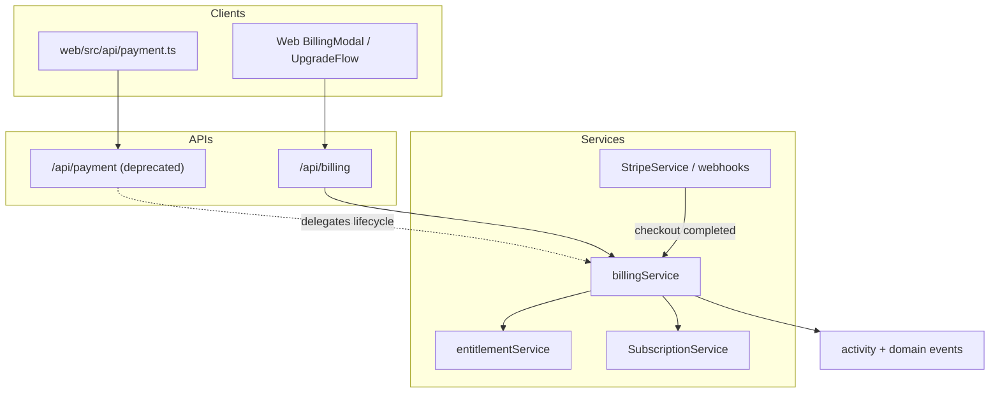

# PP-3 Package 2 — Billing Platform Architecture

**Program:** Account Platform — PP-3 Package 2 (Billing Service & API Convergence)  
**Date:** 2026-06-20  
**Status:** **Implemented** — billing foundation; UX out of scope

**Builds on:** [PP3_ENTITLEMENT_ARCHITECTURE.md](./PP3_ENTITLEMENT_ARCHITECTURE.md) (Package 1)

---

## Purpose

Establish **`billingService`** as the constitutional platform entry point for **platform subscription lifecycle** (create, update, cancel, resume, sync). Align Stripe checkout completion and entitlement cache sync. Begin **`/api/payment` → `/api/billing`** convergence without breaking clients.

**Not in scope:** Checkout redesign, invoice UX, settings consolidation, certification.

---

## Service layer

| Service | Path | Responsibility |
|---------|------|----------------|
| **`billingService`** | `server/src/services/account/billingService.ts` | Platform subscription SoR mutations + sync |
| `billingActivityService` | `server/src/services/account/billingActivityService.ts` | Module activity on billing mutations |
| `billingDomainEventService` | `server/src/services/account/billingDomainEventService.ts` | Domain event emitters |
| `entitlementService` | Package 1 | Tier cache sync after subscription writes |
| `SubscriptionService` | Legacy delegate | Stripe item orchestration (internal to billingService) |
| `StripeSyncService` | Legacy delegate | Stripe → DB sync (via `billingService.syncSubscription`) |
| `ModuleSubscriptionService` | Unchanged | Module commerce (separate vocabulary) |

---

## billingService contract

```typescript
resolveSubscription({ userId, businessId?, subscriptionId? })
createSubscription({ actorUserId, userId, tier, businessId?, ... })
updateSubscription({ actorUserId, userId, subscriptionId, tier?, cancelAtPeriodEnd? })
cancelSubscription({ actorUserId, userId, subscriptionId })
resumeSubscription({ actorUserId, userId, subscriptionId })
syncSubscription({ actorUserId, subscriptionId, source? })
upsertSubscriptionFromCheckout(actorUserId, checkoutData)  // Stripe webhook path
resolveTierForBilling(userId, businessId?)               // convenience read
```

**Order of operations:** `authorize (PE) → execute → sync entitlement cache (business) → emit activity + domain events`

---

## Entitlement integration

After any subscription write that changes tier or creates business subscription:

1. `Subscription.tier` remains authoritative (Package 1)
2. `billingService` calls `syncBusinessTierCache()` when `businessId` present
3. Tier reads elsewhere use `entitlementService.resolveTier()` (Package 1 + Package 2 convergence)

Admin override path (`setBusinessTierAuthority`) remains separate; billing path does not bypass it.

---

## API surface

| Canonical | Legacy (deprecated) | Notes |
|-----------|---------------------|-------|
| `POST /api/billing/subscriptions` | `POST /api/payment/subscription` | Legacy retained with deprecation headers |
| `DELETE /api/billing/subscriptions/:id` | `DELETE /api/payment/subscription/:id` | Legacy delegates to `billingService` |
| `POST /api/billing/subscriptions/:id/reactivate` | `POST /api/payment/subscription/:id/reactivate` | Legacy delegates to `billingService` |
| `POST /api/billing/checkout/session` | — | Canonical checkout |
| `GET /api/billing/subscriptions/user` | — | Canonical read |

See [PP3_API_CONVERGENCE_PLAN.md](./PP3_API_CONVERGENCE_PLAN.md).

---

## Architecture diagram



---

## Tier read convergence (Package 2)

| Consumer | Status |
|----------|--------|
| `FeatureGatingService` | ✅ Package 1 |
| `hrFeatureGating` | ✅ Package 1 |
| `subscriptionMiddleware` | ✅ Package 1 |
| `aiQueryService` | ✅ Package 2 |
| `usageTrackingService` | ✅ Package 2 |
| `featureGatingService.simplified.ts` | Orphan — archive candidate |

---

**Last updated:** 2026-06-20 (PP-3 Package 2)
