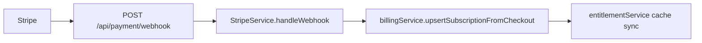

# PP-3 — Webhook Exception Review

**Program:** Account Platform — PP-3 Certification Preparation  
**Date:** 2026-06-20  
**Type:** Governance validation — **no code changes**

---

## Question

Does retention of `POST /api/payment/webhook` constitute dual API drift (PP3-F03)?

**Answer: No.** The webhook mount is an **intentional operational exception** — not a parallel CRUD API surface.

---

## Runtime configuration (validated)

| Property | Value |
|----------|-------|
| **Path** | `POST /api/payment/webhook` |
| **Mount location** | `server/src/index.ts` (before `express.json()`) |
| **Body parser** | `express.raw({ type: 'application/json' })` |
| **Authentication** | **None** — no JWT middleware |
| **Handler** | `paymentController.handleWebhook` → `StripeService` |
| **JWT payment router** | Separate — all routes **410 Gone** |

```typescript
// index.ts — registered before express.json()
app.post(
  '/api/payment/webhook',
  express.raw({ type: 'application/json' }),
  asyncHandler(handleWebhook)
);
```

---

## Why not `/api/billing/webhook`?

| Constraint | Rationale |
|------------|-----------|
| Stripe Dashboard URL | Production webhook configured to `/api/payment/webhook` |
| Raw body requirement | Must precede JSON parser — established secure pattern (F-052 mitigated) |
| Ops migration cost | Changing URL requires Stripe dashboard + env reconfiguration |
| No user/client caller | External Stripe servers only — not browser dual API |

**Phase 4 optional:** Rename to `/api/billing/webhook` with Stripe dashboard update — **not required for certification**.

---

## Dual API drift analysis

| Criterion | Webhook | Legacy JWT `/api/payment/*` |
|-----------|---------|------------------------------|
| User-facing client calls | **No** | Was yes → **retired** |
| Overlapping subscription CRUD | **No** — event ingestion | Was yes → **410** |
| Competing ownership of lifecycle | **No** — delegates to `billingService` on checkout | Was yes → **closed** |
| Documented successor API | N/A — event bus | `/api/billing` |

**Conclusion:** Webhook does **not** reopen PP3-F03.

---

## Event flow (post PP-3)



| Event type | Downstream |
|------------|------------|
| `checkout.session.completed` | `billingService` + entitlement cache |
| Module subscription events | `ModuleSubscriptionService` |
| Invoice events | Stripe sync paths — **no billing activity yet (F05)** |

---

## Security posture

| Check | Status |
|-------|--------|
| Signature verification | ✅ `stripe-signature` header |
| Raw body preserved | ✅ |
| Not behind JWT | ✅ Correct for Stripe |
| Integration test | ✅ `stripe-webhook.integration.test.ts` |
| Public mount not 401 | ✅ Verified |

---

## Documentation references

| Doc | Reference |
|-----|-----------|
| `docs/setup/STRIPE_SETUP_GUIDE.md` | Production webhook URL |
| `scripts/setup-stripe-webhook.js` | URL constants |
| `PP3_API_RETIREMENT_PLAN.md` | Webhook unchanged by design |
| System audit F-052 / A-047 | Raw body mitigation |

---

## Evaluator briefing

> **PP-3 retains `POST /api/payment/webhook` as the Stripe ingress URL.** This is not dual billing API drift: no browser or mobile client calls this path; JWT-gated `/api/payment` CRUD routes are retired (410). Checkout completion flows through `billingService` with entitlement cache sync. URL migration to `/api/billing/webhook` is optional ops follow-up, not a certification blocker.

---

## Verdict

| Field | Value |
|-------|-------|
| **Webhook exception valid?** | **Yes** |
| **Counts as dual CRUD API?** | **No** |
| **PP3-F03 impact** | **None** — finding closed |
| **Certification blocker?** | **No** |

---

**Last updated:** 2026-06-20 (Certification Preparation)
