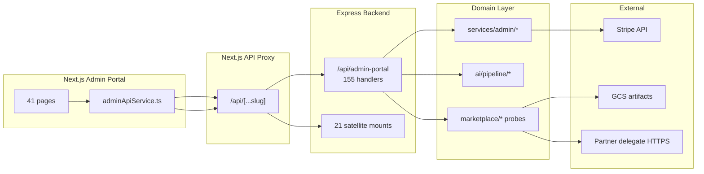

# Admin Portal — Architecture Audit

**Program:** Admin Portal Program — Phase 0A  
**Date:** 2026-06-24  
**Status:** Discovery only — **no certification awarded or changed**

**Authority:** [`VSSYL_PLATFORM_STANDARDS_AND_MODULE_CONTRACT.md`](../architecture/VSSYL_PLATFORM_STANDARDS_AND_MODULE_CONTRACT.md) — adapted for platform control plane (not module L3 15-item gate).

**Baseline:** Admin Portal **LEVEL 3 CERTIFIED** (2026-06-18). This audit re-evaluates architectural health after service decomposition and new marketplace probe surfaces.

**Related:** [Reality Assessment](./ADMIN_PORTAL_REALITY_ASSESSMENT.md) · [`ADMIN_PORTAL_OPERATION_MATRIX.md`](../architecture/audits/ADMIN_PORTAL_OPERATION_MATRIX.md) · [`ADMIN_PORTAL_SATELLITE_MOUNT_MAP.md`](../architecture/audits/ADMIN_PORTAL_SATELLITE_MOUNT_MAP.md)

---

## 1. Executive summary

Admin Portal architecture has ** materially improved** since the June 2026 pre-certification audit: the **AdminService monolith is decomposed** into 14 domain services; production safety gates (debug, dangerous ops, mock removal) are in place; route composition uses a thin aggregator with four bounded domain files.

Remaining architectural debt concentrates in **fat route files** (~4,800 LOC across domain routers), **satellite API fragmentation** (21 mount prefixes), **residual inline Prisma in routes**, and **missing cross-program operator federation layer** for Search / Context Graph governance.

**Architecture posture:** **Mixed → Improving** — operational maturity with acceptable control-plane patterns; consolidation work remains.

---

## 2. Status legend

| Status | Meaning |
|--------|---------|
| **PASS** | Meets adapted control-plane standard |
| **PASS WITH FINDINGS** | Largely present; documented gaps |
| **FAIL** | Material gap vs standard |
| **NOT PRESENT** | No implementation |
| **N/A** | Not applicable to control plane |

---

## 3. Architecture scorecard (2026-06-24)

| Gate | Status | Evidence | Notes |
|------|--------|----------|-------|
| Route composition | **PASS** | Thin `admin-portal.ts` aggregator mounts 4 domains + security | Clean entry point |
| Route file size | **FAIL** | analyticsOps 1,562 LOC; platform 1,588 LOC; aiPipeline 1,203 LOC | Fat handlers; module probes embedded in analyticsOps |
| Service decomposition | **PASS WITH FINDINGS** | 14 services under `services/admin/`; facade 706 LOC | AP-F-004 closed; some logic remains in routes |
| Controller/service separation | **PASS WITH FINDINGS** | Most paths delegate to domain services | ~6 inline Prisma calls remain in route files |
| Authorization | **PASS WITH FINDINGS** | Shared `requireAdmin` on most routes | Probe routes use inline ADMIN check |
| Production safety gates | **PASS** | `ADMIN_PORTAL_DEBUG_ENABLED`, `ADMIN_PORTAL_DANGEROUS_OPS_ENABLED` | 0E packages closed |
| Policy Engine | **NOT PRESENT** | Role gate only | Acceptable for control plane v1 |
| Admin audit taxonomy | **PASS WITH FINDINGS** | `adminAuditService` + taxonomy exist | Not universal on all mutations |
| Module activity events | **N/A** | Control plane not a product module | Uses AuditLog |
| Domain events | **NOT PRESENT** | No `emitDomainEvent` in admin routes | Optional for cross-cutting fan-out |
| API fragmentation | **FAIL** | 21 documented satellite mounts | Consolidation deferred |
| AI Pipeline routes | **PASS** | 45 handlers → pipeline services | Reference subdomain |
| Module governance gate | **PASS** | Certification gate + service tests | Production-grade |
| Marketplace probes | **PASS WITH FINDINGS** | 4 probe routes + readiness service | Inline auth; no result persistence |
| Test coverage | **PASS WITH FINDINGS** | 18+ backend integration files | Frontend smoke partial; pipeline HTTP gaps reduced in 1B |
| Frontend API client | **PASS WITH FINDINGS** | Single `adminApiService.ts` 1,996 LOC | Also calls satellite mounts |
| Tenant isolation | **N/A** | Platform-global by design | Impersonation crosses tenants — audited |

---

## 4. Service boundaries

### 4.1 Current decomposition (confirmed)

```
server/src/services/admin/
├── adminUserService.ts
├── adminImpersonationService.ts
├── adminModerationService.ts
├── adminModuleGovernanceService.ts
├── adminSecurityService.ts
├── adminBillingService.ts
├── adminSupportService.ts
├── adminAnalyticsService.ts
├── adminPerformanceService.ts
├── adminSystemOpsService.ts
├── adminAuditService.ts
├── adminAuditTaxonomy.ts
├── adminAiPipelineDiagnosticsService.ts
└── adminServiceContracts.ts

server/src/services/adminService.ts  → 706 LOC facade (delegates to above)
```

**Verdict:** Domain service extraction **complete** for planned 1B blueprint. AI Pipeline services correctly remain under `server/src/ai/pipeline/`.

### 4.2 Route-to-service mapping

| Route file | LOC | Handlers | Primary services | Issue |
|------------|----:|---------:|------------------|-------|
| `adminPortalRoutes.core.ts` | 472 | 16 | user, impersonation, moderation | Acceptable size |
| `adminPortalRoutes.analyticsOps.ts` | 1,562 | 49 | analytics, billing, security, **module governance + probes** | **Oversized** — should split marketplace ops |
| `adminPortalRoutes.platform.ts` | 1,588 | 38 | support, BI, system, database | **Oversized** |
| `adminPortalRoutes.aiPipeline.ts` | 1,203 | 45 | pipeline services | Acceptable for subsystem scope |
| `adminSecurityRoutes.ts` | — | 7 | security | Sub-mount OK |

### 4.3 Runtime dependencies



**Key dependencies:**
- NextAuth JWT forwarded through API proxy (mandatory pattern — **PASS**)
- Marketplace probes dynamically import marketplace services (acceptable lazy loading)
- AI Pipeline routes depend on trace store, policy registry, provider registry
- Billing routes depend on Stripe sync services
- No in-process third-party partner code (**PASS** — iframe/GCS model preserved)

---

## 5. API organization

### 5.1 Canonical mount structure

| Prefix | Handlers | Auth |
|--------|:--------:|------|
| `/api/admin-portal` (core) | 16 | JWT + requireAdmin |
| `/api/admin-portal` (analyticsOps) | 49 | JWT + requireAdmin (probes: inline) |
| `/api/admin-portal` (platform) | 38 | JWT + requireAdmin |
| `/api/admin-portal` (aiPipeline) | 45 | JWT + requireAdmin |
| `/api/admin-portal/security` | 7 | JWT + requireAdmin |

### 5.2 Satellite mounts (summary — full map in architecture audits)

| Category | Count | Examples | Disposition |
|----------|------:|----------|-------------|
| Platform control plane satellites | 6 | `/api/admin`, `/api/admin-override`, `/api/admin/logs` | Document; migrate to canonical |
| AI admin satellites | 3 | `/api/admin/ai-providers`, `/api/admin/business-ai`, `/api/centralized-ai` (legacy) | Retire centralized-ai body |
| Emergency ops | 6 | HR fix, seed, admin-setup | CLI/runbook target |
| Debug / test | 4 | `/api/admin-portal/testing`, `/api/ai-context-debug`, `/api/debug/*` | Env-gated |
| Module AI context | 1 | `/api/admin/modules/ai/*` | Keep until unified |

### 5.3 Organization issues

| ID | Issue | Impact |
|----|-------|--------|
| ARCH-01 | Module marketplace probes live in `analyticsOps` not `moduleGovernance` route file | Cognitive load; file size |
| ARCH-02 | `adminApiService` calls 4+ mount prefixes | Client fragmentation mirrors server |
| ARCH-03 | Legacy `/api/centralized-ai` (~97 handlers) still mounted with deprecation fence | Confusion risk for operators |
| ARCH-04 | Emergency HR/subscription routes outside portal IA | Ops debris — acceptable if documented |

---

## 6. Technical debt register

| ID | Debt | Severity | Prior finding | Status |
|----|------|----------|---------------|--------|
| TD-01 | Fat route files (1,500+ LOC) | Major | AP-F-004 partial | Open |
| TD-02 | Satellite mount fragmentation | Major | AP-F-006 | Open (documented) |
| TD-03 | Inline Prisma in routes (~6 calls) | Advisory | AP-F-004 partial | Reduced |
| TD-04 | Probe routes inconsistent auth middleware | Advisory | New | Open |
| TD-05 | `modules/page.tsx` 2,100+ LOC UI monolith | Advisory | — | Open |
| TD-06 | Legacy centralized-ai scaffold | Major | 0D deferred | Open |
| TD-07 | Synthetic/random health metrics in places | Advisory | — | Partial |
| TD-08 | No probe result persistence | Advisory | AP-G07 | Open |

**Closed debt:** AdminService 4,658 LOC monolith, unauthenticated support mutation, ungated migration delete, mock fallbacks on critical paths, phantom admin moduleId.

---

## 7. Comparison to certified references

| Dimension | File Hub L4 | AI Platform L2 | Admin Portal (2026-06-24) |
|-----------|-------------|----------------|---------------------------|
| Service extraction | Complete | Partial | **Complete** (admin domain) |
| Thin controllers | Yes | Partial | **Partial** — fat route files |
| Operation matrix | Yes | Yes | **Yes** |
| Constitutional audit | Yes | Yes | **Yes** (this program + prior) |
| PE / authZ | Partial | Service gates | Role gate only |
| Test evidence | ~80 cases | Partial | **Strong backend**; frontend partial |
| Control-plane adaptation | N/A | N/A | **L3 Certified** |

---

## 8. Architecture recommendations (planning only)

1. **Split `adminPortalRoutes.analyticsOps.ts`** — extract `adminPortalRoutes.moduleGovernance.ts` for submissions, certification, probes, marketplace readiness.
2. **Standardize probe route auth** — apply `authenticateJWT, requireAdmin` middleware; remove inline checks.
3. **Publish Platform Programs API namespace** (future) — `/api/admin-portal/platform-programs/*` for federated Search/Context Graph health reads.
4. **Continue satellite migration** — ai-providers and admin-override first (UI already exists).
5. **Retire centralized-ai body** — return 410 for duplicate handlers; keep admin fence until zero clients.

---

**Last updated:** 2026-06-24 (Phase 0A discovery)
