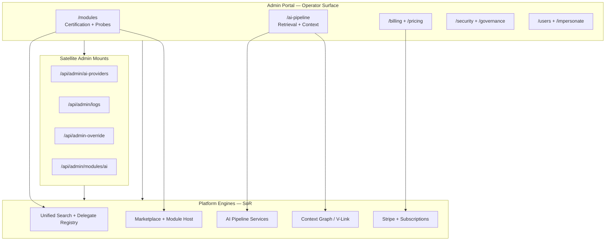

# Admin Portal — Capability Ownership Matrix

**Program:** Admin Portal Program — Phase 0A  
**Date:** 2026-06-24  
**Status:** Discovery only

**Purpose:** Map where **governance and operator control** currently live for major platform capabilities, and identify gaps now that Platform Kernel, Unified Search, AI Retrieval, Context Graph, and Marketplace Partner Capability Foundation programs are complete.

**Related:** [Reality Assessment](./ADMIN_PORTAL_REALITY_ASSESSMENT.md) · [Marketplace Governance Review](./ADMIN_PORTAL_MARKETPLACE_GOVERNANCE_REVIEW.md) · [`ADMIN_PORTAL_OWNERSHIP_BOUNDARY_ANALYSIS.md`](../architecture/audits/ADMIN_PORTAL_OWNERSHIP_BOUNDARY_ANALYSIS.md)

---

## 1. Ownership model summary

Admin Portal is the **primary operator surface** for most platform capabilities, but **not the system of record** for any of them. It orchestrates reads, probes, certification gates, and configuration — while domain engines remain in their owning services.

| Legend | Meaning |
|--------|---------|
| **AP** | Admin Portal (canonical operator UI + `/api/admin-portal`) |
| **Sat** | Satellite admin mount (documented, not canonical) |
| **Domain** | Owning platform service / module (SoR or engine) |
| **None** | No operator governance surface identified |

---

## 2. Capability ownership matrix

### 2.1 Marketplace & modules

| Capability | System of record | Operator governance lives | Admin Portal surface | Completeness |
|------------|------------------|----------------------------|----------------------|--------------|
| Module submissions | `Module`, `ModuleSubmission` | **AP** | `/admin-portal/modules` | **Complete** |
| Certification validator | `moduleVersionCertificationGate` | **AP** | Certification panel + promote gate | **Complete** |
| Artifact scan | Marketplace scan service | **AP** | Scan badge on submissions | **Complete** |
| Sandbox runtime | ModuleHost / `/modules/run` | **Domain** (marketplace) | Indirect — no dedicated sandbox dashboard | **Partial** |
| Partner scope enforcement | `moduleScope` validator | **Domain** + **AP** read | Readiness card scope badge | **Complete** |
| Developer oversight | Developer registry | **AP** | `/admin-portal/developers` | **Complete** |
| Marketplace browse (user) | `/modules` product surface | **Not AP** | User-facing only | N/A |

### 2.2 Search (Unified Search + Search Delegate)

| Capability | System of record | Operator governance lives | Admin Portal surface | Completeness |
|------------|------------------|----------------------------|----------------------|--------------|
| Unified Search engine | Search platform services | **Domain** | No dedicated Search ops page | **Gap** |
| Search Delegate registry | `searchDelegateRegistry` | **Domain** + **AP** probe | Readiness card + `GET .../search-delegate-probe` | **Pilot-complete** |
| Partner search proxy | Search delegate proxy | **Domain** | Probe only (`?live=true`) | **Partial** |
| Search indexing / health | Search infrastructure | **None in AP** | — | **Gap** |
| Allowlist / feature flags | Env + registry | **Domain** (ops config) | Not in portal UI | **Gap** |

### 2.3 Retrieval & AI Pipeline

| Capability | System of record | Operator governance lives | Admin Portal surface | Completeness |
|------------|------------------|----------------------------|----------------------|--------------|
| AI retrieval orchestration | `server/src/ai/pipeline/*` | **AP** | `/admin-portal/ai-pipeline/*` | **Complete** |
| Grounding policies | Pipeline policy store | **AP** | grounding, enforcement settings | **Complete** |
| Context sources | V-Link / context graph bindings | **AP** | sources, registry graph API | **Complete** |
| Trace / retrieval forensics | Pipeline trace store | **AP** | diagnostics, evidence viewer | **Complete** |
| Test lab / dry-run | Pipeline test services | **AP** | test-lab | **Complete** |
| Provider selection | AI provider registry | **AP** + **Sat** | AI Pipeline hub, `/api/admin/ai-providers` | **Complete** |
| Legacy centralized AI | `ai-centralized.ts` (deprecated) | **Sat** (fenced) | AI System hub cards only | **Retire deferred** |

### 2.4 Context Graph

| Capability | System of record | Operator governance lives | Admin Portal surface | Completeness |
|------------|------------------|----------------------------|----------------------|--------------|
| Context Graph engine | Context graph platform | **Domain** | Indirect via AI Pipeline sources/registry | **Partial** |
| Context provider registration | `registerBuiltInModules` + module manifests | **AP** | `/modules` AI Context tab | **Complete** |
| Provider health probes | Module AI context routes | **AP** + **Sat** | AI Context tab test + Pipeline health panel | **Complete** |
| Graph visualization | Pipeline registry | **AP** | `GET /ai-pipeline/registry/graph` | **Partial** — operator-oriented, not full graph admin |
| Cross-module context policy | Pipeline policies | **AP** | intents, tools, grounding | **Complete** |

### 2.5 AI (platform-wide)

| Capability | System of record | Operator governance lives | Admin Portal surface | Completeness |
|------------|------------------|----------------------------|----------------------|--------------|
| AI Pipeline ops | Pipeline services | **AP** | `/admin-portal/ai-pipeline` | **Complete** (reference subdomain) |
| AI System overview | Federation of AI subsystems | **AP** | `/admin-portal/ai-system` launcher | **Complete** |
| Business AI global patterns | Business AI services | **AP** + **Sat** | business-ai page, `/api/admin/business-ai` | **Complete** |
| AI learning / patterns | Centralized learning (legacy path) | **Sat** | ai-learning (deprecated) | **Consolidating** |
| AI context debug | Debug routes | **Sat** | ai-context (legacy duplicate) | **Retire deferred** |
| Provider usage / billing | Provider usage service | **AP** + **Sat** | ProviderUsageView, expenses | **Complete** |
| Query pack / model pricing | Pricing controller | **AP** | `/admin-portal/pricing` | **Complete** |

### 2.6 Providers

| Capability | System of record | Operator governance lives | Admin Portal surface | Completeness |
|------------|------------------|----------------------------|----------------------|--------------|
| OpenAI / Anthropic usage | `ai-provider-usage` routes | **Sat** | AI System, ProviderUsageView | **Complete** |
| Provider governance panel | Pipeline provider policies | **AP** | AI Pipeline hub | **Complete** |
| Provider expense history | Provider history models | **AP** | ProviderExpensesView | **Complete** |
| Provider key management | Platform secrets (env) | **None in AP** | — | **Gap** — ops outside portal |

### 2.7 Billing & commercial

| Capability | System of record | Operator governance lives | Admin Portal surface | Completeness |
|------------|------------------|----------------------------|----------------------|--------------|
| Platform subscriptions | Stripe + Prisma | **AP** | `/admin-portal/billing` | **Complete** |
| Business module billing | `BusinessModuleSubscription` | **Domain** + **AP** probe | Billing probe on readiness card | **Pilot-complete** |
| Developer payouts | Billing service | **AP** | billing payouts tab | **Complete** |
| Pricing tiers / query packs | Pricing controller | **AP** | `/admin-portal/pricing` | **Complete** |
| Revenue analytics | adminAnalyticsService | **AP** | analytics, BI, modules revenue | **Complete** |

### 2.8 Diagnostics & platform ops

| Capability | System of record | Operator governance lives | Admin Portal surface | Completeness |
|------------|------------------|----------------------------|----------------------|--------------|
| System health | systemMonitoringService | **AP** | dashboard, system, performance | **Partial** |
| Application logs | Log service | **Sat** | system-logs → `/api/admin/logs` | **Complete** |
| Security events | SecurityEvent model | **AP** | security page | **Complete** |
| Audit trail (admin) | AuditLog + adminAuditService | **AP** | security audit tab | **Partial** — taxonomy not universal |
| Database migrations | Prisma migration ops | **AP** (gated) | system admin — dangerous ops env-gated | **Complete** |
| Impersonation | Impersonation service | **AP** | impersonate lab | **Complete** |
| Admin overrides | Override service | **AP** + **Sat** | overrides → `/api/admin-override` | **Complete** |
| Debug / test runner | admin-portal-testing | **AP** (gated) | testing page | **Debug-only** |

### 2.9 Analytics (operator class)

| Capability | System of record | Operator governance lives | Admin Portal surface | Completeness |
|------------|------------------|----------------------------|----------------------|--------------|
| Platform observability metrics | adminAnalyticsService | **AP** | `/admin-portal/analytics` | **L3 CwF** |
| Business intelligence | adminAnalyticsService + CollectiveInsight | **AP** | business-intelligence (hub) | **L3 CwF** |
| Tenant analytics capability | `analyticsDashboardSummaryService` | **Domain** (not AP SoR) | Not in admin portal | N/A |
| Module analytics | adminModuleGovernanceService | **AP** | modules analytics tab | **Complete** |

---

## 3. Governance location map

---

## 4. Gap analysis — where governance should live vs does

| Platform program | Expected governance home | Current state | Gap |
|------------------|------------------------|---------------|-----|
| Marketplace Partner Capability | Admin Portal → Modules | Readiness card + probes | No pilot aggregate dashboard |
| Unified Search | Admin Portal → Platform ops | Probe only | No Search health / index ops page |
| AI Retrieval | Admin Portal → AI Pipeline | **Canonical** | None for operator scope |
| Context Graph | Admin Portal → AI Pipeline + Modules | Partial via sources/registry | No dedicated Context Graph ops |
| Platform Kernel | Admin Portal → System | system, performance | No kernel-specific diagnostics IA |
| Activity platform | Admin Portal → Modules probe | Activity ingest probe | No cross-tenant activity ingest monitor |

---

## 5. Recommendations (planning only)

1. **Preserve AP as canonical operator home** for module certification, AI pipeline, billing, security — do not duplicate governance in product modules.
2. **Add a Platform Programs hub** (planning) under Platform section — federated cards for Search, Context Graph, Marketplace pilot status without duplicating engine UIs.
3. **Migrate satellite mounts** (`/api/admin/ai-providers`, `/api/admin-override`, module AI context) into canonical prefix over time — ownership stays documented until migration.
4. **Extend AI Context tab** with delegate readiness summary (closes AP-G09).
5. **Do not register Admin Portal as module id `admin`** — control plane remains non-installable.

---

**Last updated:** 2026-06-24 (Phase 0A discovery)
