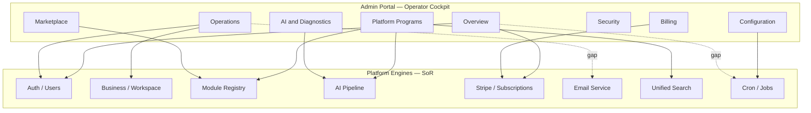

# Admin Portal — Operational Model

**Program:** Admin Portal Reference Program — Operational Excellence Phase 0A  
**Date:** 2026-07-05  
**Status:** Discovery — defines how Vssyl should be operated through the portal

**Related:** [Reference Assessment](./ADMIN_PORTAL_REFERENCE_ASSESSMENT.md) · [Capability Matrix](./ADMIN_PORTAL_CAPABILITY_MATRIX.md) · [Information Architecture](./ADMIN_PORTAL_INFORMATION_ARCHITECTURE.md)

---

## 1. Purpose

This document defines the **operational model** for running Vssyl as a SaaS platform through the Admin Portal (`/admin-portal`). It answers: who operates what, through which surfaces, and what must be consolidated so operators never need GCP console, raw SQL, or scattered satellite routes for routine work.

**Principle:** Admin Portal is the **operator system of engagement**. Domain engines remain systems of record. No parallel operator consoles.

---

## 2. Operator personas

| Persona | Primary goals | Portal home today | Gaps |
|---------|---------------|-------------------|------|
| **Founder** | Revenue, growth, risk | Dashboard → Analytics → Billing | Product funnel analytics; CS health |
| **Operations Manager** | Uptime, incidents, config | System → Performance → System Logs | Cloud Run/SQL visibility; job monitor |
| **Customer Success** | Account health, adoption | Platform Adoption → Impersonation | No business CRM; no invite pipeline view |
| **Platform Administrator** | Users, permissions, flags | Users → Security → Overrides | Feature flags UI; Policy Engine admin |
| **Support Engineer** | Tickets, user issues | Support → Impersonation → Users | Email delivery diagnostics |
| **DevOps** | Deploys, migrations, health | System → System Logs | Release visibility; `/api/health` panel |
| **Finance** | MRR, payouts, Stripe | Billing → Pricing → Analytics | Business-level revenue rollup |
| **Security** | Events, audit, compliance | Security → Governance → AI Pipeline audit | Provider key rotation workflow (external) |

All personas share one entry: **`/admin-portal/dashboard`** with role-agnostic `ADMIN` gate (no sub-roles yet).

---

## 3. Operational domains

### 3.1 Domain map

### 3.2 Domain ownership rules

| Rule | Detail |
|------|--------|
| **Single operator path** | Each capability has one canonical portal destination |
| **Probe ≠ product** | Marketplace probes live on Modules; aggregate status on Platform Programs |
| **Satellite sunset** | New operator features mount on `/api/admin-portal`, not new `/api/admin/*` prefixes |
| **Customer vs operator** | Customer billing at `/billing` (product); operator billing at `/admin-portal/billing` |
| **Module interior analytics** | HR/Chat analytics stay in modules; operator rollups in Platform Analytics |
| **Dangerous ops** | Migration delete/reset only via System Admin with env gate + confirm token |

---

## 4. Daily operator workflows

### 4.1 Morning health check (Operations Manager / DevOps)

| Step | Surface | Status |
|------|---------|--------|
| 1. Open Platform Overview | `/admin-portal/dashboard` | ✅ |
| 2. Check Platform Programs health cards | `/admin-portal/platform-programs` | ✅ |
| 3. Review performance alerts | `/admin-portal/performance` | ⚠️ Partial synthetic |
| 4. Scan application logs | `/admin-portal/system-logs` | ✅ |
| 5. Verify API health | `/api/health` | ❌ Not in portal UI |
| 6. Check cron job last-run | — | ❌ Missing |

**Target:** Steps 5–6 consolidated into Dashboard or System Admin (see Modernization Plan).

### 4.2 Customer incident (Support Engineer)

| Step | Surface | Status |
|------|---------|--------|
| 1. Find user | `/admin-portal/users` | ✅ |
| 2. Open support ticket | `/admin-portal/support` | ✅ |
| 3. Impersonate for repro | `/admin-portal/impersonate` | ✅ |
| 4. Check AI trace if AI-related | `/admin-portal/ai-pipeline/diagnostics` | ✅ |
| 5. Verify email delivery | — | ❌ Missing |
| 6. Check subscription state | `/admin-portal/billing` | ✅ |

### 4.3 Module certification (Platform Administrator)

| Step | Surface | Status |
|------|---------|--------|
| 1. Review submission queue | `/admin-portal/modules` | ✅ |
| 2. Run certification validator | Submission modal | ✅ |
| 3. Run marketplace readiness probes | Readiness card | ✅ (weak result UX) |
| 4. Review AI context providers | Modules AI Context tab | ✅ |
| 5. Approve / promote version | Submission actions | ✅ |
| 6. View adoption post-launch | `/admin-portal/platform-adoption` | ✅ |

### 4.4 Revenue review (Finance / Founder)

| Step | Surface | Status |
|------|---------|--------|
| 1. Platform analytics overview | `/admin-portal/analytics` | ✅ |
| 2. Stripe subscription sync | `/admin-portal/billing` | ✅ |
| 3. Developer payouts | Billing payouts tab | ✅ |
| 4. Pricing changes | `/admin-portal/pricing` | ✅ |
| 5. Business-level MRR rollup | — | ❌ Missing |
| 6. Export custom report | Analytics export | ✅ |

### 4.5 AI incident (Platform Administrator)

| Step | Surface | Status |
|------|---------|--------|
| 1. Pipeline health hub | `/admin-portal/ai-pipeline` | ✅ |
| 2. Provider governance | AI Pipeline #provider-governance | ✅ |
| 3. Trace forensics | diagnostics | ✅ |
| 4. Test lab dry-run | test-lab | ✅ |
| 5. Policy audit | audit | ✅ |
| 6. Provider cost review | ProviderUsageView | ✅ |

---

## 5. Operational coverage matrix

| Operational need | Required for controlled beta | Portal support | Elsewhere |
|------------------|------------------------------|----------------|-----------|
| Platform health | Yes | Partial | `/api/health`, GCP console |
| Cloud Run / Cloud SQL | Yes | Missing | GCP console |
| Storage (GCS) | Medium | Missing | GCP console |
| AI providers | Yes | Complete | Secret Manager for keys |
| Email delivery | Yes | Missing | SMTP smoke tests, scripts |
| Stripe / subscriptions | Yes | Complete | Stripe Dashboard links |
| Businesses | Yes | Partial | Impersonation list only |
| Users / permissions | Yes | Complete | — |
| Marketplace | Yes | Complete | — |
| Module applications | Yes | Complete | `/admin-portal/modules` |
| Billing / payouts | Yes | Complete | — |
| Support tickets | Yes | Complete | — |
| Feature flags | Medium | Missing | Env vars |
| Release management | Medium | Missing | Cloud Build, GitHub |
| Logs | Yes | Complete | Cloud Run logs export |
| Background jobs | Medium | Missing | `platformCronJobs.ts` |
| Operator analytics | Yes | Complete | — |
| Product funnel analytics | Medium | Missing | — |
| Security / compliance | Yes | Complete | — |
| Configuration | Yes | Complete | — |
| Notifications admin | Low | Missing | Code metadata only |

---

## 6. Consolidation recommendations

Capabilities that exist **outside** the portal should migrate **into** existing sections — not new parallel systems.

| Capability today | Current location | Target portal home |
|------------------|------------------|-------------------|
| Email test send | `/api/email-notification` | Configuration → **Email Operations** (new subsection on system or support) |
| Health probes | `/api/health`, `/api/ready`, `/api/live` | Dashboard health strip or System Admin panel |
| AI provider usage | `/api/admin/ai-providers` satellite | Already linked; migrate API to canonical prefix |
| Admin overrides | `/api/admin-override` satellite | Overrides page (exists); migrate API |
| Module AI context admin | `/api/admin/modules/ai` satellite | Modules AI Context tab (exists) |
| Cron jobs | `server/src/jobs/platformCronJobs.ts` | Configuration → **Jobs** panel |
| Feature flags | Env + registry code | Configuration → read-only **Flags** snapshot |
| Business list/detail | Impersonation + `/api/business` | Operations → **Businesses** hub |
| Public `/status` | Static page | Feed from same health panel (customer surface separate) |

---

## 7. What must NOT move into Admin Portal

| Surface | Reason |
|---------|--------|
| Business HR admin (`/business/[id]/admin/hr`) | Tenant-scoped business operations |
| Developer self-service portal | Partner-facing; not operator |
| Customer billing UI (`/billing` product) | End-user commercial surface |
| Module interior analytics (HR attendance, etc.) | Domain-owned; operator gets rollups only |
| GCP infrastructure provisioning | Stay in IaC / console; portal shows status links only |

---

## 8. Role model (current and recommended)

### 8.1 Current

| Role | Scope | Enforcement |
|------|-------|-------------|
| `ADMIN` | Full portal + all `/api/admin-portal/*` | JWT + `requireAdmin` |
| Non-admin | Forbidden | Middleware + layout redirect |

### 8.2 Recommended (modernization — no immediate implementation)

| Role | Scope | Rationale |
|------|-------|-----------|
| `ADMIN` | Full portal | Unchanged |
| `SUPPORT` (future) | Users, support, impersonation (read-only billing) | Reduce founder bottleneck |
| `FINANCE` (future) | Billing, pricing, analytics export | Segregation of duties |

**Note:** Sub-roles are **not implemented**. All operators today use platform `ADMIN`. Document as future hardening, not Phase 0A blocker.

---

## 9. Success criteria for operational model

| Criterion | Target | Today |
|-----------|--------|-------|
| Routine ops without GCP console | 90% of tasks | ~70% |
| Single nav for certified programs | Yes | ✅ Platform Programs |
| No duplicate governance UIs | Yes | ⚠️ BI/analytics overlap |
| Incident → resolution in portal | Yes | ⚠️ Email gap |
| Certification E2E in portal | Yes | ✅ |
| Billing ops without Stripe Dashboard | Partial | ✅ Sync; disputes need Stripe |

---

## 10. Operating principles (preserve)

1. **Control plane ≠ product module** — never register `admin` in marketplace.
2. **Authorize before execute** — portal never bypasses backend authZ.
3. **Consolidate satellites** — document first, migrate handlers incrementally.
4. **Reuse shells** — `AdminPortalPageShell`, `PipelineSubpageShell`, `PlatformProgramCard`.
5. **Debug stays gated** — `ADMIN_PORTAL_DEBUG_ENABLED` for labs and seed tools.

---

**Last updated:** 2026-07-05
