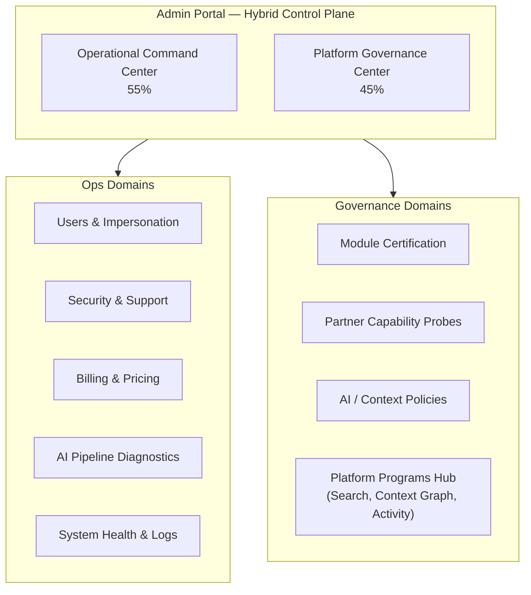

# Admin Portal — Strategic Positioning

**Program:** Admin Portal Program — Phase 0A  
**Date:** 2026-06-24  
**Status:** Discovery and recommendation only — **no implementation**

**Related:** [Executive Summary](./ADMIN_PORTAL_PHASE_0A_EXECUTIVE_SUMMARY.md) · [Reality Assessment](./ADMIN_PORTAL_REALITY_ASSESSMENT.md) · [Capability Matrix](./ADMIN_PORTAL_CAPABILITY_MATRIX.md)

---

## 1. Strategic question

**What should the Admin Portal become?**

| Option | Description |
|--------|-------------|
| **A. System Settings** | Configuration-only surface for toggles, env, and static platform settings |
| **B. Platform Governance Center** | Certification, policy, module lifecycle, partner capability governance |
| **C. Operational Command Center** | Day-to-day ops — users, billing, diagnostics, incidents, impersonation, health |
| **D. Hybrid** | Combined governance + operations with clear IA domains |

---

## 2. Current state vs options

| Option | What exists today | Fit score |
|--------|-------------------|-----------|
| **A. System Settings** | system, pricing, retention, governance pages | **~25%** — far exceeds settings scope |
| **B. Platform Governance Center** | modules certification, probes, AI pipeline policies, developer oversight | **~75%** — strong but missing cross-program federation |
| **C. Operational Command Center** | users, billing, support, security, impersonation, diagnostics | **~80%** — strongest today |
| **D. Hybrid** | Full portal spans B + C with AI Pipeline as reference subdomain | **~85%** — accurate description of reality |

**Conclusion:** Admin Portal **already is Option D (Hybrid)** in implementation. The strategic work is to **make the hybrid intentional in IA and architecture**, not to pick a single narrow identity.

---

## 3. Recommendation

# **D — Hybrid (Platform Governance Center + Operational Command Center)**

With explicit sub-identity weighting:

| Sub-identity | Weight | Rationale |
|--------------|--------|-----------|
| **Operational Command Center** | **55%** | Primary daily use: users, incidents, billing, AI traces, support |
| **Platform Governance Center** | **45%** | Growing mandate: module certification, marketplace probes, policy editing |
| **System Settings** | **≤10%** | Absorbed into Platform section — not a standalone product identity |

### 3.1 Why not A alone

Admin Portal already governs module certification, marketplace delegate probes, AI pipeline policies, and Stripe commercial ops. Reducing to "settings" would **misrepresent** platform investment and **fragment** operator workflows.

### 3.2 Why not B alone

Operators need impersonation, support tickets, billing sync, security events, and live diagnostics — these are **operational**, not governance-only. File Hub and module teams do not replace this.

### 3.3 Why not C alone

With Marketplace Partner Capability, Unified Search delegates, Context Graph instrumentation, and AI Retrieval governance, the portal **must** remain the certification and probe authority. Pure ops center would recreate governance UI in product modules (forbidden by module contract).

### 3.4 Why Hybrid is correct

The June 2026 control-plane classification remains accurate:

> **Hybrid — Platform Control Plane + Platform Governance Surface**

Phase 0A adds: after major platform program completion, the Hybrid must expose a **Platform Programs federation layer** so operators do not hunt across orphan pages and satellite APIs.

---

## 4. Target identity (12-month planning horizon)

---

## 5. IA principles (recommended)

1. **One canonical home per governance function** — no parallel UI under `/modules/admin` or product modules.
2. **Hub pattern for satellites** — AI System launcher is correct; replicate for Platform Programs.
3. **Sidebar reflects daily ops; hubs reflect depth** — avoid 30+ sidebar items.
4. **Probes and certification adjacent** — marketplace readiness stays on module submission flow.
5. **Debug surfaces never in default nav** — env-gated Admin Labs only.
6. **Satellite APIs migrate behind canonical prefix** — reduce client and operator cognitive load.

---

## 6. Relationship to other platform surfaces

| Surface | Relationship to Admin Portal |
|---------|------------------------------|
| Business workspace admin (`/business/[id]/admin/*`) | **Tenant-scoped** HR/scheduling — not platform portal |
| User `/modules` marketplace | **Product browse/install** — portal governs, does not replace |
| AI Pipeline runtime | **Engine** — portal operates, does not execute user AI |
| Unified Search | **Engine** — portal probes delegates, does not index |
| Certification Ledger | **Governance record** — portal is subject and operator tool |

---

## 7. Success criteria (Hybrid maturity)

| Criterion | Current | Target |
|-----------|---------|--------|
| Operator can certify partner module without leaving portal | ✅ | Maintain |
| Operator can diagnose AI retrieval failure end-to-end | ✅ | Maintain |
| Operator can see Search/Context Graph/Marketplace pilot status in one hub | ❌ | **Build** |
| All admin mutations on canonical API prefix | ❌ | **≥90% migrated** |
| Zero mock fallbacks on governance paths | ✅ | Maintain |
| Recertification wave after each major platform program | Partial | **Formalized** |

---

## 8. Anti-patterns to avoid

| Anti-pattern | Why harmful |
|--------------|-------------|
| Register Admin Portal as installable module | Breaks module contract; duplicates workspace |
| Duplicate certification UI in product modules | Drift vs canonical gate |
| Scatter Search/Context governance across debug routes | Operators miss production issues |
| Expand sidebar unbounded | IA collapse — use hubs |
| Treat portal as "just settings" | Under-invest in governance workflows |

---

## 9. Final recommendation

**Adopt Option D (Hybrid)** explicitly in product and architecture docs. Prioritize **Platform Programs hub** as the highest-value next UX/architecture increment to unify governance visibility without collapsing ops and cert into a single undifferentiated dashboard.

**Do not reclassify as System Settings (A).**  
**Do not split into two separate apps** — fragmentation would harm the operator model.

---

**Last updated:** 2026-06-24 (Phase 0A discovery)
