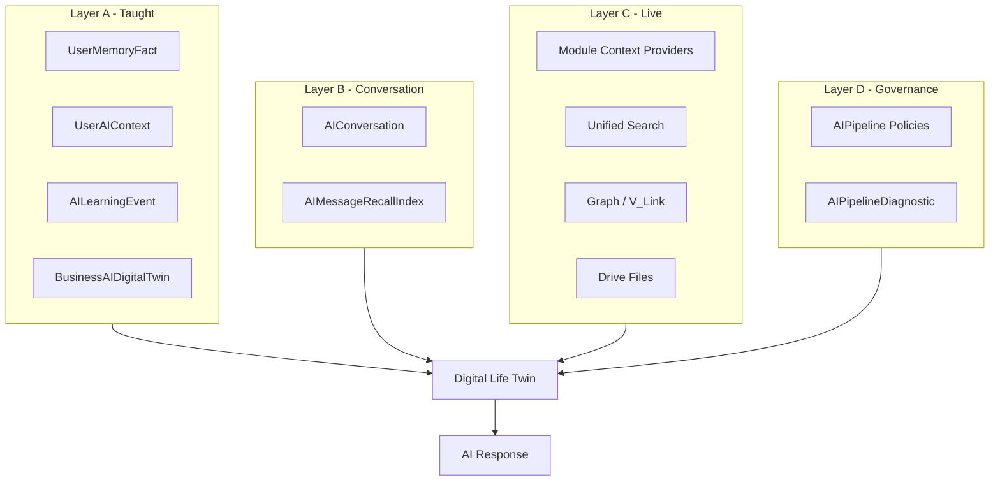

# AI Knowledge Architecture

**Program:** AI Knowledge Reference Program — Phase 0A  
**Date:** 2026-07-05  
**Status:** Descriptive model of **existing** architecture — not a redesign proposal

---

## 1. Principle

Vssyl AI knowledge is **assembled per turn**, not retrieved from a single knowledge base. The architecture is **largely correct**. Phase 0A defines how to **organize product language** around what already exists.

```
┌─────────────────────────────────────────────────────────────────┐
│                     USER / OPERATOR SURFACES                     │
│  /ai (Teach & Review)   /ai-chat (Use)   /admin-portal/ai-*   │
└───────────────────────────────┬─────────────────────────────────┘
                                │
┌───────────────────────────────▼─────────────────────────────────┐
│                  DIGITAL LIFE TWIN (per turn)                    │
│  DigitalLifeTwinService → DigitalLifeTwinCore → Providers        │
└───────────────────────────────┬─────────────────────────────────┘
                                │
        ┌───────────────────────┼───────────────────────┐
        ▼                       ▼                       ▼
┌───────────────┐     ┌─────────────────┐     ┌──────────────────┐
│   TAUGHT      │     │    LIVE DATA    │     │   GOVERNANCE     │
│   KNOWLEDGE   │     │   (providers)   │     │  (pipeline ops)  │
└───────────────┘     └─────────────────┘     └──────────────────┘
```

---

## 2. Knowledge layers (existing)

### Layer A — Taught knowledge (user/business intent)

What users and admins **explicitly or implicitly** want the AI to remember or follow.

| Component | Storage | Lifetime | Scope |
|-----------|---------|----------|-------|
| User memory facts | `UserMemoryFact` | Until trashed/expired | personal / business / household |
| User AI context | `UserAIContext` | Until deleted; inferred needs promotion | personal / business / module scopes |
| Learning events | `AILearningEvent`, `BusinessAILearningEvent` | Until reviewed/archived | user / business |
| Personality & autonomy | `AIPersonalityProfile`, `AIAutonomySettings` | Persistent | user |
| Business twin config | `BusinessAIDigitalTwin`, `Business.aiSettings` | Persistent | business |
| Session preferences | session store | Session; optional promote | user session |

**Product label (proposed):** *What you taught Vssyl*

### Layer B — Experiential knowledge (conversation-derived)

What emerges from **using** the product.

| Component | Storage | Lifetime | Scope |
|-----------|---------|----------|-------|
| Chat threads | `AIConversation`, `AIMessage` | Until archived/trashed | user (+ optional workspace) |
| Thread summaries/topics | JSON on `AIConversation` | Updated per thread | user |
| Recall index | `AIMessageRecallIndex` | Indexed per message | user |
| Turn analytics | `AIConversationHistory` | Retention per policy | user |
| Attachments | `AIMessage.attachments` + Drive `File` | Per message | user |

**Product label (proposed):** *Conversation context* (not user-editable as "facts" — distinct from Teach)

### Layer C — Live workspace knowledge (module SoR)

What modules **authoritatively** hold — edited in module UIs, fetched at query time.

| Component | Mechanism | Examples |
|-----------|-----------|----------|
| Context providers | `/api/{module}/ai/context/*` | Drive files, calendar events, tasks, chat threads |
| V_Link graph | `vlinkPipelineContextService`, graph adapters | Relationships between people, places, entities |
| Unified search | `aiRetrievalCapabilityService` | Query-native discovery across modules |
| File analysis | `fileAnalysisService` on attachments | Extracted text/OCR for current turn |

**Product label (proposed):** *Your workspace data* (already true in modules — not a teach surface)

### Layer D — Platform knowledge (operator/system)

What the **platform** defines — not taught by end users.

| Component | Storage | Audience |
|-----------|---------|----------|
| Module registry | `ModuleAIContextRegistry` | Platform + developers |
| Pipeline policies | `AIPipeline*Policy`, `AIPipelineSettings` | Platform operators |
| Static prompts | `server/src/ai/prompts/*` | Platform (code) |
| Global patterns | `GlobalLearningEvent`, `GlobalPattern` | Platform (consent-gated) |
| Diagnostics | `AIPipelineDiagnostic` | Operators |

**Product label (proposed):** *Platform rules* (visible to operators; invisible to users)

---

## 3. Assembly pipeline (unchanged)

Per turn, layers merge in `DigitalLifeTwinCore`:

1. **PreferenceResolver** — Layer A personality/preferences/learning
2. **MemoryRetrievalService** — Layer A memory facts (recall-biased)
3. **Conversation continuity** — Layer B same-thread + cross-thread summaries
4. **Recall service** — Layer B `AIMessageRecallIndex` (intent-gated)
5. **CrossModuleContextEngine** — Layer C providers + search + graph
6. **File attachments** — Layer C document extract
7. **Business policy overlay** — Layer A business when `businessId` set
8. **Pipeline grounding** — Layer D enforcement per intent
9. **AIContextAssembler** — tiered evidence blocks → provider prompt

Canonical docs: `docs/architecture/AI_TWIN_PROMPT_PIPELINE.md`, `docs/architecture/AI_CONTEXT_ASSEMBLY.md`.

---

## 4. Scoping model (existing)

| Context | Isolation keys |
|---------|----------------|
| Personal | `userId`, optional `dashboardId` |
| Business workspace | `userId` + `businessId` + `dashboardId` |
| Household | `householdId` (where applicable) |
| Module | `scope` + `scopeId` on `UserAIContext` |
| Operator | Global pipeline policies; per-trace diagnostics |

---

## 5. What we are NOT changing

| System | Status |
|--------|--------|
| Digital Life Twin entry (`/api/ai/twin`) | Keep |
| `UserMemoryFact` vs `UserAIContext` split | Keep (consolidate UX only) |
| Module context providers | Keep |
| `AIMessageRecallIndex` (lexical, not vector DB) | Keep |
| AI Pipeline policy tables | Keep |
| Context graph / knowledge composition services | Keep |
| V_Link as relationship SoR | Keep |

---

## 6. Consolidation opportunities (product only)

| Opportunity | Type | Notes |
|-------------|------|-------|
| Merge Memory + Custom Context tabs | UX | Same Layer A — one "Teach" surface |
| Label module data separately from taught facts | UX | Reduce "why doesn't Memory show my calendar?" |
| Surface `learningStatus: pending` as inbox | UX | Already exists — needs prominence |
| Operator "Knowledge Health" as diagnostics aggregate | Nav | No new datastore |
| Business `aiSettings` vs `BusinessAIDigitalTwin` | Data model review | Phase 2+ — document single SoR |

---

## 7. Relationship diagram



---

## 8. Architecture health

| Aspect | Assessment |
|--------|------------|
| Separation of taught vs live data | **Good** — distinct code paths |
| Tenant isolation | **Good** — enforced on providers and stores |
| Operator observability | **Good** — diagnostics + policies |
| User mental model | **Weak** — layers exist but UI doesn't mirror them |
| Duplicate stores | **Moderate** — Layer A triple store, business dual config |

**Architecture maturity: ~88%**  
**Knowledge product alignment to architecture: ~48%**
