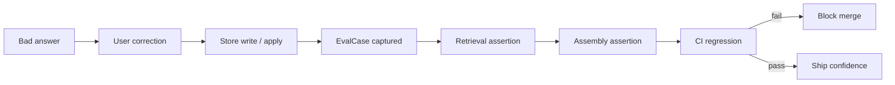

# AI Knowledge Eval Loop Specification

**Program:** AI Knowledge Reference Program — Phase 0B  
**Date:** 2026-07-05  
**Status:** Specification only — **do not build yet**

Defines the minimum evaluation loop required before Teach Vssyl ships, and the long-term eval maturity path.

---

## 1. Eval thesis

**Proving Vssyl improved** does not require model training evals. It requires proving:

1. The correction was **stored in the right place**
2. The Knowledge Engine **retrieves** it on relevant queries
3. The assembled context **includes** it at answer time
4. Future code changes **do not break** that path

LLM response quality judging is **optional and later** — deterministic retrieval proofs are **required**.

---

## 2. Canonical eval loop



**This is the minimum loop before Teach Vssyl v1.**

---

## 3. EvalCase definition (conceptual — no new table in Phase 1)

An **EvalCase** is a frozen test artifact:

| Field | Purpose |
|-------|---------|
| `id` | Stable identifier |
| `sourceCorrectionId` | Optional link to `AILearningEvent` |
| `taughtContent` | Expected fact/instruction text |
| `targetStore` | `UserMemoryFact` / `UserAIContext` |
| `probeQuery` | Query that should retrieve taught content |
| `scope` | personal / business |
| `expectedRetrieval` | Fact IDs or content substring in retrieval report |
| `expectedAssemblyBlock` | Block title or content substring in assembled context |
| `createdFrom` | `manual` / `correction_capture` / `test_lab_export` |

**Phase 1 storage:** Test fixture files in `server/src/ai/knowledge/__tests__/fixtures/evalCases/` — not production DB.

**Phase 2:** Optional `AIEvalCase` table — only if fixture volume justifies it. Audit does **not** require it for v1.

---

## 4. Minimum eval loop before Teach Vssyl ships

### Gate G1 — Retrieval proof (required)

**Test:** After teach/apply, `MemoryRetrievalService.retrieve({ query: probeQuery })` returns taught fact.

**File pattern:** `teachFactRetrieval.integration.test.ts`

**Assertions:**
- Fact in `result.facts` array
- `result.report` includes fact ID
- Scored above minimum threshold

### Gate G2 — Assembly proof (required)

**Test:** Mock or integration call through context assembly path includes taught content in appropriate block.

**Assertions:**
- Block title matches type ("User memory facts (saved by you)" for facts)
- Content contains taught substring

### Gate G3 — Routing proof (required)

**Test:** Correction router maps classifications to correct API/store.

**Cases:**
- Fact → UserMemoryFact
- Instruction → UserAIContext instruction
- Module entity → redirect, no DB write
- Ambiguous → AILearningEvent pending

### Gate G4 — Apply proof (required)

**Test:** `learningApplicationService.applyApprovedEvent` on correction event writes expected store.

**Exists:** `learningApplicationService.test.ts` — extend for teach scenarios.

### Gate G5 — CI enforcement (required)

All G1–G4 run on `pnpm test` in CI for AI knowledge path — fail blocks merge.

---

## 5. What is NOT required for v1 ship

| Eval type | Defer to |
|-----------|----------|
| Live LLM response grading | Phase 3 |
| Full E2E browser test | Phase 2 |
| Production trace sampling | Phase 2 |
| Business apply E2E | Phase 3 (with business parity) |
| EvalCase auto-capture from production | Phase 2 |

---

## 6. Bad answer → correction → test case flow

### Manual path (Phase 1)

1. QA documents bad answer scenario
2. Applies correction via API (simulating Teach Vssyl)
3. Author adds EvalCase fixture with probe query
4. CI runs retrieval + assembly assertions

### Semi-automated path (Phase 2)

1. User correction approved in product
2. Optional "Add to test suite" operator action in diagnostics
3. Exports EvalCase fixture via admin tool

### Automated path (Phase 3)

1. High-confidence corrections auto-suggest EvalCase
2. Operator approves fixture addition
3. Nightly full eval run including optional LLM judge

---

## 7. Eval layers

| Layer | What it tests | Tooling |
|-------|---------------|---------|
| **L0 — Unit** | Router rules, apply service, scoring | Jest |
| **L1 — Integration** | Retrieval + assembly with test DB | Jest + Prisma test |
| **L2 — Pipeline** | Grounding, orchestrator, trace shape | Existing pipeline tests |
| **L3 — HTTP** | Admin pipeline routes | Existing coverage tests |
| **L4 — EvalCase** | Teach loop end-to-end deterministic | New fixtures |
| **L5 — LLM judge** | Response quality vs rubric | Test lab + optional API |

**Teach Vssyl ship gate:** L0 + L1 (teach path) + L4 minimum set.

---

## 8. Regression protection strategy

| Change type | Regression guard |
|-------------|------------------|
| MemoryRetrievalService scoring change | EvalCase retrieval assertions |
| AIContextAssembler block order/titles | Assembly assertions |
| learningApplicationService routing | Apply unit tests |
| Pipeline grounding change | Existing grounding tests + teach EvalCases unaffected |
| Provider prompt change | Optional LLM judge (later) |

**Rule:** Any PR touching `MemoryRetrievalService`, `AIContextAssembler`, `learningApplicationService`, or correction routes must run teach EvalCase suite.

---

## 9. Metrics (production — post-ship)

| Metric | Formula | Purpose |
|--------|---------|---------|
| Correction apply rate | applied / submitted | Routing health |
| Retrieval hit rate | turns with taught fact retrieved / turns with teach | Engine effectiveness |
| Repeat bad answer rate | same topic corrections within 7d | Product outcome |
| EvalCase CI pass rate | pass / total | Engineering health |
| Pending review age | median time to approve | Governance friction |

**Surface for operators:** Pipeline quality dashboard extension (Phase 3) — aggregate only, no PII.

---

## 10. Comparison to frontier eval patterns

| Pattern | OpenAI / Anthropic practice | Vssyl adaptation |
|---------|----------------------------|----------------|
| Eval datasets | Curated prompt/response pairs | EvalCase fixtures from real corrections |
| Automated grading | Model grader or rule-based | L4 rule-based retrieval; L5 optional LLM judge |
| CI gate | Eval pass before deploy | G1–G5 Jest gates |
| Human feedback flywheel | RLHF | Context update via teach — not weight update |

**References:**
- [OpenAI Evals guide](https://platform.openai.com/docs/guides/evals) — dataset + grader pattern adapted to retrieval assertions
- Vssyl constitutional position: `docs/ai/retrieval/AI_RETRIEVAL_CONSTITUTION.md` — prove retrieval, don't duplicate SoR

---

## 11. Test file plan (implementation phase — not built in 0B)

```
server/src/ai/knowledge/__tests__/
  correctionRouting.test.ts          # G3
  teachFactRetrieval.integration.test.ts  # G1
  teachAssembly.integration.test.ts       # G2
  fixtures/evalCases/
    personalFactCorrection.json
    instructionCorrection.json
    moduleRedirect.json
```

---

## 12. Related documents

- `docs/ai-knowledge/deep-dive/AI_EVALS_AND_REGRESSION_AUDIT.md` — current test inventory
- [KNOWLEDGE_LIFECYCLE.md](./KNOWLEDGE_LIFECYCLE.md) — Evaluation + Regression stages
- [TEACH_VSSYL_PRODUCT_SPEC.md](./TEACH_VSSYL_PRODUCT_SPEC.md) — success metrics
