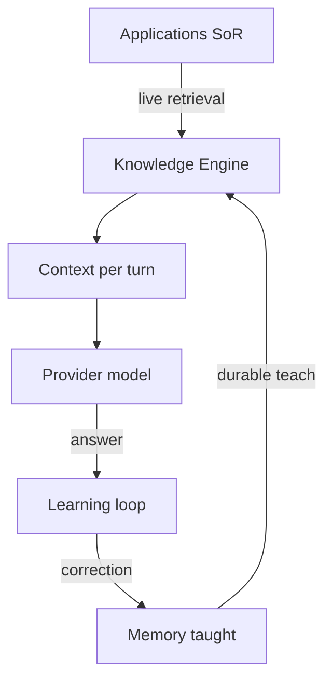

# AI Knowledge Glossary

**Version:** 1.0.0  
**Status:** Active — canonical terms for [AI_KNOWLEDGE_CONSTITUTION.md](./AI_KNOWLEDGE_CONSTITUTION.md)  
**Date:** 2026-07-05

Definitions are **philosophical and product-level**. Storage names (e.g. `UserMemoryFact`) appear only as examples — see [KNOWLEDGE_TYPE_TO_STORE_MATRIX.md](./KNOWLEDGE_TYPE_TO_STORE_MATRIX.md) for mapping.

---

## A–C

### Application

A Vssyl module or product surface that owns domain data and user workflows: Drive, Chat, Calendar, Tasks, Notes, V_Link, HR, Scheduling, Business workspace, Analytics, Marketplace modules, and future Applications.

Applications are **Systems of Record** for their entities.

### Answer

The AI-generated response to a user query in a given turn, plus metadata (explainability, optional actions, diagnostics). An answer is the output of Reasoning and Provider layers — not a store of knowledge.

### Business Digital Twin

The business-scoped AI orchestration path. Applies business voice, restrictions, and policy when a user interacts in a business workspace. Does not replace business admins as owners of business knowledge.

### Business knowledge

Intelligence scoped to an organization: policies, approved norms, business-scoped preferences, twin configuration. Owned and governed by **business admins**. Separate from any individual user's personal knowledge.

### Classification

The stage of the knowledge lifecycle that determines **what type** of knowledge a correction or observation represents (fact, preference, instruction, business rule, Application redirect, temporary context). Routes to the correct store or redirect.

### Context

Everything assembled for **one AI turn**: taught memory, live Application snapshots, conversation continuity, attachments, business policy overlay, platform rules. Context is **ephemeral per turn** — assembled, not a permanent duplicate of Application data.

**Not the same as:** Memory (durable taught knowledge) or Context providers (live read mechanisms).

### Correction

A signal that an AI answer was wrong, accompanied by what should be true instead. Corrections enter the governed learning path: classification → review (if needed) → application → evaluation.

### Context Assembly

The layer that merges retrieved knowledge into a bounded, tiered bundle for the model. Prefers explicit teaching and conversation continuity over unfocused breadth.

### Context Provider

An authorized read endpoint from an Application that returns a **live snapshot** of module data for AI retrieval (e.g. recent files, upcoming events). Providers **fetch**; they do not **store** taught knowledge.

---

## D–K

### Digital Life Twin

The personal AI orchestration path. Composes personal taught knowledge, authorized Application data, and preferences for the individual user. Canonical entry: user chat and Control Center.

### Evaluation

Proof that teaching or correction worked: taught content is stored correctly, retrieved on relevant queries, and included in assembly. Required before scaling Teach Vssyl. Not the same as user satisfaction alone.

### Explainability

The obligation to show **what influenced an answer**.

| Audience | Form |
|----------|------|
| User | Plain-language influence summary (memory, preferences, sources used) |
| Operator | Diagnostic trace (intents, grounding, retrieval attempts) |

Explainability is a constitutional requirement (P7), not optional debug.

### Feedback

User or operator reaction to an answer: teach, improve, thumbs, regenerate, dismiss inference, operator trace review. Feedback feeds the learning loop; not all feedback becomes memory.

### Fact

A stable declarative statement: "I work at Acme," "My team is Platform." Facts are taught knowledge — not Application entity records (those live in SoR).

### Governance

Rules for who may create, review, apply, and delete knowledge at each tier: user (personal), business admin (business), operator (platform).

### Inference

Knowledge **proposed** by the system from observation (e.g. chat patterns) without explicit user teach. Inference must be **reviewable** before it influences answers.

### Knowledge

Anything that may influence an AI answer:

- **Taught** — memory, preferences, instructions, approved learning  
- **Live** — Application retrieval, attachments, search  
- **Experiential** — conversation summaries, recall (with consent and scope)  
- **Platform** — pipeline policies, grounding rules (operator-governed)

### Knowledge Engine

The **emergent, governed composition** of existing Vssyl components that retrieve, scope, assemble, explain, and improve knowledge across turns. Not a standalone database, microservice, or knowledge graph product.

**Composed of (including but not limited to):** Digital Life Twin, Business Digital Twin, context orchestration, memory services, V_Link retrieval, search, pipeline policies, diagnostics.

### Knowledge Health

A user-facing view of taught knowledge quality: pending review, conflicts, staleness, coverage gaps — not operator pipeline metrics.

### Learning

The governed process of converting observation or correction into **prompt-eligible** knowledge. Learning includes review gates and application — not silent model updates.

---

## M–P

### Memory

**Durable taught knowledge** the user or admin chose to retain: facts, preferences, instructions, procedures. Memory is what Teach Vssyl primarily writes.

**Not:** Live Application data, full chat logs as default memory, or pipeline policies.

### Observation

The system noticing a learnable signal (chat pattern, repeated behavior, module interaction). Observation creates **proposals** — not automatic memory.

### Organizational Intelligence

The composed understanding of a person, team, or business **across Applications** — authorized, scoped, explainable, and improvable through teaching. Vssyl's distinguishing capability versus a general-purpose LLM.

Vssyl provides organizational intelligence; providers supply reasoning models.

### Personal knowledge

Taught and experiential knowledge scoped to an individual user. Owned by the user. Never visible to other users except through explicit shared workspace mechanisms governed elsewhere.

### Policy

A rule constraining AI behavior — especially **business policy** (company norms, restrictions) and **platform policy** (intents, grounding, tools). Policies are governance-tier owned; users teach **instructions** for personal scope, not global platform policy.

### Preference

How the user or business wants AI to communicate or prioritize: tone, verbosity, format. Preferences are taught knowledge — distinct from facts about the world.

### Procedure

A multi-step habitual workflow the user wants AI to follow repeatedly. A type of taught knowledge (workflow/instruction family).

### Provider

The external language model service (OpenAI, Anthropic, local) that generates text and vision responses from assembled context. **Replaceable.** Does not store organizational knowledge.

---

## R–T

### Reasoning

Two-part concept:

1. **Vssyl reasoning** — Intent detection, conversation continuity, cross-module synthesis, tool policy, assembly — before and after the model call.  
2. **Model reasoning** — The provider model's internal generation from the prompt.

Constitutional discussions of "reasoning" usually mean **both**, with Vssyl responsible for everything **around** the model call.

### Regression protection

Automated tests (EvalCases) that ensure future code changes do not break proven teach → retrieve → assemble paths. Required constitutional companion to Evaluation.

### Retrieval

Authorized fetch of knowledge for a turn: memory scoring, context provider calls, search, graph traversal, grounding prepass. Retrieval **always respects permissions** (P12).

### Review

Human gate before inferred or ambiguous knowledge becomes prompt-eligible. Reviewers: user (personal), business admin (business), operator (platform policy only — not user facts).

### System of Record (SoR)

The Application or module that **authoritatively owns** an entity and its edits. Calendar owns events. Drive owns files. HR owns employee records. The Knowledge Engine **reads** SoR; it does not **become** SoR.

### Teach Vssyl

The product expression of governed teaching: users and admins add or correct organizational intelligence in plain language. Implementation (APIs, stores, routing) is hidden behind facts, preferences, rules, and Application redirects.

**Capabilities:** Teach Vssyl, Improve Answer, What Vssyl Knows, Why Vssyl Answered This, Knowledge Health.

### Teaching

The **deliberate** act of adding or correcting governed knowledge — explicit, reviewable, and scoped. Distinguished from observation (system-proposed) and from editing Application data (SoR).

### Temporary context

Knowledge valid for a session or thread only — not promoted to cross-session memory without explicit teach. Examples: session tone override, thread-local notes (future).

---

## Related terms (operator / engineering)

| Term | See |
|------|-----|
| Grounding | [AI_EXPLAINABILITY_AND_GROUNDING_AUDIT.md](./deep-dive/AI_EXPLAINABILITY_AND_GROUNDING_AUDIT.md) |
| Pipeline trace | AI Pipeline diagnostics — operator explainability |
| EvalCase | [AI_KNOWLEDGE_EVAL_LOOP_SPEC.md](./AI_KNOWLEDGE_EVAL_LOOP_SPEC.md) |
| responseInfluence | User explainability metadata |
| Module AI registry | Platform catalog of context providers — not user knowledge |

---

## Term relationships

---

## Related documents

- [AI_KNOWLEDGE_CONSTITUTION.md](./AI_KNOWLEDGE_CONSTITUTION.md)  
- [AI_KNOWLEDGE_PRINCIPLES.md](./AI_KNOWLEDGE_PRINCIPLES.md)  
- [KNOWLEDGE_TYPE_TO_STORE_MATRIX.md](./KNOWLEDGE_TYPE_TO_STORE_MATRIX.md)
