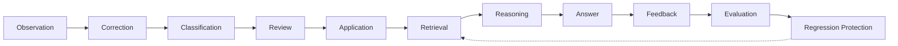

# Knowledge Lifecycle

**Program:** AI Knowledge Reference Program — Phase 0B  
**Date:** 2026-07-05  
**Status:** Canonical lifecycle specification

Defines how information moves from Vssyl Applications and user interaction into governed knowledge that influences future AI answers.

---

## 1. Lifecycle overview



Each stage maps to **existing components**. No new engine service is required.

---

## 2. Stage definitions

### Observation

**What happens:** Vssyl detects learnable signals from normal product use.

| Source | Mechanism | Store / output |
|--------|-----------|----------------|
| Chat turn completed | `factExtractionService` | Pending `UserAIContext` |
| User says "remember that" | `maybePersistRememberThatFact` | `UserMemoryFact` (explicit) |
| Module interaction | `AdvancedLearningEngine` | `AILearningEvent` |
| Ambient suggestion pattern | Suggestion accept flow | Pending preference proposal |
| Application data change | Module SoR update | Live provider fetch (not taught) |
| Operator test lab query | Admin dry-run | Diagnostic trace only |

**Governance:** Inferred observations default to **review required** (`learningStatus: pending`).

**Not observation:** Pipeline policy changes (operator action, not learning).

---

### Correction

**What happens:** User or admin identifies wrong AI behavior and initiates a fix.

| Trigger | Surface (planned) | Current state |
|---------|-------------------|---------------|
| Bad answer in chat | Teach Vssyl / Improve Answer | Not shipped |
| Explain drawer | "Correct this" CTA | Not shipped |
| Memory tab direct edit | CRUD | Shipped |
| Learning tab review | Approve/dismiss | Shipped |
| Operator diagnostic | Flag for support (manual) | Partial |
| Business admin | Business AI learning review | Partial apply |

**Output:** Classification input + correction payload + optional link to source turn (`conversationId`, `messageId`, `traceId` for operators).

---

### Classification

**What happens:** Route correction to the correct knowledge type and store.

| User-facing chip | Knowledge type | Primary store |
|------------------|----------------|---------------|
| A fact about me | Fact | `UserMemoryFact` |
| A preference | Preference | `UserAIContext` (preference) |
| A rule | Instruction | `UserAIContext` (instruction) |
| About my company | Business rule / policy | `BusinessAIDigitalTwin` or business-scoped context |
| About a file/event | Application object | **Redirect** — module SoR |
| Just this conversation | Temporary context | Session/thread metadata (Phase 2) |

**Classifier v1:** Rule-based on keywords + user chip override — not LLM classification.

See [AI_CORRECTION_ROUTING_SPEC.md](./AI_CORRECTION_ROUTING_SPEC.md).

---

### Review

**What happens:** Human gate before prompt-eligible application.

| Knowledge path | Reviewer | Gate field |
|----------------|----------|------------|
| Explicit user teach (fact/context API) | None — immediate | N/A |
| Inferred chat context | User | `UserAIContext.learningStatus` |
| Learning event (correction, preference) | User | `AILearningEvent` approve/dismiss |
| Business learning event | Business admin | `BusinessAILearningEvent.approved` |
| Behavioral signal (stars, thumbs analytics) | None | Not prompt-eligible by default |
| Pipeline policy change | Platform operator | Audit log |

**Principle:** **Explicit beats inferred.** Inferred always review; explicit teach auto-applies unless business scope requires admin.

---

### Application

**What happens:** Approved knowledge becomes prompt-eligible.

| Store | Application service | Effect |
|-------|---------------------|--------|
| `UserMemoryFact` | Direct write or `learningApplicationService` | Retrieved by `MemoryRetrievalService` |
| `UserAIContext` | Promote to `learningStatus: active` | Loaded in twin + PreferenceResolver |
| `AILearningEvent` | `learningApplicationService.applyApprovedEvent` | Target store write + mark applied |
| `AIPersonalityProfile` | Learning apply or questionnaire | PreferenceResolver |
| `BusinessAIDigitalTwin` | Business admin config API | Business policy block |
| `BusinessAILearningEvent` | **Gap:** needs apply parity | Flags only today |

**Never application targets:** Pipeline policies from user correction; module entity attributes into memory.

---

### Retrieval

**What happens:** On each new query, engine gathers relevant knowledge.

| Lane | Service | Priority |
|------|---------|----------|
| Taught memory | `MemoryRetrievalService` | Scored by query relevance |
| Active context | `PreferenceResolver`, twin context load | High for preferences/instructions |
| Pipeline grounding | `pipelineGroundingRetrieval` | Required sources first |
| Live Applications | `ContextProviderOrchestrator` | Intent-matched providers |
| V_Link / graph | `vlinkPipelineContextService` | Relationship intents |
| Search | `aiRetrievalCapabilityService` | Search-aligned intents |
| Conversation | History, summaries, recall index | Continuity + explicit recall |
| Attachments | `fileAnalysisService` | Current turn only |

**Conflict policy:** Module SoR beats stale memory for entity attributes; explicit taught beats inferred; business policy beats personal in business context.

---

### Reasoning

**What happens:** Twin prepares provider request with assembled context.

| Step | Component |
|------|-----------|
| Intent detection | Pipeline catalog + query analysis |
| Context assembly | `AIContextAssembler` with tiering |
| Conversation reasoning | `conversationReasoningLayer` |
| Cross-module synthesis | `ContextSynthesisService`, entity linking |
| Tool selection | Pipeline tool policies + `toolExecutor` |
| Provider routing | `providerRouting`, user model prefs |

**LLM reasoning** occurs inside OpenAI/Anthropic — Vssyl reasoning is **context preparation and policy enforcement**.

---

### Answer

**What happens:** Provider returns response; twin post-processes.

| Output | Consumer |
|--------|----------|
| Assistant message | Chat UI |
| `responseInfluence` | Explain drawer |
| `pipelineTrace` | Operator diagnostics |
| Structured actions | Action executor + approvals |
| Continuity metadata | Next turn thread hints |

---

### Feedback

**What happens:** User or operator reacts to the answer.

| Feedback type | Path | Changes knowledge? |
|---------------|------|-------------------|
| Teach / Improve Answer | Correction flow | Yes — if applied |
| Thumbs down | → reviewable learning event (planned) | After review |
| Explain drawer | Read-only today | No |
| Regenerate | New LLM call (planned signal) | No direct |
| Star rating | Behavioral signal | No (today) |
| Operator trace review | Diagnostics | No — observability |

---

### Evaluation

**What happens:** Measure whether teaching improved outcomes.

| Level | Method | Owner |
|-------|--------|-------|
| Retrieval proof | Assert fact in `MemoryRetrievalService` output | CI |
| Assembly proof | Assert block in assembled context | CI |
| Trace proof | Admin test lab + diagnostics | Operator |
| Response quality | Weak phrase stats, optional LLM judge | Operator |
| User satisfaction | Correction repeat rate, thumbs | Product analytics |

See [AI_KNOWLEDGE_EVAL_LOOP_SPEC.md](./AI_KNOWLEDGE_EVAL_LOOP_SPEC.md).

---

### Regression protection

**What happens:** Prevent teach loop breakage in future releases.

| Mechanism | Status |
|-----------|--------|
| Pipeline unit/integration tests (~68 AI test files) | Shipped |
| Admin pipeline handler coverage (45 routes) | Shipped |
| Teach → retrieval integration test | **Required before Teach Vssyl ship** |
| EvalCase golden queries from corrections | Phase 2 |
| LLM eval harness | Phase 3 optional |

**Minimum bar:** Approved correction → matching query → retrieval report includes taught content → CI fails if not.

---

## 3. Lifecycle by actor

### End user (personal)

```
Use Applications → Chat → (optional) Observation/inference → Review in Learning
Bad answer → Correction → Classify → Apply to memory/context → Next answer retrieves
```

### Business employee

```
Use business workspace → Employee AI → Business policy applied
Wrong about company → Correction → Business admin review → Apply (when parity built)
Wrong about personal fact → Personal teach path
```

### Business admin

```
Configure BusinessAIDigitalTwin → Business policy in every employee answer
Review BusinessAILearningEvent → Approve business-wide teach
Cannot edit pipeline policies
```

### Platform operator

```
Configure pipeline policies → Govern retrieval and tools
Inspect diagnostics → No user knowledge edit
Test lab → Validate engine behavior
```

---

## 4. Lifecycle timing

| Stage | Latency expectation |
|-------|---------------------|
| Observation → pending | Same turn or async post-turn |
| Explicit teach → applied | Immediate |
| Inferred → applied | After user review (minutes to never) |
| Applied → retrievable | Next twin turn |
| Application data change → live | Next provider fetch (seconds to cache TTL) |
| EvalCase → CI | On PR / nightly |

---

## 5. Anti-patterns (never in lifecycle)

| Anti-pattern | Why forbidden |
|--------------|---------------|
| Auto-apply inferred facts without review | Violates consent model |
| User correction writes pipeline policy | Operator governance breach |
| Memory stores copy of calendar event time | SoR duplication; staleness |
| Model fine-tune from user correction | Out of scope; privacy |
| Cross-tenant knowledge merge | Tenant isolation breach |

---

## 6. Related documents

- [AI_KNOWLEDGE_ENGINE_SPEC.md](./AI_KNOWLEDGE_ENGINE_SPEC.md) — engine definition
- [TEACH_VSSYL_PRODUCT_SPEC.md](./TEACH_VSSYL_PRODUCT_SPEC.md) — product entry points per stage
- [KNOWLEDGE_TYPE_TO_STORE_MATRIX.md](./KNOWLEDGE_TYPE_TO_STORE_MATRIX.md) — classification targets
