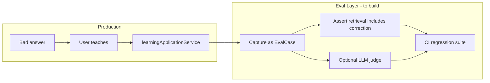

> **HISTORICAL DOCUMENT**  
> This document reflects an earlier stage of the AI architecture (deep-dive audit, 2026-07-05).  
> For the **current** architecture, see:  
> - [`docs/ai-system-audit/README.md`](../../ai-system-audit/README.md) — official System Audit  
> - [`docs/architecture/AI_SYSTEM_MENTAL_MODEL.md`](../../architecture/AI_SYSTEM_MENTAL_MODEL.md) — mental model  
> - [`docs/architecture/AI_READING_GUIDE.md`](../../architecture/AI_READING_GUIDE.md) — reading order  
> - [`docs/architecture/AI_ARCHITECTURE_NAVIGATION_GUIDE.md`](../../architecture/AI_ARCHITECTURE_NAVIGATION_GUIDE.md) — agent navigation  

---

# AI Evals and Regression Audit

**Program:** AI System Deep Dive Audit  
**Date:** 2026-07-05

Audit of AI testing, eval loops, and whether Vssyl has regression protection comparable to: bad answer → correction → test case → future protection.

---

## Executive summary

Vssyl has **strong deterministic test coverage** for pipeline orchestration, grounding, provider selection, context assembly, and admin HTTP handlers. It does **not** have a **production LLM eval harness** or a **closed-loop teach regression suite**.

The gap for Teach Vssyl is **evaluation infrastructure connecting user corrections to automated regression tests** — not missing unit tests for core AI code.

---

## Test inventory by category

### Twin and core orchestration

| Area | Representative tests | Coverage |
|------|---------------------|----------|
| DigitalLifeTwinService | `DigitalLifeTwinService.activity.test.ts` | Activity emission, service integration |
| Action executors | `chatActionExecutor.test.ts`, `calendarActionExecutor.test.ts`, `todoActionExecutor.test.ts`, etc. | Module action paths |
| Conversation continuity | `conversationContinuity.test.ts` | Thread hints, state updates |
| Preference wiring | `preferenceProviderWiring.test.ts` | Resolver → provider options |

### Pipeline and grounding (~23 files)

| Area | Path pattern | Coverage |
|------|--------------|----------|
| Grounding retrieval | `pipelineGroundingRetrieval.*.test.ts` | Orchestrator, vlink, graph bundle, project assistant pilots |
| Enforcement | `pipelineEnforcement.test.ts` | Block/regenerate modes |
| Trace building | `pipelineTraceInsights.test.ts`, `mapPipelineTraceInputs.test.ts` | Diagnostic structure |
| Catalog/registry | `pipelineCatalogService.test.ts`, `pipelineRegistryService.test.ts` | Policy merge |
| Diagnostic persistence | `pipelineDiagnosticPersistence.test.ts` | DB write path |

### Context providers (~15 files)

| Area | Tests |
|------|-------|
| Orchestrator | `ContextProviderOrchestrator.test.ts` |
| Selection | `contextProviderSelection.test.ts` |
| Certification | `moduleContextProviderCertification.test.ts` |
| Legacy gate | `legacyProviderCanHandle.test.ts` |
| Full module contract | `fullAiContractModule.certification.test.ts` |

### Learning and memory

| Area | Tests |
|------|-------|
| Learning application | `learningApplicationService.test.ts` |
| Learning contract | `learningEventContract.test.ts` |
| Personal events | `personalAILearningEventsService.test.ts` |
| Learning trace | `learningPipelineTrace.test.ts` |
| Advanced learning | `AdvancedLearningEngine.test.ts` |
| User signals | `userLearningSignalService.test.ts` |
| Memory routes | `ai-memory-routes.integration.test.ts` |

### Reasoning (limited)

| Area | Tests | Note |
|------|-------|------|
| Conversation reasoning | `conversationReasoningLayer.test.ts`, `conversationReasoningPrompt.test.ts` | Only 2 files — thinner than pipeline |

### Retrieval platform

| Area | Tests |
|------|-------|
| Retrieval hook | `aiRetrievalPipelineHook.test.ts` |
| Context patch | `aiRetrievalContextPatch.test.ts` |
| Consumer contract | `aiRetrievalConsumerContract.test.ts` |

### Explainability

| Area | Tests |
|------|-------|
| Response influence | `buildResponseInfluence.test.ts` |
| Context used/available | `contextUsedAvailable.test.ts` |

### Admin pipeline HTTP

| Area | Tests |
|------|-------|
| Route integration | `admin-portal-ai-pipeline.test.ts` |
| Handler coverage (45) | `admin-portal-ai-pipeline-coverage.test.ts` |
| Registry fixture | `fixtures/aiPipelineHandlerRegistry.ts` |

### Suggestions and integration

| Area | Tests |
|------|-------|
| Ambient suggestions | `ambientSuggestionAcceptance.test.ts`, `ai-suggestions.integration.test.ts` |
| Correlation | `correlation.integration.test.ts` |
| Constitutional | `aiPipelineConstitutional.test.ts` |

**Approximate count:** ~68 AI-named test files under `server/src/**/__tests__`.

---

## Eval loop comparison

### Frontier lab pattern (OpenAI/Anthropic evals)

| Stage | Frontier practice | Vssyl today |
|-------|-------------------|-------------|
| Dataset of prompts + expected behaviors | Curated eval sets | Partial — fixture queries in pipeline tests only |
| Automated scoring | Model-graded or rule-based | Rule-based quality validation (`validateAIResponseQuality`) for weak phrases |
| Regression on prompt/policy change | CI eval gate | Unit/integration tests; **no LLM output regression** |
| Human feedback → eval case | Flywheel from production | **Not built** |
| Correction → golden test | Standard in mature AI products | **Not built** |

### Vssyl's closest equivalent today

**Admin Test Lab** (`POST /api/admin-portal/ai-pipeline/test-lab`):
- Operator submits query → dry-run twin → trace persisted
- Manual inspection in diagnostics UI
- **Not** automated assertion on response quality
- **Not** connected to user corrections

**Pipeline quality dashboard:**
- Aggregates weak generic phrase detection stats
- Observational — not a regression gate

---

## Does Vssyl have: bad answer → correction → test case → regression protection?

| Step | Status |
|------|--------|
| Bad answer detected | Manual (user) or weak phrase stats (operator) |
| Correction captured | Backend yes (if user uses Learning/Memory); chat UX no |
| Test case created | **No automated conversion** |
| Regression test in CI | **No** for teach scenarios |
| Proof next answer improved | Manual verification only |

**Verdict:** The eval loop is **open at the correction→test-case boundary**.

---

## Snapshot and golden example patterns

| Pattern | Exists? | Location |
|---------|---------|----------|
| Orchestration snapshots | Yes | `orchestrationSnapshot.ts`, capped at 2 per turn in query context |
| Pipeline trace fixtures | Yes | Test files with mock trace inputs |
| Golden LLM responses | **No** | — |
| Prompt snapshot tests | Partial | `conversationReasoningPrompt.test.ts` — prompt string assertions |
| Provider response mocks | Yes | Tests mock provider calls, don't hit live APIs |

---

## Gaps for Teach Vssyl program

| Gap | Priority | Recommendation |
|-----|----------|----------------|
| No teach-loop integration test | P0 | Approve correction → assert fact in `MemoryRetrievalService.retrieve()` output |
| No golden query set per intent | P1 | Seed from test lab exports |
| No LLM eval harness | P2 | Optional later — start with retrieval/assertion tests without live LLM |
| Reasoning layer thin tests | P2 | Expand beyond 2 files |
| Frontend explain/feedback untested | P2 | Component tests for Teach modal when built |
| Business learning apply untested E2E | P1 | When business apply pipeline built |

---

## Recommended eval architecture (documentation only)



**Phase 1 (no live LLM):** Assert store state + retrieval report + assembled context blocks contain taught fact.

**Phase 2:** Frozen query set run through test lab API in CI with trace assertions.

**Phase 3:** Optional model-graded eval for response quality (expensive; operator-triggered).

---

## What not to build yet

- Fine-tuning regression sets
- Automated model training flywheel
- Production trace → auto-eval without human review (privacy + noise)

Aligns with platform strategy: improve via **context engineering, policies, evals, feedback** — not direct model training.

---

## Key test paths

```
server/src/ai/pipeline/__tests__/
server/src/ai/context/__tests__/
server/src/ai/core/__tests__/
server/src/ai/learning/__tests__/  (via services)
server/src/routes/__tests__/admin-portal-ai-pipeline*.test.ts
server/src/ai/retrieval/__tests__/
server/src/services/__tests__/learningApplicationService.test.ts
```

---

## Related docs

- `docs/ai/GOLDEN_RULES.md` — attachment/vision test expectations
- `docs/ai/RUNBOOK.md` — operational debugging
- `docs/ai-knowledge/AI_CORRECTION_WORKFLOW.md` — designed correction UX
