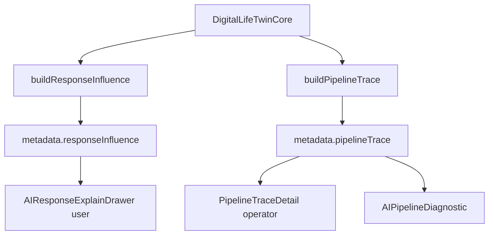

# AI Explainability and Grounding Audit

**Program:** AI System Deep Dive Audit  
**Date:** 2026-07-05

Audit of whether Vssyl can answer explainability questions, what metadata exists, and how grounding is enforced.

---

## Can Vssyl answer these questions?

| Question | User-facing today | Operator-facing today |
|----------|-------------------|----------------------|
| Why did AI answer this way? | **Partial** — `responseInfluence` summary | **Full** — pipeline trace + insights |
| What sources were used? | **Partial** — `contextUsed` list in explain drawer | **Full** — retrieval records + evidence bundle |
| What context was included? | **Partial** — memory/learning items listed | **Full** — context density report, provider payloads |
| What was excluded? | **Partial** — `contextAvailable` vs `contextUsed` | Trace shows skipped/failed providers |
| Which policies applied? | **No** — not in user drawer | **Yes** — intent policies, grounding rules, enforcement |
| Which memory influenced this? | **Yes** — `memoryItems` in influence | Trace memory retrieval report |
| Which provider/model answered? | **Not in explain drawer** | Trace + conversation history |
| Was grounding satisfied? | **No** | **Yes** — grounding required/performed/failures |
| Which tools were called? | **No** | **Yes** — tool usage records in trace |

---

## Two explainability silos

Vssyl intentionally separates **user explainability** (plain language) from **operator diagnostics** (technical trace).

**No cross-link today:** User drawer does not expose `traceId` for support escalation.

---

## User-facing explainability

### AIResponseExplainDrawer

**File:** `web/src/components/ai/AIResponseExplainDrawer.tsx`  
**Trigger:** "Why this answer" on assistant messages in `AIChatWorkspace.tsx`  
**Data source:** `ResponseInfluenceSummary` from twin response metadata

**Sections displayed:**

| Section | Content |
|---------|---------|
| Summary | Plain-language overview |
| Shaped by | Personality, preferences, autonomy factors |
| Session only | Ephemeral session overrides (not persisted) |
| Memory items | User memory facts that influenced turn |
| Learning items | Applied learning events referenced |
| Context used / available | Module context included vs available but trimmed |
| Workspace policies | Business policy lines when in business context |

**Links:** Memory tab, Learning tab for follow-up edits.

### Builder

**File:** `server/src/ai/preferences/buildResponseInfluence.ts`  
**Called from:** `DigitalLifeTwinCore` after response generation  
**Tests:** `buildResponseInfluence.test.ts`, `contextUsedAvailable.test.ts`

**Client parsing:** `web/src/api/aiResponseInfluence.ts` → `extractResponseInfluenceFromTwinMetadata`  
**Chat item attachment:** `web/src/lib/aiResponseHandler.ts`

### Effective preferences preview

**API:** `GET /api/ai/effective-preferences`  
**Use:** Preview what next turn will use; referenced by `buildInfluenceStack.ts`  
**Scope:** Personal; optional `?businessId=` note for business policies

### What users cannot see

- Raw orchestration snapshots
- Provider routing decisions
- Grounding enforcement block/regenerate events
- Pipeline intent classification
- Token-level prompt content
- Failed provider fetch details
- Model ID (not in explain drawer — available in metadata if client chose to show)

---

## Operator-facing explainability

### AIPipelineTrace

**Type:** `server/src/ai/types/pipelineDiagnostics.ts`  
**Builder:** `server/src/ai/pipeline/buildPipelineTrace.ts`  
**Enrichment:** `server/src/ai/pipeline/pipelineTraceInsights.ts`

**Trace stages include:**

- Intent detection results and confidence
- Grounding required / performed / failures
- Context providers attempted (hit/miss/fail/skipped)
- Memory retrieval report
- Tool invocations and results
- Enforcement decisions (block, regenerate, warn)
- Learning pipeline stages
- Evidence bundle references
- Risk badges and failure categories

### Persistence

| Store | Content |
|-------|---------|
| `AIPipelineDiagnostic` | Full trace JSON, linked `conversationHistoryId` |
| `AIConversationHistory.context` | Embedded `_pipelineTrace` snapshot |
| In-memory store | `pipelineTraceStore.ts` for recent access |

### Admin UI

| Component | Path |
|-----------|------|
| Trace table | `PipelineTraceTable` — `/admin-portal/ai-pipeline/diagnostics` |
| Trace detail | `PipelineTraceDetail.tsx` — risk badges, intents, grounding, density |
| Evidence viewer | `/diagnostics/:traceId/evidence` |
| Export | `PipelineCompliancePanel` — CSV/JSON export |

### Test lab

Dry-run twin always produces persistable trace for operator inspection without affecting user data (when `adminDryRun` flags set appropriately).

---

## Grounding system

### Policy layer

**Models:** `AIPipelineIntentPolicy`, `AIPipelineGroundingRulePolicy`, `AIPipelineContextSourcePolicy`  
**Catalog:** `pipelineCatalogService.getEffectivePipelineCatalog()` merges DB + `pipelineCatalogDefaults.ts`

Each intent may declare:
- `groundingRequired: true`
- Required sources (e.g. `business_context`, `module_context`, `drive_files`)
- Optional sources
- Minimum confidence thresholds
- Enforcement behavior

### Runtime enforcement

**File:** `server/src/ai/pipeline/pipelineEnforcement.ts`

| Mode | Behavior on grounding failure |
|------|------------------------------|
| `warn` | Log + trace flag; response proceeds |
| `block` | Fail response or return grounding error |
| `regenerate` | Attempt regeneration with stricter context |

**Prepass:** `shouldRunGroundingRetrievalPrepass` → `runPipelineGroundingRetrieval` before/assembled with module orchestration.

### Evidence bundles

**Builder:** `buildPipelineEvidenceBundle.ts`  
**Contents:** Source records with provenance, freshness, confidence — attached to trace for operator audit.

### Module vs platform sources

See [AI Context Provider Inventory](./AI_CONTEXT_PROVIDER_INVENTORY.md) for HTTP provider mapping. Platform sources (`user_memory`, `vlink`, `business_context`, etc.) satisfied in `pipelineGroundingRetrieval` without module HTTP calls.

---

## Grounding by intent (examples from catalog defaults)

| Intent | Typical required sources |
|--------|-------------------------|
| `business_operations` | `business_context`, `module_context` |
| `local_discovery` | Optional `vssyl_place` |
| `workflow_action` | Optional `drive_files`, `calendar` |
| `project_assistant` | Optional `drive_files` |
| `recommendation` | Optional `vssyl_place` |

Operators can override via admin portal grounding registry.

---

## Explainability gaps for Teach Vssyl

| Gap | Recommendation |
|-----|----------------|
| No "correct this" in explain drawer | Add primary CTA linking to correction flow |
| Provider/model hidden from users | Optional subtle footer "Answered by …" |
| No traceId for support | Optional "Copy reference" for support tickets (admin lookup) |
| Business employee assistant lacks explain drawer | Port `AIResponseExplainDrawer` to `EmployeeAIAssistant` |
| Grounding failure invisible to users | User-friendly message when enforcement blocks (if not already) |
| Excluded context not explained | Extend drawer: "Also available but not used: …" |

---

## Data boundaries in explainability

| Concern | Implementation |
|---------|----------------|
| Personal vs business | `responseInfluence` includes workspace policies only when `businessId` in context |
| Cross-tenant leak | Trace scoped by admin access; diagnostics don't expose other users' PII in aggregate views without filter |
| Raw provider payloads | Operator-only in evidence bundle |
| Memory consent | Pending inferred context never appears in `memoryItems` until active |

---

## Related suggestion explainability

| Surface | Mechanism |
|---------|-----------|
| Ambient suggestions | `resolveSuggestionExplainability` in `AmbientSuggestionCard.tsx` |
| Admin dry-run | `SuggestionCorrelationDryRunPanel` — `explainSummary`, completeness rate |

Separate from twin explainability but same product family.

---

## Key files

| Concern | Path |
|---------|------|
| User influence builder | `server/src/ai/preferences/buildResponseInfluence.ts` |
| Trace builder | `server/src/ai/pipeline/buildPipelineTrace.ts` |
| Trace insights | `server/src/ai/pipeline/pipelineTraceInsights.ts` |
| Grounding retrieval | `server/src/ai/pipeline/pipelineGroundingRetrieval.ts` |
| Enforcement | `server/src/ai/pipeline/pipelineEnforcement.ts` |
| User drawer | `web/src/components/ai/AIResponseExplainDrawer.tsx` |
| Admin detail | `web/src/components/admin/ai-pipeline/PipelineTraceDetail.tsx` |
| Trace types | `server/src/ai/types/pipelineDiagnostics.ts` |
