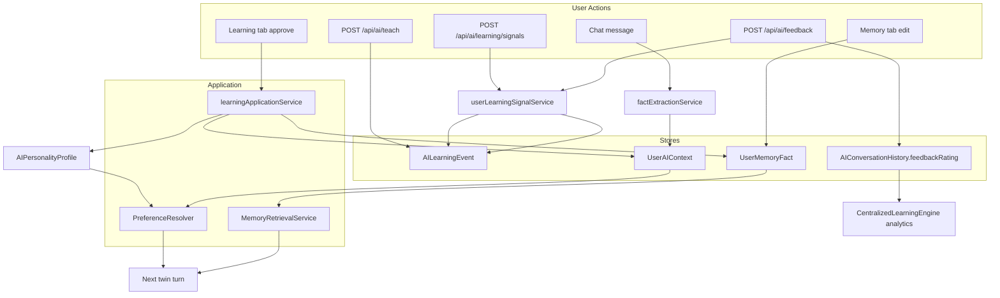

> **HISTORICAL DOCUMENT**  
> This document reflects an earlier stage of the AI architecture (deep-dive audit, 2026-07-05).  
> For the **current** architecture, see:  
> - [`docs/ai-system-audit/README.md`](../../ai-system-audit/README.md) — official System Audit  
> - [`docs/architecture/AI_SYSTEM_MENTAL_MODEL.md`](../../architecture/AI_SYSTEM_MENTAL_MODEL.md) — mental model  
> - [`docs/architecture/AI_READING_GUIDE.md`](../../architecture/AI_READING_GUIDE.md) — reading order  
> - [`docs/architecture/AI_ARCHITECTURE_NAVIGATION_GUIDE.md`](../../architecture/AI_ARCHITECTURE_NAVIGATION_GUIDE.md) — agent navigation  

---

# AI Feedback and Correction Audit

**Program:** AI System Deep Dive Audit  
**Date:** 2026-07-05

Audit of mechanisms for user feedback, corrections, learning review, and whether feedback changes future AI behavior.

---

## Executive summary

Vssyl has a **strong backend correction pipeline** for reviewed learning events but a **weak in-the-moment feedback UX**. APIs exist for star ratings and behavioral signals that are **not wired to main chat**. The designed Teach Vssyl flow (`docs/ai-knowledge/AI_CORRECTION_WORKFLOW.md`) remains unimplemented.

**When a user gets a bad answer today:** they can read "Why this answer" or manually edit Memory/Learning tabs — but cannot correct from the failure moment in chat.

---

## Feedback mechanisms inventory

### Exists and wired

| Mechanism | API / path | UI | Changes future behavior? |
|-----------|------------|-----|--------------------------|
| Learning event review (personal) | `PUT /api/ai/learning/events/:id/review` | `/ai?tab=learning` → `PersonalLearningEventsReview` | **Yes** — on approve via `learningApplicationService` |
| Pending context promotion | `POST /api/ai/user-context/:id/review` | `AILearningNotice`, Learning hub | **Yes** — activates `UserAIContext` |
| Memory fact CRUD | `/api/ai/memory/facts` | `AIMemoriesView` | **Yes** — next-turn retrieval |
| User context CRUD | `/api/ai/user-context` | `CustomContext` | **Yes** — when active |
| Explicit teach | `POST /api/ai/teach` | **No prominent UI** | Creates reviewable event |
| Explain drawer | metadata `responseInfluence` | `AIResponseExplainDrawer` in chat | **No** — read-only |
| Session preference promote | `AILearningNotice` | Chat + Control Center | **Yes** — if promoted to profile |
| Suggestion accept | `POST /api/ai/suggestions/:id/accept` | Ambient suggestions tab | **Indirect** — may create pending preference |
| Business learning review | `PUT /api/business-ai/.../learning-events/:id/review` | `BusinessAIControlCenter` | **Partial** — flags only, weak apply |
| Approval respond | `/api/ai/approvals/:id/respond` | Notifications page | **Yes** — for governed actions, not knowledge |

### API exists, UI missing or stub

| Mechanism | API | UI status | Changes behavior? |
|-----------|-----|-----------|-------------------|
| Star rating (1–5) | `POST /api/ai/feedback` | **No web client** | **Mostly no** — behavioral signal, not review queue |
| Learning signals | `POST /api/ai/learning/signals` | Helpers defined, **unused in chat** | **Mostly no** |
| Regenerate signal | `recordResponseRegenerate` in `aiLearningSignals.ts` | Not wired | No |
| Edit-and-resend signal | `recordEditAndResend` | Not wired | No |
| Thumbs up/down (main chat) | — | **Not implemented** | — |
| Thumbs (employee assistant) | — | Client state only; comment says "Could send to backend" | No |

### Dead / legacy paths

| Mechanism | Status |
|-----------|--------|
| `LearningEngine.processFeedback()` | Creates events — **not wired to any route** |
| `POST /api/ai/personality` (deprecated) | Old interaction feedback shape |
| `/api/centralized-ai/*` learning | 410 Gone |

---

## Learning event types and review contract

From `server/src/ai/learning/learningProposalTypes.ts`:

| Type | Review queue? | On approve |
|------|---------------|------------|
| `correction` | Yes | → `UserMemoryFact` or context |
| `preference_update` | Yes | → `UserAIContext` or personality |
| `reinforcement` | Yes | Strengthens existing |
| `pattern_recognition` | Yes | Context/personality |
| `feedback` | Yes | Depends on payload |
| `behavioral_signal` | **No** | Stored only; auto applied+validated flags |

**Human-reviewable types** go to Learning tab. **Behavioral signals** (including star ratings via `recordFeedbackOutcome`) bypass review.

---

## Correction application pipeline (personal)

**Service:** `server/src/services/learningApplicationService.ts`

```
User approves AILearningEvent
  → applyApprovedEvent(event)
    → correction: create/update UserMemoryFact
    → preference: create/update UserAIContext
    → trait: merge AIPersonalityProfile.personalityData
  → mark event applied + validated
```

**Proof it worked:** Integration tests in `learningApplicationService.test.ts`; user can verify via Memory tab and next-turn `responseInfluence` showing memory items.

**Gap:** No automated "correction → next response includes fact" E2E golden test in CI for all event types.

---

## Chat inference consent flow

Post-assistant-turn:

1. `factExtractionService` may create `UserAIContext` with `learningStatus: pending`
2. `AILearningNotice` in chat offers promote/dismiss
3. Until promoted, **not prompt-eligible** (`userAIContextLearningService.promptEligibleContextWhere`)

This is Vssyl's primary **implicit learning with consent** — distinct from explicit Teach Vssyl.

---

## Business correction path

| Step | Status |
|------|--------|
| Business learning event created | Works |
| Admin reviews in Business AI CC | Works |
| Approval flags persisted | Works |
| `learningApplicationService` equivalent | **Missing** — no memory fact / context write on approve |

**Gap:** Business corrections don't reliably change employee-facing AI behavior.

---

## Where feedback data goes



---

## What happens when AI gives a bad answer (today)

| User action available | Effect |
|-----------------------|--------|
| Read "Why this answer" | See `responseInfluence` — shaped-by, memory, context used/available |
| Regenerate response | New LLM call; **no learning captured** |
| Navigate to Memory tab | Manual fix |
| Navigate to Learning tab | Review pending events if any exist |
| Star rate or thumbs down | **Not available in main chat** |
| Report to operator | **No user path** |
| In-chat "Teach Vssyl" | **Not implemented** |

**Operator path:** Find trace in admin diagnostics if they know user/time — not self-service for users.

---

## Gaps vs Teach Vssyl requirements

| Requirement | Status |
|-------------|--------|
| In-chat correction affordance | Missing |
| Classification UI (fact vs preference vs rule) | Designed only |
| Route correction to correct store | Backend ready; UX missing |
| Thumbs down → reviewable event | Not built |
| Prove correction affected next answer | Partial (manual); no CI golden loop |
| Business employee correction with admin gate | Partial |
| Feedback metrics in pipeline quality | Not connected |

---

## Recommendations (implementation-ready, not implementing here)

1. **Wire thumbs down** → `AILearningEvent` type `correction` with message context (not `behavioral_signal`).
2. **Implement designed workflow** from `AI_CORRECTION_WORKFLOW.md` using existing APIs.
3. **Deprecate or repurpose** `POST /api/ai/feedback` star rating to create reviewable events when rating ≤ 2.
4. **Wire** `recordResponseRegenerate` when user regenerates after bad answer.
5. **Add business** `learningApplicationService` parity.
6. **Add metric** in pipeline quality: correction volume, approval latency, apply success rate.

---

## Key files

| Concern | Path |
|---------|------|
| Feedback route | `server/src/routes/ai.ts` — `/feedback`, `/teach`, `/learning/*` |
| Signal service | `server/src/services/userLearningSignalService.ts` |
| Application | `server/src/services/learningApplicationService.ts` |
| Personal review | `server/src/services/personalAILearningEventsService.ts` |
| Chat UI | `web/src/components/ai/AIChatWorkspace.tsx` |
| Explain drawer | `web/src/components/ai/AIResponseExplainDrawer.tsx` |
| Learning review UI | `web/src/components/ai/PersonalLearningEventsReview.tsx` |
| Design doc | `docs/ai-knowledge/AI_CORRECTION_WORKFLOW.md` |
| Client signals (unwired) | `web/src/api/aiLearningSignals.ts` |
