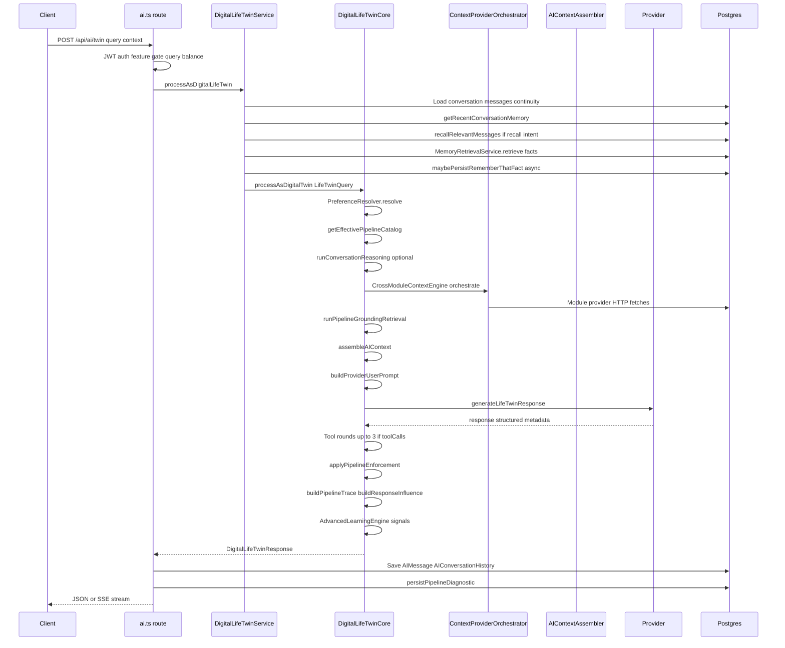

> **HISTORICAL DOCUMENT**  
> This document reflects an earlier stage of the AI architecture (deep-dive audit, 2026-07-05).  
> For the **current** architecture, see:  
> - [`docs/ai-system-audit/README.md`](../../ai-system-audit/README.md) — official System Audit  
> - [`docs/architecture/AI_SYSTEM_MENTAL_MODEL.md`](../../architecture/AI_SYSTEM_MENTAL_MODEL.md) — mental model  
> - [`docs/architecture/AI_READING_GUIDE.md`](../../architecture/AI_READING_GUIDE.md) — reading order  
> - [`docs/architecture/AI_ARCHITECTURE_NAVIGATION_GUIDE.md`](../../architecture/AI_ARCHITECTURE_NAVIGATION_GUIDE.md) — agent navigation  

---

# AI Request Lifecycle

**Program:** AI System Deep Dive Audit  
**Date:** 2026-07-05

End-to-end lifecycle for a canonical personal AI turn: `POST /api/ai/twin`.

Business employee interact (`POST /api/business-ai/:id/interact`) follows a parallel path through `BusinessAIDigitalTwinService` with business policy gates; admin test lab adds `pipelineOptions.adminDryRun`.

---

## Lifecycle diagram



---

## Phase 1 — Request ingress

**Route:** `server/src/routes/ai.ts` — `POST /api/ai/twin`

| Step | Detail |
|------|--------|
| Auth | `authenticateJWT`; `req.user.id` required |
| Feature gate | Query balance check (admins bypass) |
| Business scope | If `context.businessId`, verify active `businessMember` |
| Input | `query`, `context` (module, dashboard, fileIds, businessId, conversationId, preferredProvider/Model, stream flag) |
| Callers | `AIChatWorkspace`, `AIChatDropdown`, `AIEnhancedSearchBar`, `SchedulingAIAssistant`, admin test lab |

**Streaming:** When `stream: true`, route sets SSE headers; `DigitalLifeTwinService.processAsDigitalLifeTwinStreaming` streams tokens; client uses `web/src/lib/aiStreamHandler.ts`.

---

## Phase 2 — Pre-core context collection (DigitalLifeTwinService)

File: `server/src/ai/core/DigitalLifeTwinService.ts`

| Step | Service / function | Output in `LifeTwinQuery.context` |
|------|---------------------|-----------------------------------|
| Same-thread history | Load `AIMessage` for `conversationId` (max 20) | `conversationHistory[]` |
| Continuity state | Last assistant message metadata | `continuityState`, `activeTopic` |
| Cross-thread memory | `getRecentConversationMemory` | `recentConversationMemory` |
| Semantic recall | `recallRelevantMessages` if `hasExplicitRecallIntent(query)` | `recalledMessages` |
| Memory facts | `memoryRetrievalService.retrieve` | `userMemoryFacts`, `memoryRetrievalReport` |
| Remember that | `maybePersistRememberThatFact` (async, non-blocking) | New `UserMemoryFact` if phrase detected |

---

## Phase 3 — Core orchestration (DigitalLifeTwinCore)

File: `server/src/ai/core/DigitalLifeTwinCore.ts`

### 3a. Preferences and business boundaries

1. **`PreferenceResolver.resolve`** — personality profile, autonomy settings, active `UserAIContext` (preference type), applied+validated `AILearningEvent` soft prefs.
2. **`loadBusinessWorkspaceBoundaryBlock`** — when `context.businessId` set, inject business policy lines from `BusinessAIDigitalTwin`.
3. **Session soft preference detection** — ephemeral tone/verbosity overrides for this thread; may promote via `AILearningNotice`.

### 3b. Pipeline catalog and intent

1. **`getEffectivePipelineCatalog`** — merge DB policy rows with `pipelineCatalogDefaults.ts`.
2. **Intent inference** — match query to pipeline intents (grounding required flags, default tools).
3. **`shouldRunGroundingRetrievalPrepass`** — decide if grounding retrieval runs before module fetch.

### 3c. Conversation reasoning (conversation mode)

**`runConversationReasoning`** — optional pre-pass producing `ConversationReasoningResult` injected via `buildConversationReasoningPromptBlock` in `providerUserPrompt`. Suppresses recommendation richness when appropriate.

### 3d. Module context retrieval

1. **`CrossModuleContextEngine.getContextForAIQuery`** delegates to **`ContextProviderOrchestrator.orchestrateContextRetrieval`** (default; legacy path if `AI_CONTEXT_ORCHESTRATOR_ENABLED=false`).
2. Selection plan from **`contextProviderSelection.buildProviderSelectionPlan`**:
   - Required grounding providers first
   - Query-matched modules (max 4 optional)
   - Intent filter on `supportedIntents`
   - One provider per module; skip HR/scheduling without `businessId`
3. **`fetchModuleContextProvider`** — internal HTTP to `/api/{module}/ai/context/*` with 5s timeout.
4. **`appendOrchestrationSnapshot`** — up to 2 snapshots in query context for diagnostics replay.

### 3e. Pipeline grounding retrieval

**`runPipelineGroundingRetrieval`** — for intent-required sources:
- Platform sources: `user_memory`, `recent_conversations`, `business_context`, `vlink`, `web_search`, etc.
- Module-backed sources via orchestrator: `drive_files`, `calendar`, `vssyl_place`
- Produces evidence records for trace and enforcement

### 3f. Attachments and vision

When `context.fileIds` present:
1. Load `File` records (scope + permission + not trashed)
2. **`fileAnalysisService.getFileSummaries`** — text extraction (PDF, Office, OCR)
3. **`getVisionImageParts`** — image/PDF vision parts with size caps
4. Inject ATTACHED FILES CONTEXT section; vision parts to provider if capable

### 3g. Context assembly

**`assembleAIContext`** merges blocks with tier metadata:

| Block source | Typical title |
|--------------|---------------|
| Module provider payloads | Module-specific (e.g. "Drive recent files") |
| User memory facts | "User memory facts (saved by you)" / "(inferred)" |
| User AI context | "User-defined AI context" |
| Cross-session threads | Thread summaries and topics |
| Recalled messages | "Recalled prior messages (semantic)" |
| Preferences | "User communication and AI preference settings" |
| Business policy | "Business workspace AI policies" |
| Collective patterns | "Collective learning patterns" (consent-gated) |
| Attached files | "Attached files context" |

Tiering trims low-relevance blocks under token pressure; conversation continuity blocks favored.

### 3h. Provider request construction

1. **`buildProviderData`** — assembles provider-specific payload.
2. **`buildProviderUserPrompt`** — user message with thread section, reasoning block, slim assembled context (conversation mode caps blocks to 6).
3. **`selectLlmProvider` + `resolveVisionModelForProvider`** — routing from user prefs, capabilities matrix, vision need.
4. System prompt from provider `buildSystemPrompt` + personality/autonomy wiring via **`applyResolvedPreferencesToProviderOptions`**.

**Privacy note:** Full `assembledContext` JSON is provider-private; user-facing query is clean `userQuery`.

### 3i. Provider call and tool loop

1. **`generateLifeTwinResponse`** → **`callAIProvider`**
2. If `toolCalls` in metadata, **`executeTool`** up to **`MAX_TOOL_CALL_ROUNDS` (3)**
3. Tool policies from pipeline catalog gate availability and risk
4. Fallback on 429 via **`resolveLlmFallback`**

### 3j. Post-generation

| Step | Function | Output |
|------|----------|--------|
| Quality validation | `validateAIResponseQuality` | Weak generic phrase detection |
| Pipeline enforcement | `applyPipelineEnforcement` | Block/regenerate if grounding failure + enforcement mode |
| Evidence bundle | `buildPipelineEvidenceBundle` | Grounding evidence for trace |
| Pipeline trace | `buildPipelineTrace` | `AIPipelineTrace` in metadata |
| User explainability | `buildResponseInfluence` | `responseInfluence` in metadata |
| Learning signals | `userLearningSignalService`, `AdvancedLearningEngine` | Behavioral events, fact extraction trigger |
| Continuity update | `updateConversationContinuityState` | Persisted in assistant message metadata |

---

## Phase 4 — Persistence and response

**Route handler (post-core):**

| Action | Target |
|--------|--------|
| Save user + assistant messages | `AIConversation` / `AIMessage` |
| Index for recall | `aiMessageRecallService.indexAIMessageForRecall` |
| Full turn log | `AIConversationHistory` (query, context snapshot, response, provider, tokens) |
| Pipeline diagnostic | `AIPipelineDiagnostic` via `persistPipelineDiagnostic` |
| Update thread summary | `aiConversationMemoryService` (async) |
| Query consumption | Query balance decrement |
| Approval rows | If actions require approval |

**Response shape:**

```typescript
{
  success: true,
  data: {
    response: string,
    confidence: number,
    reasoning?: string,
    actions?: LifeTwinAction[],
    structured?: StructuredAIResponse,
    metadata: {
      provider: string,
      model: string,
      responseInfluence?: ResponseInfluenceSummary,
      pipelineTrace?: AIPipelineTrace,  // admin/diagnostic; not shown raw to users
      // tokens, cost, fileIssues, usedVisionParts, etc.
    }
  }
}
```

---

## Admin test lab variant

**Route:** `POST /api/admin-portal/ai-pipeline/test-lab`

| Option | Effect |
|--------|--------|
| `pipelineOptions.adminDryRun` | Runs twin without side effects where flagged |
| `skipLearning` | Skips learning signal emission |
| `skipRememberThat` | Skips auto fact persistence |
| `skipEnforcement` | Skips block/regenerate |

Trace always persisted for operator review.

---

## Business employee interact variant

**Route:** `POST /api/business-ai/:businessId/interact`

Additional gates:
- Active business membership
- Capability flags from `BusinessAIDigitalTwin`
- Policy digest from `workspaceAIPolicyDigest`
- Business learning events separate from personal

Uses enterprise prompt profile; business policy block always present.

---

## Request metadata carried through trace

`AIPipelineTrace` stages include (non-exhaustive):

- Intent detection results
- Grounding required / performed / failures
- Context providers attempted (hit/miss/fail)
- Memory retrieval report
- Tool usage records
- Enforcement decisions
- Learning pipeline stages (pending/applied)
- Reasoning depth insights via `pipelineTraceInsights.enrichTraceWithInsights`

User sees distilled **`responseInfluence`** only — see [AI Explainability and Grounding Audit](./AI_EXPLAINABILITY_AND_GROUNDING_AUDIT.md).

---

## Key files index

| Concern | Path |
|---------|------|
| Route handler | `server/src/routes/ai.ts` |
| Service pre-core | `server/src/ai/core/DigitalLifeTwinService.ts` |
| Core orchestration | `server/src/ai/core/DigitalLifeTwinCore.ts` |
| Orchestrator | `server/src/ai/context/ContextProviderOrchestrator.ts` |
| Assembly | `server/src/ai/context/AIContextAssembler.ts` |
| User prompt | `server/src/ai/prompts/providerUserPrompt.ts` |
| Trace builder | `server/src/ai/pipeline/buildPipelineTrace.ts` |
| Influence builder | `server/src/ai/preferences/buildResponseInfluence.ts` |
| Client stream | `web/src/lib/aiStreamHandler.ts` |
| Client response parse | `web/src/lib/aiResponseHandler.ts` |
