# AI System Component Map

**Program:** AI System Deep Dive Audit  
**Date:** 2026-07-05

Visual and tabular map of Vssyl's AI system components, their relationships, and ownership.

---

## System layers

```mermaid
flowchart TB
  subgraph entry [Entry Points]
    Chat["/ai-chat AIChatWorkspace"]
    Dropdown["AIChatDropdown"]
    ControlCenter["/ai Control Center"]
    BizAI["/business/id/ai"]
    EmpAI["EmployeeAIAssistant"]
    AdminPipe["/admin-portal/ai-pipeline"]
  end

  subgraph api [API Layer]
    Twin["POST /api/ai/twin"]
    BizTwin["POST /api/business-ai/id/interact"]
    AdminLab["POST .../ai-pipeline/test-lab"]
    ModuleCtx["/api/module/ai/context/*"]
  end

  subgraph orchestration [Orchestration]
    DLTService["DigitalLifeTwinService"]
    DLTCore["DigitalLifeTwinCore"]
    CrossMod["CrossModuleContextEngine"]
    Orch["ContextProviderOrchestrator"]
    Assembler["AIContextAssembler"]
    PrefRes["PreferenceResolver"]
    Reason["conversationReasoningLayer"]
  end

  subgraph policy [Policy and Grounding]
    Catalog["pipelineCatalogService"]
    Ground["pipelineGroundingRetrieval"]
    Enforce["pipelineEnforcement"]
    Trace["buildPipelineTrace"]
  end

  subgraph providers [LLM Providers]
    Route["providerRouting"]
    OpenAI["OpenAIProvider"]
    Anthropic["AnthropicProvider"]
    Local["LocalProvider"]
  end

  subgraph stores [Knowledge Stores]
    Facts["UserMemoryFact"]
    Context["UserAIContext"]
    Learn["AILearningEvent"]
    Conv["AIConversation"]
    BizTwin["BusinessAIDigitalTwin"]
    PipePol["AIPipeline* policies"]
  end

  Chat --> Twin
  Dropdown --> Twin
  ControlCenter --> Twin
  BizAI --> BizTwin
  EmpAI --> BizTwin
  AdminPipe --> AdminLab

  Twin --> DLTService --> DLTCore
  AdminLab --> DLTService
  BizTwin --> DLTCore

  DLTCore --> CrossMod --> Orch --> ModuleCtx
  DLTCore --> Ground --> Orch
  DLTCore --> PrefRes
  DLTCore --> Assembler
  DLTCore --> Reason
  DLTCore --> Enforce
  DLTCore --> Trace

  Assembler --> Route --> OpenAI
  Assembler --> Route --> Anthropic
  Assembler --> Route --> Local

  DLTService --> Facts
  DLTService --> Conv
  PrefRes --> Context
  PrefRes --> Learn
  Catalog --> PipePol
```

---

## Entry points by surface

### Personal AI

| Surface | Path | Primary API | Auth |
|---------|------|-------------|------|
| Full-page chat | `web/src/app/ai-chat/` → `AIChatWorkspace` | `POST /api/ai/twin` | JWT |
| Header dropdown | `AIChatDropdown` | Same | JWT |
| Dashboard widget | `AIWidget` → `AIChatModule` | Same | JWT |
| Global search AI | `AIEnhancedSearchBar` | Same | JWT |
| Control Center | `web/src/app/ai/page.tsx` | Identity, memory, learning, suggestions APIs | JWT |
| Scheduling assistant | `SchedulingAIAssistant` | Twin with scheduling context | JWT |

### Business AI

| Surface | Path | Primary API | Auth |
|---------|------|-------------|------|
| Business admin | `web/src/app/business/[id]/ai/` | `/api/business-ai/:id/*` | JWT + business admin |
| Employee drawer | `EmployeeAIAssistant` | `interact`, `employee-access` | JWT + member |
| Workspace policy | `WorkspaceAIDrawer` | `employee-access` | JWT + member |

### Operator / Platform

| Surface | Path | Primary API | Auth |
|---------|------|-------------|------|
| AI Pipeline hub | `web/src/app/admin-portal/ai-pipeline/` | `/api/admin-portal/ai-pipeline/*` | JWT + admin |
| Business AI global | `admin-portal/business-ai/` | `/api/admin/business-ai/*` | JWT + admin |
| Provider usage | Hub `#provider-governance` | `/api/admin/ai-providers/*` | JWT + admin |
| Module AI registry | Admin modules | `/api/admin/modules/ai/*` | JWT + admin |
| Context debug (transitional) | — | `/api/ai-context-debug/*` | JWT + admin |

---

## Core orchestration components

| Component | File | Responsibility |
|-----------|------|----------------|
| **DigitalLifeTwinService** | `server/src/ai/core/DigitalLifeTwinService.ts` | Pre-core assembly: conversation history, cross-thread memory, recall, memory facts, `remember that` |
| **DigitalLifeTwinCore** | `server/src/ai/core/DigitalLifeTwinCore.ts` | Full turn: context, grounding, provider call, tools, enforcement, trace, influence, learning signals |
| **CrossModuleContextEngine** | `server/src/ai/context/CrossModuleContextEngine.ts` | Query analysis → orchestrator delegation |
| **ContextProviderOrchestrator** | `server/src/ai/context/ContextProviderOrchestrator.ts` | Intent + grounding + parallel provider fetch + audit snapshot |
| **AIContextAssembler** | `server/src/ai/context/AIContextAssembler.ts` | Merge blocks with tiering and relevance trimming |
| **PreferenceResolver** | `server/src/ai/preferences/PreferenceResolver.ts` | Personality, autonomy, active context, applied learning |
| **conversationReasoningLayer** | `server/src/ai/conversation/conversationReasoningLayer.ts` | Pre-provider reasoning pass for conversation mode |
| **providerUserPrompt** | `server/src/ai/prompts/providerUserPrompt.ts` | User-message construction; assembled context is provider-private |
| **providerRouting** | `server/src/ai/providers/providerRouting.ts` | Model selection, vision routing, fallback on 429 |
| **buildResponseInfluence** | `server/src/ai/preferences/buildResponseInfluence.ts` | User-facing explainability summary |
| **buildPipelineTrace** | `server/src/ai/pipeline/buildPipelineTrace.ts` | Operator-facing diagnostic trace |

---

## Learning and memory services

| Service | File | Role |
|---------|------|------|
| MemoryRetrievalService | `server/src/ai/memory/MemoryRetrievalService.ts` | Score and retrieve `UserMemoryFact` |
| userMemoryFactService | `server/src/services/userMemoryFactService.ts` | CRUD, `remember that`, relevance query |
| userAIContextLearningService | `server/src/services/userAIContextLearningService.ts` | Pending inference consent |
| learningApplicationService | `server/src/services/learningApplicationService.ts` | Apply approved learning events |
| personalAILearningEventsService | `server/src/services/personalAILearningEventsService.ts` | Personal review queue |
| factExtractionService | `server/src/services/factExtractionService.ts` | Post-chat inference |
| aiMessageRecallService | `server/src/services/aiMessageRecallService.ts` | Lexical recall index |
| aiConversationMemoryService | `server/src/services/aiConversationMemoryService.ts` | Thread summaries/topics |
| AdvancedLearningEngine | `server/src/ai/learning/AdvancedLearningEngine.ts` | Event creation, pattern detection |
| CentralizedLearningEngine | `server/src/ai/learning/CentralizedLearningEngine.ts` | Collective learning aggregation |
| BusinessAIDigitalTwinService | `server/src/ai/enterprise/BusinessAIDigitalTwinService.ts` | Business twin config and interact |

---

## Pipeline / operator components

| Component | File | Role |
|-----------|------|------|
| pipelineCatalogService | `server/src/ai/pipeline/pipelineCatalogService.ts` | Merge DB policies + code defaults |
| pipelineRegistryService | `server/src/ai/pipeline/pipelineRegistryService.ts` | Policy CRUD |
| pipelineGroundingRetrieval | `server/src/ai/pipeline/pipelineGroundingRetrieval.ts` | Intent-based retrieval orchestration |
| pipelineEnforcement | `server/src/ai/pipeline/pipelineEnforcement.ts` | Block/regenerate on grounding failure |
| pipelineDiagnosticPersistence | `server/src/ai/pipeline/pipelineDiagnosticPersistence.ts` | Persist traces to `AIPipelineDiagnostic` |
| adminPortalRoutes.aiPipeline | `server/src/routes/admin-portal/adminPortalRoutes.aiPipeline.ts` | ~45 admin HTTP handlers |

---

## Frontend API clients

| Client | Path | Used by |
|--------|------|---------|
| `aiConversations.ts` | `/api/ai-conversations` | Chat workspace |
| `aiMemoryFacts.ts` | `/api/ai/memory/facts` | Memory tab |
| `aiContextLearning.ts` | `/api/ai/user-context/pending` | Learning hub |
| `aiLearningEvents.ts` | `/api/ai/learning/events` | Learning review |
| `aiLearningSignals.ts` | `/api/ai/learning/signals` | **Defined; not wired to chat** |
| `aiResponseInfluence.ts` | Parses twin metadata | Explain drawer |
| `adminApiService.ts` | Admin pipeline + module AI | Admin portal |

---

## Retired / fenced components

| Path | Status | Replacement |
|------|--------|---------------|
| `/api/centralized-ai/*` | 410 Gone | `POST /api/ai/twin` + admin pipeline |
| `/api/ai/autonomous/*` (writes) | 410 Gone | Twin + approvals |
| `/api/ai/chat` | Deprecated shim | `/api/ai/twin` |
| `LearningEngine.processFeedback` | Dead code path | `userLearningSignalService` + review APIs |
| `UserAIContextCache` | Schema only | Orchestrator + installation cache |

---

## Module context provider modules (built-in)

12 modules, 35 registered providers — see [AI Context Provider Inventory](./AI_CONTEXT_PROVIDER_INVENTORY.md).

Registration: `server/src/startup/registerBuiltInModules.ts`  
Fetch: `server/src/ai/context/fetchModuleContextProvider.ts` via `ModuleAIContextService`

---

## Test coverage anchors

| Area | Representative test path |
|------|-------------------------|
| Twin / service | `server/src/ai/core/__tests__/DigitalLifeTwinService.activity.test.ts` |
| Pipeline | `server/src/ai/pipeline/__tests__/` (~23 files) |
| Grounding | `pipelineGroundingRetrieval.*.test.ts` |
| Providers | `contextProvider*.test.ts`, `moduleContextProvider*.test.ts` |
| Admin pipeline HTTP | `admin-portal-ai-pipeline-coverage.test.ts` |
| Learning | `learningApplicationService.test.ts`, `learningEventContract.test.ts` |
| Explainability | `buildResponseInfluence.test.ts` |
| Retrieval | `aiRetrievalContextPatch.test.ts` |
