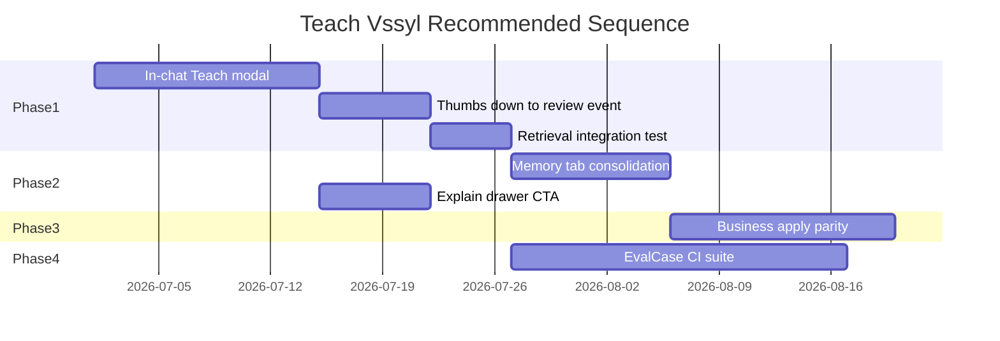

> **HISTORICAL DOCUMENT**  
> This document reflects an earlier stage of the AI architecture (deep-dive audit, 2026-07-05).  
> For the **current** architecture, see:  
> - [`docs/ai-system-audit/README.md`](../../ai-system-audit/README.md) — official System Audit  
> - [`docs/architecture/AI_SYSTEM_MENTAL_MODEL.md`](../../architecture/AI_SYSTEM_MENTAL_MODEL.md) — mental model  
> - [`docs/architecture/AI_READING_GUIDE.md`](../../architecture/AI_READING_GUIDE.md) — reading order  
> - [`docs/architecture/AI_ARCHITECTURE_NAVIGATION_GUIDE.md`](../../architecture/AI_ARCHITECTURE_NAVIGATION_GUIDE.md) — agent navigation  

---

# AI Teach Vssyl — Implementation Readiness

**Program:** AI System Deep Dive Audit  
**Date:** 2026-07-05  
**Status:** Readiness assessment — **do not implement in this audit**

Safest, simplest path to a coherent Teach Vssyl product experience based on codebase audit findings.

---

## Readiness scorecard

| Dimension | Score | Notes |
|-----------|-------|-------|
| Backend stores | **Ready** | UserMemoryFact, UserAIContext, AILearningEvent, review APIs exist |
| Application pipeline | **Mostly ready** | Personal apply works; business apply weak |
| In-chat UX | **Not ready** | Designed in AI_CORRECTION_WORKFLOW.md; not shipped |
| Feedback wiring | **Not ready** | APIs exist; chat UI missing |
| Explainability | **Partial** | Drawer exists; no correction CTA |
| Eval loop | **Not ready** | No correction → regression test path |
| Governance clarity | **Partial** | Dual memory SoR confuses users and implementers |
| Operator tools | **Ready** | Pipeline diagnostics adequate for ops |

**Overall:** **Build UX + eval + governance on top of existing architecture** — do not redesign.

---

## Safest simplest path

### Principle

**Route all teaching through existing stores and review APIs.** No new memory tables. No prompt override table. No twin rewrite.

### Phase 1 — Minimum viable Teach Vssyl (personal)

**Goal:** User can fix a bad answer in the moment; prove it affects the next turn.

| # | Deliverable | Uses existing |
|---|-------------|---------------|
| 1 | "Teach Vssyl" button on assistant messages | `AIChatWorkspace.tsx` |
| 2 | Correction modal with classification chips | Design from `AI_CORRECTION_WORKFLOW.md` |
| 3 | Route fact → `POST /api/ai/memory/facts` | `userMemoryFactController` |
| 4 | Route preference/rule → `POST /api/ai/user-context` or `POST /api/ai/teach` | Existing APIs |
| 5 | Thumbs down → reviewable `AILearningEvent` correction | Extend `ai.ts` or signals service |
| 6 | Confirmation + link to Memory/Learning | Existing tabs |
| 7 | Integration test: teach fact → retrieval includes it | `MemoryRetrievalService` + `learningApplicationService.test.ts` pattern |

**Explicitly defer:** Business scope picker, thread-only corrections, platform admin queue.

### Phase 2 — Clarity and consolidation

| # | Deliverable |
|---|-------------|
| 8 | Memory tab UX: unify facts vs context with clear labels |
| 9 | "Correct this" CTA inside `AIResponseExplainDrawer` |
| 10 | Wire regenerate → `recordResponseRegenerate` learning signal |
| 11 | Optional provider/model footer on assistant messages |
| 12 | User help: "What Vssyl can know" — modules, @mentions, recall |

### Phase 3 — Business and ops

| # | Deliverable |
|---|-------------|
| 13 | Business learning apply parity (`learningApplicationService` for business events) |
| 14 | Employee assistant: Teach + explain drawer |
| 15 | Pipeline quality metric: corrections submitted / approved / applied |
| 16 | Business-admin read-only "AI sources" panel (not policy editor) |

### Phase 4 — Eval maturity (optional)

| # | Deliverable |
|---|-------------|
| 17 | EvalCase capture from approved corrections |
| 18 | CI suite: retrieval + assembly assertions (no live LLM) |
| 19 | Test lab export → golden query fixtures |

---

## Store routing decision tree (implement in UX)

```
User correction text
  │
  ├─ Declarative fact about self/org
  │    → UserMemoryFact (preferred)
  │
  ├─ Standing instruction ("always…", "never…")
  │    → UserAIContext contextType: instruction
  │
  ├─ Style/communication preference
  │    → UserAIContext contextType: preference
  │    OR AILearningEvent preference_update → review
  │
  ├─ Wrong module data ("check my calendar")
  │    → Do NOT store — explain @calendar / module limit
  │
  ├─ Business policy (employee)
  │    → BusinessAILearningEvent → admin review (Phase 3)
  │
  └─ Uncertain
       → AILearningEvent correction → Learning tab review
```

---

## What NOT to build

| Avoid | Why |
|-------|-----|
| New `TeachVssylFact` table | Duplicates UserMemoryFact |
| User-facing pipeline policy editor | Misconfiguration risk |
| Raw trace in user UI | Wrong audience; use responseInfluence |
| Model fine-tuning pipeline | Out of scope; context engineering first |
| Rewrite DigitalLifeTwinCore | High risk; extend only |
| Merge UserMemoryFact + UserAIContext in schema now | Large migration; UX consolidation first |
| Auto-apply inferred learning without consent | Violates learningStatus model |

---

## Architecture vs UX vs governance vs eval

| Primary blocker | Weight |
|-----------------|--------|
| **UX** | 40% — no in-chat teach path |
| **Governance** | 25% — dual SoR, business apply gap, consent flows |
| **Evaluation** | 25% — no teach regression loop |
| **Architecture** | 10% — minor gaps only (cache dormant, business apply) |

**Problem type:** Product completion, not platform rebuild.

---

## Comparison to frontier AI improvement patterns

| Approach | Frontier labs | Vssyl should |
|----------|---------------|--------------|
| Pre-training / fine-tuning | Core capability | **Defer** — use provider models |
| RLHF from user feedback | Standard | **Indirect only** — via context/policies, not weight updates |
| Context engineering | Increasingly important | **Primary strategy** — already implemented |
| Tool use / grounding | Standard | **Shipped** — pipeline + orchestrator |
| Eval harnesses | Required for release | **Build Phase 4** — start deterministic |
| User correction flywheel | Best practice | **Phase 1–2** — wire existing stores |

**Official references (conceptual alignment):**
- Anthropic: [Contextual retrieval](https://docs.anthropic.com/en/docs/build-with-claude/contextual-retrieval) — retrieval + context placement patterns analogous to Vssyl's assembly tiering
- OpenAI: [Evals guide](https://platform.openai.com/docs/guides/evals) — eval datasets; Vssyl Phase 4 target
- Industry pattern: **RAG + policy + human feedback → context update** — matches Vssyl's `UserMemoryFact` / review pipeline without model training

Vssyl's constitutional position (from `docs/ai/retrieval/AI_RETRIEVAL_CONSTITUTION.md`): improve via governed retrieval and context — not duplicate module SoR in AI stores.

---

## Data boundaries checklist (Teach Vssyl must preserve)

| Rule | Enforcement today | Teach must respect |
|------|---------------------|-------------------|
| Personal memory scoped by userId | userMemoryFactService | Yes |
| Business memory requires businessId + membership | Tenant checks | Yes — scope picker in Phase 3 |
| Pending inference not prompt-eligible | learningStatus gate | Yes — show pending state in UI |
| Business employee cannot override business policy | BusinessAIDigitalTwin restrictions | Route to admin review |
| Operator policies global | Admin-only CRUD | Never expose edit to users |
| Memory deletion / trash | trashedAt soft delete | Teach UI links to Memory management |
| Collective learning opt-in | collectiveLearningConsent | Don't conflate with personal teach |

---

## Success metrics (when implemented)

| Metric | Source |
|--------|--------|
| Corrections submitted per WAU | New analytics on teach API |
| Approval rate (personal) | AILearningEvent stats |
| Time to apply after approve | learningApplicationService timestamps |
| Next-turn retrieval hit rate | memoryRetrievalReport in trace |
| Regressions caught in CI | EvalCase suite count |
| Operator diagnostic volume for "bad AI" | Trace filter by grounding failure |

---

## Dependencies and sequencing



---

## Documentation map for implementers

| Read first | Purpose |
|------------|---------|
| [Executive Summary](./AI_SYSTEM_DEEP_DIVE_EXECUTIVE_SUMMARY.md) | Bottom line |
| [AI Request Lifecycle](./AI_REQUEST_LIFECYCLE.md) | Where teaching affects prompts |
| [Knowledge Store Inventory](./AI_KNOWLEDGE_STORE_INVENTORY.md) | Which API to call |
| [Feedback Audit](./AI_FEEDBACK_AND_CORRECTION_AUDIT.md) | What's unwired |
| `docs/ai-knowledge/AI_CORRECTION_WORKFLOW.md` | UX wireframes |
| `docs/ai-knowledge/AI_KNOWLEDGE_USER_EXPERIENCE.md` | Product intent |

---

## Audit sign-off

This readiness document concludes the AI System Deep Dive Audit. **No Teach Vssyl implementation was performed.** All findings are documentation-only based on repository state as of 2026-07-05.
