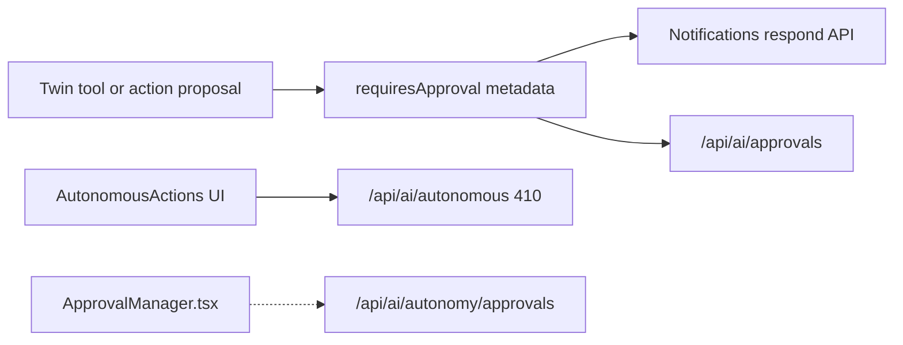

# AI Action Governance Audit

**Date:** 2026-07-12  

---

## Controls inventory

| Control | Where | On twin hot path? |
|---------|-------|-------------------|
| JWT authentication | AI routes | Yes |
| Business membership | Twin route when `businessId` | Yes |
| AI query balance | Twin, notebook, media | Yes (admins may bypass) |
| Dashboard / household scope | Context fetch + tools | Yes when provided |
| Role checks | Module services / business admin routes | Module-dependent |
| Autonomy levels | `AIAutonomySettings` + AutonomyManager | **Settings yes; evaluate not in Core** |
| Approval requirements | Response flags, ApprovalManager, notifications | Partial / dual |
| Action proposal models | `AIApprovalRequest`, action payloads | Side paths |
| Action execution | `toolExecutor`, `ActionExecutor`, module `*AIActionService` | Tools yes |
| Tool allowlists | `toolDefinitions` + pipeline catalog tools | Yes |
| Audit / activity | Module activity on writes; pipeline diagnostics | Tools via services |
| Reversibility | Trash patterns in modules; approvals | Module-dependent |
| Side-effect classification | Autonomy risk assessment (side path) | Not Core |
| Notifications | Approval notifications | Yes for some actions |
| Failure recovery | Tool error strings to model; HTTP errors | Partial |
| Duplicate-action prevention | Limited / module-dependent | Gap |
| Idempotency | Not universal for AI tools | Gap |
| Rate limiting | Provider + query balance | Partial |
| Sensitive data | Keyword → local; privacy router on legacy path | Partial |

---

## Can AI components…

| Question | Answer | Evidence | Priority |
|----------|--------|----------|----------|
| Invoke tools without canonical permission checks? | **Should not** on Drive tools — `listAccessibleDriveFiles` + policy; share uses owner checks. Other tools must be verified per name. | `toolExecutor.ts` | High if any tool skips |
| Write directly to DB from provider adapter? | **No** — adapters return text/tool calls | Providers | — |
| Bypass domain services? | **Risk** on ActionExecutor legacy mocks historically noted in Wave register E-01 — verify each executor | ActionExecutor tests | High follow-up |
| Create external side effects without approval? | **Tools can** (e.g. share_file) without ApprovalManager — relies on user being initiator of twin turn | toolExecutor share_file | **High** product policy question |
| Learn without governance? | **Partially** — remember-that persists; inferred should stay pending | memory + learning | Medium |
| Expose cross-business information? | Mitigated by membership checks + scoped provider fetch; always regression-test | Twin route + orchestrator | High |
| Bypass audit logging? | Diagnostics optional by flags; module activity depends on service | pipeline settings | Medium |
| Bypass cookie/session/business membership? | Twin uses JWT; businessId checked | `routes/ai.ts` | — |

---

## Autonomy de-emphasis (intentional)

`AutonomyManager.ts` documents **A7**: do not wire into `DigitalLifeTwinCore`; production uses PreferenceResolver for action-boundary **copy** only — no silent execution.

`AutonomousActionExecutor` + `/api/ai/autonomous/*` are retired/fenced.

**Product implication:** “Autonomy settings” UI still exists for user expectation / future policy, but is **not** an auto-pilot.

---

## Approval paths

---

## High-priority findings

| ID | Finding | Severity |
|----|---------|----------|
| GOV-01 | Tool writes (share/create) may execute in-loop without separate approval UX | High (policy) |
| GOV-02 | Dual approval APIs confuse ownership | Medium |
| GOV-03 | ActionExecutor vs toolExecutor consolidation incomplete (Wave E-01) | Medium |
| GOV-04 | Orphan ApprovalManager UI vs live notification path | Low–Medium |
| GOV-05 | Idempotency / duplicate prevention not systematic | Medium |

---

## What must remain non-delegable to models

- Authentication and tenant membership  
- Tool/argument authorization  
- Whether inferred knowledge becomes durable  
- Pipeline grounding enforcement outcomes  
- Business workspace policy blocks  
- Billing/query consumption rules  
