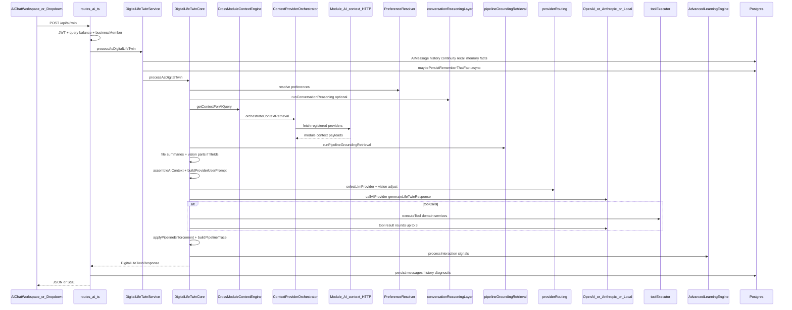
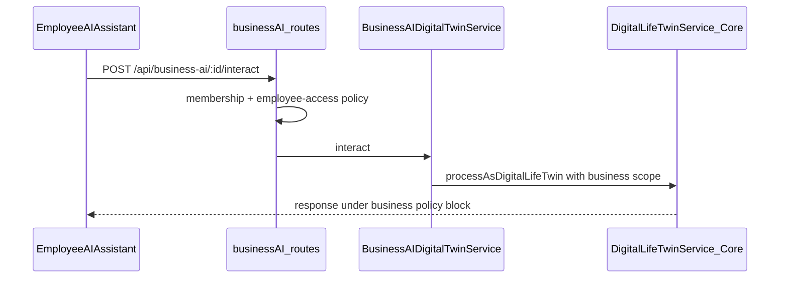

# AI System End-to-End Flows

**Date:** 2026-07-12  
**Rule:** Every step below is grounded in repository call paths. Where a flow is incomplete or dual-path, both are documented.

---

## Canonical sequence — personal twin turn

**Evidence anchors:** `server/src/routes/ai.ts` (twin handler), `DigitalLifeTwinService.ts` (`processAsDigitalLifeTwin`), `DigitalLifeTwinCore.ts` (`processAsDigitalTwin`), `AutonomyManager.ts` comments (not in this path).

---

## Flow 1 — Simple text-only chat

| Step | Implementation |
|------|----------------|
| Entry | `web/src/components/ai/AIChatWorkspace.tsx` or `AIChatDropdown.tsx` |
| Client | `fetch('/api/ai/twin', { Authorization, body: { query, context } })` |
| Auth | `authenticateJWT`; `req.user.id` |
| Validation | query required; optional context fields |
| Context | Orchestrator may still fetch light providers based on intent; may be empty |
| Retrieval | Grounding prepass if intent requires sources |
| Reasoning | `runConversationReasoning` when conversation mode applies |
| Knowledge decision | No durable write unless “remember that” heuristic fires |
| Prompt | System + `providerUserPrompt` |
| Provider/model | `selectLlmProvider` → default openai unless prefs/complexity/sensitive |
| Tools | Only if model returns tool calls and tools exposed |
| Side effects | Message persistence; optional learning signals; usage/query consume |
| UI | Markdown / structured renderer |

---

## Flow 2 — Multi-turn conversation

| Extra vs Flow 1 | Detail |
|-----------------|--------|
| `context.conversationId` | Required for thread continuity |
| Service preload | Loads up to 20 `AIMessage` rows; continuity from last assistant metadata |
| Cross-thread | `getRecentConversationMemory` may inject summaries |
| Recall | `recallRelevantMessages` if explicit recall intent in query |
| Persistence | New user+assistant messages under same conversation |

---

## Flow 3 — Module context request

| Extra | Detail |
|-------|--------|
| Trigger | Query keywords / current module / pipeline intent match |
| Selection | `contextProviderSelection.buildProviderSelectionPlan` — grounding-required first, max optional modules |
| Fetch | `fetchModuleContextProvider` → e.g. `/api/drive/ai/context/recent` |
| Assembly | Module payloads → `AIContextAssembler` blocks |
| Tenant | `businessId` / `dashboardId` / `householdId` passed; HR/scheduling skipped without business |

---

## Flow 4 — Cross-module context

| Extra | Detail |
|-------|--------|
| Synthesis | `linkEntitiesAcrossModules` + `synthesizeCrossModuleContext` when multiple moduleContexts or V_Link present |
| V_Link | `fetchVLinkPipelineContext` if catalog source `vlink` enabled |
| Evidence | Entity links stored on query context for prompt + diagnostics |

---

## Flow 5 — File attachments

| Extra | Detail |
|-------|--------|
| Client | `context.fileIds` from `AIFileUpload` / Drive deep-link (`/ai-chat?fileIds=`) |
| Core | `prisma.file.findMany` scoped; not trashed |
| Text path | `fileAnalysisService.getFileSummaries` → attached-files prompt section |
| Issues | `fileIssues` returned to UI when extraction fails |
| Docs | Matches `docs/ai/ARCHITECTURE.md` (validated) |

---

## Flow 6 — Image / PDF vision

| Extra | Detail |
|-------|--------|
| Vision parts | `getVisionImageParts` / `getPdfVisionParts` (caps: count/size) |
| Routing | `resolveVisionModelForProvider` forces vision-capable model or strips parts |
| Provider shapes | OpenAI `image_url` blocks; Anthropic `image` base64 blocks (`docs/ai/PROVIDERS.md`) |
| Local | Vision stripped; summaries only |
| Logging | `[VISION_PIPELINE]` markers |

---

## Flow 7 — Recommendations

| Path A — twin conversational | Path B — intelligence API |
|------------------------------|---------------------------|
| Conversation reasoning + recommendation richness policies in Core prompts | `GET/POST /api/ai/intelligence/*` → `IntelligentRecommendationsEngine` |
| Ambient `AISuggestion` from event consumer rules | Control Center “More → insights” dashboards |

These are **related product features**, not one stack. Twin recommendations are linguistic/policy-shaped; intelligence engines are separate HTTP surfaces.

---

## Flow 8 — Action-producing request

| Channel | Path |
|---------|------|
| **Tool loop (in-provider)** | Model returns toolCalls → `executeTool` (Drive list/share, todo create, etc.) with user scope → results re-fed to model |
| **Post-hoc LifeTwin actions** | Core/`ActionExecutor` proposes module actions after generation; may require approval flags in response metadata |
| UI | Action cards; notifications may call `POST /api/ai/approvals/:id/respond` |

---

## Flow 9 — Approval-required request

| Path | Status |
|------|--------|
| Twin response `requiresApproval` + notifications page | Active customer path |
| `ApprovalManager` via `/api/ai/autonomy/approvals/*` | Active API; **ApprovalManager.tsx UI orphaned** |
| `/api/ai/autonomous/*` | Retired |
| Core ↔ AutonomyManager | **Not wired** (explicit comment A7) |

---

## Flow 10 — Knowledge / learning

| Ingress | Decision outcome (philosophy) | Implementation |
|---------|-------------------------------|----------------|
| Explicit “remember that…” | Durable taught fact | `maybePersistRememberThatFact` (async from Service) |
| Teach Vssyl / user-context CRUD | Durable / pending | `/api/ai/user-context`, memory facts APIs |
| Soft interaction signals | Proposed learning event | `AdvancedLearningEngine.processInteraction` |
| Review UI | Promote/dismiss | `/ai?tab=learning`, learning event review APIs |
| Session style | Temporary | Session preference detection + promote endpoint |

**Gap:** Not every signal path is uniformly labeled against Decision Model outcomes in code comments — philosophy docs are ahead of naming in services.

---

## Flow 11 — Provider fallback

| Trigger | Behavior (`providerRouting` + Core `callAIProvider`) |
|---------|------------------------------------------------------|
| RATE_LIMITED / TEMP_UNAVAILABLE | Retry once with alternate OpenAI ↔ Anthropic when capability-eligible |
| Sensitive keywords in query | Prefer `local` provider |
| Vision unsupported | Strip vision; keep summaries |
| Fallback blocked | Capability warnings recorded on routing diagnostics |

---

## Flow 12 — Module-specific AI

| Module | Flow type | Entry | Stack |
|--------|-----------|-------|-------|
| Drive | Twin deep-link | Navigate to `/ai-chat?fileIds=` | Canonical twin |
| Calendar | Context provider only in twin | `/api/calendar/ai/context/*` | Twin context, not separate chat |
| Chat messaging | Context provider | `/api/chat/ai/context/*` | Twin context |
| Place | Discover APIs + context providers | Place explore / twin | Mixed (discover ≠ twin) |
| Notebook | **Parallel completion** | `NotebookAIPanel` → `notebookAICompletion.ts` | **OpenAI only**, bypasses Core grounding |
| Todo prioritize/schedule | Module AI routes | Dropdown helpers / unused components | Module services + optional twin |
| Scheduling assistant | Twin with scheduling context | Component **unmounted** | Would use twin if mounted |
| Workforce Comms | Context panel | Module AI context endpoints | Context only |
| Business employee | Business interact | `EmployeeAIAssistant` | `BusinessAIDigitalTwinService` → twin |

---

## Dual flows for similar requests

| Similarity | Flow A | Flow B | Why both exist |
|------------|--------|--------|----------------|
| “Chat with AI” | Twin | Deprecated `POST /api/ai/chat` → `processRequest` | Compatibility shim |
| Approvals | Twin approvals + notifications | Autonomy ApprovalManager | Historical autonomy product vs twin actions |
| Insights | Twin influence/explain drawer | Intelligence dashboards | Explainability vs exploratory analytics UI |
| Completions | Twin | Notebook `runNotebookAICompletion` | Domain-specialized short tasks vs full twin cost |

---

## Business AI interact (parallel wrapper)

---

## Admin test-lab

`POST .../admin-portal/ai-pipeline/test-lab` constructs `DigitalLifeTwinService` and calls twin with admin dry-run / pipeline options — same Core spine, operator surface.
