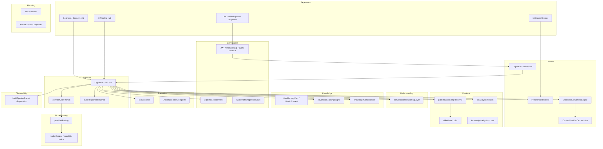

# AI System Layer Map

**Date:** 2026-07-12  

---

## Layer definitions

| # | Layer | Owns | Must not own |
|---|-------|------|--------------|
| 1 | Experience | Chat UI, identity, suggestions UX, approval UI, admin hubs | Provider selection policy, durable knowledge writes |
| 2 | Understanding | Objective, confidence, coaching, premature-solution guard | Tool authorization, SoR writes |
| 3 | Context | Identity, workspace, module payloads, preferences injection, conversation continuity | Cross-tenant data |
| 4 | Retrieval | Search discovery, file text, module queries, recall index, context graph neighborhoods | Executing mutations |
| 5 | Knowledge | Observation→proposal, durable stores, composition eligibility, provenance | Silent auto-apply of inferred knowledge |
| 6 | Planning | Action proposals, tool-call plans, sequencing hints | Permission final say |
| 7 | Governance | AuthZ, autonomy settings, approvals, pipeline enforcement, privacy routing | Generating prose |
| 8 | Execution | toolExecutor, ActionExecutor, module AI action services | Bypassing domain authorize→execute→emit |
| 9 | Model Routing | Provider/model selection, capabilities, fallback, cost tiers in catalog | Business domain rules |
| 10 | Response & Grounding | Assembly, structured output, enforcement, influence explainability | Inventing missing required sources |
| 11 | Observability | Traces, diagnostics, usage, logs, quality stats | Changing user-visible knowledge |

---

## High-level architecture

---

## Component → primary layer

| Component | Primary | Secondary | Why |
|-----------|---------|-----------|-----|
| AIChatWorkspace / Dropdown | Experience | — | Customer interaction |
| DigitalLifeTwinService | Context | Knowledge (remember-that) | Preload continuity/memory |
| DigitalLifeTwinCore | Response & Grounding | Many | Turn owner — **over-broad** |
| conversationReasoningLayer | Understanding | — | Pre-provider posture |
| CrossModuleContextEngine | Context | — | Facade to orchestrator |
| ContextProviderOrchestrator | Context | Observability (audit) | Provider fetch plan |
| AIContextAssembler | Context | Response | Merge for prompt |
| pipelineGroundingRetrieval | Retrieval | Governance | Required sources |
| aiRetrieval* | Retrieval | — | Search discovery pilot |
| server/src/knowledge/* | Knowledge | Retrieval | Compose eligible knowledge |
| PreferenceResolver | Context | Governance | What may influence |
| AdvancedLearningEngine | Knowledge | Observability | Post-turn signals |
| AutonomyManager | Governance | — | Side path only |
| ApprovalManager | Governance | Execution | Side path |
| toolExecutor / ActionExecutor | Execution | Governance | Domain-backed side effects |
| providerRouting / catalog | Model Routing | — | Provider/model choice |
| OpenAI/Anthropic/Local | Model Routing | Response | Adapters |
| buildPipelineTrace | Observability | — | Operator diagnostics |
| Suggestion* services | Experience | Knowledge (spawn) | Ambient proposals |
| notebookAICompletion | Model Routing | Experience | Parallel specialized path |
| IntelligentRecommendationsEngine | Experience | Planning | Separate HTTP intelligence |

---

## Layer-to-component matrix (dense)

| Layer | Active components |
|-------|-------------------|
| Experience | Chat UIs, Identity, suggestions UI, Business AI UI, admin pipeline UI, notifications approve |
| Understanding | conversationObjective, understandingConfidence, prematureSolutionGuard, coachingModePolicy |
| Context | Service preload, Orchestrator, Registry, Prefs, PersonalityEngine, continuity utils |
| Retrieval | Grounding retrieval, AI retrieval pilot, file analysis, recall index, V_Link fetch, knowledge neighborhoods |
| Knowledge | Memory facts, UserAIContext, learning events, composition/convergence, Teach Vssyl |
| Planning | Tool schemas, action templates, recommendation engines (partial) |
| Governance | Auth, query balance, business boundaries, pipeline enforcement, ApprovalManager, autonomy settings |
| Execution | toolExecutor, ActionExecutor(+Registry), module *AIActionService |
| Model Routing | providerRouting, matrix, catalog, provider classes |
| Response & Grounding | Core generation, normalize/structured response, enforcement, influence |
| Observability | pipelineTrace, diagnostics persistence, logger, usage tracking, admin quality |

---

## Over-broad components

| Component | Layers claimed in practice | Risk |
|-----------|----------------------------|------|
| **DigitalLifeTwinCore** | Context, Understanding, Retrieval, Knowledge signals, Planning, Governance enforcement, Execution tools, Model Routing, Response, Observability | Hard to test/reason; change blast radius |
| **routes/ai.ts** | Experience media + twin + legacy shims | Route sprawl; dual mounts historically |

---

## Unowned or weakly owned responsibilities

| Responsibility | Gap |
|----------------|------|
| Provider-neutral **task tier** routing (FAST/BALANCED/DEEP) | Not implemented; only preference/complexity/vision |
| Unified cost ledger across twin + notebook + whisper | Partial (`AIUsageTracking`, query balance) — not one execution record |
| Single “observation classifier” runtime matching Decision Model | Philosophy exists; classification distributed across heuristics/rules |
| Frontend ApprovalManager mounting | API exists; primary UI orphaned |

---

## Competing owners

| Responsibility | Claimants | Resolution |
|----------------|-----------|------------|
| Context fetch | CrossModule vs Orchestrator | Orchestrator canonical; CrossModule facade |
| Approvals | Twin approvals vs autonomy ApprovalManager | Keep both until retirement plan; document |
| Learning | Advanced vs Centralized vs personal events APIs | Partial overlap; Wave R-06 still open |
| Debug | ai-context-debug vs pipeline diagnostics | Prefer pipeline; transitional debug |
| LLM call | Core providers vs notebookAICompletion vs extraction | Specialize but share config eventually |

---

## Responsibility ownership matrix

| Decision | Owner |
|----------|-------|
| May user call AI? | Auth + query balance |
| Which modules fetch? | Orchestrator selection plan + catalog |
| What is prompt-eligible knowledge? | PreferenceResolver + knowledge composition eligibility + review status |
| Conversation posture | conversationReasoningLayer |
| Which provider/model? | providerRouting + user prefs + vision |
| May tool mutate? | toolExecutor → domain service AuthZ |
| May inferred learning apply? | Review gates (learning events / user-context pending) |
| Is answer grounded enough? | pipelineEnforcement |
| What operators see? | pipelineTrace / diagnostics |
| What users see for “why”? | buildResponseInfluence |
