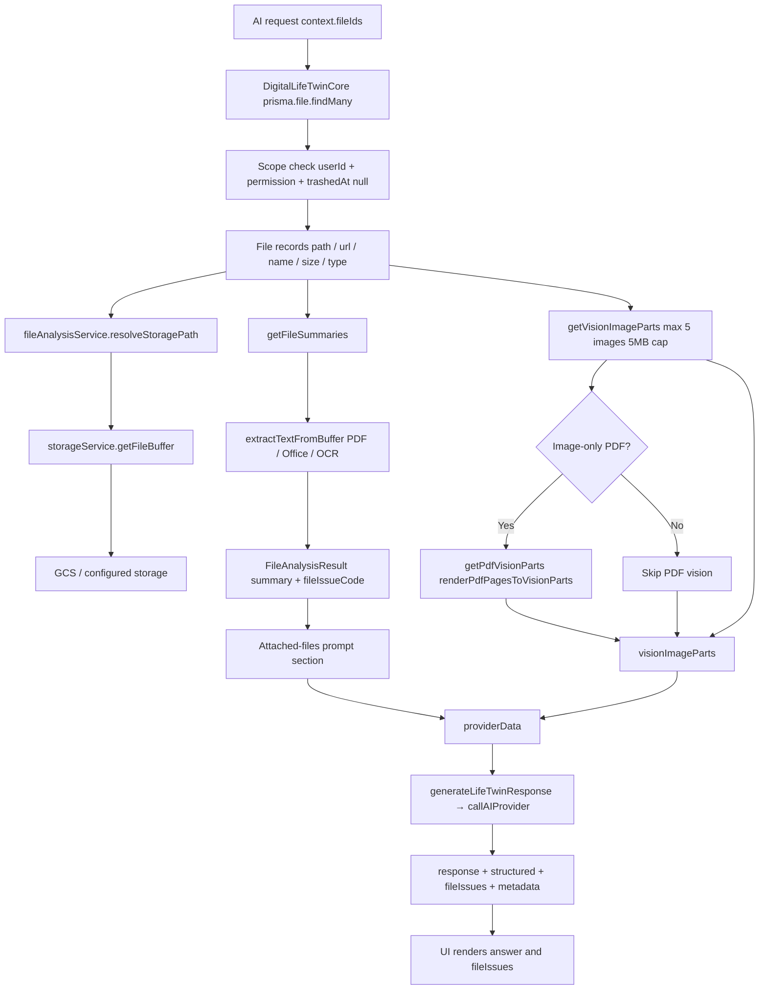
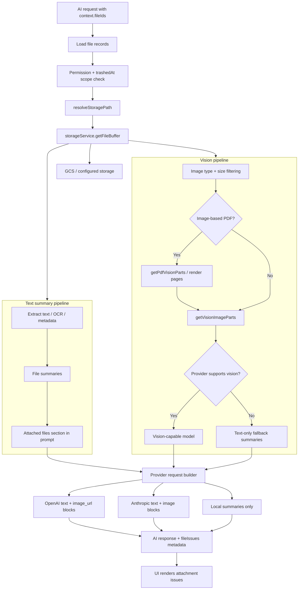

# AI Attachment & Vision Architecture

How file attachments flow from the client to the AI provider in the Digital Life Twin pipeline. Single source of truth for developers and AI editors.

**Platform hub:** [`docs/architecture/AI_PLATFORM_OVERVIEW.md`](../architecture/AI_PLATFORM_OVERVIEW.md)

---

## Attachment flow (end-to-end)

```
Client (ai-chat, AIChatDropdown, etc.)
  → POST /api/ai/twin with context.fileIds: string[]
  → Backend: DigitalLifeTwinCore.processAsDigitalTwin(query)
```



### Step summary

1. **Resolve files**  
   `context.fileIds` load **File** records (`trashedAt: null`, user/permission scope).

2. **Storage resolution**  
   Production uses **GCS** via `resolveStoragePath` + `storageService.getFileBuffer`.

3. **Two pipelines in parallel**
   - **Text/summaries**: `getFileSummaries` → attached-files prompt section.
   - **Vision**: `getVisionImageParts`; image-only PDFs via `getPdfVisionParts` → **visionImageParts**.

4. **Prompt + vision to provider**  
   `generateLifeTwinResponse` → `callAIProvider` with summaries + vision parts. See [PROVIDERS.md](./PROVIDERS.md).

5. **Response**  
   Twin returns `fileIssues` when analysis failed; UI surfaces attachment issues.

---

## Client-facing attachment pipeline

Higher-level view from the chat UI through provider formatting.



---

## Cloud Run constraints

- **No local uploads directory.** All file content via **storageService** (GCS in production).
- **Path/URL must resolve.** `File.path` or `File.url` must work with `resolveStoragePath`.
- **Vision/PDF rendering.** In-memory buffers or **/tmp** (Poppler for PDF pages).

---

## Key files

| Layer        | File / area |
|-------------|-------------|
| Entry       | `server/src/routes/ai.ts` (POST /twin), `server/src/ai/core/DigitalLifeTwinCore.ts` |
| File load   | `DigitalLifeTwinCore`: prisma.file.findMany by context.fileIds |
| Summaries   | `server/src/services/fileAnalysisService.ts`: getFileSummaries, resolveStoragePath, extractTextFromBuffer |
| Vision      | fileAnalysisService: getVisionImageParts, getPdfVisionParts, renderPdfPagesToVisionParts |
| Provider    | DigitalLifeTwinCore.generateLifeTwinResponse → callAIProvider |
| Capabilities| `server/src/ai/providers/capabilities.ts`: getProviderCapabilities |
| File issues | `server/src/ai/types/fileIssues.ts` |

---

## See also

- **PROVIDERS.md** — Request shapes, capability matrix, model selection.
- **RUNBOOK.md** — Logging, debugging, prod troubleshooting flowchart.
- **GOLDEN_RULES.md** — Rules for editors and Cursor.
